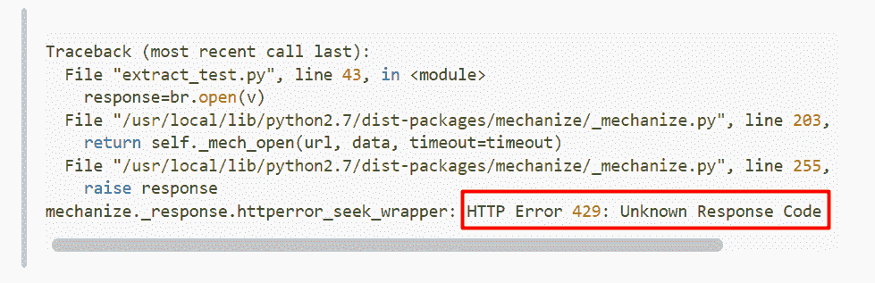
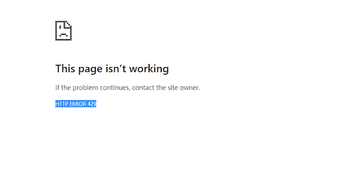
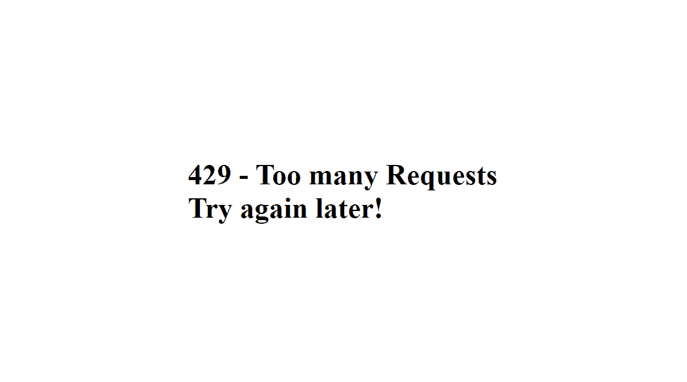

# 429 错误-解释了太多请求 HTTP 代码

> 原文：<https://www.freecodecamp.org/news/what-is-the-429-too-many-requests-http-error/>

无论您是 web 开发人员还是普通的 internet 用户，您都可能遇到过 429 错误。这意味着网站无法处理发送给它的大量请求。

对于开发人员来说，这个错误可能很难解决，因为在许多情况下，它没有显示出您需要做什么来修复它。


但是如果你作为一个用户在网上冲浪时遇到了错误，可能会有提示告诉你该怎么做。


在这种情况下，您应该等一会儿再提出另一个请求。出于安全原因，可能没有指定等待的时间。但是如果网站提高了用户体验，他们会告诉你在再次请求前要等多长时间。

在本文中，我将解释 429 错误的含义，以及开发人员可能如何实现它。我还将展示作为一名互联网用户，您可以做些什么来解决这个问题。

## 429 错误是什么？

429 错误是一个 HTTP 状态代码。它会告诉您在给定的时间内，internet 资源的使用何时超过了它可以发送的请求数。

此错误可能会以另一种形式显示给您，如下所示:

*   错误 429
*   429 请求太多
*   429(请求太多)

这完全取决于负责互联网资源的管理员如何定制它。

在我构建的小应用程序中，向您展示如何在 Express 应用程序中实现速率限制，这是我如何定制错误:


出现此错误时，负责网站或互联网资源的管理员会告诉您，他们没有足够的资源来处理您发送的大量请求。这就是所谓的“限速”。

## 是什么导致了 429 错误？

429 错误最常见的原因是没有足够的资源来处理如此多的并发请求。

例如，如果这个错误显示在一个托管服务器上，这可能意味着您使用的软件包对您可以发送的请求数量有限制。

如果在发出 API 请求时出现错误，这意味着您已经超出了在某个时间段内可以发出的请求数量。

此外，如果用户试图过于频繁地访问网站上的页面，该网站的服务器可能会触发在其中实现的速率限制功能。因此，这是一个很好的安全措施，可以防止黑客的攻击。

例如，这就是如何使用[快速限速包](https://www.npmjs.com/package/express-rate-limit)在快速应用程序中实现限速:

```
// Import deps
const express = require("express");
const rateLimit = require("express-rate-limit");

const app = express();

// Port
const port = 4000;

const limiter = rateLimit({
  windowMs: 5 * 60 * 1000,
  max: 5, // Limits each IP to 5 per 15 minutes
  message:
    `<h1 style='display:flex; align-items:center; justify-content:center; height:100vh'>
     429 - Too many Requests <br> Try again later!
    </h1>`,
});

// Apply to all requests
app.use(limiter);

app.get("/", limiter, (req, res) => res.send("Hello World!"));

app.listen(port, () => console.log(`App listening on port ${port}!`)); 
```

当超过指定的秒数时，该消息显示给用户:


## 如何解决 429 错误

作为一个互联网用户，你应该等一会儿再提出另一个请求。但是如果错误仍然存在，您应该联系网站管理员。

如果您是网站管理员，您应该减少在指定时间内发出的请求数量(如果有的话)。如果你自己能控制这个限度，你应该在一段特定的时间内增加它。

如果你正在处理的网站是一个 WordPress 网站，你的一个插件或主题可能会导致 429 错误。你应该一个一个地禁用你的站点插件和主题，看看是哪一个导致的。

如果错误与主机有关，您应该联系您的主机提供商的客户服务。

## 结论

没有网站管理员希望他们的服务器被卡住或崩溃。所以，从技术角度来看，429 错误不是错误。这是服务器告诉你它没有足够的资源来处理你的大量请求的方式。

感谢您的阅读。