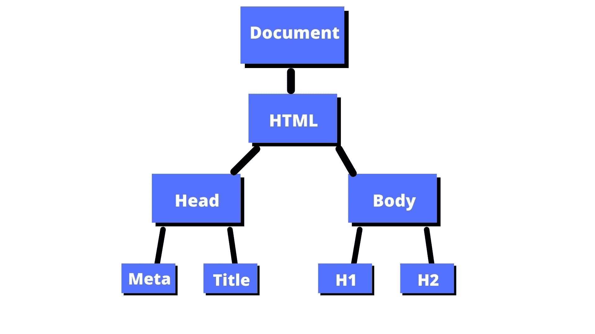
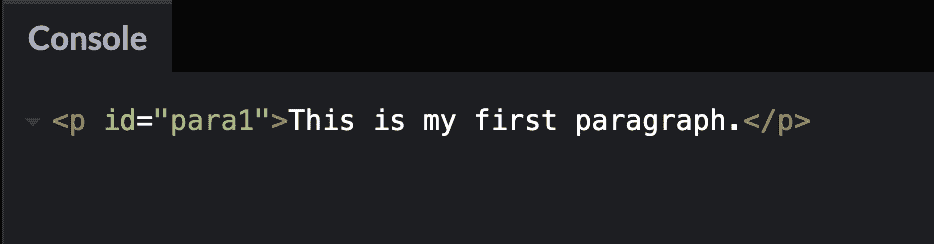
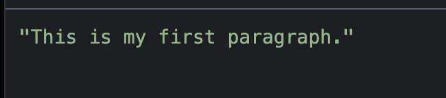
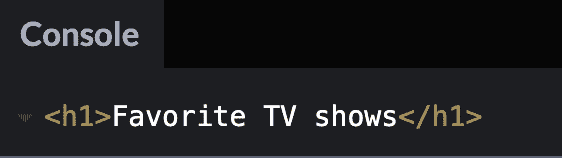
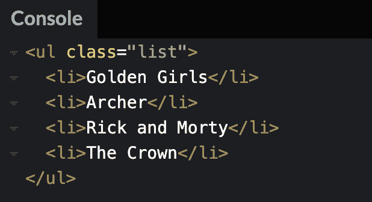
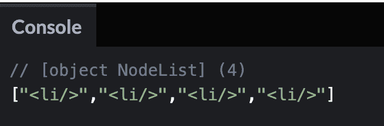
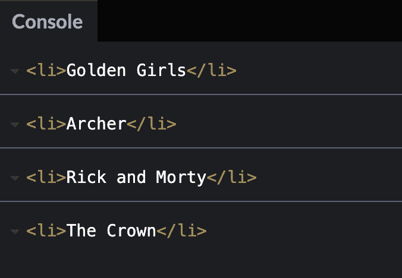
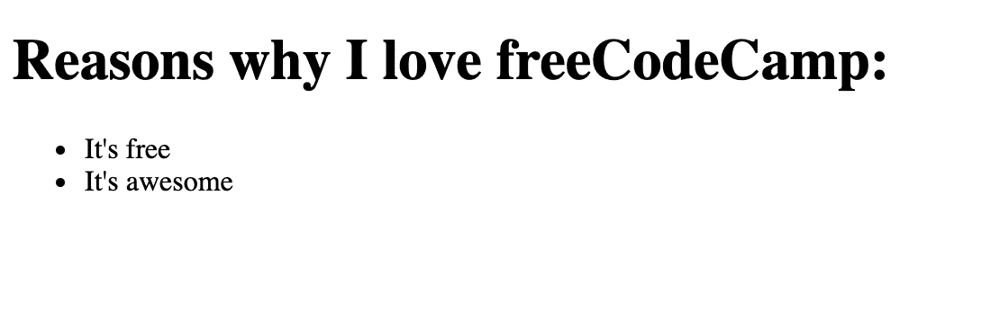
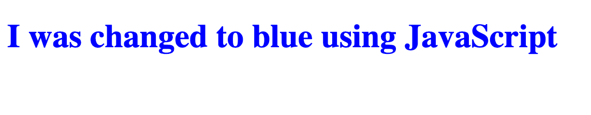

# 什么是 DOM？JavaScript 中文档对象模型的含义

> 原文：<https://www.freecodecamp.org/news/what-is-the-dom-document-object-model-meaning-in-javascript/>

如果您刚刚开始学习 JavaScript，您可能听说过 DOM。但是到底是什么呢？

在本文中，我将解释什么是 DOM，并提供一些 JavaScript 代码示例。

我们将看看如何从 HTML 文档中选择元素，如何创建元素，如何改变内联 CSS 样式，以及如何监听事件。

## 这只狗是什么

DOM 代表文档对象模型。它是一个编程接口，允许我们创建、更改或删除文档中的元素。我们还可以向这些元素添加事件，使页面更加动态。

DOM 将 HTML 文档视为节点树。一个节点代表一个 HTML 元素。

让我们来看看这段 HTML 代码，以便更好地理解 DOM 树结构。

```
<!DOCTYPE html>
<html lang="en">
  <head>
    <meta charset="UTF-8">
    <meta name="viewport" content="width=device-width, initial-scale=1.0">
    <meta http-equiv="X-UA-Compatible" content="ie=edge">
    <title>DOM tree structure</title>
  </head>
  <body>
    <h1>DOM tree structure</h1>
	<h2>Learn about the DOM</h2>
  </body>
</html>
```

我们的文档称为根节点，包含一个子节点，即`<html>`元素。`<html>`元素包含两个子元素，分别是`<head>`和`<body>`元素。

`<head>`和`<body>`元素都有自己的子元素。

这是另一种可视化节点树的方法。



我们可以访问文档中的这些元素，并使用 JavaScript 对它们进行修改。

让我们看几个例子，看看如何使用 JavaScript 处理 DOM。

## 如何选择文档中的元素

在 HTML 文档中选择元素有几种不同的方法。

在本文中，我们将重点介绍其中的三种方法:

*   `getElementById()`
*   `querySelector()`
*   `querySelectorAll()`

### `getElementById()`

在 HTML 中，`id`被用作 HTML 元素的唯一标识符。这意味着两个不同的元素不能有相同的`id`名称。

这是不正确的:

```
<p id="para">This is my first paragraph.</p>
<p id="para">This is my second paragraph.</p>
```

你必须确保这些`id`是独一无二的，就像这样:

```
<p id="para1">This is my first paragraph.</p>
<p id="para2">This is my second paragraph.</p>
```

在 JavaScript 中，我们可以通过引用`id`名称来获取 HTML 标签。

```
document.getElementById("id name goes here")
```

这段代码告诉计算机用`para1`的`id`获取`<p>`元素，并将该元素打印到控制台。

```
const paragraph1 = document.getElementById("para1");
console.log(paragraph1);
```



如果我们只想读取段落的内容，那么我们可以使用`console.log()`中的`textContent`属性。

```
const paragraph1 = document.getElementById("para1");
console.log(paragraph1.textContent);
```



### `querySelector()`

您可以使用此方法来查找带有一个或多个 CSS 选择器的元素。

我为我最喜欢的电视节目创建了这个 HTML 示例:

```
<h1>Favorite TV shows</h1>
<ul class="list">
  <li>Golden Girls</li>
  <li>Archer</li>
  <li>Rick and Morty</li>
  <li>The Crown</li>
</ul>
```

如果我想找到并打印到控制台的`h1`元素，那么我可以在`querySelector()`中使用这个标记名。

```
const h1Element = document.querySelector("h1");
console.log(h1Element);
```



如果我想让`class="list"`将无序列表打印到控制台，那么我会在`querySelector()`中使用`.list`。

`list`前的`.`告诉计算机以类名为目标。如果你想瞄准一个`id`，那么你可以在名字前使用一个`#`符号。

```
const list = document.querySelector(".list");
console.log(list);
```



### `querySelectorAll()`

该方法查找与 CSS 选择器匹配的所有元素，并返回所有这些节点的列表。

如果我想在我们的例子中找到所有的`<li>`项，我可以使用`>`子组合子来找到`<ul>`的所有子项。

```
const listItems = document.querySelectorAll("ul > li");
console.log(listItems); 
```



如果我们想打印出电视节目的实际`<li>`项，我们可以使用一个`forEach()`循环遍历节点列表并打印出每一项。

```
const listItems = document.querySelectorAll("ul > li");

listItems.forEach((item) => {
  console.log(item);
});
```



## 如何向文档中添加新元素

我们可以使用`document.createElement()`向 DOM 树添加新元素。

让我们来看看这个例子:

```
<h1>Reasons why I love freeCodeCamp:</h1>
```

现在，我在页面上只有一个`<h1>`标签。但是我想用 JavaScript 在那个`<h1>`标签下面添加一个我喜欢 freeCodeCamp 的原因列表。

我们可以首先使用`document.createElement()`创建一个`<ul>`元素。我会把它赋给一个叫做`unorderedList`的变量。

```
let unorderedList = document.createElement("ul"); 
```

然后我们需要使用`appendChild()`方法将`<ul>`元素添加到文档中。

```
document.body.appendChild(unorderedList);
```

下一步是使用`createElement()`方法在`<ul>`元素中添加几个`<li>`元素。

```
let listItem1 = document.createElement("li");

let listItem2 = document.createElement("li");
```

然后我们可以使用`textContent`属性为列表项添加文本。

```
let listItem1 = document.createElement("li");
listItem1.textContent = "It's free";

let listItem2 = document.createElement("li");
listItem2.textContent = "It's awesome"; 
```

最后一部分是使用`appendChild()`方法，这样列表项可以被添加到无序列表中。

```
let listItem1 = document.createElement("li");
listItem1.textContent = "It's free";
unorderedList.appendChild(listItem1);

let listItem2 = document.createElement("li");
listItem2.textContent = "It's awesome";
unorderedList.appendChild(listItem2);
```

这是所有代码的外观。

```
let unorderedList = document.createElement("ul");
document.body.appendChild(unorderedList);

let listItem1 = document.createElement("li");
listItem1.textContent = "It's free";
unorderedList.appendChild(listItem1);

let listItem2 = document.createElement("li");
listItem2.textContent = "It's awesome";
unorderedList.appendChild(listItem2);
```

页面上的输出如下所示:



## 如何使用 Style 属性更改内联 CSS 样式

属性赋予你改变 HTML 文档中 CSS 的能力。

在本例中，我们将使用`style`属性将`h1`文本从黑色改为蓝色。

这是我们的 HTML。

```
<h1>I was changed to blue using JavaScript</h1> 
```

我们首先需要使用`querySelector()`方法获取`h1`标签。

```
const h1 = document.querySelector("h1");
```

然后我们使用`h1.style.color`将`h1`文本从黑色变为蓝色。

```
const h1 = document.querySelector("h1");
h1.style.color = "blue";
```

浏览器中的结果如下所示:



您可以使用这个`style`属性来改变许多 CSS 内联样式，包括`background-color`、`border-style`、`font-size`等等。

## 如何使用 addEventListener()监听页面上的事件

此方法允许您将事件附加到 HTML 元素，如按钮。

在这个例子中，当用户点击按钮时，会弹出一个警告消息。

在我们的 HTML 中，我们有一个按钮元素，它的`id`为`btn`。

```
 <button id="btn">Show alert</button> 
```

我们可以在 JavaScript 中使用`getElementById()`方法将该元素指定给名为`button`的变量。

```
const button = document.getElementById("btn"); 
```

`addEventListener()`接受一个事件类型和一个函数。事件类型将是`click`事件，该功能将触发警报消息。

这是将事件监听器添加到`button`变量的代码。

```
button.addEventListener("click", () => {
  alert("Thank you for clicking me");
});
```

这是完整的代码，您可以单击按钮，然后弹出警告消息:

[https://codepen.io/jessica-wilkins/embed/preview/abwQwPb?default-tabs=css%2Cresult&height=300&host=https%3A%2F%2Fcodepen.io&slug-hash=abwQwPb](https://codepen.io/jessica-wilkins/embed/preview/abwQwPb?default-tabs=css%2Cresult&height=300&host=https%3A%2F%2Fcodepen.io&slug-hash=abwQwPb)

## 如何在现实项目中使用 DOM

这是对您可以使用的一些 DOM 方法的简要介绍。还有很多我们在本文中没有涉及的例子。

如果你想开始构建初级 JavaScript 项目并使用 DOM，那么我建议你看看我的 [40 篇初级 JavaScript 项目](https://www.freecodecamp.org/news/javascript-projects-for-beginners/)文章。

## 结论

DOM 代表文档对象模型，是一个编程接口，允许我们创建、更改或删除文档中的元素。我们还可以向这些元素添加事件，使页面更加动态。

您可以使用像`getElementById(), querySelector()`和`querySelectorAll()`这样的方法在 JavaScript 中选择元素。

如果你想给文档添加新元素，你可以使用`document.createElement()`。

您还可以使用`style`属性更改元素的内联 CSS 样式。

如果你想给按钮这样的元素添加事件，那么你可以使用`addEventListener()`。

我希望您喜欢这篇文章，并祝您的 JavaScript 之旅好运。