# 什么是 DOM？用简单的英语解释文档对象模型

> 原文：<https://www.freecodecamp.org/news/what-is-the-dom-explained-in-plain-english/>

现代网页是动态的。这意味着我们需要一种合适和方便的方法来修改和操作 web 文档的结构。

例如，HTML 文档中的这种修改通常采取在文档中创建、添加或删除元素的形式。

在本文中，您将了解什么是**文档对象模型(DOM)** ，了解它的历史，以及如何使用它来操作 web 文档，尤其是 HTML 文档。

## 什么是文档对象模型(DOM)？

DOM 是一个网络接口，由**万维网联盟( [W3C](https://www.w3.org/) )** 开发并发布。这个组织的成立是为了建立万维网的标准。

DOM 是一个语言中立的 web API。这意味着您可以在任何编程语言中实现和采用它。

DOM 将 web 文档的结构部分表示为可以被访问和操作的对象。换句话说，DOM 允许软件开发人员做以下事情:

*   创建和构建 web 文档。
*   浏览 web 文档的结构。
*   添加、修改或删除 web 文档中的元素和内容。

## DOM 的历史

DOM 的历史与 JavaScript 和 JScript 相关，它们是最早广泛使用的脚本语言。这些语言有助于网页的互动。

在 W3C 开发标准 DOM 规范之前，JavaScript 和 JScript 有不同的方式来支持对 HTML 文档的操作。

这些有限的方法和接口让你以这种方式操作 HTML 文档，成为了 DOM Level 0。

1998 年，W3C 完成了第一个标准 DOM 规范的草案，该规范成为所有浏览器的推荐标准。这个标准 DOM 规范成为了 **DOM Level 1** 。DOM level 1 为操纵 HTML 和 XML 文档提供了一个全面的模型。

2000 年，W3C 发布了 **DOM Level 2** ，引入了`getElementById()`等方法，以及标准化的事件模型和对 XML 名称空间和 CSS 的支持。

2004 年发布的 DOM Level 3(T1)增加了对 XPath 和键盘事件处理的支持。并且在 2015 年末，最新的 DOM 规范， **DOM Level 4** 成为了发布的标准。

## 什么是 DOM 树？

DOM 创建的结构表示非常像一棵树。它有几个被称为节点的对象。

浏览器使用它从 HTML 文档构建的 DOM 树表示来确定在网页上呈现什么。例如，DOM 树的可视化表示如下所示:

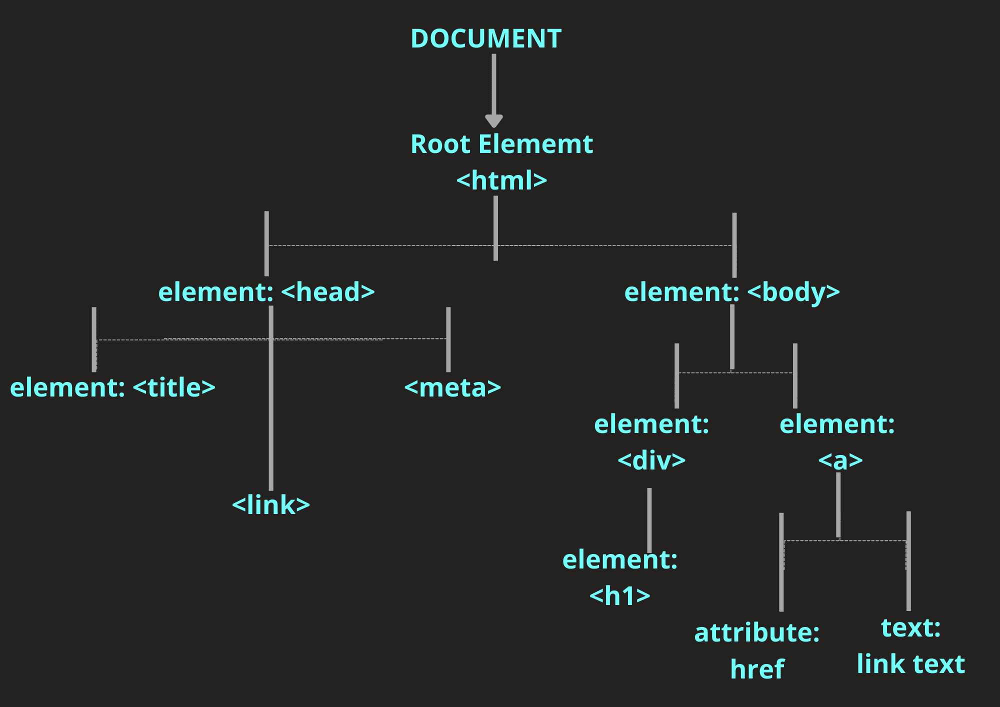

The DOM Tree

上述 DOM 树的 HTML 文档如下所示:

```
<!DOCTYPE html>
<html lang="en">
<head>
    <meta charset="UTF-8">
    <meta http-equiv="X-UA-Compatible" content="IE=edge">
    <meta name="viewport" content="width=device-width, initial-scale=1.0">
    <title>TITLE</title>
    <link rel="stylesheet" href="style.css">
</head>
<body>
    <div>
        <h1>HELLO WORLD</h1>
    </div>
    <a href="link text">Document Object Model</a>
</body>
</html>
```

### DOM 中的节点与元素

通常，开发人员会混淆节点和元素。因此，我们应该在本文的前面区分这两者，以避免混淆。

**节点**是组成网页文档的所有组件。换句话说，网页是节点的集合。

元素是文档中的一种节点。例如，DOM 属性`nodes.childNodes`在父节点上使用时将返回指定父节点中包含的所有不同节点。

在下面的示例中，childNodes 属性用于上面给出的 HTML 文档的`<body>`元素节点:

```
//javascript content

//select the <body> element node with the DOM method querySelector
const body = document.querySelector('body') 
//select the children nodes with the <body> element node with the DOM property node.childNodes
const childrenNodes = body.childNodes
//console log the children nodes
console.log(childrenNodes)//NodeList(5) [text, div, text, a, text]
```

注意在`nodeList`中有五个项目。这是因为我们有另一种类型的节点，即文本节点，它不同于`<body>`元素节点中的元素节点。

要对此进行进一步调查，请在您的控制台中完成以下步骤:

1.  单击“节点列表”前面的下拉图标。
2.  单击“测试”前的下拉图标，选择文本节点。
3.  检查下拉列表选项中的 textContent 选项。

如果按照上面的说明操作，会看到第一个文本节点的测试内容是“/n”。这是一个文本节点，指示在`<body>`元素节点、`<div>`元素节点和`<a>`元素节点之后的新行。

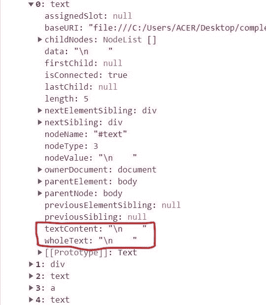

### DOM 树中节点之间的关系

DOM 树中的节点在 DOM 树中彼此具有层次关系。它们是由它们在 DOM 树中的相对位置定义的。

这些是上面 DOM 树图中的节点位置:

*   **根节点**:根节点总是在 DOM 树的顶点。在 HTML 文档中，根节点总是`<html>`元素。
*   **子节点**:子节点是嵌入在另一个节点中的节点。在上图中，`<head>`和`<body>`元素是`<html>`元素的子元素。
*   **后代节点**:在层次结构中位于另一个节点之下的任何节点都是位于其上的节点的后代。例如，虽然`<h1>`元素不是`<body>`元素的直接子元素，但是它是`<body>`和根`<html>`元素的后代。
*   **父节点**:任何内部有另一个节点的节点都是父节点。例如，在上面的例子中，`<body>`元素是`<div>`和`<a>`元素的父元素。请注意，只有元素类型的节点可以是父节点。
*   **兄弟节点**:在 DOM 树中处于同一层次的节点是兄弟节点。例如，上面示例中的`<div>`和`<a>`元素是兄弟元素。
*   **叶节点**:元素内部的文本是叶节点。这是因为它们不能有自己的子节点。

## html 集合与节点列表

要操作 DOM 树，您需要一种方法来选择其中的单个项目或项目集合。

您可以使用像 JavaScript 这样的编程语言，通过使用 DOM 提供的一些方法来选择 DOM 树中的一个项目或项目集合。

方法`getElementById()`和`querySelector()`可以选择单个项目。方法`getElementsByClassName()`、`getElementsByTagName()`或`querySelectorAll()`可以选择一组项目。

在 DOM 树中，根据用来选择项目集合的方法，我们可以获得 HTMLCollection 或 NodeList。`getElementsByClassName()`和`getElementsByTagName()`方法返回 HTMLCollections，而`querySelectorAll`返回 nodeList。

HTMLCollection 和 nodeList 有一些相似之处和不同之处。它们在以下方面相似:

*   它们是类似数组的对象。
*   它们是物品的集合。
*   它们可以通过使用`Array.from()`方法转换成一个数组。
*   它们都有一个从零开始的索引。
*   它们都可以用 for 迭代...循环。
*   它们有一个长度属性。
*   它们没有可用的数组方法。

下面是强调这些相似性的 HTML 文档和 JavaScript 代码示例:

```
<!-- html documant -->

<!DOCTYPE html>
<html lang="en">
<head>
    <meta charset="UTF-8">
    <meta http-equiv="X-UA-Compatible" content="IE=edge">
    <meta name="viewport" content="width=device-width, initial-scale=1.0">
    <title>Document</title>
</head>
<body>
   <ul>
    <li>item one</li>
    <li>item two</li>
    <li>item three</li>
    <li>item four</li>
   </ul>

    <script src="main.js"></script>
</body>
</html> 
```

```
//javascript content

const listItemsHtmlCollection = document.getElementsByTagName("li")
console.log(listItemsHtmlCollection) // HTMLCollection(4) [li, li, li, li]

const listItemsNodeList = document.querySelectorAll("li")
console.log(listItemsNodeList) // NodeList(4) [li, li, li, li]
```

从上面可以看到，`getElementsByTagName`返回一个 HTMLCollection，其中的条目与指定的`<li>`标签匹配，`querySelectorAll`返回一个 nodeList。

现在，让我们用一个 for...循环来迭代两个集合:

```
for(let i = 0; i < listItemsHtmlCollection.length; i++) {
    listItemsHtmlCollection[i].style.color = 'red'
}

for(let i = 0; i < listItemsHtmlCollection.length; i++) {
    listItemsHtmlCollection[i].style.color = 'red'
}
```

在这两种情况下，文本的颜色都将变为红色。

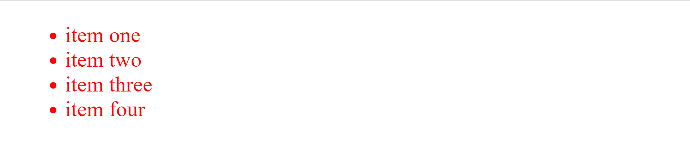

现在让我们删除 for...循环迭代并在 map 上使用数组方法来迭代两个集合:

```
listItemsHtmlCollection.map( element => element.style.color = 'red' )
listItemsNodeList.map( element => element.style.color = 'red' )
```


为了成功地使用 map array 方法，您必须使用如下的`Array.from()`方法将两个项目转换成一个数组:

```
Array.from(listItemsHtmlCollection).map( element => element.style.color = 'red' )
Array.from(listItemsNodeList).map( element => element.style.color = 'red' )
```

HTMLCollection 和 nodeList 主要有两个不同之处。它们是:

*   nodeList 带有一些 HTMLCollection 中没有的内置方法和属性。这些方法包括用于遍历节点列表的`forEach()`和`entries`方法。这些属性包括 keys 属性和值属性。
*   HTMLCollection 总是活动的，而 nodeList 可以是活动的，也可以是静态的。如果 DOM 树中的变化自动更新集合，则节点集合是活动的。如果 DOM 树中的变化不影响集合，那么它就是静态的。DOM 更改可以是添加新节点或删除现有节点。DOM 方法如`getElementById()` 和`getElementsByClassName()` 返回 HTMLCollections，这是始终活的。`querySelectorAll()` 方法返回一个静态节点列表。

## DOM HTML 方法

DOM level 1 core、Dom level 2 core 和 Dom level 3 core 引入了几种方法，允许 web 开发人员操作 DOM 树。其中一些方法如下:

### `createElement()` DOM 方法

`createElement()`方法创建一个指定类型的元素作为它的参数。

```
//html document

<!DOCTYPE html>
<html lang="en">
<head>
    <meta charset="UTF-8">
    <meta http-equiv="X-UA-Compatible" content="IE=edge">
    <meta name="viewport" content="width=device-width, initial-scale=1.0">
    <title>Document</title>
    <link rel="stylesheet" href="style.css">
</head>
<body>
   <ul>
    <li>item one</li>
    <li>item two</li>
    <li>item three</li>
    <li>item four</li>
   </ul>

    <script src="main.js"></script>
</body>
</html>
```

```
//javascript content

//select the parent element
const list = document.querySelector('ul')
//create a new element
const listItem = document.createElement('li')
//make the newly created element a child of the parent
list.appendChild('listItem')
console.log(list)
```

现在检查控制台列表控制台记录。您将看到在`<ul>`父元素中现在有五个`<li>`元素。

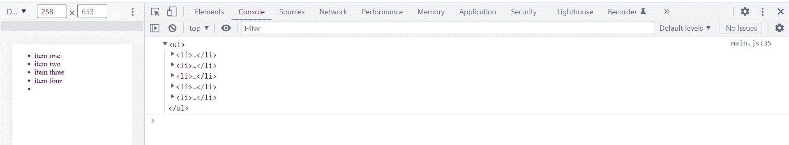

### `createTextNode()` DOM 方法

方法创建一个文本节点，将字符串指定为它的参数。让我们向上面创建的`<li>`元素添加文本。

```
//javascript content

const listText = document.createTextNode("item five")
listItem.appendChild(listText)
```

现在保存您的 JavaScript 文件并重新加载您的网页。

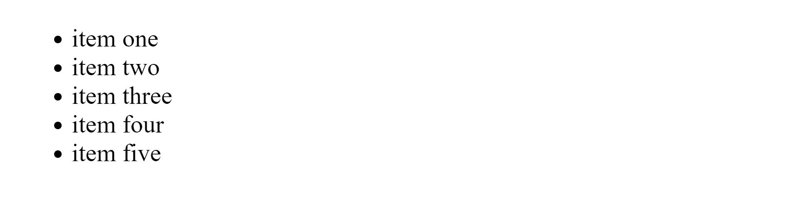

### `appendChild()` DOM 方法

方法将一个节点添加到父节点的子节点列表的末尾。

如果指定的子节点是文档中的现有节点，`appendChild()`将其从 DOM 树中的当前位置移动到新位置。我们在前面使用了这个方法来使我们新创建的`<li>`元素成为`<ul>`元素的子元素。

### `getElementById()` DOM 方法

此方法选择并返回其 ID 在其中作为参数指定的元素。如果不存在这样的元素，该方法将返回 null。让我们给 HTML 文档中的`<ul>`元素添加一个 *id* 属性，并给它一个红色边框。

```
//html document

<!DOCTYPE html>
<html lang="en">
<head>
    <meta charset="UTF-8">
    <meta http-equiv="X-UA-Compatible" content="IE=edge">
    <meta name="viewport" content="width=device-width, initial-scale=1.0">
    <title>Document</title>
    <link rel="stylesheet" href="style.css">
</head>
<body>
   <ul id="ulList">
    <li>item one</li>
    <li>item two</li>
    <li>item three</li>
    <li>item four</li>
   </ul>

    <script src="main.js"></script>
</body>
</html>
```

```
//javascript content

const ulList = document.getElementById("ulList") 
ulList.style.border = '2px solid red'
```

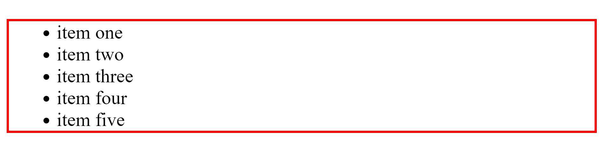

### `getElementsByClassName()` DOM 方法

`getElementsByClassName()`方法选择具有指定类名的所有元素，并按照它们在 DOM 树中出现的顺序将它们作为 HTMLCollection 返回。

您可以通过索引号访问 HTMLCollection 中的单个元素。让我们为 HTML 文档中的前两个`<li>`元素添加一个 class 属性，并将它们的文本颜色改为红色，如下所示:

```
//html document

<!DOCTYPE html>
<html lang="en">
<head>
    <meta charset="UTF-8">
    <meta http-equiv="X-UA-Compatible" content="IE=edge">
    <meta name="viewport" content="width=device-width, initial-scale=1.0">
    <title>Document</title>
    <link rel="stylesheet" href="style.css">
</head>
<body>
   <ul id="ulList">
    <li class="itemOneAndTwo">item one</li>
    <li class="itemOneAndTwo">item two</li>
    <li>item three</li>
    <li>item four</li>
   </ul>

    <script src="main.js"></script>
</body>
</html>
```

```
//javascript content

//select by elements one and two by their class name
const itemOneAndTwo = document.getElementsByClassName("itemOneAndTwo")
//change text color to red with use of index
itemOneAndTwo[0].style.color = 'red'
itemOneAndTwo[1].style.color = 'red'
```

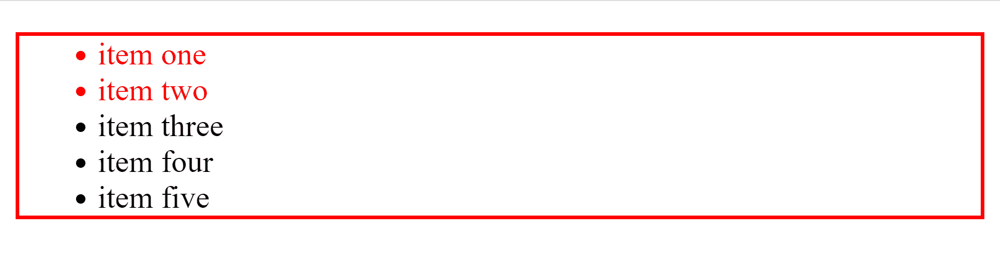

### `getElementsByTagName()` DOM 方法

`getElementsByTagName()`方法返回所有元素的 HTMLCollection，将标记名指定为它的参数，按照它们在 DOM 树上出现的顺序。

让我们用`getElementsBytagName()`方法选择`<li>`元素，并将它们的字体改为斜体。

```
//javascript content

const liTags = document.getElementsByTagName("li") 
for(let i = 0; i < liTags.length; i++) {
    liTags[i].style.fontStyle = 'italic'
} 
```

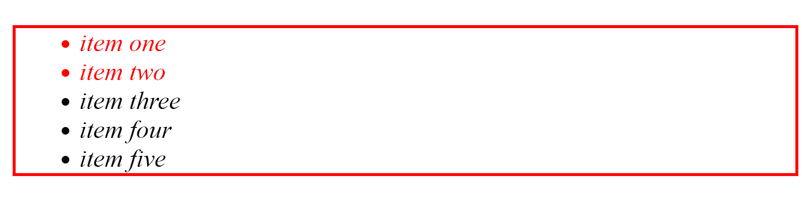

### `querySelector()` DOM 方法

`querySelector()`方法接受任何 CSS 字符串选择器作为参数。然后，它使用指定的选择器来选择文档中与该指定选择器匹配的第一个。

让我们用`querySelector()`方法选择前两个`<li>`元素，并将它们的文本颜色改回黑色。

```
//javascript content

const querySelectItem = document.querySelector("itemOneAndTwo")
querySelectItem.style.color = 'black' 
```

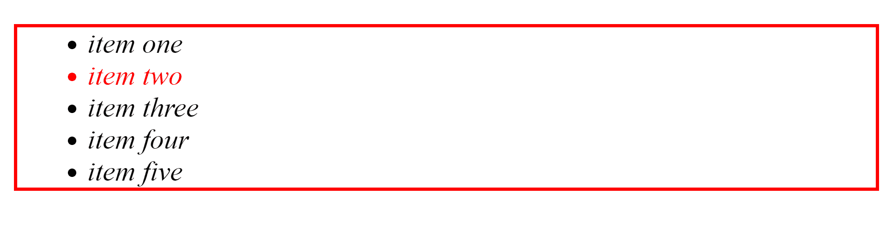

请注意，只有第一个列表项的颜色变成了黑色。

### `querySelectorAll()` DOM 方法

与`querySelector`方法一样，`querySelectorAll()`方法接受任何 CSS 字符串选择器作为其参数。然后，它使用指定的 CSS 字符串选择器来选择与指定选择器匹配的所有元素，将它们放在一个节点列表中，并返回该节点列表。

现在，让我们用它来改变所有的文本在我们的列表项目为绿色。

```
//javascript content

const querySelectAllItems = document.querySelectorAll("li")
for(let i = 0; i < querySelectAllItems.length; i++) {
    querySelectAllItems[i].style.color = 'green'
} 
```

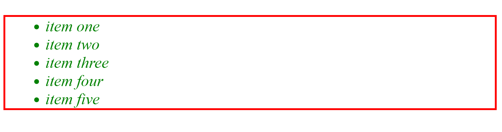

### `setAttribute()` DOM 方法

`setAttribute()`方法向元素添加一个新的属性名。如果元素中已经存在具有该名称的属性，则其值将更改为参数中设置的值。

该方法接受两个参数。第一个参数是您想要创建的属性的名称。第二个参数是要在属性上设置的值，该值始终是一个字符串。

让我们用它给我们的第三个项目一个类属性，并将文本颜色改为黑色。

```
//javascript content

const itemThree = querySelectAllItems[2] 
itemThree.setAttribute("class", "attributeValue")  
const attributeValue = document.querySelector('.attributeValue')
attributeValue.style.color = 'black'
```

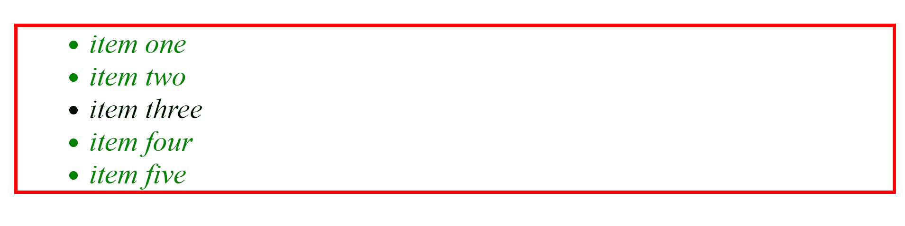

### `removeAttribute()` DOM 方法

方法删除一个指定的属性。它接受要删除的属性的名称作为它的参数。让我们从`<ul>`父元素中移除 *id* 属性，并使用移除的 id 移除其红色边框。

```
//javascript content

//remove attribute
ul.removeAttribute('id')
ul.style.border = 'none'
```

现在保存您的 JavaScript 文件并重新加载您的 web 页面。请注意，边框仍然存在。如果您检查控制台，您会看到一条错误消息，指出不再定义 *ul* 。

### `contains()` DOM 方法

如果一个节点是一个节点的后代，那么`contains()`方法返回 true，否则返回 false。

```
<--HTML document--> 
<body>   
    <h1>Heading</h1> 
</body>
```

```
//javascript content
const body = document.querySelector('body')
const h1Element = document.querySelector('h1')
console.log( body.contains(h1Element) ) // true
```

### `item()` DOM 方法

在集合上使用时，`item()`方法返回在指定索引处指定的项，该索引被指定为它的参数。

```
<--HTML document--> 
<body>   
    <p>Paragraph</p> 
    <p>Paragraph</p> 
</body>
```

```
//javascript content
const pElements = document.querySelectorAll("p") 
console.log(pElements.item(0)) // <p></p>
```

### `hasChildNodes()` DOM 方法

如果被调用的元素中有子节点，方法返回 true，否则返回 false。

```
<--HTML document--> 
<body>   
    <p>Paragraph</p> 
    <p>Paragraph</p> 
</body>
```

```
//javascript content

const body = document.querySelector("body")

console.log(body.hasChildNodes()) // true
```

## 什么是 DOM 事件？

为了通过在网页上启动自动响应或事件来使我们的网页具有逻辑交互性，我们需要事件。

DOM 事件包括:

> 您正在编程的系统中发生的动作或事件，系统会告诉您，以便您的代码可以对它们做出反应。(来源: [MDN](https://developer.mozilla.org/en-US/docs/Learn/JavaScript/Building_blocks/Events#event_objects) )

事件的一个常见例子是当用户单击表单中的提交按钮时，该按钮提交用户输入的数据作为对单击的响应。

另一个例子是当用户点击一个菜单图标，然后触发一个下拉导航或选项。

您可以使用 JavaScript 之类的脚本语言在 DOM 树内部的元素上注册事件处理程序或侦听器，这将在指定的事件触发时运行。

事件处理程序是:

> 事件触发时运行的代码块(通常是程序员创建的 JavaScript 函数)。当这样的代码块被定义为响应一个事件而运行时，我们说我们正在**注册一个事件处理程序**。(来源: [MDN](https://developer.mozilla.org/en-US/docs/Learn/JavaScript/Building_blocks/Events#event_objects)

DOM 树中元素上使用的事件示例包括:

*   **点击**:点击事件是鼠标按下或者鼠标放在网页上的一个元素上。
*   **按键**:当键盘上的按键被按下时，发生按键事件。
*   **mouseover** :当指针设备移动到一个元素上时，发生 mouseover 事件。
*   **dblclick** :当网页上的某个元素上有双击事件时，就会发生 dblclick。
*   **提交**:提交表单时发生提交事件。

## 结论

DOM 是现代 web 动态的支柱。它将 web 文档的每一部分都表示为一个对象，并为编程语言提供了操作和修改每一部分的必要方法。

如果你喜欢这篇文章，你应该给我一个[](https://twitter.com/activus_d)*。*

### *参考资料和进一步阅读*

1.  *[https://dom.spec.whatwg.org/](https://dom.spec.whatwg.org/)*
2.  *[https://www . w3 . org/TR/1998/REC-DOM-Level-1-1998 10 01/Level-one-core . html](https://www.w3.org/TR/1998/REC-DOM-Level-1-19981001/level-one-core.html)*
3.  *[https://www . w3 . org/TR/1998/REC-DOM-Level-1-1998 10 01/Level-one-html . html](https://www.w3.org/TR/1998/REC-DOM-Level-1-19981001/level-one-html.html)*
4.  *[https://www.w3.org/TR/DOM-Level-2-HTML/](https://www.w3.org/TR/DOM-Level-2-HTML/)*
5.  *[https://www.w3.org/TR/DOM-Level-3-Core/core.html](https://www.w3.org/TR/DOM-Level-3-Core/core.html)*