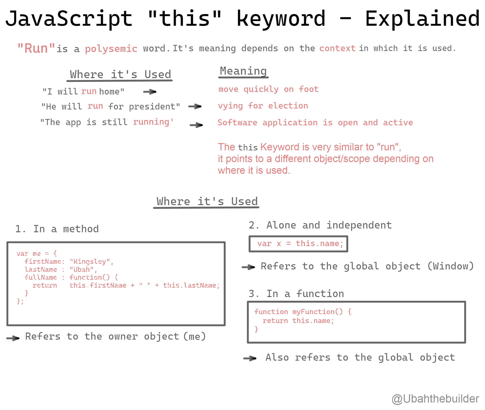
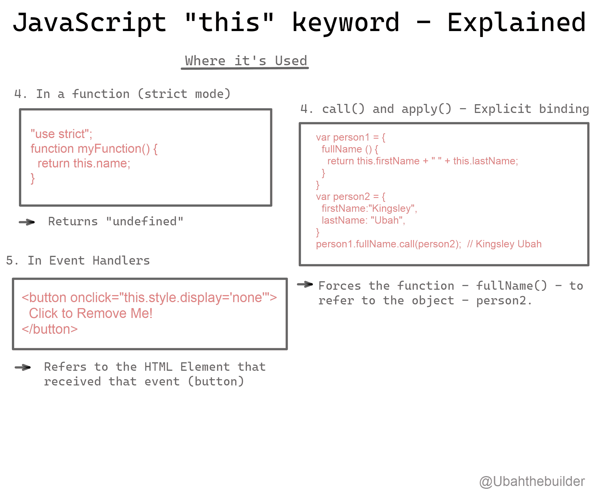

# JavaScript 中的“this”是什么意思？this 关键字用例子解释

> 原文：<https://www.freecodecamp.org/news/what-is-this-in-javascript/>

为了理解`this` 在 JavaScript 中真正的意思，我们来看看英语中一个非常相似的概念:**多义性。**

让我们考虑一下“ **run** ”这个词。Run 是一个单词，根据**的上下文**，它可能有许多不同的意思。

*   “我要跑回家”——意思是步行快速移动
*   “她跑了 1500 米”——意思是参加赛跑
*   “他正在竞选总统”——意思是争夺一个官方职位
*   “应用程序正在运行”——表示软件应用程序仍处于打开和活动状态
*   “去跑步”——意思是把跑步作为一种锻炼方式

这样的例子不胜枚举。

当您在 JavaScript 代码中使用 **`this`** 关键字时，也会出现类似的情况。当您这样做时，它会根据定义它的上下文自动解析为一个对象或范围。

可能的上下文是什么？我们如何利用这些信息来推断一个 **`this`调用**将解析到哪个对象？

## `this`上下文

在函数中使用时，`this`关键字只是指向它所绑定的对象。它回答了**的问题，即它应该从哪里获得一些值或数据:**

```
function alert() { 
  console.log(this.name + ' is calling'); 
} 
```

A function with a "this" reference

在上面的函数中，`this`关键字引用了它所绑定的对象**，因此它从那里**获得“name”属性。

但是你怎么知道这个函数绑定到哪个对象呢？你怎么知道`this`指的是什么？

为此，我们需要详细了解函数是如何绑定到对象的。

## JavaScript 中的绑定类型

通常有四种绑定:

*   默认绑定
*   隐式结合
*   显式绑定
*   构造函数调用绑定

### JavaScript 中的默认绑定

要记住的第一条规则是，如果包含一个`this` 引用的函数是一个**独立函数**，那么这个函数被绑定到**全局对象。**

```
function alert() { 
  console.log(this.name + ' is calling'); 
}

const name = 'Kingsley'; 
alert(); // Kingsley is calling 
```

Standalone function

如您所见，`name()`是一个独立的函数，因此它被绑定到**全局作用域**。结果，`this.name`引用解析为全局变量 **`const name = 'Kingsley'`** 。

然而，如果以严格模式定义`name()`,这条规则就不成立:

```
function alert() { 
  'use strict'; 
  console.log(this.name + ' is calling'); 
}

const name = 'Kingsley'; 
alert(); // TypeError: `this` is `undefined` 
```

undefined in strict mode

在严格模式下设置时，`this`参考被设置为未定义。

### JavaScript 中的隐式绑定

另一个要注意的场景是函数是否在调用点被附加到一个对象(它的上下文)**。**

根据 JavaScript 中的绑定规则，只有当对象在调用点绑定到函数时，函数才能使用该对象作为其上下文。这种形式的绑定被称为隐式绑定。

我的意思是:

```
function alert() { 
  console.log(this.age + ' years old'); 
}

const myObj = {
  age: 22,
  alert: alert
}

myObj.alert() // 22 years old 
```

简而言之，当您使用点标记法调用函数时，`this`被隐式绑定到调用该函数的对象。

在这个例子中，因为从`myObj`调用`alert`，所以`this`关键字被绑定到`myObj`。所以用`myObj.alert()`调用`alert`时，`this.age`是 22，这是`myObj`的`age`属性。

让我们看另一个例子:

```
function alert() { 
  console.log(this.age + ' years old'); 
}

const myObj = {
  age: 22,
  alert: alert,
  nestedObj: {
    age: 26,
    alert: alert
  }
}

myObj.nestedObj.alert(); // 26 years old 
```

这里，因为`alert`最终是从`nestedObj`调用的，`this`被隐式绑定到`nestedObj`而不是`myObj`。

确定哪个对象`this`被隐式绑定的一个简单方法是查看哪个对象在点(`.`)的左边:

```
function alert() { 
  console.log(this.age + ' years old'); 
}

const myObj = {
  age: 22,
  alert: alert,
  nestedObj: {
    age: 26,
    alert: alert
  }
}

myObj.alert(); // `this` is bound to `myObj` -- 22 years old
myObj.nestedObj.alert(); // `this` is bound to `nestedObj` -- 26 years old
```

### JavaScript 中的显式绑定

我们看到隐式绑定必须在对象中有一个引用。

但是如果我们想让**强制**一个函数使用一个对象作为它的上下文，而不在该对象上放置一个属性函数引用，该怎么办呢？

我们有两个实用方法来实现这一点:`call()`和`apply()`。

连同另外一组实用函数，这两个实用函数通过[[Prototype]]机制可用于 JavaScript 中的所有函数。

要显式地将一个函数调用绑定到一个上下文，只需调用该函数上的`call()`,并将上下文对象作为参数传入:

```
function alert() { 
  console.log(this.age + ' years old'); 
}

const myObj = {
  age: 22
}

alert.call(myObj); // 22 years old 
```

现在有趣的部分来了。即使您将该函数多次传递给新变量(currying ),每次调用都将使用相同的上下文，因为它已经被锁定(显式绑定)到该对象。这叫做**硬绑定**。

```
function alert() { 
  console.log(this.age); 
} 

const myObj = { 
  age: 22 
}; 

const bar = function() { 
  alert.call(myObj); 
}; 

bar(); // 22
setTimeout(bar, 100); // 22 
// a hard-bound `bar` can no longer have its `this` context overridden 
bar.call(window); // still 22 
```

Hard binding

硬绑定是将上下文锁定到函数调用中并真正将函数变成方法的完美方式。

### JavaScript 中的构造函数调用绑定

最后一种可能也是最有趣的一种绑定是新的绑定，它也强调了 JavaScript 与其他基于类的语言相比的不同寻常的行为。

当调用前面带有关键字`new` 的函数时，也称为**构造函数调用**，会发生以下情况:

1.  创建(或构建)了一个全新的对象
2.  新构造的对象被[[原型]]-链接到构造它的函数
3.  新构造的对象被设置为该函数调用的`this`绑定。

为了更好地理解，让我们看看代码:

```
function giveAge(age) { 
  this.age = age; 
} 

const bar = new giveAge(22); 
console.log(bar.age); // 22 
```

通过调用前面带有`new` 的`giveAge(...)`，我们构建了一个新对象，并将该新对象设置为`foo(...)`调用的`this`。所以`new`是绑定一个函数调用的`this`的最后一种方法。

## 包扎

总而言之，

*   当在函数中使用时，`this`关键字将该函数绑定到一个上下文对象
*   绑定有四种:*默认绑定、隐式绑定、显式绑定和构造函数调用绑定* ( *新增*)
*   了解这四条规则将有助于你轻松辨别`this` 引用的上下文。



An Image Explaining the 'this' keyword



An Image Explaining the 'this' keyword

如果你喜欢或受益于这篇文章，并愿意支持我，你可以在这里给我买一杯咖啡。

你也可以在推特上找到我。请务必查看我的[博客](https://ubahthebuilder.tech)，了解更多 JavaScript 和编程相关的内容。

谢谢，很快再见。