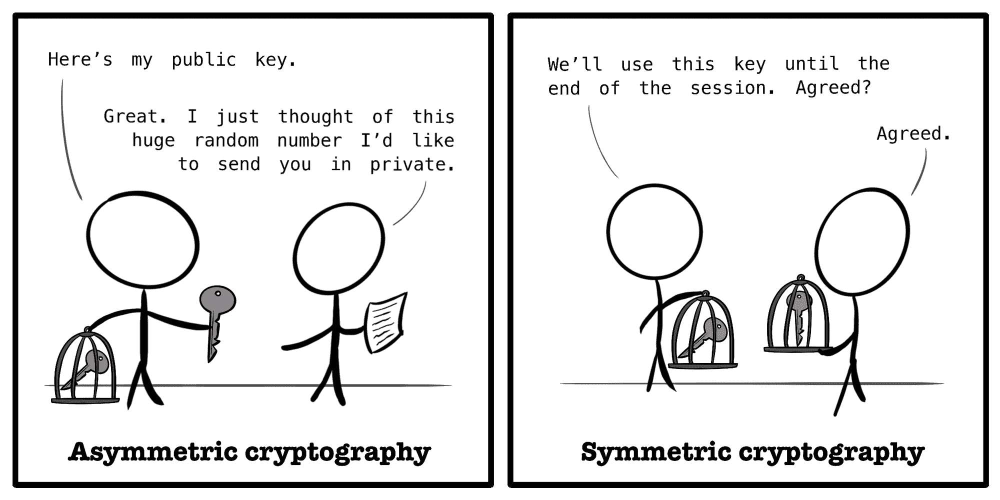

# 什么是 TLS？用简单的英语解释传输层安全加密

> 原文：<https://www.freecodecamp.org/news/what-is-tls-transport-layer-security-encryption-explained-in-plain-english/>

如果你想和你认识的人进行一次秘密的谈话，你可以亲自见面，找个私人的地方谈谈。

但是，如果您想通过互联网秘密地发送数据，您可能需要考虑更多的问题。

TLS 或传输层安全性指的是一种协议。“协议”这个词的意思是，“我们同意在这里做事情的方式”，或多或少。

在[互联网协议套件模型](https://en.wikipedia.org/wiki/Internet_protocol_suite)中，TLS 的“传输层”部分只是指主机到主机的通信，例如客户端和服务器如何交互。

TLS 协议试图解决这些基本问题:

*   我怎么知道你是你说的那个人？
*   我怎么知道你发来的这条消息没有被篡改？
*   我们怎样才能安全地交流？

以下是 TLS 的工作原理，用简单的英语解释。正如许多成功的互动一样，它始于握手。

## 开始了解你

一个 [TLS 握手](https://en.wikipedia.org/wiki/Transport_Layer_Security#TLS_handshake)的基本过程包括一个客户端，比如你的网络浏览器，和一个服务器，比如一个托管网站的服务器，建立一些基本的通信规则。

它从客户打招呼开始。字面上。这叫做 *ClientHello* 消息。

*ClientHello* 消息告诉服务器它支持哪个 TLS 协议版本和*密码套件*。

虽然“密码套件”听起来像是一种豪华的酒店升级，但它只是指一套可用于安全通信的算法。

服务器在类似命名的 *ServerHello* 消息中，从提供的选项中选择要使用的协议版本和密码套件。如果服务器支持恢复先前的握手，也可以发送其他数据，例如*会话 ID* 。

Cartoon of a browser window and server saying hello, by author.

根据所选择的密码组，客户端和服务器交换进一步的信息，以建立共享的秘密。

通常，这个过程将交换从[非对称加密](https://en.wikipedia.org/wiki/Public-key_cryptography)转移到[对称加密](https://en.wikipedia.org/wiki/Symmetric-key_algorithm)，其复杂程度各不相同。让我们从总体上探讨这些概念，看看它们为什么对 TLS 如此重要。

## 不对称开端

这就是不对称:

Small egg, big egg.

非对称加密是一种可以执行*身份验证*的方法。当你验证你自己时，你回答了一个基本的问题，“我怎么知道你是你所说的那个人？”

在非对称加密系统中，您使用一对密钥来实现身份验证。这些密钥是不对称的。一个密钥是您的公钥，正如您所猜测的，它是公开的。另一个是你的私人钥匙，你知道的。

通常，在 TLS 握手期间，服务器将通过其数字证书提供其公钥，有时仍被称为其 *SSL 证书*，尽管 TLS 取代了不赞成使用的安全套接字层(SSL)协议。

数字证书是由被称为[认证机构(CA)](https://en.wikipedia.org/wiki/Certificate_authority) 的可信第三方提供和验证的，这本身就是另一回事。

虽然任何人都可以使用您的公钥加密消息，但只有您的私钥可以解密该消息。

非对称加密的安全性只依赖于您的私钥保持私密，因此存在不对称性。

从某种意义上说，这也是一种非对称的单向旅行。Alice 可以向您发送用您的公钥加密的消息，但是您的两个密钥都不能帮助您向 Alice 发送加密的消息。

## 对称秘密

非对称加密也比对称加密需要更多的计算资源。

因此，当 TLS 握手以非对称交换开始时，客户端和服务器将使用这种初始通信来建立共享秘密，有时称为*会话密钥*。该密钥是对称的，这意味着双方使用相同的共享秘密，并且必须保持该秘密以确保加密的安全性。

Wise person say: share your public key, but keep your shared keys private.

通过使用初始非对称通信来建立会话密钥，客户端和服务器可以依赖于只有它们自己知道的会话密钥。在接下来的会话中，他们都将使用同一个共享密钥来加密和解密消息，这加快了通信速度。

## 安全会话

TLS 握手可以使用非对称加密或其他密码套件来建立共享会话密钥。一旦建立了会话密钥，握手部分就完成了，会话开始了。

*会话*是客户端和服务器之间加密通信的持续时间。在此期间，使用只有客户端和服务器拥有的会话密钥对消息进行加密和解密。这确保了通信的安全性。

通过使用校验和来维护交换信息的完整性。使用会话密钥交换的消息附有一个[消息认证码(MAC)](https://en.wikipedia.org/wiki/Message_authentication_code) 。这和你的设备的 [MAC 地址](https://en.wikipedia.org/wiki/MAC_address)不是一回事。使用会话密钥生成并验证 MAC。

因此，任何一方都可以在收到消息之前检测到消息是否已被更改。这就解决了一个根本问题，“我怎么知道你发来的这条消息没有被篡改？”

由于网络断开，或者客户端空闲时间过长，会话可能会故意终止。一旦会话结束，就必须通过新的握手或之前建立的称为*会话 id*的允许恢复会话的秘密来重新建立会话。

## TLS 和你

让我们回顾一下:

*   TLS 是一种用于提供安全通信的加密协议。
*   创建安全连接的过程从握手开始。
*   握手会建立一个共享的会话密钥，然后使用该密钥来保护消息并提供消息完整性。
*   会话是临时的，一旦结束，必须重新建立或恢复。

这只是非常复杂的加密系统的表面层次，它有助于保持您的通信安全。关于这个主题的更多深度，我推荐探索密码套件和各种支持的算法。

TLS 协议在您的日常生活中起着非常重要的作用。它有助于保护您给家人的电子邮件、您的网上银行活动以及您阅读本文的联系。

使用 TLS 对 [HTTPS 通信协议](https://en.wikipedia.org/wiki/HTTPS)进行加密。每当你在你的地址栏中看到那个小锁图标时，你就在亲身体验你刚刚在这篇文章中读到的所有概念。

所以现在你知道最后一个问题的答案了:“我们怎样才能安全地交流？”