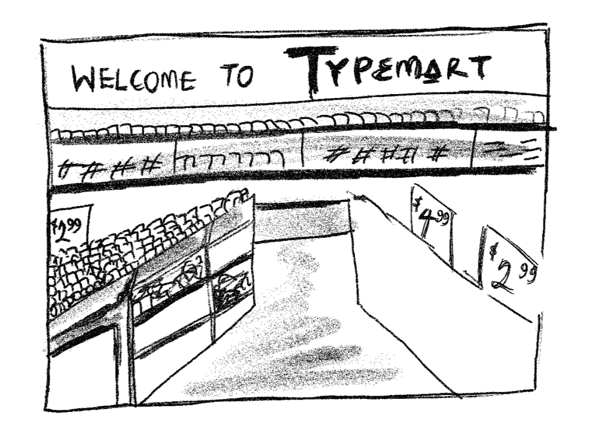
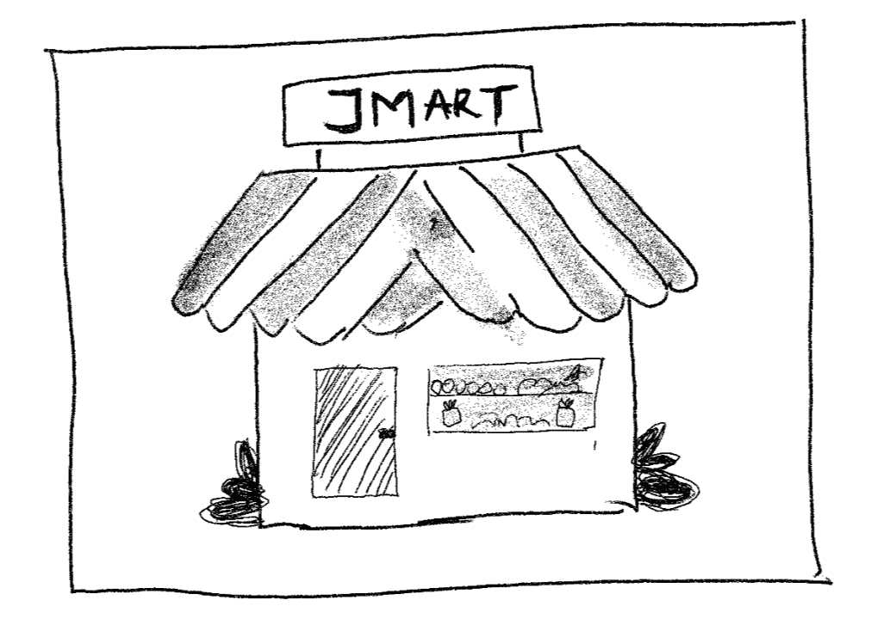
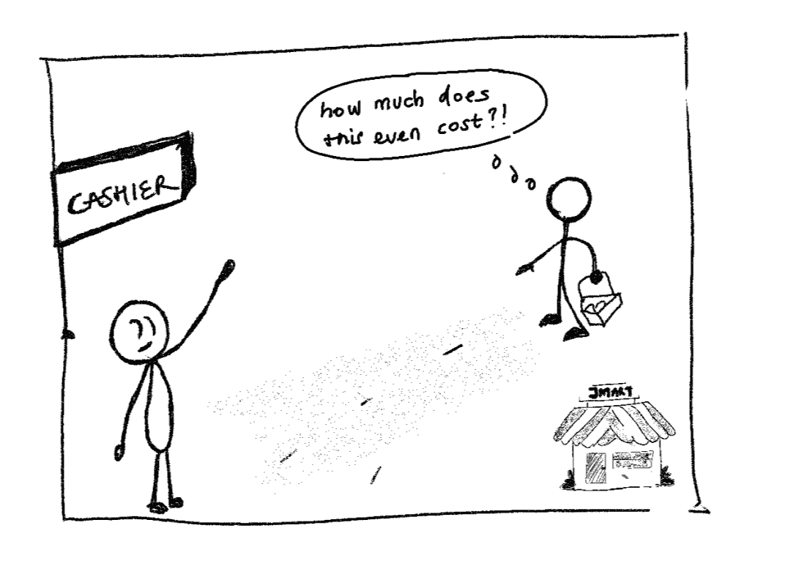
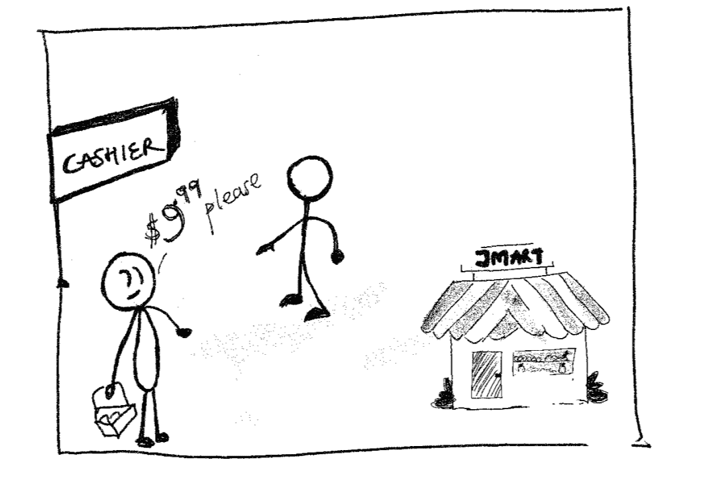
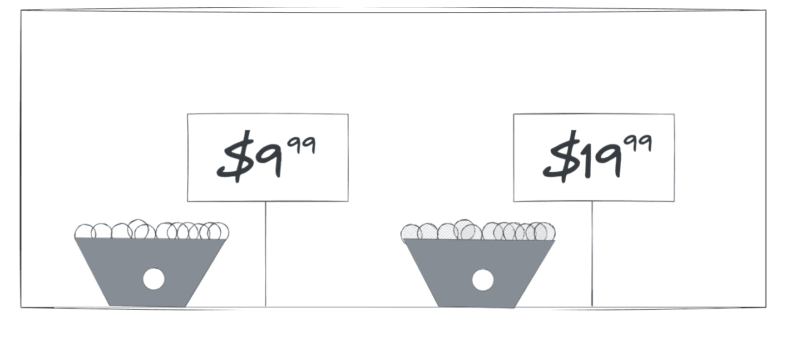
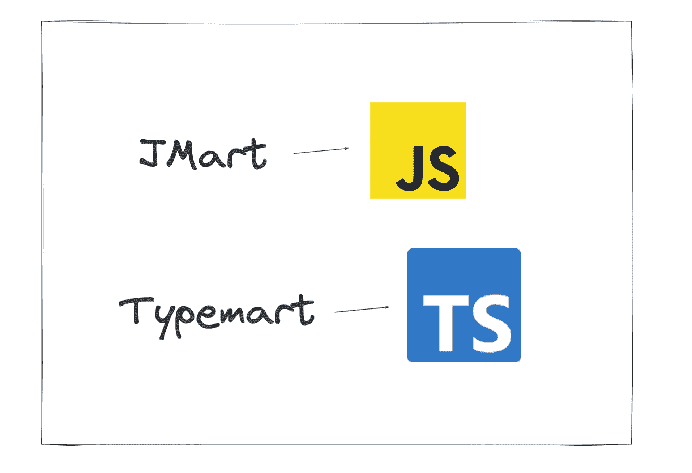
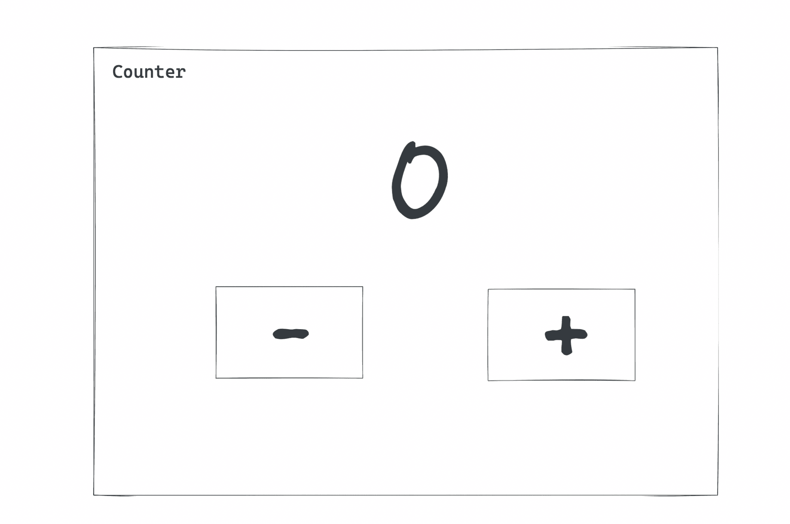
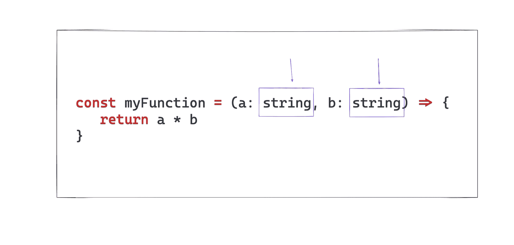
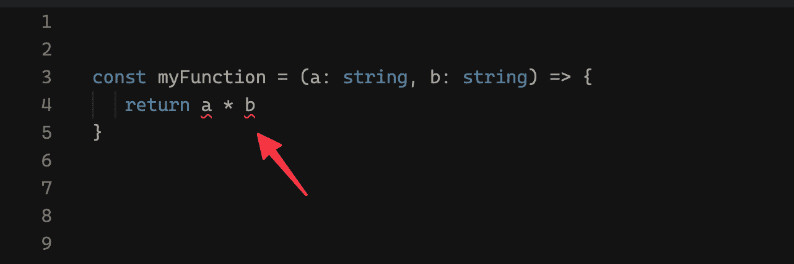
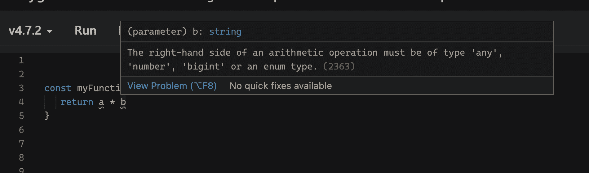

# 什么是 TypeScript？初学者指南

> 原文：<https://www.freecodecamp.org/news/what-is-typescript-for-beginners/>

几周前，我出版了一本[中级 TypeScript 和 React 手册](https://www.freecodecamp.org/news/build-strongly-typed-polymorphic-components-with-react-and-typescript/)。

它收到了许多意见，我收到了几封电子邮件。大多数是“感谢”邮件，但也有其他类似的邮件:

> “…我是编程新手，什么是 TypeScript？”

并且:

> "感谢这本免费的电子书，但作为初学者，我该如何学习 TypeScript？"

我在开始的时候解释过，这本手册是为那些已经知道一些类型脚本的中级开发人员准备的——但是这什么时候阻止过任何人下载免费资源呢！:)

因此，在本指南中，我决定用我希望在学习 TypeScript 时拥有的文章来回答那些电子邮件中的问题。

现在，如果你还在阅读，我会假设你是一个打字初学者。

系好安全带。你在一个有趣的旅程中。

## 像我 5 岁一样解释打字稿

我的教学方法一直保持不变。

如果你不能向一个 5 岁的孩子解释，那么也许你对这个主题还不够了解。

让我们尝试一些不同的东西，而不是用大量的技术术语来淹没你。

让我们用一个你永远不会忘记的比喻。

你上次去杂货店是什么时候？

考虑一下 TypeMart:



The TypeMart grocery store

TypeMart 是典型的大型杂货店。

你想下班后去买各种杂货吗？他们掩护你。

另一方面，JMart 是这样的:



The JMart grocery store

JMart 是一个较小的杂货店，可以快速购物。

在我居住的柏林，我们称这些为“T1”。这些基本上都是小型便利店。

但我相信你不是来上德语课的。

这里对我们来说重要的是杂货店 JMart 和 TypeMart 是如何运作的。

### JMart 和 TypeMart 如何工作

带着 *JMart* ，你走进商店，找到你需要的杂货，然后把它交给收银员。



Going over to the Cashier to pay your bill

在这一点上，你不太确定你所选择的食品价格。

这就是你去收银台的原因。

收银员拿起你的商品，扫描一下，然后告诉你它的价格。

如果他们“更擅长”自己的工作，他们会直接告诉你这件东西的价格(或者他们放在抽屉里的手册目录)。



Receiving the bill from the Cashier

这个过程看起来很脆弱，但是男孩做到了！

这些收银员非常聪明。没有任何物品是禁止的。他们知道每样东西的价格。

一个美丽的星期二，你决定去试试 TypeMart。

你很快就会意识到 TypeMart 的情况有所不同。

*“那些讨厌的大店”，*你可能会说。

与 JMart 不同，他们对商店里的每样东西都有标价。



Basket of fruits with price tags

他们让你失去了计算账单时的兴奋感和收银员脸上的表情。

另一方面，他们给你的是某种保证。

没有惊喜！

你很清楚你买的每样东西的价格。

当你的钱包很紧的时候，这是有益的。

每一分钱都很重要。

### 为什么这个类比很重要？

你的直觉是正确的。



JMart represents JavaScript. Typemart, TypeScript.

打个比方，JMart 代表 JavaScript，TypeMart，TypeScript。

当你去超市时，有一个不成文的合同:他们承诺以合理的价格提供你需要的东西。

并且你承诺为你买的东西付钱(除非你在商店偷东西。不要这样。)

代码也是如此。

这是一个不成文的契约，但却是一个清晰而残酷的契约。

您的合同是与您的应用程序的用户。您承诺您的应用程序能够正常工作。

考虑一个像 Google meet 这样的电话会议应用程序的例子。


The Google meet web interface. Source: https://shrtm.nu/L0yk

Google meet 的承诺是，你可以随时进行视频通话。他们还承诺，你可以在和伴侣聊天或快速观看抖音时将按钮静音。

还好他们听不到你！

或者你是这么认为的？

想象一下，如果静音按钮没有做到它所承诺的。

你的秘密就在那里。随之而来的是你对 Google meet 的信任。

你写的应用也是如此。

你承诺一个工作的应用程序，并且你的用户信任这种情况——假设你已经赢得了他们的信任。

现在让我们把这个带回家。

在 JMart 和 TypeMart，商品就是钱。有了软件，商品就是数据。

假设您有一个基本的计数器应用程序。



A basic counter application user interface

你的用户看到了一个漂亮的用户界面，但是真正神奇的是你增加或减少的计数器*变量*。

使用 JMart(类似于 JavaScript)，商品没有标签(价格标签)。你不知道任何东西的价格。你去收银台迎接你的命运。

这类似于 JavaScript 的工作方式。

你可以定义和操作各种各样的变量，但是没有明确的标签说明这些变量是什么。

你相信自己写的东西，把它交给 JavaScript 编译器去迎接你的命运。

考虑以下简单的 JavaScript 代码:

```
const JMart = {
    bananas: true,
    apples: true,
    mangos: true
}
```

在标准的 JavaScript 应用程序中，您可以继续编写以下代码:

```
const myOrder = JMart.cars.price 
```

即使`cars`在`JMArt`对象上不存在，也没有明确的标签来定义它。

所以，在你写代码的时候，你可能不知道这行代码是有错误的……直到你去收银台迎接你的命运。

这里的收银员是 JavaScript 解释器。通常，当您在浏览器中运行代码时会发生这种情况。

如果您这样做了，那么您会得到一个显示为`can't read price of undefined`的错误。

如果您(错误地)将这段代码发布到产品中，那么您的使用也会遇到这个难看的错误。

你刚刚损害了他们对你申请的信任。

有了 TypeScript，事情就不一样了。就像在 TypeMart 中一样，每条数据都被“贴上标签”。

在你去收银台(也就是浏览器)运行代码之前，你可以知道你的应用程序是否正常工作！

TypeScript 编译器将抛出一个错误，让您知道您错误地访问了一个不正确的值。

这发生在您的代码编辑器中，在浏览器中打开应用程序之前。

就像在 TypeMart 买一件你买不起的杂货一样，你会看到价格标签。

你知道你钱包里有什么。可以说你已经被警告了。

这就是你应该知道的 TypeScript 和 JavaScript 之间的主要区别。

> TypeScript 是带有类型语法的 JavaScript。

其中类型是悬挂在你的杂货项目(数据)周围的标签，确切地告诉你每段代码代表什么。

考虑下面这个简单的 JavaScript 例子:

```
 const myFunction = (a, b) => {
   return a * b
} 
```

在 TypeScript 中，这段代码可能如下所示:

```
const myFunction = (a: string, b: string) => {
	return a * b
}
```

请注意，这看起来与 JavaScript 代码几乎相同。

但是它有一个主要的区别:数据`a`和`b`是`'labelled'`。



The type function parameter type annotations

这段代码明确指出`myFunction`中的`a`和`b`是字符串。

有了这些信息(称为类型注释)，TypeScript 现在可以在您编写代码时向您显示错误。



View this code in the TypeScript playground: https://shrtm.nu/FlC0

这些错误通常会以红色曲线的形式呈现。类似于微软 Word 等应用中的错误。

然后，您可以将鼠标悬停在这些行上，查看错误的详细信息。



The details of the TypeScript error

在这个简单的例子中，错误的症结在于乘法运算不应该在字符串上运行。

### 非异常错误

如果您是一名更有经验的 JavaScript 开发人员，您可能已经注意到上面的代码示例在标准 JavaScript 中没有抛出错误。

```
const myFunction = (a, b) => {
    return a * b
} 
```

如果用 JavaScript 计算`“1” * "6"`，会得到`6`。

在内部，JavaScript 将字符串强制转换为数字，并执行乘法运算。

这种在 JavaScript 中不会失败，但在 TypeScript 中会出错的错误称为非异常错误。

这些应该可以帮助你防止应用程序中讨厌的错误。

在您的 TypeScript 之旅的这个阶段，您不必担心这个问题，但它值得一提。

正如您所看到的，TypeScript 不仅帮助您捕捉代码中不需要的行为。

解决这个问题的一个简单方法是显式键入参数，也就是说，`a`和`b`是数字:

```
const myFunction = (a: number, b: number) => {
   return a * b
}
```

错误就消失了！

不要因为让你注意到这些非异常错误而被 Typescript 所困扰。

它们是应用程序中潜在的错误来源。

拯救打字稿💪🏽

## 结论

问问你自己，我现在知道什么是 TypeScript 了吗？

是的，你有——从概念上来说。

TypeScript 对于 JavaScript 就像 TypeMart 对于 JMart 一样。

TypeScript 为您提供了一种有组织的方式来*标记*应用程序中的数据，以防止未知的错误。

这些错误会在你去收银台之前被发现并引起你的注意——也就是说，在你运行应用程序之前。

花点时间消化这些信息。随着你[学习更多的打字稿](https://www.freecodecamp.org/news/an-introduction-to-typescript/)，这将是至关重要的。

给自己一个鼓励，然后去写你的第一个应用程序。

### 更多资源

*   [中间类型脚本和 React 手册](https://www.freecodecamp.org/news/build-strongly-typed-polymorphic-components-with-react-and-typescript/):通过构建强类型多态组件，用 React 学习中间类型脚本。


[Intermediate TypeScript and React Handbook](https://www.freecodecamp.org/news/build-strongly-typed-polymorphic-components-with-react-and-typescript/)

*   想做个快速打字练习吗？找出并修复前面描述的示例中的错误。在这里使用官方在线编辑器 Typescript playground:[[https://shrtm.nu/FlC0](https://shrtm.nu/FlC0)