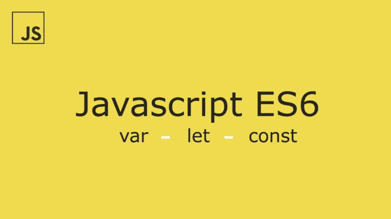

# JavaScript 变量提升指南？带字母和常量

> 原文：<https://www.freecodecamp.org/news/what-is-variable-hoisting-differentiating-between-var-let-and-const-in-es6-f1a70bb43d/>

布万·马利克

# JavaScript 变量提升指南？带字母和常量



新的 JavaScript 开发人员通常很难理解变量/函数*提升*的独特行为。

因为我们稍后将讨论`var`、`let`和`const`声明，所以理解*变量提升*而不是*函数提升*很重要。让我们开始吧！


### **什么是可变吊装？**

JavaScript 引擎将所有使用“`*var*`”的变量声明视为在函数范围(如果在函数内声明)或全局范围(如果在函数外声明)的顶部声明，而不管实际声明出现在哪里。这实质上是“*吊装*”。

所以变量可能在声明之前就已经存在了。


让我们看看它的实际效果..

```
// OUTPUT : undefinedconsole.log(shape);
```

```
var shape = "square";
```

```
// OUTPUT : "square"console.log(shape);
```

如果你来自基于 C 的语言，你会期望当第一个`console.log` 被调用时抛出一个错误，因为变量`shape` 那时还没有被定义。但是 JavaScript 解释器向前看，将所有变量声明“提升”到顶部，初始化保持在同一位置。

以下是幕后发生的事情:

```
//declaration getting hoisted at the topvar shape;
```

```
// OUTPUT : undefinedconsole.log(shape);
```

```
shape = "square";
```

```
// OUTPUT : "square"console.log(shape);
```

下面是另一个例子，这次是在功能范围内，以使事情更清楚:

```
function getShape(condition) {    // shape exists here with a value of undefined
```

```
 // OUTPUT : undefined    console.log(shape);
```

```
 if (condition) {        var shape = "square";        // some other code        return shape;    } else {        // shape exists here with a value of undefined        return false;    }}
```

你可以在上面的例子中看到`shape`的声明是如何被悬挂在`getShape()`函数的顶部的。这是因为 if/else 块不像其他语言那样创建局部范围。在 JavaScript 中，局部作用域本质上是函数作用域。因此，在`if` 块之外的任何地方，以及在具有“*未定义“*值的函数之内，形状都是可访问的。

JavaScript 的这种默认行为有其优点和缺点。没有完全理解这些会导致我们代码中微妙但危险的错误。

### 输入块级声明！


ES6 引入了块级范围选项，为开发人员提供了对变量生命周期的更多控制和灵活性。

块级声明是在块“{ }”内创建的块/词法范围中进行的。

#### 让声明

这个语法类似于`var`，只是用`let`代替`var`来声明一个变量，它的作用域只有那个代码块。

将您的`let`声明放在一个块的顶部，这样它们将在整个块中可用。

例如:

```
function getShape(condition) {// shape doesn't exist here
```

```
// console.log(shape); =&gt; ReferenceError: shape is not defined
```

```
if (condition) {        let shape = "square";        // some other code        return shape;    } else {        // shape doesn't exist here as well        return false;    }}
```

注意 shape 只存在于`if`块中，当在块外被访问时抛出一个错误，而不是像我们之前使用`var`声明的情况那样输出`undefined`。

**注意**:如果一个标识符已经在一个带有`var`的作用域内定义了，那么在同一个作用域内的`let`声明中使用同一个标识符会抛出一个错误。
同样，如果`let`声明创建了一个与其外部作用域中的变量同名的变量，也不会抛出错误。(这种情况与我们马上要谈到的`const`声明是一样的。)

例如:

```
var shape = "square";let shape = "rectangle";
```

```
// SyntaxError: Identifier 'shape' has already been declared
```

并且:

```
var shape = "square";if (condition) {    // doesn't throw an error    let shape = "rectangle";    // more code }// No error
```

### 常量声明

声明语法与`let` & `var`类似，生命周期与`let`相同。但是你必须遵守一些规则。

使用`const`声明的绑定被视为**常量**和，因此**它们一旦被定义**就不能被重新赋值。因此，每个`const`声明**必须在声明时初始化**。

例如:

```
// valid const shape = "triangle";
```

```
// syntax error: missing initializationconst color;
```

```
// TypeError: Assignment to constant variableshape = "square"
```

**然而**，一个对象的属性是可以修改的！

```
const shape = {    name: "triangle",    sides: 3}
```

```
// WORKSshape.name = "square";shape.sides = 4;
```

```
// SyntaxError: Invalid shorthand property initializershape = {    name: "hexagon",    sides: 6}
```

在上面的例子中，我们可以看到只有`shape`对象的属性可以被改变，因为我们只改变了`shape`包含的内容，而不是它绑定的内容。

我们可以总结为,`const`从整体上防止了绑定的修改——而不是它所绑定的值。

注意:属性可以变异。所以为了真正的不变性，使用 Immutable.js 或 Mori。

### 时间死区

我们现在知道在声明之前访问`let`或`const`变量会抛出一个`ReferenceError`。从进入作用域到被声明为不能被访问的这段时间被称为临时死区。

请注意，ECMAScript 规范中没有正式提到“时间死区”。这只是程序员中的一个流行术语。


我个人推荐你总是使用`const`，因为它会导致更少的错误。我还没有遇到过需要使用`var`的情况。

一般来说，只对循环计数器使用`let`,或者只在你真的需要重新分配的时候使用。其他地方用`const`。就我个人而言，我已经抛弃了 filter()，map() & reduce()。你也应该。

请务必查看第 2 部分中关于功能提升的内容，以及与 JS 中提升主题相关的重要面试问题。

[**函数提升&提升面试问题**](https://medium.freecodecamp.org/function-hoisting-hoisting-interview-questions-b6f91dbc2be8)
[*这是我之前关于变量提升的文章《JavaScript 变量提升指南？与…米*edium.freecodecamp.org](https://medium.freecodecamp.org/function-hoisting-hoisting-interview-questions-b6f91dbc2be8)

点击[这里](https://medium.com/@bhuvanmalik/es6-functions-9f61c72b1e86)看我的文章，关于 ES6 中一些有用的新功能。

下次见。和平！✌️️