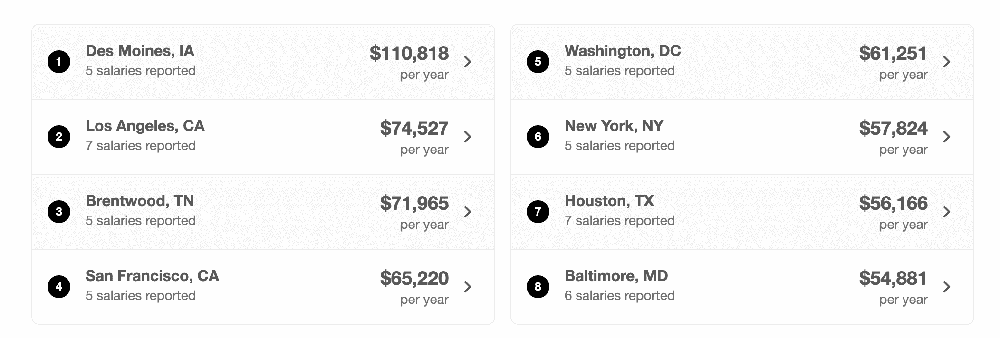
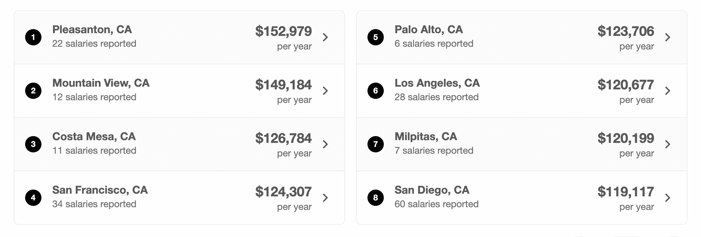
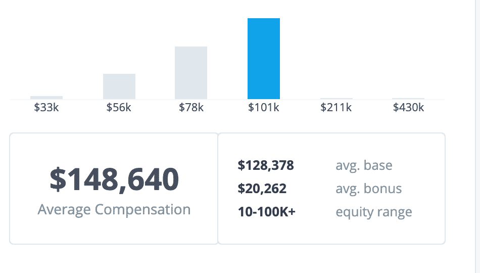

# 什么是 Web 开发？如何成为一名网页开发者【2021 职业道路】

> 原文：<https://www.freecodecamp.org/news/what-is-web-development-how-to-become-a-web-developer-career-path/>

你刚刚决定学习如何编码，并且想从事 web 开发工作。但是到底什么是 web 开发呢？

从哪里开始学？

网页开发者挣多少钱？

你如何找到一份网页开发员的工作？

当我第一次开始学习如何编码时，我也有同样的问题，甚至更多。

在本文中，我将提供 web 开发的基本介绍，并提供如何获得开发人员工作的职业资源。

## 什么是 Web 开发？

Web 开发是为 internet 或 intranet(专用网络)构建和维护网站的行为。你可能建立的网站包括博客、个人网页、电子商务网站或社交媒体网站。

网站开发人员将与客户合作，了解他们对网站的要求。然后，开发人员将构建、测试和部署网站，并通过修复问题和添加功能来维护它。

## 网站开发者和网站建设者的区别

有许多像 Wix 和 Weebly 这样的网站构建者可以让非开发人员轻松创建和启动网站。问题是，如果人们可以直接使用网站建设者，我们为什么还需要网络开发者？

这在很大程度上取决于项目的需求和要求。有些时候雇佣开发人员是有意义的，有些时候使用网站建设者是一种选择。

例如，如果有人想为他们的手工首饰创建一个基本的网站，那么使用网站建设者是一个可行的选择。这些工具易于使用且价格低廉。

但是，如果有人的业务不断增长，需要一个带有定制软件的网站来满足他们的业务需求，该怎么办呢？在这一点上，开发人员将有工具和知识与客户一起工作，并构建客户需要的软件和功能。

## 有哪些不同类型的 Web 开发人员？

你可以选择专注于不同的网站开发领域。常见的类型有前端、后端和全栈开发人员。让我们更详细地看一下每一个。

### 前端(客户端)开发

前端开发是用户在网页上看到的和与之交互的一切。前端开发人员将专注于编写视觉上令人愉悦且易于用户导航的应用程序。

您将在前端使用的主要技术是 HTML、CSS 和 JavaScript。HTML 创建页面内容的结构，CSS 设计内容的样式并使其看起来漂亮，JavaScript 使网站具有交互性并提供有用的功能。

前端开发人员在编写网站代码时也可以使用许多库和框架，包括 React、Angular、Bootstrap、Tailwind CSS 等等。这些工具可以帮助您优化和加速开发过程。

### 后端(服务器端)开发

后端开发指的是用户看不到的应用程序部分。后端开发人员关注网站的逻辑，创建服务器，并使用数据库和 API(应用程序编程接口)。

例如，表单的内容和布局将在客户端创建，但是当用户提交他们的信息时，它在服务器端(后端)被处理。

可以用于后端开发的语言包括 Java、Python、Ruby 和 PHP。

### 全栈开发

全栈开发人员同时处理 web 应用程序的前端和后端。

这些开发人员必须能够使用浏览器、服务器和数据库。所以你需要我上面讨论的所有技能和知识。

这里有一些前端和后端开发的流行技术栈。

*   [平均栈](https://www.freecodecamp.org/news/cjn-understanding-mean-stack-through-diagrams/) (MongoDB，Express，Angular 和 Node)
*   [MERN 栈](https://www.freecodecamp.org/news/create-a-mern-stack-app-with-a-serverless-backend/) (MongoDB，Express，React 和 Node)
*   [Ruby on Rails](https://www.freecodecamp.org/news/learn-ruby-on-rails-video-course/)
*   [灯栈](https://www.freecodecamp.org/news/how-to-setup-a-lamp-server-on-a-local-ubuntu-linux-machine-or-vm/) (Linux、Apache、MySQL 和 PHP)

## 如何学习 Web 开发

既然你已经了解了 web 开发人员是做什么的，让我们看看一些可能的资源开始学习吧。

### 我应该自学编码吗？

有很多免费的在线资源可以教你网络开发。但是你怎么知道这是不是正确的道路呢？

如果你是那种具备自学这些技能的纪律和结构的人，那么这是一个可行的选择。

免费代码营(freeCodeCamp)提供了一整套关于网络开发的课程，你可以免费学习。这是一个互动的学习环境，你将经历一系列的挑战，并在此过程中建立项目。

我还编辑了一个资源列表，你可以在那里免费学习 web 开发。

### 我应该参加编码训练营吗？

如果你需要一个结构化的环境，在那里你可以和其他学生和老师一起学习，那么你可以考虑训练营。

训练营是一个密集的环境，在这里你可以学到在短时间内成为一名初级开发人员的技能。然而，这些训练营通常不是免费的，需要投入大量的时间。

在报名参加训练营之前，你首先要做好调查，这一点非常重要。昆西·拉森写了一篇文章，解释训练营是如何运作的，以及它们是否适合你。

此外，Class Central 将提供一个基于 freeCodeCamp 课程的免费训练营，于 8 月 23 日开始。如果你在那个日期之后读到这篇文章，请和他们联系。他们可能会再做一次:)

## 网页开发者挣多少钱？

如果你想知道在你的领域你能赚多少钱，我建议你使用像[或者](https://www.indeed.com/)这样的网站来查找薪水。

根据你在世界各地的不同，薪水也会有所不同。但总的来说，网络开发预计将在未来十年增长，并提供良好的补偿。

这里有一个美国一些初级开发人员工资的例子。初级开发人员通常被认为是那些有两年或更少经验的人。

中级开发人员已经在这个行业工作了 2-4 年。这里有一个美国中级开发人员工资的例子。

资深开发人员至少有几年的行业经验。这里有一个美国高级开发人员工资的例子。

## FAANG 工资呢？

FAANG 代表脸书、亚马逊、苹果、网飞和谷歌。在这些大型科技公司找工作竞争非常激烈，也非常困难。

这些类型的大型科技公司将支付高于平均水平的开发人员工资。

这是一个你在美国为脸书工作的初级网络开发人员的薪水的例子。

## 怎样才能找到一份网页开发的工作？

一旦你学会了网站开发的技术方面，你就必须专注于整理你的求职材料。有许多令人难以置信的资源可以帮助你学习如何获得一份开发人员的工作。

### 简历构建资源

*   [如何获得你的第一份开发工作——从查看职业转换者的简历中得到的启示](https://www.freecodecamp.org/news/how-to-get-your-first-dev-job/)
*   [如何写一份招聘人员会看的开发人员简历](https://www.freecodecamp.org/news/how-to-write-a-developer-resume-recruiters-will-read/)
*   [如何用几个简单的步骤写出一份出色的初级开发人员简历](https://www.freecodecamp.org/news/how-to-write-an-awesome-junior-developer-resume-in-a-few-simple-steps-316010db80ec/)

### 技术面试资源

*   如何准备技术面试
*   [如何回答任何技术面试问题–示例包括](https://www.freecodecamp.org/news/how-to-answer-any-technical-interview-question-with-example/)
*   [我在 30 天内做了 60 多次技术访谈后学到了什么](https://www.freecodecamp.org/news/what-i-learned-from-doing-60-technical-interviews-in-30-days/)
*   [技术编码面试准备最佳书籍](https://www.freecodecamp.org/news/is-this-the-best-book-for-coding-interview-preparation/)
*   [如何准备技术面试——帮助你发挥最佳水平的技巧和诀窍](https://www.freecodecamp.org/news/interviewing-prep-tips-and-tricks/)

### 找工作的小窍门

*   [如何通过智能、真正的社交网络获得第一份开发人员工作](https://www.freecodecamp.org/news/networking-for-aspiring-developers/)
*   [2021 年求职技巧](https://www.youtube.com/watch?v=K3B5AltcCTY)
*   [如何掌握求职技巧](https://www.youtube.com/watch?v=KPzFCZ_u_sY)
*   [如何使用 LINKEDIN 作为一名开发人员获得一份技术领域的工作！如何联网！](https://www.youtube.com/watch?v=SG5Sb5WTV_g)

如果你对从事自由职业感兴趣，我还会提供一些如何开始自由职业的资源。

*   什么是自由职业者？如何在网上找到自由职业者和你所在城市的客户
*   [如何撰写赢得客户的自由职业建议书+免费模板](https://www.freecodecamp.org/news/free-web-design-proposal-template/)
*   [自由网络开发者指南:如何通过自由编程工作赚钱](https://www.freecodecamp.org/news/freelance-web-developer-guide/)

我希望你喜欢这篇文章，并祝你在成为一名 web 开发人员的道路上好运。