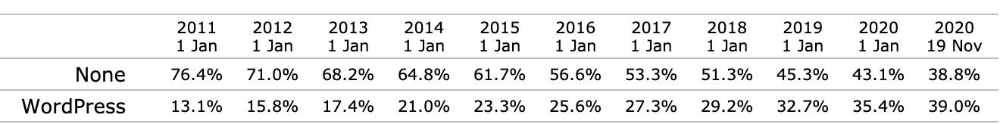
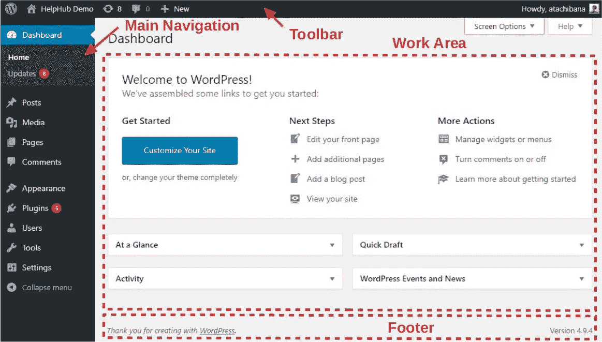
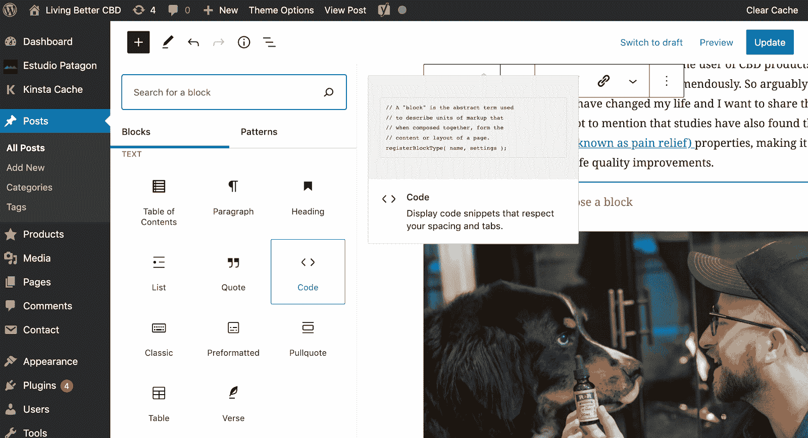
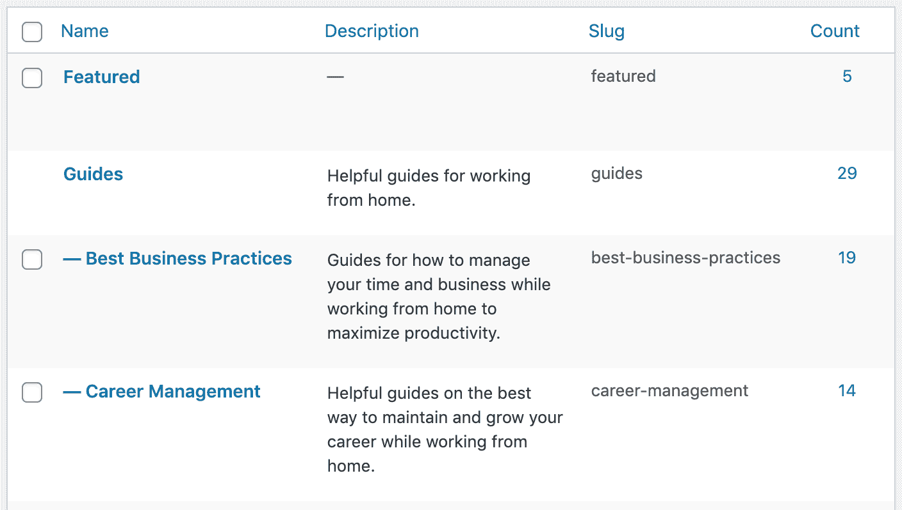
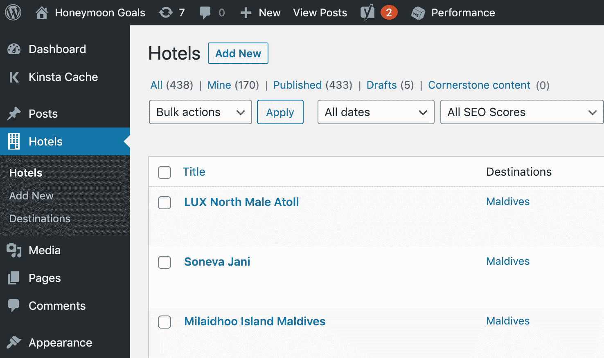
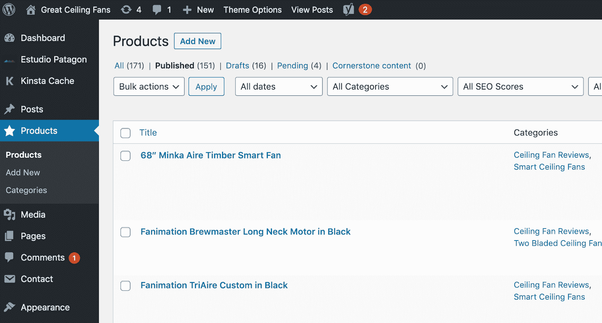
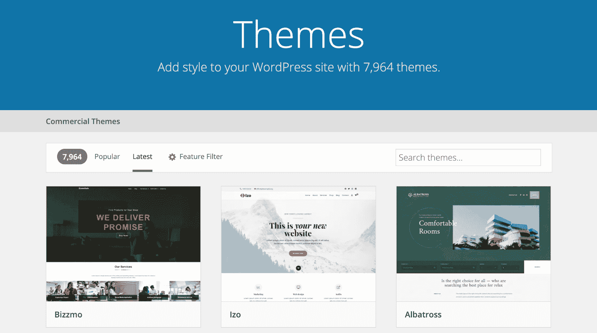
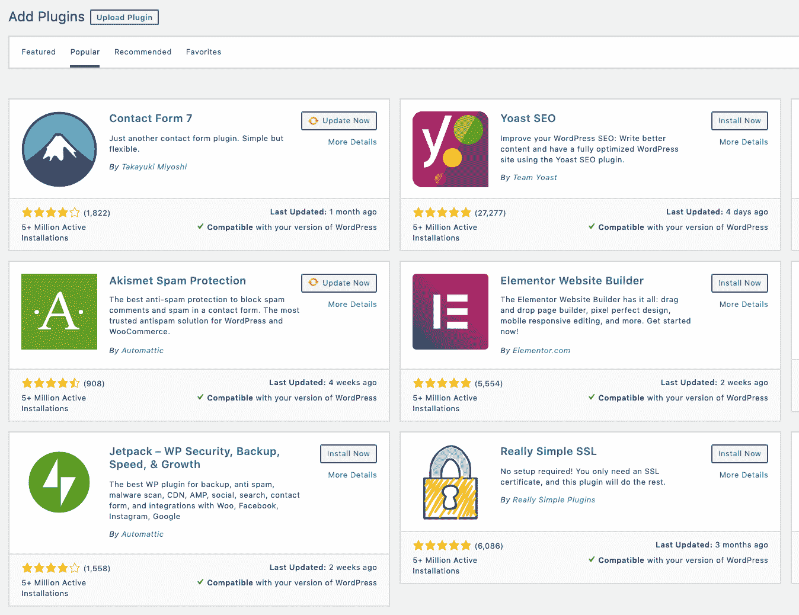
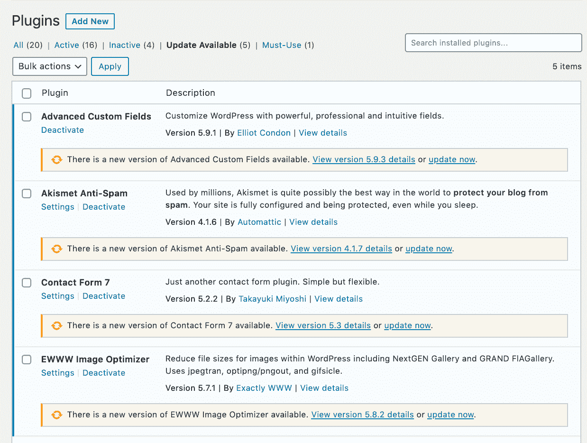

# 什么是 WordPress？博客和网站工具解释

> 原文：<https://www.freecodecamp.org/news/what-is-wordpress/>

WordPress 是世界上最受欢迎的内容管理系统，为大约 38%的网站提供支持。内容管理系统(CMS)是一种软件，可以帮助用户用最少的技术知识创建和管理网站内容。

> “基本的 WordPress 软件简单且可预测，因此你可以很容易地开始使用。它还为成长和成功提供了强大的功能。”WordPress.com

简而言之，WordPress 是创建一个强大网站的可靠方法。

WordPress 易于安装，并且开箱即用。WordPress 的核心功能拥有你建立网站所需的一切，包括页面、博客文章、导航和用户管理。

但是 WordPress 的真正强大之处在于它有广泛的选项，可以快速设计一个带有预置主题的漂亮网站，并通过可选插件添加难以置信的功能。

在这篇文章中，我们将介绍 WordPress 的基础知识，包括:

*   WordPress 的起源和流行
*   用页面和文章构建基础
*   用主题改进设计
*   用插件扩展功能

## WordPress 为什么这么受欢迎？

WordPress 被大约 5 亿个其他网站使用，包括一些知名的网站，如 TechCrunch、The New Yorker、Variety、瑞典官方网站和华特·迪士尼公司。

提示:要查看一个网站是否运行 WordPress，你可以查看页面源代码，搜索“WordPress”或“wp-”,如果你看到“wp-includes”或“wp-content”这样的目录，那么这个网站正在运行 WordPress。

WordPress 仍在疯狂增长，每天都有超过 500 个新网站建立。

在过去的三年里，WordPress 在网站驱动软件方面的市场份额增长了约 8%，从 2019 年的 27.3%增长到 2020 年的 35.2%。

令人惊讶的是，WordPress 现在支持的网站比不使用 CMS 的网站还多:

Percent of All Websites Not Using a CMS vs. Percent of Sites Using Wordpress. There are more websites using WordPress than websites powered by a CMS. Source: w3techs

WordPress 受欢迎的主要原因之一是它是免费的。WordPress 被授权使用 [GPLv2](https://www.gnu.org/licenses/old-licenses/gpl-2.0.en.html) ，这意味着任何人都可以自由使用和修改。

据估计，WordPress 已经为开源项目贡献了超过 100 年的开发时间。

## WordPress 基础知识-页面和文章

建立一个 WordPress 网站需要选择一个域名，找到一个主机提供商，并安装 WordPress。

安装 WordPress 会让你拥有一个功能齐全的网站。但是释放 WordPress 的真正力量需要安装主题、插件和定制网站。

但是让我们从基础开始。

安装 WordPress 时，你会被要求输入用户名和密码。您的凭据可用于访问您网站的管理后端。这可以在*yourdomainname.com/***WP-admin**访问。

管理部分如下所示:

*The WordPress admin backend. Source: WordPress*

正如你所看到的，WordPress 加载了一些功能，可以通过左边的导航来访问。出于本文的目的，让我们讨论两种重要的内容类型页面和帖子。

### WordPress 页面

Pages 允许您快速构建网页。通过添加这类内容，你可以在*yourdomain.com*/**新页面**创建网页。

WordPress 有一个内置的编辑器，你可以用它快速地将文本和多媒体格式化成一个漂亮的网页。编辑器是用“块”构建的，因此您不必担心内容的对齐和组织，而可以专注于创作。

这是在 WordPress 中编辑内容和添加区块的样子:

*Easily insert different “blocks” like code into your Pages and Posts.*

虽然默认的 WordPress 编辑器很棒，但它可以用插件来增强，甚至可以用内容构建器来代替，这样可以更容易地以可视化的方式拖放内容，如 Elementor、Visual Composer 或 WP Bakery。WordPress 的美妙之处在于它是**无限可定制的**。

无论你选择使用哪种编辑器，使用 WordPress 的内置页面都可以让你轻松地创建动态和华丽的网页。

### WordPress 帖子

帖子部分与页面部分具有相同的编辑器，只是此内容类别创建博客帖子。帖子是 WordPress 的核心，因为该软件最初是一个博客工具。

帖子使用与页面相同的内容编辑器，因此创建页面和帖子是相同的体验。

页面和帖子的主要区别在于容量。假设一个典型的小企业网站有 5-10 个核心页面(主页、关于我们、联系我们、服务等等)。同一家公司可能有 100 多篇博客文章。

为了管理大量的文章，WordPress 提供了广泛的分类和层次管理。帖子可以很容易地组织成类别。

*Example of categories and hierarchies to organize Posts.*

您可以根据需要添加和嵌套任意多的类别。通过分类，内容可以在你的网站上分层显示，如*yourdomainname.com*/**指南/最佳商业实践/** ***你的内容**。*

由于 WordPress 是高度可定制的，这个“permalink”*结构也可以很容易地在设置标签中改变。*

### *自定义文章类型(高级)*

*WordPress 预装了两种主要的内容类型(文章和页面),但是许多用户希望进一步定制他们的内容类型。*

*例如，如果您想要建立一个包含酒店目录的旅游网站，那么一个名为“酒店”的自定义帖子类型将是一个很好的补充。*

*这些自定义的文章类型利用了 WordPress 的内置编辑器、类别以及文章和页面的其他特性。因此，自定义帖子类型是快速开发动态网站的一种方式。*

*自定义的文章类型可以通过插件或者在核心的*functions.php*文件中添加一些代码来添加。这些新增功能很好地展示了 WordPress 是如何**高度可定制的**和一个**开发你的编码技能的伟大平台**。*

****

**Custom posts like Hotels and Products can be added into WordPress to better organize content and enhance the functionality of your custom WordPress site.**

## *WordPress 主题——好看很容易*

*一旦你建立了你的 WordPress 网站，下一步就是选择一个主题。*

*主题是定义 WordPress 网站外观和功能的模板和样式表的集合。*

*WordPress 预装了一个标准的主题，但是很少有网站真正使用这个主题(或者数以亿计的网站看起来都一样！)*

*主题允许 WordPress 用户很快拥有一个漂亮的网站。在大约 10 分钟内，你就可以拥有一个拥有相同后端、引擎、看起来像 TechCrunch 等优秀网站的网站。缺的就是内容！*

*由于设计和选项的多样性，建立一个 WordPress 网站最好的部分之一是选择一个主题。有数千种主题可供选择。* 

**

*高级主题的价格通常在 20 美元到 60 美元之间。你可以下载一个 zip 文件，然后轻松上传到 WordPress。一旦主题被激活，你的 WordPress 网站就会采用模板和样式表。就这样，你有了一个专业设计的网站！*

**提醒一句*:主题选择可能很棘手，安装前需要考虑很多事情。我建议寻找评级高(有人测试过)、插件依赖性最小、速度快的主题。*

*为了测试速度，在开发者网站上找到一个主题的演示，并通过谷歌页面速度运行它。如果主题表现不好，就不要用。*

*一旦你选择了一个很棒的基本主题，你可以选择**无休止地定制它**。您可以通过用 HTML、PHP、CSS 和 JavaScript 编辑主题文件来完全定制您的站点。*

*最简单的方法是安装一个子主题，这样你仍然可以用最新的版本更新你的主题。*

*有了一个好的主题，你就可以拥有一个漂亮的网站。插件增加了能力。*

## *WordPress 插件使它不仅仅是一个博客*

*WordPress 的历史根植于个人出版和博客。该项目始于 2003 年，当时迈克·利特尔和马特·莫楞威格开始致力于一个“优雅且架构良好的个人出版系统”*

*但是 WordPress 现在不仅仅是一个博客。*

*WordPress 有超过 50，000 个可用的插件。WordPress 插件是 PHP 脚本，它扩展了核心内容管理系统的功能。他们可以给你的网站添加全新的功能。*

*插件是由志愿者和公司开发的。它们通常是免费的，许多都有高级版本。*

*当心安装太多插件，因为维护更新对 WordPress 网站管理员来说是一项永无止境的任务。*

****

**Plugins can be uploaded and updated directly from the admin backend.**

## *把一切都包起来*

*WordPress 是建立网站的一个很好的工具。它快速、可靠且可扩展。*

*虽然 WordPress 最初只是一个简单的发布工具，但它已经远远超越了它卑微的起点。无论你是想创建一个个人博客，一个电子商务商店，还是一个商业网站，WordPress 都是一个很好的选择。*

*此外，WordPress 是开始学习更多 web 开发知识的好方法。*

*当你开始在 WordPress 中构建时，你将使用 HTML、CSS、Javascript、PHP 和 MySQL 进行编码。因为 WordPress 是开源的，而且非常受欢迎，所以有大量的免费资源([包括 freeCodeCamp](https://www.freecodecamp.org/news/search/?query=wordpress) 上的资源)可以让你深入了解。*