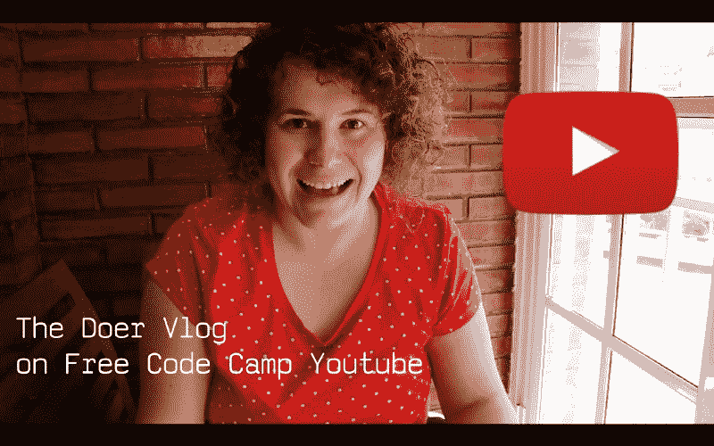
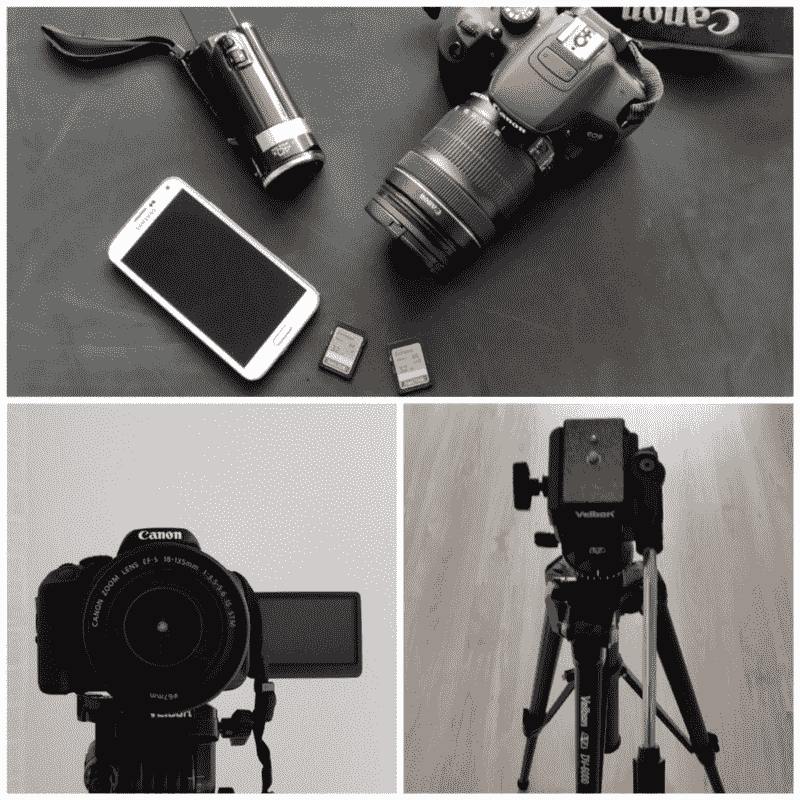

# 我从 18 周的编程之旅中学到了什么

> 原文：<https://www.freecodecamp.org/news/what-ive-learned-from-18-weeks-of-vlogging-my-coding-journey-4005a1e71b7d/>

埃娃·米切卡什卡

# 我从 18 周的编程之旅中学到了什么

我正在学习编码，并且正在写博客。

2016 年拍了 18 个周码 vlogs(视频博客)。我正在慢慢把所有的剧集发布在[自由代码营的 YouTube 频道](https://www.youtube.com/watch?v=TWFNnbAylHI&list=PLWKjhJtqVAbkyQnSv-DNXOKsglcHhYAV2)上。看几分钟我的第一集，你会很好地了解我的 vlog 是什么样的:

在这篇文章中，我将把我学到的经验教给你，这样你也可以记录你的编码之旅。

### 你是从视频日志中获益最多的人。

我从 2016 年 8 月开始 vlogging，作为一个实验。事实证明，这是我巨大的动力来源。

有太多的理由开始分享你的代码学习之旅。以下是我的几个例子:

*   它迫使你定期编码
*   你可以复习你学过的东西
*   通过向观众解释你在做什么，你自己会更好地理解它
*   您从受众那里获得了许多有用的反馈，作为开发人员，您可以根据这些反馈进一步改进
*   这给了你一个练习英语口语的机会——尤其是当英语是你的第二语言时，就像我一样
*   你会遇到其他鼓舞人心的博客作者
*   vlog 本身成为你的投资组合的一部分
*   这是一本帮助你记录旅程的代码日记
*   最重要的是，你可以教导其他开发人员，帮助他们保持积极性

这里有一些实用的技巧，可以让 vlogging 变得更容易。我希望我在凝视外面的时候知道这些。

### 音乐

音乐为你的博客定下基调。

为了找到好听的节拍，我使用了 [Soundcloud](https://soundcloud.com/) 和 [YouTube 音频库](https://www.youtube.com/audiolibrary/music)。

在看其他 YouTubers 和听我最喜欢的播客时，我会查看描述以了解他们使用的音乐。这也是发现新音乐人的好方法。

很难找到合适的音乐曲目，你可以用你的博客。我的第一个 vlog 被 YouTube 屏蔽了，因为一个音乐家没有权利获得他们混合到一个音轨中的样本。这花费了我几个小时的额外工作，因为我必须用新的音乐重新编辑这一集。

不管你是付费的还是免费的，都要注意版权。

还有一个提示:在开始编辑视频之前先选择音乐要比在最后添加音乐容易得多。

### 装备

我从家里有的开始。

我喜欢拍照，所以早在我决定开始写博客之前，我就买了一台佳能 EOS 700d T1。

这部 DSLR 在拍摄电影时有一个很大的特点——可变角度清晰视图 LCD II 触摸屏。它允许您在录制时在 LCD 查看器中看到自己。您也可以站在摄像机前使用触摸屏更改设置。这是最方便的大型 DSLR 相机之一。

我还有一个配套镜头(18-135 毫米)。

到目前为止，我已经设法将一集的所有原始镜头保存到两张 32GB 的卡上。

当你用沉重的 DSLR 拍摄时，一个好的三脚架是必不可少的。我选择了 [Velbon DV-6000](https://www.amazon.co.uk/Velbon-2335-DV-6000-Video-Tripod/dp/B000KHVGTC) 。我有时也会用[我的旧 JVC 相机](https://www.amazon.com/JVC-GZ-HM50-Camcorder-Optical-Detection/dp/B004LB5AJK)，但更多时候，我会用我的手机——一台[三星 Galaxy S5](http://www.samsung.com/uk/consumer/mobile-devices/smartphones/galaxy-s/SM-G900FZKABTU) 。

我仍然梦想得到一个[led 麦克风](https://www.amazon.com/Rode-VMPR-VideoMic-Rycote-Shockmount/dp/B00YAZHRZM)，一个[小一点的相机](https://www.amazon.com/Canon-PowerShot-G7-Digital-Camera/dp/B00NEWYE12)，很容易用一只手拿着，还有一个照明套件。也许今年我能从这份清单上买些东西。

好消息是你不需要这些东西来开始。你甚至可以用你的智能手机拍摄高质量的视频。

### 声音

如果你买得起一个好的外接麦克风，就买一个吧！我还没有，所以我必须在后期制作中调整声音。很费时间，甚至 18 集之后，我还在学习怎么做好。

在给自己录音的时候，尽量不要放任何多余的音乐，也不要有很大的背景噪音。如果你住在一个繁忙的城市，你可能需要重拍，因为突然的汽车喇叭声，附近学校的孩子们的尖叫声，嘈杂的摩托车声，或者邻居的钻孔声。

练习不要说*这样无用的话，嗯，yyyyhh。*这将为您节省数小时的后期制作时间。短句比长句好。

说话清晰，语调有力。没有清晰的发音和音调的变化，你的独白可能会听起来很无聊，不管你的话题有多精彩。

到目前为止，在录制我的 18 集的过程中，有数百分钟的素材被放在剪辑室的地板上。为什么？因为我说的不清楚，语言错误太多，大风打断了我(那是我拍摄的时候没注意到的)，或者是背景里有一些其他烦人的噪音。

视频博客就是在镜头前大声思考。刚开始的时候很奇怪——尤其是当你在户外博客的时候。这就像是和潜在的成千上万的观众进行一场私人谈话。

我发现，通过想象我正在和一个也在学习编程的朋友交谈，我能够说得更自然。

### 照明设备

最好的光线是自然光。但是根据你所处的位置和季节，可用的自然光可能太刺眼或太弱。

有时我无法获得足够的自然光，我必须更多地使用我的相机设置，或者在不同的房间寻找好的光线。我也试着重新定位我的相机，调整我拍摄的角度来适应光源。

你家里最简单的光源是窗户。有些人买的是类似[这种](https://www.amazon.com/gp/product/B003WLY24O)的闪电套件，但你肯定不需要这个来入门。我只用自然光拍摄了全部 18 集。

有时，即使很暗，图像中会有颗粒，我还是决定继续拍摄暗的部分。在这些时刻，我真的觉得我现在需要对着镜头说些什么，因为明天就不一样了。因为这是一个视频博客，而不是一个大预算的制作，所以我最大限度地捕捉最精彩的瞬间。

### 故事

我拍一个周码 vlog 的时候，并没有创作剧本。它是由我的生活创造的。我只是试着让相机一直在身边，这样我就能捕捉到这一刻。

我努力录制额外的镜头，展示我在我参观的各种场所编码。这些类型的照片帮助我填补了想法之间的空白，并使我所有的想法更容易消化。他们把所有的镜头粘在一起，增加了一集的连贯性。

我围绕一个项目计划我的工作周。这导致每集只有一个主题。有时候到了一周结束的时候，发现这一集的主题应该不一样了。因为这是一个每周代码 vlog，一旦我拍摄了这一周的所有材料，我就决定电影的流程。

到目前为止，只有一个星期，我用完了时间，决定放弃，不发表一集。这就是生活。有时候你太忙于其他事情，对最终的结果不够满意，以至于不能展示给你的视频观众。

### 电影术

当有人和你在一起的时候，他们很少用同样的方式看你——从同一个点和同一个角度——在你们在一起的整个时间里。所以在录独白的时候，我经常会从不同的角度、距离、变焦的程度来拍摄自己。这使得这些独白生动，给人的印象是它们更真实。

在拍摄过程中，我尽量不在一个画面中移动太多，以防以后需要剪辑。

我试着在没有干扰的背景前拍摄。我也试着选择角度，将观众的注意力引向画面中的重要元素。

有一些 YouTubers 用户——像 [Flux](https://www.youtube.com/channel/UCN7dywl5wDxTu1RM3eJ_h9Q) 或[Mackenzie Child](https://www.youtube.com/channel/UCfWZwsP8trUy5uHJg8gcGIQ)——在自己周围贴满了励志海报。其他人投资于简单的照片材料背景，如[和](https://www.amazon.com/Fancierstudio-Chromakey-Green-Background-H804/dp/B01ACF5P2K)。

如果你刚刚开始，你可以在公寓的一个角落找一面普通的墙——不需要额外的费用。

### 原料

我拍摄的素材总是比我最终使用的多。有时候，我会多次拍摄同一个镜头——尤其是在我解释一些事情的时候。当你开始编辑一集时，最好有一个额外的镜头可供选择。

在开始编辑之前，我会给拍摄的素材命名和分类。这样，我可以立即摆脱薄弱环节。

我给每个文件命名，并将其归类为一个演讲、一个截屏或一个填充镜头。

如果你只是记录，不做任何预选，编辑你的 vlog 可能会比需要的时间多花几个小时。

### 屏幕广播

为了记录我的画面，我投资了 [Screencast-o-matic](http://screencast-o-matic.com/home) 。这很直观，但不是最明智的选择。如果你想在 Mac 上全屏录制，你得到的是 1440×900 维度的最终视频，这对高清来说有点小。

市场上有许多其他解决方案，我最终会选择一个新的。如果你知道一个更好的，相对便宜的工具，留下评论？

### YouTube 设置

当你把视频上传到 YouTube 时，工作并没有结束。你可以做更多的事情来吸引观众，让每一集尽可能对他们有用。

我总是为每个视频设置一个缩略图，然后添加标题。如果用 [Photoshop](http://www.adobe.com/products/photoshop.html) ，就好比给每一集新的剧集多加一层，然后换个字幕。你也可以使用像 [Pixlr](https://pixlr.com/) 这样的免费工具。

我为每集添加了详细的视频描述和标签。在描述中，我提供了一些额外的链接，指向我在一周内使用过的有用的工具、网站、播客、文章和教程。我还添加了音乐和我自己的简介。

如果你计划将非 vlog 视频上传到你的 YouTube 频道，或者将你的内容发布到一个更大的社区(就像我现在正在用[自由代码营](https://www.youtube.com/channel/UC8butISFwT-Wl7EV0hUK0BQ)做的那样)，将你的视频分成播放列表是很有用的。

在第 13 集之后，我开始使用一个可以在桌面和手机上点击的终端屏幕。这是一个号召行动的时刻，比如*看另一个视频*或者*订阅*。如果您想要在影片播放过程中添加其他信息，您可以使用卡片，这些卡片会出现在视频的右上角，带有一个小 I 字母图标。

有时候我在博客里说西班牙语，然后加上字幕。上传完视频后，你可以很容易地进入字幕部分。

YouTube 提供的选项比我最终使用的多得多，比如翻译和视频编辑器。当你上传你的第一个视频时，花点时间探索它的一些功能。

### 备份东西

当你运行一个视频日志时，你会处理成千上万的镜头。以原始质量备份所有这些视频需要大量的空闲 TB。出于这些空间考虑，如果你不打算回来重新使用你的旧镜头(就像[凯西](https://www.youtube.com/user/caseyneistat)所做的那样)，我不建议尝试存储所有东西。

我总是保留一份我最终剪辑过的剧集的拷贝。我储存我用过的音乐曲目。我还会把我最近一集的所有原始数据保留大约一两周，以防我需要重新编辑这一集。幸运的是，这种情况到目前为止只发生过一次。

### 后期制作

这就是奇迹发生的地方。你要决定一致性、剪裁、流量、长度和许多其他的考虑因素。这是你开始创作故事的地方。

为了编辑我的博客，我使用了 Premiere Pro。这是我花 3 到 6 个小时编辑每集的工作流程。

这是一个强大的工具，需要大量的实践才能掌握。我仍然只是触及表面。

作为初学者，你可以使用任何你想要的视频编辑器。如果您的计算机使用 Windows，默认情况下您应该已经安装了影音制作。Mac 用户获得 iMovie。有些人甚至在智能手机上编辑电影。

记住:工具很重要，但远没有它们支持的内容重要。

### 分享你的故事

把你的博客留给你自己就可以了。但是如果你在拍摄和编辑你的 vlog 上花了这么多精力，为什么不与他人分享呢，这样他们也可以从观看中受益。

我建议将你的视频发布在社交媒体、论坛和博客上。到达你的听众已经在的地方。

是的，这需要很多时间和精力。但我这样做是因为这是一种回报编码社区的方式，我从编码社区中获益良多。

写博客并不容易，但却是值得的！我鼓励你以这种方式记录你的编码之旅。你可以把它当作一个实验，然后再决定是否要发表。

如果你做了一个 vlog，给我发一个链接。我很兴奋看到它。

继续做。在[我的下一个代码 Vlog](https://www.youtube.com/watch?v=TWFNnbAylHI&list=PLWKjhJtqVAbkyQnSv-DNXOKsglcHhYAV2) 见！

如果你觉得这篇文章能激励别人，就分享一下吧。如果你点击？下面，它肯定会增加我的动力？

关于我的更多信息:我是正在接受培训的前端开发人员。我是一名[自由代码营员](http://www.freecodecamp.com/ewathedoer)。我在[媒体](https://medium.com/@thedoer)和[上发布关于 UX 和前端](http://twitter.com/thedoerdoes)的推特。