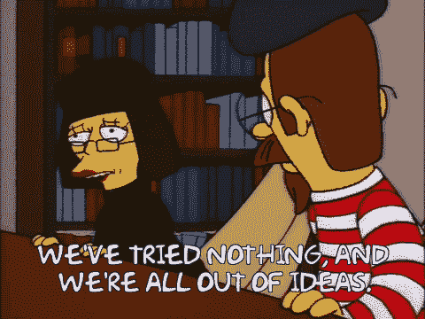

# 作为一名自学成才的软件工程师，我在第一份工作的六个月里学到了什么

> 原文：<https://www.freecodecamp.org/news/what-ive-learned-six-months-into-my-first-job-as-a-self-taught-software-engineer-516b0703e86/>

在这篇文章中，我将分享我的经验并给出建议，因为我作为一名自学成才的软件工程师，已经工作了六个月了。

注意，这篇文章不会关注如何获得一份软件工程工作。查看我之前的帖子，[我如何在 9 个月内从新手成为软件工程师](https://medium.freecodecamp.org/how-i-went-from-newbie-to-software-engineer-in-9-months-while-working-full-time-460bd8485847)了解更多信息。

还要注意，这只是我在一家公司的经历的一个数据点！

我记得当我在找工作时，我阅读了大量关于科技行业、学习编程和成功故事的阅读材料，我的主要关注点是如何找到一份工作。但我总是有点好奇一旦你真的得到了这份工作会是什么样。这篇文章的目的是试图回答其中的一些问题。

> 第一天、第一周、第一个月是什么样的？有没有需要学习的技能可能对面试没有帮助，但一旦你开始工作就会有帮助？即使我找到了一份工作，我怎么知道我能做好它呢？

### 背景

我在加州圣马特奥一家名为 Human API 的公司担任软件工程师。这是一家拥有约 35 名员工的医疗保健科技初创公司，主要致力于以用户为中心的医疗保健数据交换。我被聘为软件工程师，专注于前端，使用 React、Redux 和 Sass 等技术。

### 基督教公谊会对星期日的称呼

第一天很不真实。我曾经梦想成为一名软件工程师，但第一天感觉还是像做梦一样。有一项破冰寻宝活动需要我去做，包括与办公室里的每个人交谈。

我收到了一份“新员工成功计划”，其中包括以下内容:

*   第一天-配置好笔记本电脑，去吃欢迎午餐
*   第 1 周——能够画出产品如何工作的图表，熟悉敏捷，完成入职培训
*   第二周——使用我们的公共 API 构建一些东西，修复一个 bug，添加一个增强功能
*   第 1 个月-开始接管我的产品部分
*   第 1 季度-接管我的产品部分

但正如你所料，第一天主要是为我的笔记本电脑设置合适的环境。

### 第一周

第一周基本上还是老样子。仍然正确设置我的所有账户，阅读完入职文档，等等。

在工作日的白天编码感觉很奇怪！我也仍然习惯于典型的湾区创业津贴。我的技术主管一直称我为“反应专家”,因为我是那个特定团队的主要前端人员。我不确定他是否认为我是那样的人，或者他只是想把标准定得高一些。无论如何，我试着随遇而安。

我还学习了敏捷过程。我们每天都有 15 分钟的“站起来”会议，每个人都会站起来谈论他们正在做什么，以及他们的工作是否被任何人“阻止”。

这是我申请工作时半担心的事情:

> 如果我不懂敏捷、scrum、velocity、产品增量、sprint、retro……是不是很糟糕？

在我看来，在你开始工作之前，你不需要知道这些事情意味着什么。这在面试中可能会有帮助，因为如果你这样做，面试官可能会下意识地认为你更可信，但在现实中，你可以在不到一天的工作中学会这一点。

### 第一个月

此时，我正在做一些真正的开发，并且实际上为团队做出了贡献。我正在学习如何与设计师、产品管理人员和其他软件工程师一起工作。有时候我开始在家工作，这很棒。我发现偶尔在家工作让我总体上更有效率。似乎没有人在乎你什么时候进办公室，什么时候离开，这与我以前的公司截然不同。我参加的会议也比我之前的工作少得多。

我之前没用过 Sass，所以看了一些视频，看了一些文档。它与 CSS 非常相似，所以这没什么大不了的。我从事的项目相当新，所以没有严格的、标准化的 git 工作流程。老实说，在产品的那个阶段，它与我开发投资组合项目的方式惊人地相似。我还有点担心另一件事…

> 我够了解 git 吗？如果有一些复杂的 git 工作流，而我把一切都搞砸了怎么办？

我确实认为在团队中获得一些使用 git 的经验是有价值的。参加当地的聚会，做一个项目，参加黑客马拉松，为开源做贡献。熟悉拉、推、合并、重置基础。经历处理合并冲突的痛苦。阅读一些关于 git 工作流的最佳实践。

你可以在工作中学习，但是如果你有了通用 git 工作流的经验，你会更有效率。

我在第一个月遇到的另一件事是试图找出当我陷入困境时我应该做什么。我是应该去问别人还是纠结于此？

关于代码，我最期待的事情之一就是身边有比我更聪明、懂得更多的人，这样当我遇到困难时，我可以得到帮助。

当你独自学习时，你没有那种奢侈，你必须决定你是应该继续用你的头撞你面前的墙，还是寻找一堵新的墙来撞你的头。

然后我意识到…自学如何编码给了我一项有价值的技能。这是一种技能，知道在继续前进、找到解决办法或询问别人之前，你的头要撞在墙上多久。如果你身边总是有一屋子的导师来帮助你解决每一个问题，当你陷入困境时，你永远不会被迫经历决定下一步做什么的痛苦斗争。

你的心态不应该是…

> 哇，看看这个！我有一屋子的软件工程师可以帮我！

或者这个…

应该更像是…

> 我会积极努力自己解决这个问题，如果我需要寻求帮助，我会告诉那个人我做了什么但没有成功。

### 第 6 个月

到现在为止，我已经对代码、我的团队和整个公司感到满意了。我们有公司野餐，产品发布后在啤酒厂的活动，每个人都带着他们最喜欢的视频游戏玩的游戏之夜，我们在办公室玩世界杯，以及许多其他社交活动。也有许多令人紧张的产品增量演示。

我向许多聪明人学习，试图在公司内部发表意见，分享我对我们应该如何做某些事情的看法。我一直在技术访谈的另一边，参与多个产品发布。我也开始更多地参与后端，因为这最终是我最喜欢的。

估计添加功能/修复 bug 需要多长时间是非常困难的，感觉我并没有在这方面做得更好。

我认为这份工作最困难和最具挑战性的部分是设计和建筑。当有一个特性要添加时，有很多方法可以让我立即想到，但是考虑到时间限制，找出最好的方法是非常困难的。

有时候，某些新增功能需要与许多人进行多次讨论，而其他时候，即使你想不出好的解决方案，也必须自己做出决定，因为这不值得花时间。三个月后，你看着你的代码，像这样:

### 常见问题解答

在这一部分，我包括了新手可能会有的常见问题。

> 我一直在努力学习如何编程…我怎么知道我会喜欢做一名软件工程师？

如果你喜欢学习编码，那么我想你会喜欢做一名软件工程师。这并不意味着所有的软件工程工作都很棒，或者你会喜欢所有的工作。即使你得到了一份很棒的软件工程工作，那也不意味着你会一直热爱它的每一个方面。

但是如果你喜欢构建新的东西，重构丑陋的代码，最终修复一个已经困扰你一段时间的 bug，你应该会做得很好。如果你喜欢学习编码，那么我认为软件工程适合你。

> 即使我找到了一份工作，我怎么知道我能做好它？

出于某种原因，我一直认为，我和那些靠写代码赚钱的人(那些靠写代码不赚钱的人)之间存在着巨大的差异。所以很自然的，这个问题在我脑海里蹦了很多次。

我同意这个老生常谈的建议，“如果他们雇佣了你，那么你已经准备好做这份工作了”。我坚信一步一步来。如果你没有工作，把注意力放在如何找到工作上。一旦你得到了一份工作，那么你就可以专注于做你需要做的事情来获得成功。

如果你同时担心得到一份工作和你在假想工作中的假想表现，那么你会给你的生活增加不必要的压力和担忧。

> 有没有需要学习的技能可能对面试没有帮助，但一旦你开始工作就会有帮助？

我会重申并说，我对这个问题的主要回答是，不要担心你假设的工作，直到它不再是假设的。

然而，如果你不接受否定的回答，那么我会推荐我前面提到的。试着和团队一起做一个项目，选择一个最佳的 git 工作流程。

我敢肯定，如果你在谷歌上搜索“通用 git 工作流”，你可以找到很多关于它的文章。除了基本的软技能之外，我没有很多额外的建议。试着从第一天开始就和你的团队以及公司里的每个人和睦相处。

> 在创业公司，你自己建立一个项目和在团队中工作的主要区别是什么？

这真的取决于你正在开发的产品有多成熟。大部分的不同来自于开发一个会被很多人使用的大产品。在创业公司中，当你创建自己的副业项目，而不是制作应用程序时，你可能没有想到以下几点:

*   安全- 当然，如果你不想的话，这不是你在自己的项目中需要担心的事情。当你开发一个被很多人使用的产品时，网络安全是非常重要的。我给[写了一篇网络安全简介](https://medium.freecodecamp.org/a-quick-introduction-to-web-security-f90beaf4dd41)，解释了网络安全基础知识，如 CSP、HTTPS、CORS 等。
*   浏览器兼容性 -你可能不得不支持 IE 的版本，这意味着你可能无法使用所有最新的 CSS，可能会遇到一些 JS 问题。随之而来的是跨浏览器测试，这是它的强项。
*   **分析** -你可以使用类似谷歌分析或 Mixpanel 这样的工具来了解转化率和产品使用情况。
*   测试——如果你不想的话，你当然不必在自己的项目中编写测试。然而，测试对于编写好的代码是必不可少的。学习编码时，你等待开始编写测试的时间越长，就越难养成习惯。
*   阻止者 -你可能会在建立你的特性之前依赖某人来建立一些东西。因此，您可能需要考虑解决这个问题的方法。如果你是一个前端工程师，API 还没有完全准备好，你可能需要做一个模拟 API，这样你就不会被阻止使用 UI。
*   可维护性 -你当然想为你的副业项目编写好的代码，但是风险不会太高。从现在起一年内，你可能不会维护它，所以谁会在乎它是否没有评论，是否在一个大文件中，对吗？当你在一个团队的时候，你想要一个低门槛的贡献。也就是说，当一个新人加入时，你希望他们能够阅读文档，看到代码，并且能够快速地开始做出贡献。如果代码很难理解和阅读，那么人们不仅要花更长的时间来做出贡献，而且在不增加大量技术债务的情况下增加功能也将更加困难。

### 成交建议

正如我多次说过的，我认为在你得到一份软件工程工作之前，知道所有这些东西并不重要。我确实认为了解**it 是有价值的，不管是因为你不知道你是否喜欢做软件工程师，还是你只是想知道期待什么。**

同样，不幸的是，有些面试官会问你一些这方面的问题。也许是因为他们不知道更多，也许是因为他们正在招聘一个更高级的职位。我认为，如果你基础扎实，这些东西都可以在工作中学习。

祝你好运！