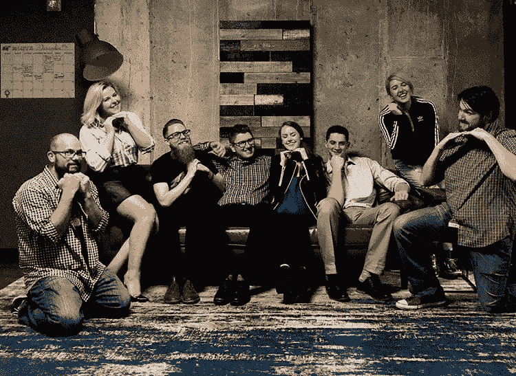

# 训练营结束两年后，我学到了什么

> 原文：<https://www.freecodecamp.org/news/what-ive-learned-two-years-post-bootcamp-49812d33e2b7/>

卡拉·卢顿

# 训练营结束两年后，我学到了什么

My Iron Yard cohort

整整两年前，我放弃了音乐公关的职业生涯——我在整个大学期间都在从事这项工作，并奇迹般地获得了一个梦寐以求的职位——在铁场开始了为期三个月的前端工程项目。我对科技行业一无所知，也几乎不知道 div 是什么。过去的两年是我一生中最艰难的时期，但我很高兴我开始了这段旅程。

为了给你一些关于我为什么决定转型到科技世界的背景知识，请阅读我的文章“从音乐公关到网络开发者”。我压力很大。我大部分时间都在给数百名记者发电子邮件，希望他们能同意我的一个客户的采访或报道。我想要新的东西。一些我每天都会被推动并且会一直学习的事情。嗯，作为一名开发人员就是这样。以下是我从训练营毕业后学到的一些东西。

#### 你总是会不断学习

作为一名 web 开发人员，我没有一天不学到新东西。这是这份工作中我最喜欢的事情之一，但也可能让人不知所措。每当我患上冒名顶替综合症时，我都喜欢坐下来想想我已经走了多远。

正如我前面所说的，我开始我的训练营时对 web 开发一无所知。我只知道我在 Codecademy 中学到的东西。两年前我没有任何线索，现在我所能做的仍然让我感到惊讶。我等不及回头看看再过两年我还能做些什么。

#### 总是问问题

当我做公关的时候，我觉得问问题是软弱的表现。这意味着我不知道如何做我的工作，所以我避开了它。

但是为了更好地编码，你必须提出问题。这是我必须习惯的事情。有时候，我仍然不愿意向一位资深开发人员询问我的代码中的问题。永远不要害怕问。

不过，在接触之前，要确保你已经做了调查。你彻底谷歌过你遇到的问题了吗？你有没有运行调试器来看看你是否遗漏了一个步骤？问之前尽你所能。向你的高级开发人员解释你做了什么，这样他们就不必走同样的步骤。戈登·朱也有一篇关于这个问题的精彩文章。

#### 做一件事有一百万种不同的方法

我的办公室最近吃了一顿午餐，了解到我们用普通 JavaScript 制作了一个[自动化量表。当我们四处解释我们的解决方案时，我意识到每个人都以不同的方式处理这个问题。我喜欢看到我和我的同事如何解决同一个问题。我从每个人的角度学到了新的东西。](https://medium.com/javascript-in-plain-english/creating-an-animated-gauge-chart-with-vanilla-javascript-38d1d7e81b2b)

#### 从容接受反馈

作为一名开发人员意味着你总是要进行代码审查。不管你多高，总会是发生的事情。学会从容地接受来自代码评审的反馈。

写代码是非常个人化的事情。你正在从零开始建造一些东西，你为此感到自豪。当你收到一个评论的反馈时，不要生气。审查你的代码的人并没有恶意。他们试图让你成为更好的开发者。我见过一些开发人员对他们的代码审查如此狂热，这只会伤害他们自己。代码评审是另一个学习和成长的机会。

如果你喜欢这篇文章，别忘了点击❤！一定要在 Twitter 上关注我的最新文章，关于技术的推文，如果我诚实的话，还有很多可爱的狗狗视频。

[**卡拉卢顿(@卡拉卢顿)|推特**](https://twitter.com/karaluton)
[*卡拉卢顿的最新推文(@卡拉卢顿)。前端开发者+前音乐公关。退役芭蕾舞演员……*twitter.com](https://twitter.com/karaluton)