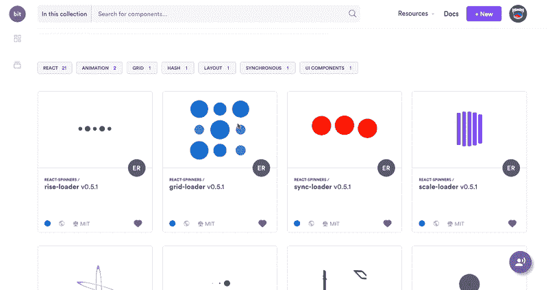
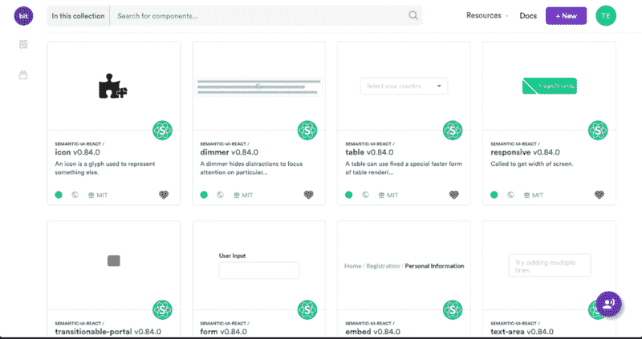

# 关于我们共享代码的方式，音乐能教会我们什么

> 原文：<https://www.freecodecamp.org/news/what-music-can-teach-us-about-the-way-we-share-code-a69c30ebded8/>

乔纳森·萨林

# 关于我们如何共享代码，音乐能教会我们什么


Is that a Cello-playing ape?

就在不久前，我们中的许多人在汽车后座上带着一个看起来可疑的行李箱，或者藏在床下。我们中的一些人拥有宜家制造的带有多个储物空间的塔楼，自豪地矗立在客厅里。在这两种情况下，这是我们令人印象深刻的音乐光盘收藏的结果。今天，它们很可能怀旧地存放在我们的车库里。

在短暂的统治之后，音乐光盘被 iTunes 和 YouTube 取代，MP3 播放器介于两者之间。这场革命的发生主要是因为 CDs 从第一天起就有 5 个主要缺点:

1.  它们使用、携带和处理都很麻烦。
2.  他们花了太多精力去购买/创造。
3.  它们很难改变和修改。没有人真的想每当比伯的新歌出来就刻录一张新 CD(不要评价我)。
4.  他们强迫我们带着一堆我们不听的歌，快速浏览，只为了听一首我们真正想听的歌。
5.  谁记得哪张 CD 上有哪些歌曲？我刻录的 CD 中 90%都包含同样的 10 首歌曲。

令人惊讶的是，这与我们今天在项目之间和人与人之间共享代码的方式并没有什么不同。让我们看看怎么做。

### 这和共享代码有什么关系？


“I usually just like to listen to my light-saber swooshing back and forth…”

模块化一直是软件开发的圣杯，也是提高可重用性、可维护性和可测试性的关键。

每天，我们构建的更多应用程序都是通过更小的代码组件以更大的模块化设计的。可重用的功能、UI 和 Web 组件(如 React、Vue 和 Angular)、Node.js 模块、GraphQL APIs 甚至无服务器功能都是我们的构建模块。

现在让我们实话实说——谁确切地知道哪些可重用组件被写在他们的代码库中，组织它们，并在他们的项目之间大规模地共享它们？我知道我没有。然后，我开始问自己为什么不。

让我展示给你看。这里有一个托管在 GitHub 上的 [React 电影应用](https://github.com/teambit/movie-app)。如您所见，它总共包含 49 个文件和 14 个目录。其中一个目录是`components`子目录。子目录中有 8 个可重用 React 组件(如`hero` 和`navigation`)。

```
├── src
```

```
│   ├── App.js
```

```
│   ├── App.scss
```

```
│   ├── App.test.js
```

```
│   ├── components
```

```
│   │   ├── hero
```

```
│   │   ├── hero-button
```

```
│   │   ├── item
```

```
│   │   ├── list-toggle
```

```
│   │   ├── logo
```

```
│   │   ├── navigation
```

```
│   │   ├── title-list
```

```
│   │   └── user-profile
```

```
│   ├── favicon.ico
```

```
│   ├── global.css
```

```
│   └── index.js
```

```
└── yarn.lock
```

假设我有另一个 React 应用程序，我也想在那个不同的应用程序中使用我的`hero`组件，并让我的团队可以在他们的项目中使用它，并轻松地修改它以满足他们的需求。

复制粘贴代码是一个[非常糟糕的主意](https://stackoverflow.com/questions/4226284/how-to-convince-a-colleague-that-code-duplication-is-bad)。这看起来像是快速的方法，但事实并非如此。不要这样做。

从今天开始，我有三个选择:

1.  **发布九个包**:创建八个新的 repos，样板文件，发布九个包，将两个项目的源代码都改成**要求**它们。当我想修改一个组件时，我必须非常努力地从不同的回复中做出改变。现在想象一下有 500 个这样的东西。
2.  我可以使用[Lerna](https://github.com/lerna/lerna)在单个回购中保留多个包，但这只在我真的想进行 monorepo 时才有效。即使这样，我也不得不重新构建我的项目，分别配置每个包，并定义它们的依赖树，并且每一个改变都必须经过原始的存储库。
3.  **共享库**:创建一个新的 repo，将组件组合在一起，创建这样一个项目所需的配置，将其发布为一个新的库，并更改两个项目的源代码。使用这个库的每个应用程序都会增加冗余代码、重量和复杂性。每次修改都需要重新发布整个库，并通过所有者。

事实是，对于更大的项目来说，包是很棒的。对于较小的组件和模块，这些解决方案与音乐 CD-r om 有一些相同的问题:严重的开销，难以改变，缺乏可发现性。

在某种程度上，设置 500 个 repos 和软件包来共享更小的组件让我想起了使用迷你光盘播放器(不是我最划算的 100 美元):你不能通过优化来解决这个问题。你必须创新。

### 那么…共享代码的 iTunes？

显然，将共享库比作 CD-r om 在技术上并不十分准确。在复杂的环境和上下文之间共享功能的复杂性不同于听 Lady Gaga。

不过，在项目之间共享公共代码真的不应该这么难。从我们今天分享和消费音乐的方式中，我们可以真正学到的是，有效的分享需要更好的体验:减少开销，增加可发现性，从静态到动态。

### 所以，我们决定建造它

2017 年初的某个时候，我们做了同样的梦。开源最大的好处之一是，有一个想法是一个非常好的理由去创造它。

我们决定继续开发[Bit](https://bitsrc.io)——一个[开源项目](https://github.com/teambit/bit)，旨在做代码共享，就像 iTunes 做音乐共享一样——让它变得简单、动态，让每个人都能轻松访问。 [Bit](https://bitsrc.io) 的想法很简单:杀死共享代码的开销。

#### 它是如何工作的



它旨在为“托管复制粘贴”提供最快的体验，并与 Git 和 NPM 100%兼容。

关键在于 Bit 将共享代码的表示从项目的文件系统中分离出来的能力，以及它跨回购和项目跟踪共享代码的能力，无论它是安装在这些项目中还是实际来源于这些项目。

它打破了共享代码的开销，消除了拆分 repos 的需要，也消除了重组项目和在其中套用多个包的需要。

相反，您可以简单地将 Bit 指向您的 repo 中您想要共享的任何部分，让 Bit 自动隔离它(包括依赖项)，并将其共享到一个名为 Scope 的共享位置，从该位置可以安装 NPM。

由于 Bit 能够跟踪项目之间的实际源代码，所以您还可以使用它将代码本身导入到任何存储库中，对其进行更改，并让 Bit 为您同步项目之间的更改。

当共享时，你甚至可以将代码恢复为你项目的包依赖。

因此，基本上没有共享代码并使其可用于 NPM 的开销，可发现性增加了，维护变得简单多了。作用域甚至帮助[构建](https://docs.bitsrc.io/docs/building-components.html)和测试您的代码，这样您就不必为每个包配置这些环境。

以下是 [Bit 的工作流程](https://docs.bitsrc.io/)的样子:

1.  为您的项目安装 Bit 并初始化它。
2.  选择从您的项目中跟踪哪些代码组件，以及为构建和测试过程添加哪些[环境](https://docs.bitsrc.io/)。
3.  将它们共享到一个远程范围，在那里它们被托管、组织，并且可以使用您最喜欢的包管理器进行安装。
4.  轻松地将他们的代码导入到任何 repo 中，根据需要进行更改，并在您的代码库中更新您的更改。

让我们看一个例子。

#### 返回 React 电影应用程序

让我们回到 [React 电影应用](https://github.com/teambit/movie-app)。

向项目添加位使我能够跟踪和隔离内部的可重用组件，而无需建立新的存储库或更改我的项目代码。然后，我把它们分享给了这个[收藏](https://bitsrc.io/bit/movie-app)。

分享它只花了很少的时间，而且我的项目根本没有改变。没有创建新的`package.json`文件，我也不需要配置多个环境或与依赖树斗争。



React components with Bit

正如你所看到的，现在我的整个团队都可以用 NPM 安装每一个组件，或者导入到他们自己的项目中做进一步的修改。

他们可以搜索它，查看有用的信息——从实时渲染到构建和测试结果、自动解析的文档和示例——这样他们就可以判断它的有用性。

我们的整个团队现在可以组织和共享我们的公共代码组件，而不必每天努力工作或重新发明轮子。

在使用了 10 个月之后，并且现在被更多的团队和社区使用，我欢迎您加入并在您的项目中使用它。

你可以在这里看到这个项目[的视频演示。](https://www.youtube.com/watch?v=vm_oOghNEYs)

### 回到未来

直到几年前，我们不得不为每首想听的歌曲刻录一个新的项目。为了听一首歌，我们不得不存储和维护多张静态 CD，拖着一堆东西。我们在 CD 之间复制歌曲，很难找到我们真正想要的歌曲。

iTunes 为我们提供了动态体验，帮助我们编写和共享播放列表，轻松找到我们想要的歌曲，并快速更新我们的播放列表。当我参加聚会时，我可以轻松地播放我的快节奏夏季播放列表，或者轻松地为我的猫播放我的浪漫歌曲，让她入睡。

我们可以从音乐如何从光盘转移到共享播放列表中学到很多。Bit 旨在让代码共享和重用变得简单，让每个人都可以使用，就像 iTunes 对共享音乐所做的那样。它仍然是一项正在进行的工作，因此它仍然有很大的成长和发展空间。欢迎您来[尝试](https://bitsrc.io)，提出[的想法](https://gitter.im/bit-src/Bit)和[的反馈](https://github.com/teambit/bit/issues)，帮助我们向前迈进。

> “有效构建‘大型’事物的秘密通常是从一开始就避免构建它们。相反，用更小、更集中的片段组成你的大东西……”

> -奥斯马尼