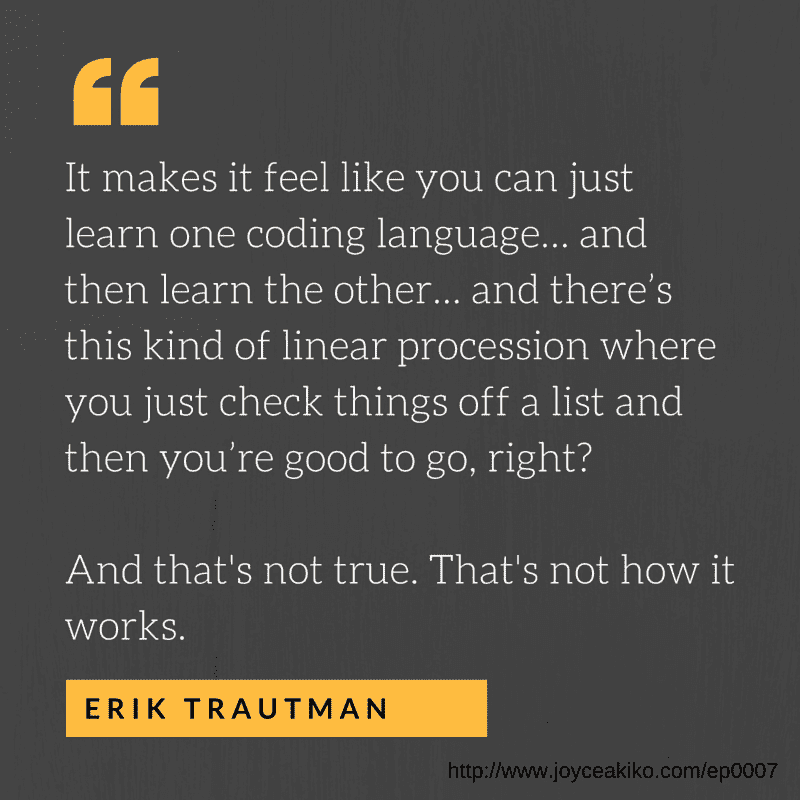

# 没人告诉你如何学习编码——以及为什么学习编码如此困难

> 原文：<https://www.freecodecamp.org/news/what-nobody-tells-you-about-learning-to-code-and-why-that-makes-it-so-hard-22431ba27d78/>

乔伊斯·秋子

# 没人告诉你如何学习编码——以及为什么学习编码如此困难

你熟悉文章[为什么学习编码如此困难](http://www.vikingcodeschool.com/posts/why-learning-to-code-is-so-damn-hard)吗？

如果没有，那就去看看。

挺好的。

几周前，我和编剧埃里克·特罗特曼录制了一段播客。他创办了[维京代码学校](http://www.vikingcodeschool.com/)。在此之前，他创立了[Odin 项目](http://theodinproject.com/)，这是一个学习网络开发的免费开源课程。

在我们与 Odin 项目和 Viking 代码学校讨论了他的历史之后，我们探究了为什么，确切地说，当你刚刚开始时，学习编码是如此困难。

他说了些什么。一些让我震惊的事情。

因为他说的话听起来很真实。这与我自己学习编码的经历产生了共鸣。

它回荡在我的脑海里，回响着每一个给我发邮件说学习如何编码有多难的人。开始新的生活。

他在说什么——没人谈论这个。永远不会。

当我们寻找学习如何编码的方法时，我们发现了什么？

程序。工作坊。训练营。他们都许下承诺。

3 小时建一个网站。不需要技术知识或背景。

参加为期两天的 Ruby on Rails 研讨会。带着足够的知识去构建真正的应用程序并从中赚钱。

一个周末学会 HTML。

5 天掌握 JavaScript。

支付你的$29，$200，*无论什么*，你将知道关于 SQL 的一切。

勾选复选框。继续下一个。

只不过事情根本不是这样。

这不是对空头承诺或糟糕计划的咆哮。当你开始学习编码时，没人会告诉你这些。

学习编码不是一个线性的过程。你不会勾选一个框就完事了。你不会因为参加了一个研习班或一堂课，就学到关于一门语言或概念的所有知识。

学习编码是一个跌宕起伏的循环。下跌是真正的下跌。你被卡住了，以至于你想把自己的头发拔出来。你会感到沮丧。气馁。

你开始问:

*   作为一名开发人员，我真的会成功吗？
*   真的会有人付钱让我这么做吗？
*   我是不是浪费了几个月的时间去学一些不会成功的东西？

所以，如果学习编码不容易，不是线性的，不仅仅是打勾…你会怎么做？不管你的*在那里*是什么，你如何从这里到那里？

埃里克的建议？

> 明确你想用你将学到的技能做什么。专注于你的“那里”。

是做全栈开发者吗？自由网络开发者？具体点。

当你把注意力集中在你想*做什么*和接下来要上什么课的时候，你就巧妙地把你的思维模式从基于技能转变为基于能力。

不要一门接一门地学习，然后为自己没有取得进步或学得不够快而感到沮丧——你应该关注每次编码、每次掌握一项新技能时，你是如何进步的。

你变得越来越有能力实现你的首要目标，你学习的全部原因。更容易进步。你在大的图景中努力前进，而不是在日常生活中挣扎。

你学会了。你建造。你仍然碰壁，也许比你预期的更频繁。你可能会考虑放弃。但是，如果你专注于你的最终目标并坚持不懈，你就建立了一个基本的基础知识，你就能继续前进。

你可能需要上五门 JavaScript 课程才能感觉到你最终掌握了它。您可能仍然不了解 JavaScript 的所有知识。这没关系。

你可能需要永远搜索函数表达式和函数声明之间的区别。这没关系。

学习编码是一个不断学习新概念的过程。寻找和添加新的拼图，并把它变得越来越大，直到你达到获得梦想工作或第一个自由职业客户所需的能力水平。

有时候你会觉得自己在向前迈两步，向后退一步。挫败感再次袭来，也许你想放弃。但是你继续前进。

因为你对学习编码有一个*为什么*。最终目标。前进的理由。

因为事实是，你可能永远也不会知道关于 JavaScript 的所有知识——而且在为期两天的研讨会上，你*肯定*也不会知道关于 JavaScript 的所有知识。

乔伊斯帮助人们建立成功且有利可图的自由职业业务，这样他们就可以为自己工作，赚更多的钱，并每天体验自由和灵活性。**查看她为期 3 周的课程，[兼职](http://freelanceontheside.com/)，今天就免费注册。**

你也可以看看她的书， **[【自由职业者你的自由之路:成为自己的老板，赚更多的钱，做你喜欢的事情的简单蓝图](http://freelanceyourwaytofreedom.com/)** 因为如果一本书有那么长的标题，那它一定非常好。

Joyce 已经出现在 Lifehacker、Skillcrush、MatterMark Daily 和其他几十个网站上，她的课程和文章仅在去年就帮助了 80 多个国家的数千人。