# 2022 年应该先学什么编程语言？[已解决]

> 原文：<https://www.freecodecamp.org/news/what-programming-language-should-i-learn-first-19a33b0a467d/>

大多数人学习编程的旅程都是从深夜谷歌搜索开始的。

通常是“学习 ______”之类的东西

但是他们如何决定搜索哪种语言呢？

> “他们总是在硅谷开 Java 的玩笑。我想我应该学学这个。”

或者:

> “哈斯克尔。现在这么热。哈斯克尔。”

或者:

> "那只 gopher 实在是太可爱了."


然后是我们剩下的人。我们可能会搜索如下内容:

> “应该先学哪种编程语言？”

很少有问题如此普遍地被问到，以至于它们得到了完整的信息图表处理。但这是其中之一:

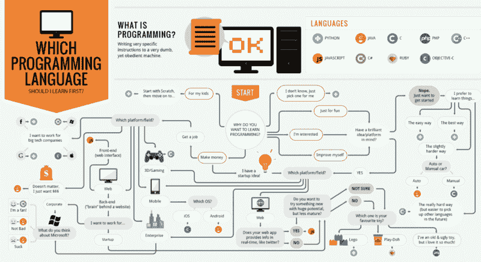

[Image credit](http://carlcheo.com/startcoding)

决定你的第一门编程语言可能是一个有趣的过程——有点像“你是哪个昆汀·塔伦蒂诺角色？”性格测验。

但是在你因为小时候喜欢玩 Play-Doh 而跑去学习 Ruby 之前，让我提醒你:这里的风险相当高。

你将花费数百个小时的练习来掌握你的第一门编程语言。

所以你应该考虑以下因素:

*   该语言的就业市场
*   这种语言的长期前景
*   这种语言多么容易学啊
*   当你学习的时候，你可以建立什么项目(和朋友分享，这样你可以保持动力)

每年都会出现新的编程语言，随之而来的还有新的学术论文。和新的网络漫画。

说真的。看看这个上个月的宝石:

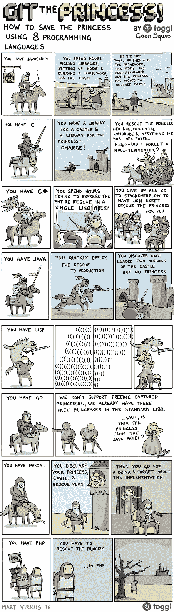

当谈到选择第一种编程语言时，有很多选择。为了缩小搜索范围，以下是过去 12 年中与学习编程相关的最常见的谷歌搜索:

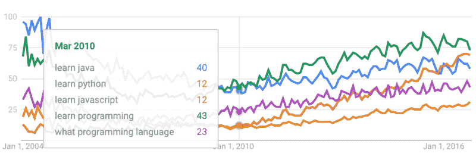

Java 经历了起起落落。

Python 逐渐上升为最受欢迎的选择。

但是藏在这些下面的是一个小引擎，它可以在过去几年里慢慢地变得流行起来。这个引擎就是 JavaScript。

在我谈论这些编程语言之前，让我澄清一下:

*   我并不是说任何一种语言在客观上比其他语言更好
*   我同意开发人员最终应该学习不止一种语言
*   我认为首先他们应该学好一门语言。正如你可能从我标题中上下颠倒的文字中猜到的，那种语言应该是 JavaScript。

让我们先来看看目前学校是如何教授编程的。

### 计算机科学


大学传统上在计算机科学的保护伞下教授编程，计算机科学本身通常被视为数学的延伸，或者与电子工程学位相联系。

当然，你可能已经听说了:

> “计算机科学教育不能让任何人成为专业的程序员，就像学习画笔和颜料不能让一个人成为专业的画家一样。”埃里克·雷蒙德

截至 2016 年，许多大学仍将编程视为计算机科学，将计算机科学视为数学。

因此，许多介绍性编程课程侧重于低级抽象语言，如 C，或数学语言，如 MATLAB。

系主任通常会坚持下去，指出年度编程语言排行榜，如 [TIOBE Index](http://www.tiobe.com/tiobe-index/) ，或来自 [IEEE](http://spectrum.ieee.org/computing/software/the-2016-top-programming-languages) 的这个:

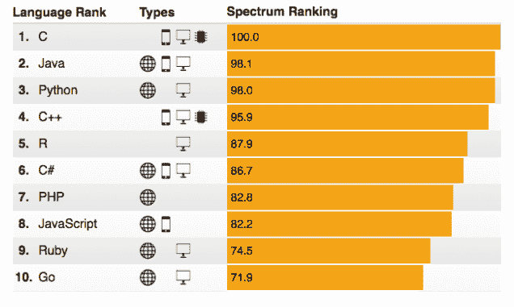

这些排行榜中的大多数看起来与 10 年前几乎一样。

但是变化确实发生了。即使在学术界。

2014 年，Python [取代 Java](http://cacm.acm.org/blogs/blog-cacm/176450-python-is-now-the-most-popular-introductory-teaching-language-at-top-u-s-universities/fulltext) 成为美国顶级计算机科学项目中最受欢迎的教学语言。

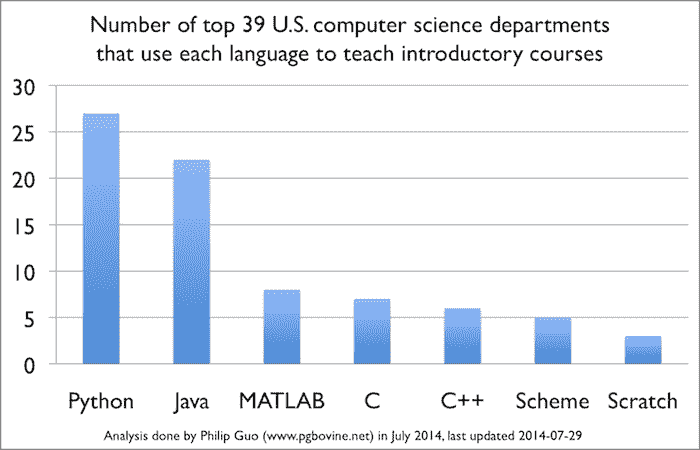

然而另一个变化注定会…最终…发生。

因为如果你看看工作人员实际使用的语言，它描绘了一幅非常不同的画面:

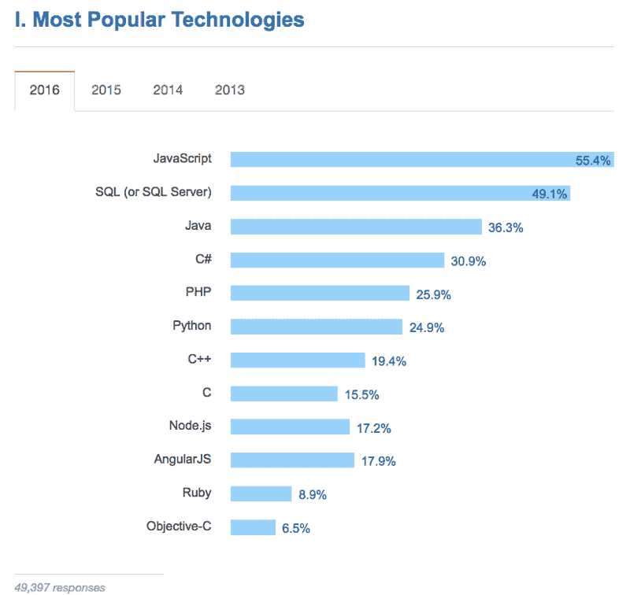

JavaScript is by far the most popular language used by the 49,397 developers who responded to Stack Overflow’s 2016 Survey.

超过一半的开发人员使用 JavaScript。它对前端 web 开发至关重要，对后端开发也越来越重要。它正在迅速扩展到游戏开发和物联网等领域。

招聘信息中提到 JavaScript 的次数也超过了除 Java 之外的任何编程语言:

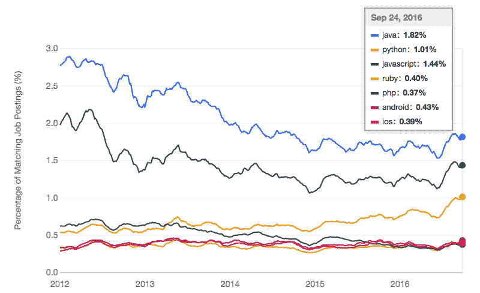

Data from the world’s largest job posting aggregator, [Indeed.com](http://www.indeed.com/jobtrends/q-java-q-python-q-javascript-q-ruby-q-php-q-android-q-ios.html)

我们围绕 JavaScript 构建了我们的开源社区课程，这绝非偶然。在过去的两年中，超过 5000 人使用免费代码营获得了他们的第一份开发人员工作。

我不是因为教 JavaScript 而提倡它。我教 JavaScript 是因为这是第一份开发工作最可靠的途径。

但是 JavaScript 适合你吗？它值得成为你的第一门编程语言吗？让我们探讨一下我前面提到的那些因素。

### 因素 1:就业市场

如果你纯粹是出于求知欲而学习编程，可以跳过这个因素。但是如果你——像大多数学习编程的人一样——想用这项技能去找工作，这是一个重要的考虑因素。

正如我前面提到的，Java 比任何其他编程语言在更多的招聘信息中被提及。JavaScript 紧随其后。

但是关于 JavaScript 的事情是这样的:尽管它已经存在了 20 年，但直到最近它才成为一个重要的工具，像网飞、沃尔玛和 PayPal 这样的公司将围绕它构建整个应用程序。

因此，许多公司都在雇佣 JavaScript 开发人员，但就业市场上却没有多少。

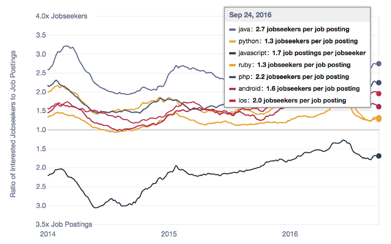

Data from [Indeed.com](http://www.indeed.com/jobtrends/q-java-q-python-q-javascript-q-ruby-q-php-q-android-q-ios.html)

每一个开放的 Java 职位都有 2.7 个 Java 开发者在竞争。PHP 和 iOS 工作的竞争同样激烈。

但是每一个开放的 JavaScript 职位，只有 0.6 个 JavaScript 开发者。对于拥有 JavaScript 技能的开发人员来说，这是一个卖方市场。

### 因素 2:长期前景

普通 JavaScript 项目收到的拉请求是普通 Java、Python 或 Ruby 项目的两倍。最重要的是，JavaScript 比任何其他流行语言都发展得更快。

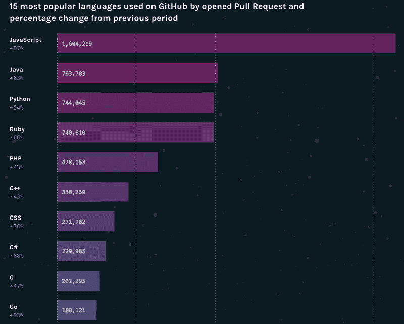

Source: The GitHub’s [2016 State of the Octoverse](https://octoverse.github.com/)

JavaScript 的生态系统也受益于谷歌、微软、脸书和网飞等公司的大量资金投入和工程人才。

例如，TypeScript(JavaScript 的静态类型超集)有 100 多个开源贡献者，其中许多人是微软和谷歌的员工，他们拿着报酬从事这项工作。

用 Java 很难找到这种类型的公司间合作。甲骨文——通过收购太阳微系统公司实际上拥有 Java 经常起诉那些试图在 Java 上扩张的公司。

### 因素 3:学习困难

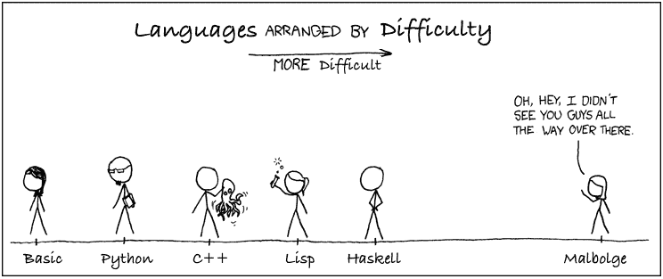

This is a parody of an [XKCD comic](https://xkcd.com/435/).

大多数程序员都会同意高级脚本语言相对容易学习。JavaScript 属于这一类，还有 Python 和 Ruby。

尽管大学仍然将 Java 和 C++等语言作为第一语言来教授，但它们要难学得多。

### 因素#4:您可以用它来构建项目

这是 JavaScript 真正闪光的地方。JavaScript 可以在任何有浏览器的设备上运行，就在浏览器里。你可以用 JavaScript 构建任何东西，并在任何地方分享。

由于 JavaScript 无处不在，Stack Overflow 的联合创始人杰夫·阿特伍德创造了他现在著名的定律:

> “任何可以用 JavaScript 编写的应用程序，*、*、*最终都会用 JavaScript 编写。”*

随着时间的推移，阿特伍德定律依然有效。

Java 曾经承诺也可以在任何地方运行。你可能还记得 [Java 小程序](http://motherboard.vice.com/read/a-brief-history-of-the-java-applet)。甲骨文在今年早些时候正式消灭了它们。

Python 也面临着同样的问题:

> “我怎么能把自己做的这个游戏送给朋友呢？更好的是，有没有一种方法可以让我把它放在我的手机上，这样我就可以在学校给孩子们看，而不用他们安装它？嗯。”—詹姆斯·黑格在[将 Python 作为教学语言退休](http://prog21.dadgum.com/203.html)

相比之下，这里有一些我们开源社区的成员在 CodePen 的浏览器中开发的应用程序。您可以在浏览器中点击并使用这些内容:

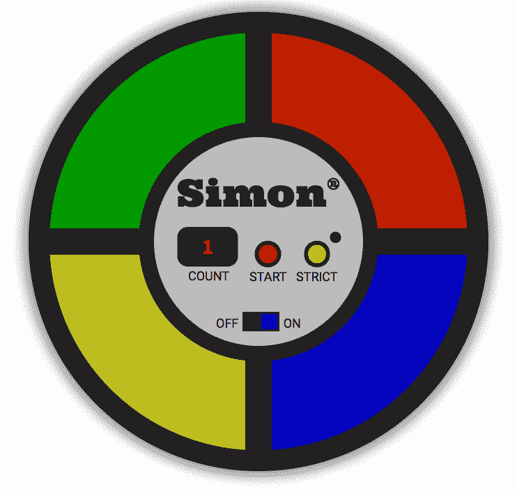

[1970s style Simon game](http://s.codepen.io/adambeagle/debug/qOamaz)

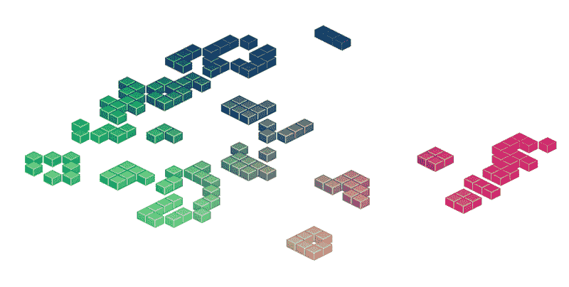

[Conway’s Game of Life](http://s.codepen.io/safx/debug/Ewcym)


[Star Wars-themed Wikipedia Search](http://s.codepen.io/duttakapil/debug/BKGjOa)


[A roguelike dungeon crawler game](http://s.codepen.io/Megabyteceer/debug/qbXJMQ)

### 学好一门语言。然后学第二个。

如果你不停地从一种语言跳到另一种语言，[你就不会走远](https://medium.freecodecamp.com/a-cautionary-tale-of-learning-to-code-my-own-eddb24d9d5a7)。

为了超越基础，你需要学好你的第一语言。那么你的第二语言将会变得容易得多。

从那里，您可以扩展业务，通过学习多种语言成为一名更全面的开发人员:

*   c 语言是了解计算机在内存管理方面实际如何工作的好方法，在高性能计算中非常有用
*   C++非常适合游戏开发。
*   Python 对于科学和统计来说是牛逼的。
*   如果你想在大型科技公司工作，Java 很重要。

**但是先学 JavaScript。**

好了，现在我要尝试一下不可能的事情——我要试着预测来自评论区的反对意见。

### 反对意见 1:但是 JavaScript 不是很慢吗？

就大多数实际用途而言，JavaScript 与高性能语言一样快。

JavaScript (Node.js)比 Python、Ruby、PHP 快几个数量级。

它的速度几乎和高性能语言如 C++、Java 和 Go 一样快。

以下是最近最全面的跨语言基准测试的结果:

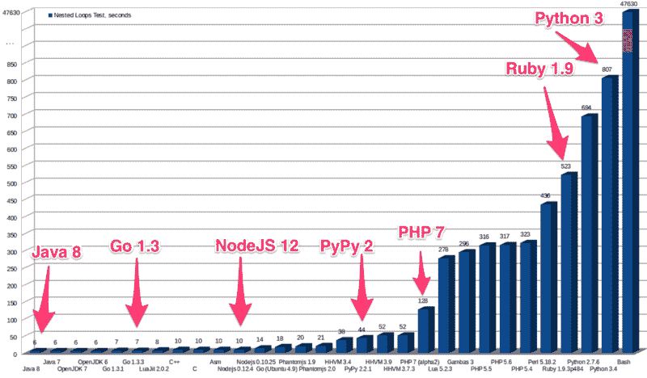

### 反对意见 2:但是 JavaScript 不是静态类型的

和 Python、Ruby 一样，JavaScript 是动态类型的，很方便。但是你可能会惹上麻烦。这里我打算让`exampleArray`成为一个数组。我设置它的值，然后检查它的长度——即它包含的元素数量。

```
exampleArray = [1, 2]
-> [1, 2]

exampleArray.length
-> 2
```

但是后来我不小心把它赋成了一个字符串。

```
exampleArray = “text”
-> “text”

exampleArray.length
-> 4
```

这种错误在动态类型语言中经常发生。大多数开发人员只是进行检查来防止它们，并相应地编写测试。

如果你的第一门编程语言中一定要有静态类型，那么我仍然建议你先学习 JavaScript。然后你就可以快速拿起打字稿。

> “Typescript 有一个学习曲线，但如果你已经知道 JavaScript，它将是一个平稳的曲线。”—[Alex ewerlf 在打字稿上](https://medium.freecodecamp.com/when-should-i-use-typescript-311cb5fe801b#.j920zs7g2)

### 异议 3:但是我真的想做一个手机应用

我还是建议先学 JavaScript。

1.  JavaScript 有几个制作原生移动应用的工具，比如 [Angular Cordova](https://cordova.apache.org/) 和 [React Native](https://facebook.github.io/react-native/) 。
2.  为了让你的移动应用程序真正做一些有趣的事情，它可能需要一个合适的后端，你需要用一个合适的 web 开发框架来构建它，比如 Node.js + Express.js。

此外，值得指出的是，移动应用程序开发的最佳时期可能已经过去了。

首先，尽管人们使用移动应用，但近一半的开发工作是网络开发。相比之下，只有 8%的工作涉及移动应用程序开发。

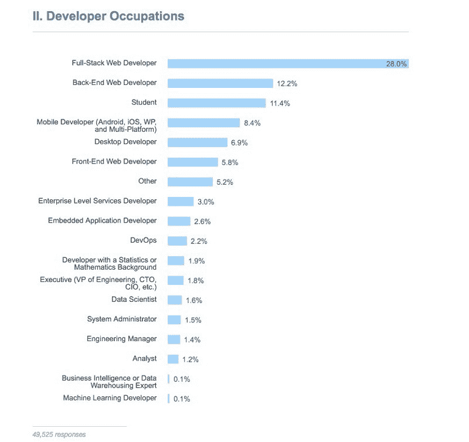

The occupations of 49,525 developers, based on responses to the [2016 Stack Overflow](https://medium.freecodecamp.com/2-out-of-3-developers-are-self-taught-and-other-insights-from-stack-overflow-s-2016-survey-of-50-8cf0ee5d4c21#.f39zmdujb) survey.

“有一个应用程序”的宏伟愿景还没有实现。相反，大多数智能手机用户已经停止下载新的应用程序。

当然——他们仍然使用应用程序。大部分是脸书，谷歌地图，还有其他一些。因此，对移动应用程序开发人员的需求主要集中在少数大型雇主身上。

这些移动开发工作的前景很难预测。使用 JavaScript，开发、维护和分发移动应用程序的许多方面都变得更加容易。因此，像脸书和谷歌这样的公司正在大力投资更好的工具，用 JavaScript 来构建这些。

截至 2016 年，几乎所有的开发都是 web 开发。一切都触及那个大平台，那就是“网络”下一波你将在家中与之通话的设备，以及接你孩子放学的汽车——它们也将通过网络连接在一起。

这意味着 JavaScript。

### 反对意见# 4:JavaScript 难道不是 10 天就写好的玩具语言吗？

JavaScript 有一段古怪的历史。

毫无疑问，你会听到人们拿它开玩笑。

人们也很讨厌 C++。和 JavaScript 一样，尽管有这种讨厌，C++还是成功了，现在它几乎无处不在。

因此，如果有人因为学习 JavaScript 而不是本周精英语言而为难你，请记住 C++创始人的名言:

> "只有两种编程语言:那些总是被人抱怨的语言和那些没人用的语言."—比雅尼·斯特劳斯特鲁普

我只写编程和技术。如果你在推特上关注我，我不会浪费你的时间。？