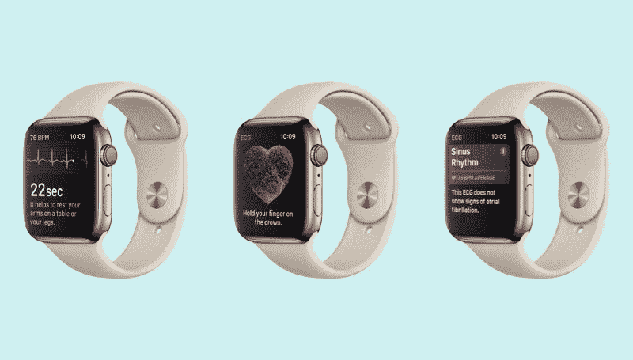
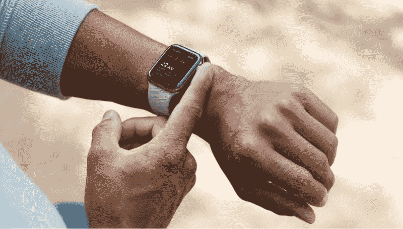
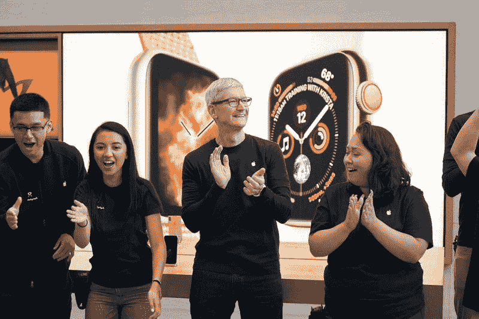

# 新款 Apple Watch 的 EKG 对消费者可穿戴设备和医疗保健的未来意味着什么

> 原文：<https://www.freecodecamp.org/news/what-the-apple-watchs-new-ekg-feature-means-for-the-future-of-consumer-wearables-and-medicine-4189c070a4e/>

作者詹姆斯·许

# **新款 Apple Watch 的 EKG 对消费者可穿戴设备和医疗保健的未来意味着什么**

当苹果今年 9 月宣布其最新的 Series 4 Apple Watch 包含 EKG 功能时，我想象着全球数百万颗心在欣喜地跳动。

这一消息意义重大，原因有几个。主要原因是这是第一次主流消费者可穿戴设备将执行复杂的医疗程序。今天我们需要看医生的同样的程序。

为了理解这一意义，你首先需要抛开一个事实，即健康和健身已经是消费者目前使用可穿戴设备的关键原因。多年来，健康追踪器已经有了心率传感器。

(可以肯定的是，心率传感器有利于健身。但是，它们也很原始。任何有手指的人都可以感觉脉搏，并在必要时计算心率。)

[EKG(或 ECG/心电图)](https://www.webmd.com/heart-disease/electrocardiogram-ekgs#1)不同于心率测量。首先，因为 EKG 通过观察心脏的电脉冲来监测和识别特定的心脏异常。这些异常是严重疾病的直接前兆。中风或心脏病之类的疾病。

这项技术能够也将会拯救生命。

通过增加新的实质性医疗功能，苹果(和其他公司)可以为可穿戴设备成为诊断、治疗甚至预防严重医疗状况的前沿铺平道路。

*Hold your finger on the crown of the Series 4 Apple Watch, and you’ll get an EKG reading on the spot.*

### Apple Watch 属于二类医疗设备。

给苹果手表添加 EKG 不仅仅是一项工程任务。

这也需要众所周知的挑剔的美国食品药品监督管理局(FDA)的关注和合作。FD 已经批准苹果在新款 Apple Watch 中使用两项医疗级功能:1)EKG，以及 2)Apple Watch 识别并通知用户心律不齐的能力。

需要注意的是，对于 FDA 来说，“批准”一个器械并不等同于“批准”一个器械。后者要困难得多，需要大量的协作和测试来降低潜在的风险。清理 Apple watch 从申请到决定只用了一个月。像新的 Apple Watch 这样的二级设备不需要 FDA 的批准，因为相关的健康风险被认为不足以保证更严格的审查程序。

同样重要的是要理解[FDA 许可函](https://www.accessdata.fda.gov/cdrh_docs/pdf18/DEN180044.pdf)附带的语言声明，被许可的功能不适用于 22 岁以下的用户，并且“无意取代传统的诊断或治疗方法”

对于后者，这意味着在你的 Apple Watch 告诉你它已经检测到轻微的心律失常后，你可能会想跟你的医生联系，以获得正确的诊断。

另一方面，如果你的 Apple Watch 告诉你刚刚心脏病发作，紧急情况(和常识)决定你直接去急诊室或叫救护车，跳过 FDA 信中提到的“传统诊断方法”。

### 新医疗功能的滩头阵地

随着监管先例的确立，苹果产品经理无疑正在考虑更多的医疗功能，以加强 Apple Watch 作为医疗设备的概念。

如果是这样的话，我们会从苹果公司看到什么呢？

事实证明，苹果公司多年来一直致力于开发一款与苹果手表相关的血糖追踪器。这种追踪器可以帮助诊断、治疗，甚至预防二型糖尿病。

糖尿病目前仅在美国就影响了大约 3000 万人。挑战在于创造一种非侵入性的技术，这种技术不需要透过皮肤来获取读数，而目前的葡萄糖追踪器必须这样做。根据美国消费者新闻与商业频道去年的一份报告，苹果已经组建了一个新团队来追求这一“圣杯”突破。

以下是苹果公司首席执行官蒂姆·库克关于葡萄糖追踪器的机会:

> “每天多次贴着自己检查血糖，精神上很痛苦。如果一个人对自己正在吃的东西有持续的了解，那么他就有很大的希望可以立即知道是什么导致了这种反应……而且他们可以在患糖尿病之前调整好自己。

*Apple CEO Tim Cook appears to be gung-ho about enabling the Apple Watch as a medical device, with CNBC reporting last year that he was personally testing a blood glucose tracker for the Apple Watch.*

### 对医疗实践和保险成本的影响

据报道，库克的前任、富有传奇色彩的史蒂夫·乔布斯(Steve Jobs)首先设想了消费者可穿戴设备的普及，这种设备可以提供血糖读数和其他健康指标。

如果乔布斯对多功能可穿戴健康追踪器的愿景成为现实，这对久经考验的“年度体检”会有什么影响首先，我们很可能会看到正式的医生检查让位于通过 Apple Watch 等可穿戴设备进行的每日甚至每小时的自动测试。

如果发生这种情况，这种设备的广泛使用可能会对用户的健康产生什么影响，例如，对医疗费用和医疗系统本身的影响？北美医疗保健提供商 United Healthcare 就是一个保险提供商的例子，它已经向使用可穿戴健身追踪器来满足日常健身目标的客户提供财务激励。

当客户获得了也能解决健康和长寿的医疗组件的设备时，我当然希望看到这种财务激励增加，医疗保险费减少。

### 可穿戴医疗技术不是一场单人竞赛

健康和健身可穿戴设备领域的另一家巨头 FitBit[已经在其 Ionic 手表中内置了血氧传感器一年多了](https://www.wired.com/story/when-your-activity-tracker-becomes-a-personal-medical-device/)。该传感器可用于检测常见的呼吸相关疾病，如哮喘、睡眠呼吸暂停，甚至心律失常状况，如心房纤维性颤动。

不过，有一个问题。在这篇文章发表时，Fitbit 还没有公开发布利用硬件传感器的软件。

三星是另一家承诺调整其可穿戴技术以支持医疗用例的公司。

例如，总部位于加州的 [IrisVision](https://irisvision.com/) 使用三星的 Gear VR 头戴设备，让法律上失明的用户能够清楚地看到生活的各个方面。使用[定制的 IrisVision 软件](https://citrusbits.com/portfolio/irisvision/)，IrisVision 耳机使用专有的视觉敏锐度算法来放大用户仍然拥有的任何剩余有用视力。结果是清晰的视觉，对于许多用户来说，恢复了日常生活中的独立性。IrisVision 得到了美国国立卫生研究院(NIH)的资金支持，由来自约翰霍普金斯大学、加州大学伯克利分校、斯坦福大学和加州大学洛杉矶分校的领先视觉专家开发。

### 医疗可穿戴设备将增强临床研究人员的能力

除了消费者医疗保健，临床研究人员也将受益于可穿戴设备的这些最新发展。当进行任何类型的临床研究时，获得可靠的数据可能是一个巨大的挑战，尤其是当一项研究依赖于自我报告的数据或回忆时。

即使对于使用实验室结果的临床研究来说，收集数据也是一项挑战——成本高昂、不切实际，甚至是不可能的。

*In clinical testing and research, data collection can be a considerable challenge without sophisticated wearables.*

但是，如果这些测量可以由可穿戴设备自动进行，这就在很大程度上解决了这个问题，为研究人员提供了丰富、可靠和(或许)可操作的数据，这些研究人员的工作依赖于他们可以信任的数据的可用性。

举个例子，约翰霍普金斯大学在过去的三年里[一直在进行一项临床研究，该研究允许参与者使用他们的苹果手表和该大学的 EpiWatch 应用程序](https://www.hopkinsmedicine.org/epiwatch/#.W8e46GhKiUk)来提供临床数据(心率和加速度计数据)，以加深他们对癫痫的了解。

就在去年 9 月，美国国家卫生研究院拨款 250 万美元给生物科学公司，用于开发可穿戴传感器，以监测亨廷顿舞蹈症的症状。[与罗彻斯特大学合作的试点研究正在进行中](https://clinicaltrials.gov/ct2/show/NCT03599076)。

### 可穿戴设备提供传感器和硬件，但用户体验是最重要的。

与将医疗传感器集成到小型可穿戴设备相关的硬件工程只是挑战的一个方面。

挑战的另一个方面是发明非侵入性或“用户友好”的传感器，这些传感器可以提供相当于我们目前需要抽血才能获得的读数。坦率地说，消费者不会购买一个让他们痛苦甚至经常让他们吃惊的设备。

监管障碍(类似于 FDA)是挑战的另一个方面，尽管根据苹果最近的许可，这似乎是一个有希望的方面。

最后一个挑战是软件和用户体验，这为传感器收集的数据带来了意义。当然，您可以让 EKG 提供读数——电脉冲的线形图——但是您如何以一种不仅有用，而且直观甚至令人愉快的方式向您的最终用户提供读数呢？

据 CitrusBits 首席执行官哈里·李(Harry Lee)称，应用程序通常是可穿戴设备公司最大的竞争优势。

> “在可穿戴领域，硬件方面已经有些商品化了。每个人或多或少都可以接触到相同的传感器、微处理器和芯片。苹果、Fitbit 和 CitrusBits 等公司的不同之处在于，鉴于固有的屏幕尺寸和控制限制，它们有能力为智能手表和其他设备设计直观而强大的应用程序。这绝对是采用的关键，我们已经看到 Pebble 等一度有前途的可穿戴设备公司近年来被迫关闭，部分原因是应用程序产品疲软。”

展望未来，史蒂夫·乔布斯(Steve Jobs)的愿景显然即将实现:在未来，医疗可穿戴设备将发挥重要作用，甚至可能减轻现有医疗系统的压力。

它很可能依赖于计算硬件、非侵入式医疗传感器、渐进的监管监督和精心制作的应用程序的和谐融合。