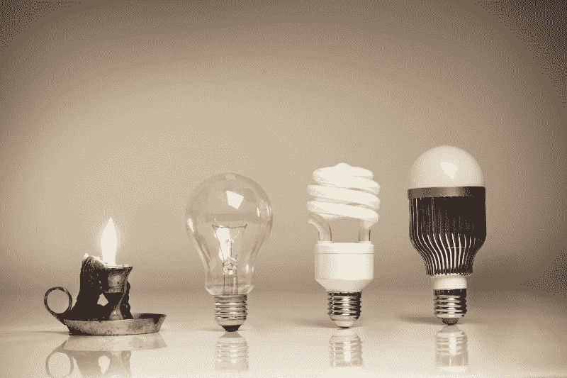

# “最小可行产品”到底是什么意思？

> 原文：<https://www.freecodecamp.org/news/what-the-hell-does-minimum-viable-product-actually-mean-anyway-7d8f6a110f38/>

作者 Ravi Vadrevu

# “最小可行产品”到底是什么意思？

#### 埃隆·马斯克解释令人困惑的想法

Confused about MVP? You’re not alone — this giraffe is too. Image credit: [Matt McCaslin](https://unsplash.com/@andrewfurlan)

即使是专家也搞不清楚最小可行产品的实际含义:

*   Eric Ries :“最重要的精益启动技术之一被称为最小可行产品。它的威力只能和它造成的混乱程度相匹配，因为它实际上很难做到。我花了很多年才弄明白这一点。”([最低可行产品:指南](http://www.startuplessonslearned.com/2009/08/minimum-viable-product-guide.html))
*   Marty Cagan :“所有软件中最重要的概念之一是最小可行产品的概念(通常被称为“MVP”)。)但是，如果你接触软件产品有一段时间了，你就会知道这个术语有很多不同的用法，虽然这个术语能直观地引起人们的共鸣，但在实践中它的真正含义却常常令人困惑。”([最小可行产品](http://www.svpg.com/minimum-viable-product/))
*   Steve Blank :“这个最小特性集(有时被称为“最小可行产品”)会引起很多混乱。创始人表现得好像“最小”部分就是目标。或者更糟的是，每个潜在客户都应该想要它。”([减法完善——最小特征集](http://steveblank.com/2010/03/04/perfection-by-subtraction-the-minimum-feature-set/))

在我的[初创公司](http://kriya.ai)中，有两个特别的引语帮助我理解并有效地应用了经常令人困惑的 MVP 原则:

> "你是在向有远见的人而不是每个人推销愿景和交付最少的功能集."—史蒂夫·布兰克

> " MVP 是一个更大愿景的首付."—约翰尼·荷兰

### 简化的 3 步 MVP 流程

我采用了复杂的精益、敏捷和游击方法，并将 MVP 流程提炼为 3 个步骤:

1.  从一个简单的产品开始，解决一个大问题的一小部分；
2.  保持迭代，在解决大问题的过程中不断解决更大的相关问题；
3.  不断交流将要解决的大问题的愿景。

让我们用光的进化来说明这是如何工作的。

Source: [Egg Lighting](http://www.egglighting.com/2016/08/16/laas/)

#### 大问题:黑暗中，人类需要廉价有效的照明

**第一个 MVP:火。**人类见证了来自天空的闪电如何点燃森林并产生火焰。通过摩擦木棒进行实验后，他们自己生起了火。问题解决了。但是火不是特别容易携带。

**第二 MVP:油灯、蜡烛&煤气灯**。现在人类可以随身携带光来处理他们的事务。问题解决了。但是蜡烛和煤气灯不是特别亮，一点点微风就会把它们吹灭。

**第三 MVP:白炽灯泡**。早期的灯泡是电池供电的，比闪烁的蜡烛更可靠。问题解决了。但是随着城市规模的扩大，对更广泛的照明的需求也在增长。国家电网尚未建成。

**第四 MVP:广泛可用的电力**。为了远距离输电，人们发明了交流电和变压器。建造热电站是为了满足巨大的需求。问题解决了。但是随着世界电力需求的增加，需要替代能源。

**第五 MVP:太阳能**。瓦数较低的灯泡取代了原来的白炽灯泡，而太阳能电池板变得更高效，生产成本更低。问题解决了。但太阳能解决方案仍然相对昂贵，采用率太低，无法关闭国家电网。

**第六届 MVP:一颗仅由太阳提供动力的行星**。高效电池可以仅由廉价且无处不在的太阳能电池板充电。至此，我们有可能摆脱对化石燃料的依赖。我们还没到那一步。

作为一个早期公司或产品的创始人，你对你正在解决的大问题(MVP6)有一个清晰的愿景。但是你远远领先于你的市场(或者至少你应该如此)。

要想成功，你有责任把这个世界从现在到你希望我们去的地方的旅程分成几段。你将如何发布功能集，让我们远离今天可以交付的东西，同时传达你的愿景的未来真相？

埃隆·马斯克是一位企业家，他在 3 步 MVP 流程中表现出色。

1.  从解决小问题的简单产品开始。他推出了一款电动汽车，在不到 3 年的时间里，这款汽车成为世界上最畅销的插电式电动汽车。
2.  **不断迭代，同时不断解决更大的问题。**电池寿命不断提高，汽车可以行驶更远，性能提高:2.28 秒内达到 60 英里/小时，自动驾驶技术减少事故，特斯拉第二部分推出电动公交车和卡车，特斯拉与 Solar City 合并，以及 Gigafactory 即将完工。
3.  **不断沟通宏大问题的愿景**。马斯克的终极愿景是一个完全由太阳驱动的星球，并最终实现多星球居住。他不是世界上最好的沟通者。他的许多演讲都很笨拙(随着时间的推移，他越来越好)。但他已经吸引了全世界的注意力，因为他在前进的道路上不断传达他的愿景，同时传递 MVP。

想象一下，如果马斯克**通过建造 Gigafactory(绕过特斯拉和太阳能城)开始**解决他的大问题。他可能推出了每月生产 1 块电池的 MVP。他的想法不会有任何结果，因为他没有带领我们从现在的位置到他能看到我们需要去的地方。他的 MVP 是不可行的。

企业家经常犯从大问题开始的错误。然后他们交付了一个 MVP，但是市场没有反应，因为他们没有带我们踏上必要的旅程。结果呢？一个不可行的 MVP，往往会导致一个支点。

### 实践中简化的 3 步 MVP 流程

假设你已经推出了你的产品。少数客户已经注册了您的初始版本。你的分析告诉你有下载。但你也注意到订婚很糟糕。你的财务预测远远超出了你的预期。

与普遍看法相反，这通常不是一场灾难。

好消息是，人们会根据你的部分愿景来注册。这是验证你的市场的第一步。此时，产品策略师必须走出办公室，与客户交谈，并了解情况:

*   你的视觉的哪一部分最初引起了他们的注意？
*   到底是什么让你的产品难以实现愿景？
*   有没有人比你做得更好？他们的做法有何不同？
*   客户想要解决的问题与您正在解决的问题是否不同？

这是一个系统的意义和意义形成过程。这是一个依赖于数据和明确定义的指标的科学过程。但是这个过程是由艺术家想象一个更好、更令人满意的未来的愿景所引导的。艺术家不仅能看到未来，还能看到通往未来的道路。他们知道交付哪些 MVP 作为垫脚石，将我们从这里推向那里。

这是我对可行的最低可行产品的理解。

Ravi Vadrevu 是 Kriya 的首席执行官兼创始人，这是一个即时雇佣产品承包商的信息平台。