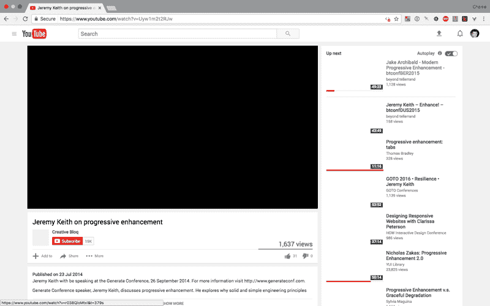
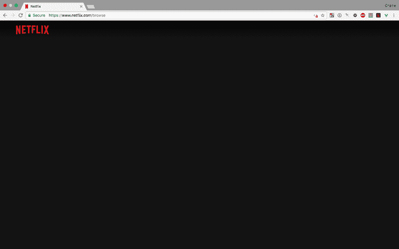
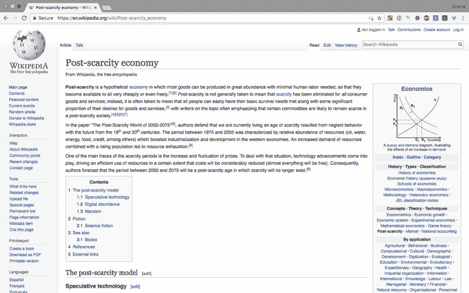

# 没有 JavaScript 的网络会是什么样子

> 原文：<https://www.freecodecamp.org/news/what-the-web-looks-like-without-javascript-c7eaf09c9983/>

一位柏林的 web 开发人员——以编写 JavaScript 为生——决定一整天不用 JavaScript。

让我们面对它——在一个平均网页为 2.4 兆字节的疯狂世界里——与 1993 年的游戏《毁灭战士》的大小相同——完全关闭 JavaScript 似乎是一件明智的事情。

以下是她在浏览器中禁用 JavaScript 一天后的主要观察结果:

*   没有 JavaScript，网络真的很快
*   没有任何广告。没有自动播放视频或“告诉我们你的电子邮件地址”弹出窗口。
*   但是…很多网站根本不能用。图像无法加载，表单无法提交。

以下是她访问的几个禁用了 JavaScript 的热门网站的样子:

**YouTube** 的视频和缩略图无法加载。

**网飞**不加载任何东西，除了左上角的标志。

**亚马逊**看起来有点奇怪，但还是管用的。

维基百科仍然很好用。

你可以在这里阅读她当天的全部想法，无需 JavaScript 实验:( [6 分钟阅读](https://fcc.im/2sEuawe)

### 以下是其他三个值得你花时间去做的链接:

1.  如何以开发人员的身份环游世界( [8 分钟阅读](https://fcc.im/2rWzCwH))
2.  走向无服务器:如何在云中运行你的第一个 AWS Lambda 函数
3.  连线之间:对 MooTools 核心贡献者的采访( [20 分钟阅读](https://fcc.im/2rWvGMd)

### 想到这一天:

> "任何可以用 JavaScript 编写的应用程序，最终都会用 JavaScript 编写."—阿特伍德定律

### 今日趣事:

堆栈溢出键盘

### 今日学习小组:

柏林自由代码营

编码快乐！

–昆西·拉森，自由代码营的老师

如果你从这些邮件中获得了价值，请考虑[支持我们的非营利组织](http://bit.ly/donate-to-fcc)。