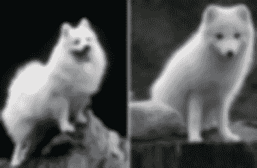
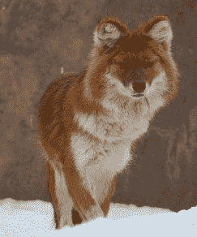
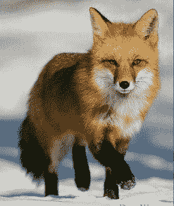
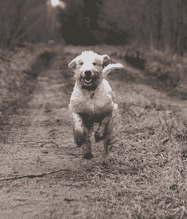
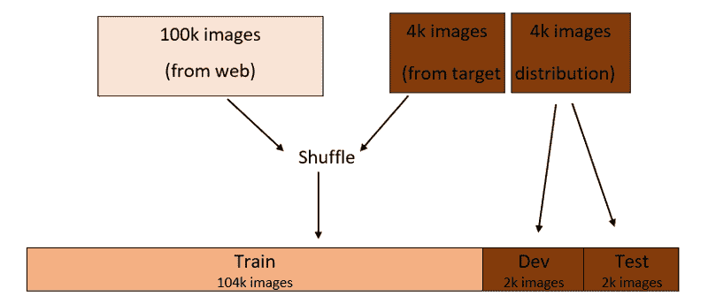
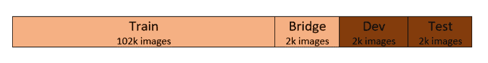
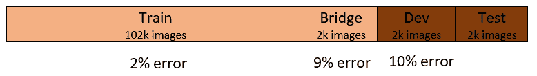
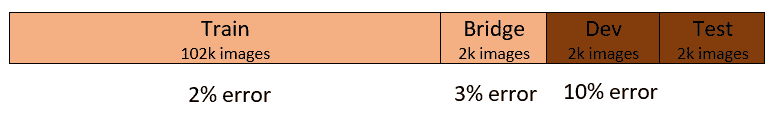
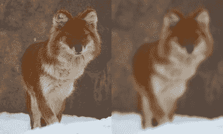

# 当您的训练和测试数据来自不同的发行版时该怎么办

> 原文：<https://www.freecodecamp.org/news/what-to-do-when-your-training-and-testing-data-come-from-different-distributions-d89674c6ecd8/>

奈扎·阿萨维尔

# 当您的训练和测试数据来自不同的发行版时该怎么办

credit: [https://www.chessbazaar.com/blog/game-chess-can-make-child-genius-smarter/](https://www.chessbazaar.com/blog/game-chess-can-make-child-genius-smarter/)

为了建立一个性能良好的机器学习(ML)模型，必须根据来自相同目标分布的数据来训练和测试该模型。

然而，有时只能从目标分布中收集有限数量的数据。构建所需的培训/开发/测试集可能还不够。

然而，来自其他数据分布的类似数据可能很容易获得。在这种情况下该怎么办？让我们讨论一些想法！

#### **一些背景知识**

为了更好地理解这里的讨论，如果您还不熟悉以下基本的 ML 概念，您可以仔细阅读:

*   **培训、开发(dev)和测试集:**注意，开发集也称为验证集或保持集。[这篇文章](https://towardsdatascience.com/train-validation-and-test-sets-72cb40cba9e7)很好地介绍了这个话题。
*   **偏差(欠拟合)和方差(过拟合)误差:** [这个](https://www.quora.com/What-is-the-best-way-to-explain-the-bias-variance-trade-off-in-layman’s-terms)是对这些误差的一个很好的简单解释。
*   **如何正确地进行培训/开发/测试分解:**你可以参考[这篇文章](https://medium.freecodecamp.org/how-to-strategically-accomplish-your-machine-learning-models-performance-goals-44dddc11697e)我以前写的关于这个主题的简短背景。

### 方案

假设您正在构建一个狗图像分类器应用程序，它可以确定图像是否是一只狗。

该应用程序面向农村地区的用户，他们可以通过移动设备拍摄动物的照片，以便应用程序为他们分类动物。

研究目标数据分布-您发现图像大多模糊、分辨率低，类似于以下内容:

*Left: Dog (Volpino Italiano breed), Right: Arctic fox.*

您只能收集 8，000 个这样的图像，这不足以构建培训/开发/测试集。让我们假设您已经确定至少需要 100，000 张图片。

您想知道除了您收集的 8，000 个图像之外，是否可以使用另一个数据集的图像来构建培训/开发/测试集。

你意识到你可以很容易地从网上搜集到 100，000 张或更多的图片，狗图片和非狗图片的频率与所需的频率相似。

但是，很明显，此 web 数据集来自不同的分布，具有高分辨率和清晰的图像，如下所示:

Images of dogs (left and right) and a fox (center).

您将如何构建培训/开发/测试集？

您不能只使用您收集的原始 8，000 张图像来构建训练/开发/测试集，因为它们不足以构成性能良好的分类器。通常，计算机视觉和其他自然感知问题一样——语音识别或自然语言处理——需要大量数据。

另外，不能只使用 web 数据集。分类器在用户的模糊图像上表现不佳，这些图像不同于用于训练模型的清晰、高清晰度的网络图像。

你是做什么的？让我们考虑一些可能性。

#### 一个可能的选择——混排数据

你可以做的是将两个数据集合并，然后随机洗牌。然后，将结果数据集分成培训/开发/测试集。

假设您决定对培训/开发/测试集进行 96:2:2%的划分，这个过程将是这样的:

有了这个设置，train/dev/test 集合都来自同一个分布，如上图中的颜色所示，这是所期望的。

然而，这里有一个很大的缺点！

如果您查看 dev 集，在 2，000 个映像中，平均只有 148 个映像来自目标发行版。

这意味着在很大程度上，你是在优化网络图像分布的分类器(2，000 张图像中的 1，852 张)——这是**而不是**你想要的！

当评估分类器相对于测试集的性能时，可以对测试集说同样的话。因此，这并不是一个将培训/开发/测试分开的好方法。

#### 更好的选择

另一种方法是让开发/测试集来自目标分布数据集，而训练集来自 web 数据集。

假设您仍然像以前一样对培训/开发/测试集使用 96:2:2%的分割。每个开发/测试集将有 2，000 个图像——来自目标发行版——其余的将进入训练集，如下所示:

使用这种分割，您将优化分类器以在目标分布上表现良好，这是您所关心的。这是因为 dev 集的图像只来自目标发行版。

然而，培训发行版现在不同于开发/测试发行版。这意味着，在大多数情况下，你是在网络图像上训练分类器。因此，优化模型需要更长的时间和更多的努力。

更重要的是，您将无法轻易地辨别 dev 集上的分类器误差相对于 train 集上的误差是方差误差、数据不匹配误差，还是两者的组合。

让我们更详细地考虑一下这个问题，看看我们能做些什么。

#### 差异与数据不匹配

考虑上面第二个选项中的培训/开发/测试部分。为简单起见，假设人为误差为零。

此外，让我们假设您发现训练误差为 2%，开发误差为 10%。这两者之间 8%的误差有多少是由于这两个数据集之间的数据不匹配造成的——假设它们来自不同的分布？又有多少是由于模型的方差(过拟合)？我们不知道。

让我们修改培训/开发/测试分割。取出火车组的一小部分，称之为“桥”组。桥接集将不用于训练分类器。相反，它是一个独立的集合。分割现在有属于两种数据分布的四个集合，如下所示:

#### 方差误差

通过这种划分，让我们假设您发现培训和开发错误分别为 2%和 10%。您发现电桥误差为 9%，如下所示:

现在，在训练集和开发集误差之间的 8%误差中，有多少是方差误差，有多少是数据不匹配误差？

轻松点。答案是 7%方差误差和 1%数据不匹配误差。但是为什么呢？

是因为桥集和列车集来自同一个分布，两者误差差 7%。这意味着分类器过度适合训练集。这告诉我们，我们手头有一个**高方差问题**。

#### 数据不匹配误差

现在，让我们假设您发现电桥的误差设置为 3%,其余如前所示:

训练集和开发集之间的 8%误差有多少是方差误差，有多少是数据不匹配误差？

答案是 1%方差误差和 7%数据不匹配误差。为什么这样

这一次，这是因为分类器在它以前没有见过的数据集上表现良好，如果它来自相同的分布，如桥集。如果它来自不同的发行版，比如 dev set，那么它的性能会很差。因此，我们有一个数据不匹配的问题。

减少方差误差是 ML 中的一项常见任务。例如，可以使用正则化方法，或者分配更大的训练集。

然而，减轻数据不匹配错误是一个更有趣的问题。那么，让我们来谈谈吧。

#### 缓解数据不匹配

为了减少数据不匹配的错误，您需要以某种方式将开发/测试数据集的特征——目标分布——合并到训练集中。

从目标分布中收集更多数据以添加到训练集中始终是最佳选择。但是，如果这是不可能的(正如我们在讨论开始时所假设的)，您可以尝试以下方法:

#### 误差分析

分析 dev 集上的错误以及它们与 train 集上的错误有何不同，可以为您提供解决数据不匹配问题的思路。

例如，如果您发现开发集上的许多错误发生在动物图像的背景是岩石时，您可以通过将具有岩石背景的动物图像添加到训练集来减轻此类错误。

#### 人工数据合成

将开发/测试集的特征并入训练集的另一种方法是合成具有相似特征的数据。

例如，我们之前提到过，我们的开发/测试集中的图像与来自 web 的清晰图像形成鲜明对比，而 web 上的清晰图像构成了我们的大部分训练集。您可以人为地向训练集的图像添加模糊度，使其更类似于开发/测试集，如下图所示:

Image from the train set before and after blurring.

但是，这里有很重要的一点需要注意！

你可能会使你的分类器过度适应你制造的人为特征。

在我们的例子中，你通过一些数学函数人为制造的模糊度可能只是存在于目标分布的图像中的模糊度的一个小的子集。

换句话说，目标分布的模糊可能是由许多原因造成的。例如，雾、低分辨率相机、对象移动都可能是原因。但是你合成的模糊可能并不代表所有这些原因。

更一般地说，在为任何类型的问题(如计算机视觉或语音识别)的训练集合成数据时，您可以使您的模型过度适应合成的数据集。

这个数据集对于人眼来说可能看起来足够代表目标分布。但实际上，它只是目标分布的一小部分。所以，在使用这个强大的工具——数据合成时，请记住这一点。

#### 概括起来

当开发一个 ML 模型时，理想情况下，trian/dev/test 数据集应该都来自相同的数据分布——当被用户群使用时，模型将遇到的数据分布。

然而，有时不可能从目标发行版收集足够的数据来构建 trian/dev/test 集，而来自其他发行版的类似数据却很容易获得。

在这种情况下，开发/测试集应该来自目标分布，而来自其他分布的数据可以用来构建(大部分)训练集。然后，可以使用数据不匹配技术来减轻训练集与开发/测试集之间的数据分布差异。