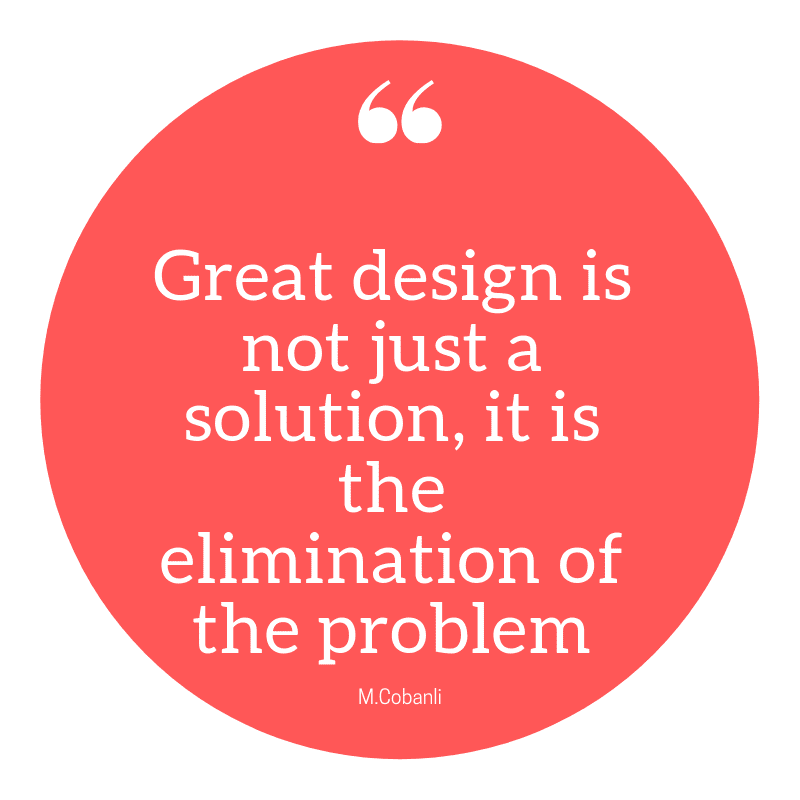

# 设计系统时要记住什么

> 原文：<https://www.freecodecamp.org/news/what-to-keep-in-mind-when-architecting-a-system-912ec5c6f79/>

作者:Ayelet Sachto

# 设计系统时要记住的 6 件事

架构可能听起来像是一个“可怕的”或压倒性的主题，但实际上，应用逻辑和方法处理问题极大地简化了过程。

当你设计一个系统、服务或特性时，你实际上是在一个**特定的环境**中为一个问题设计了一个**解决方案**。解决方案应该回答一个真正的需求，解决手头的问题**。**

在整篇文章中，我将使用**解决方案**来强调我们构建的**系统、服务和功能**是更大的**流程**的一部分。

设计解决方案时，考虑您影响的整个环境流程。

*   想想在数据到达您的代码之前会发生什么
*   是什么触发了你的特色或服务
*   谁送的？
*   是自动的吗？
*   是用户吗？

这也将帮助您思考您想要解决的测试和边缘情况，之后会发生什么，谁将使用它以及如何使用它。

#### 1.理解问题

从低估手头的问题开始，了解自己的边界。不要为未知的未来优化，关注当前的情况，最重要的是，不要做假设。不要被不存在的要求限制自己。

> 确保你有了解问题所需的所有信息，不要害怕做研究，谷歌是你的朋友；)

Photo by [rawpixel](https://unsplash.com/@rawpixel?utm_source=medium&utm_medium=referral) on [Unsplash](https://unsplash.com?utm_source=medium&utm_medium=referral)

#### 2.了解你的界限并设定优先顺序

解决方案架构总是在各种问题之间进行权衡，例如弹性、安全性、数据完整性、吞吐量、可伸缩性、性能，当然还有成本。

> 思考价值与摩擦

理解你的约束。你的**必备**有哪些？如果您有一个产品团队，请与他们合作，以了解业务需求、影响和 SLA。这将帮助你更好地理解你的考虑和限制。

使用**数据**制定**优先级**，尽可能避免假设，以数据为导向。

*   有多少用户？
*   请求数量？
*   请求的大小？

测试您的服务，以估计所需的资源。

> 确保你提出了你想要支持的最高比率，而不仅仅是平均比率(看百分比和平均比率)。

考虑**如何解决**的问题，而不仅仅是**如何**解决问题。首先考虑解决方案，然后才考虑实现。当你把自己从对解决方案**应该是什么样子**的期望中解放出来时，你就会明白解决方案可以有多种形式。它可以是一个系统、服务、特性、过程甚至文档。

#### 3.问为什么？

挑战他人甚至挑战自己有时会令人沮丧。但是问**为什么**可以帮助你解决真正的问题，了解强制要求和你的边界，可以帮助你避免错误，从业务方面了解动机。

*   为什么是真正的痛苦？
*   为什么要这样做？
*   为什么今天会这样？

> 挑战自己，提出问题。这将有助于做出更好的决策和更好的解决方案。

Photo by [Emily Morter](https://unsplash.com/@emilymorter?utm_source=medium&utm_medium=referral) on [Unsplash](https://unsplash.com?utm_source=medium&utm_medium=referral)

#### 4.你的解决方案不是在真空中

背景很重要。一个需要提供 MVP 并受到资金限制的 4 人创业公司，解决问题的方式将会也应该不同于一个大组织中的团队，他们需要创造一个可持续的产品，需要由几个团队来维护。

回到我的第一个陈述，在你理解了问题之后，想想背景。

*   你手头有哪些工具？
*   你是一个大组织的一部分吗？
*   有时间或金钱等限制吗？
*   谁来维护解决方案？

想想什么是适合**你**的情况，定义*生产就绪*对**你**意味着什么，是否要高可用(哈)。想想 [ROI](https://en.wikipedia.org/wiki/Return_on_investment) 。您应该解决边缘情况吗？

*   你将如何设计一个从数据库返回值的解决方案？
*   如果我告诉你，直到年底，它每周只使用一次。这会改变你的答案吗？会影响设计吗？
*   如果你有一天的时间来构建一个解决方案，它会和你有一个月的时间一样吗？

**思考成长**。对于不同的解决方案和不同的公司，增长意味着不同的东西。可以从**规模**的角度，比如支持额外用户的增长。也可以从**功能**的角度来看，你的解决方案应该**灵活**以使其他开发人员能够轻松添加/修改功能。

#### 5.费用

作为工程师和开发人员，我们有时不会停下来考虑我们的解决方案和服务的成本。根据我的经验，这主要是由于缺乏意识，而不是意愿。

当我们在大学的时候，我们被“灌输”着对性能和复杂性的关注，并且被教导要考虑解决方案的效率。但是在设计将要使用的产品时，我们还需要考虑成本方面的效率。你可以建立一个令人惊讶的稳定可靠的服务，提供价值，但如果它的投资回报率不高，或者如果你的公司将无法承担成本，它将被削减有利于其他替代品。

> 记住，性能和基础设施不是免费的。

#### 6.生产部署只是开始

一个有时被忽视的重要概念是**维护**。我们的系统或服务是否稳定且易于维护、调试、故障排除和修复？

生产部署只是我们解决方案的开始。确保它易于维护，确保它已准备好投入生产，并能为真实的流量和用户提供服务。在开发您的解决方案时，考虑端到端监控，侧重于应用程序监控和利用率，并确保添加日志记录和文档。

> 当设计您的解决方案时，考虑一个简单且易于维护的设计，当然是在需求允许的情况下。

作为开发人员，我们有时会被新的“浮华”和新潮的技术所吸引。停下来想一想这个技术是否足够成熟。它能在生产中得到维护吗？不同的堆栈是否会更高效或风险更低？

#### 包扎

总的来说，如果你想设计出有史以来最好的解决方案，从理解问题和你的局限性开始，并且了解你试图设计的解决方案的背景。

然后想想你的解决方案上线后会发生什么。

除非你有无限的资金(这是从来没有的情况)，考虑你的解决方案的成本，并确保它的可维护性。

如果你喜欢你所读的，一定要？它下面！

如果你喜欢更多的建筑帖子和/或希望我深入讨论以上每一点，请在评论中告诉我，❤。