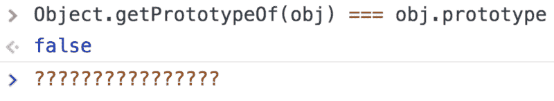
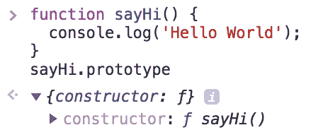
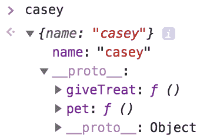
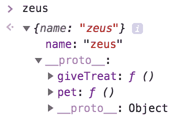

# 当我们谈论原型时，我们真正的意思是什么

> 原文：<https://www.freecodecamp.org/news/what-we-really-mean-when-we-talk-about-prototypes-165586f29fa9/>

海登·贝茨

# 当我们谈论原型时，我们真正的意思是什么


Photo by [rawpixel](https://unsplash.com/photos/ij3DVxU7qbc?utm_source=unsplash&utm_medium=referral&utm_content=creditCopyText) on [Unsplash](https://unsplash.com/search/photos/prototype?utm_source=unsplash&utm_medium=referral&utm_content=creditCopyText)

开始的 JavaScript 开发人员经常错误地使用一个词——“原型”——来指代两个不同的概念。但是“对象的原型”和 JavaScript 函数的“原型属性”之间到底有什么区别呢？



But why…?

我认为我理解 JavaScript 中“原型”和原型继承的概念。但是我继续发现自己被代码和文档中的“原型”所迷惑。

当我意识到**在撰写关于 JavaScript 的文章时，人们经常不经意地用“原型”来描述两个*不同但相关的*概念** **时，我的许多困惑消失了。**

1.  **一个对象的原型**:另一个 JavaScript 对象从其继承方法和属性的模板对象。( [MDN](https://developer.mozilla.org/en-US/docs/Learn/JavaScript/Objects/Object_prototypes)
2.  **JavaScript 函数上的[不可枚举的](https://stackoverflow.com/questions/17893718/what-does-enumerable-mean) `prototype`属性** : *一种方便的设计模式*(该设计模式稍后将深入讲解！)*。*
    本身没有意义，直到被刻意设置成具有某种继承相关的功能。当与构造函数和工厂函数一起使用时最有用(解释来了！).尽管默认情况下所有 JS 函数都有这个属性。包含一个`constructor`属性，该属性引用原始函数。



Even trivial functions have a prototype property by default.

在很长一段时间里，我对定义 1 感到满意，但对定义 2 却不满意。

### 为什么这种区别很重要？

在我理解“一个对象的原型”和“函数的不可枚举的`prototype`属性”之间的区别之前，我发现自己被下面这样的表达弄糊涂了:

```
Array.prototype.slice.call([1, 2], 0, 1);// [ 1 ]
```

*(侧栏:理解上述内容的第一步(但不是唯一的一步)是理解`call()`。这里有一个快速[复习](https://developer.mozilla.org/en-US/docs/Web/JavaScript/Reference/Global_Objects/Function/call)以防万一！)*

一个我以前无法回答的问题:

*   “为什么我们要在`Array`构造函数的原型中寻找`slice`？难道`Array`构造函数本身不应该包含`slice`方法，它的原型只是包含一些所有对象共享的真正底层的方法吗？”

当我开始理解设计模式时，这些问题就完全清楚了，`Array`构造函数上的`prototype`属性的存在就是为了支持这种设计模式。

### 理解 JS 函数的原型属性的 3 个步骤

为了理解 JS 函数的`prototype`属性，您需要理解它支持的设计模式。我将首先通过两个不太好的选择来建立对这种模式的理解。

#### 实现 1:功能类模式

想象一下，我们想要创建一个与狗互动的游戏。我们想快速创造出许多可以使用普通方法的狗，比如**宠物**和**给予款待。**

我们可以使用[功能类模式](https://www.thegreatcodeadventure.com/javascripts-functional-class-pattern/)开始实现我们的游戏，如下所示:

让我们通过将这些方法存储在它们自己的对象中来稍微清理一下。然后在`createDog`工厂函数中扩展它们。

尽管这个实现很容易推理，并且方便地反映了其他语言中基于类的继承，但它至少有一个主要问题:我们使用工厂函数`createDog`将我们的方法定义复制到我们创建的每个 dog 对象。

这占用了过多的内存，并且没有[干](https://en.wikipedia.org/wiki/Don%27t_repeat_yourself)。如果我们可以在一个地方定义我们的方法，而不是将方法定义复制到`zeus`和`casey`中，这不是很好吗？然后有`zeus`和`casey`指向那个地方？

#### 重构 1:实现“原型类”设计模式

原型继承给了我们上面所要求的。它将允许我们在一个原型对象中定义我们的方法。然后让`zeus`、`casey`，还有无限多像他们这样的物体指向那个原型。`zeus`和`casey`将通过引用访问该原型的所有方法和属性。

> *注意:对于不太熟悉的人来说，有许多[优秀的](https://hackernoon.com/prototypes-in-javascript-5bba2990e04b) [教程](https://medium.freecodecamp.org/prototype-in-js-busted-5547ec68872)比我在这里做的更深入地解释了原型继承的概念！*

> *关于我下面的例子:为了教学的清晰，我使用[工厂函数](https://stackoverflow.com/questions/8698726/constructor-function-vs-factory-functions)命名为* `createDog` *，而不是 ES5 [构造函数](https://stackoverflow.com/questions/8698726/constructor-function-vs-factory-functions)，来实现继承的[原型模型](https://medium.com/javascript-scene/3-different-kinds-of-prototypal-inheritance-es6-edition-32d777fa16c9)。我选择使用工厂函数，因为它们没有 ES5 构造函数那么“神奇”和“语法甜”。希望这能让你更容易专注于手头的事情！*

太好了！现在，对应于`zeus`和`casey`的对象本身不包含方法`giveTreat`和`pet`的副本。相反，对象在它们的原型`methodsForShowingAffection`中查找那些方法。



但是如果将`methodsForShowingAffection`封装在`createDog`工厂函数中不是很好吗？这样做可以清楚地表明，这些方法只适用于该函数。所以一个简单的重构留给我们的是:

#### 重构 2:原型继承+工厂函数的原型属性

太好了！但是`methodsForShowingAffection`不是一个又长又奇怪的名字吗？为什么不使用更通用和可预测的东西呢？事实证明，Javascript 的设计者为我们提供了我们正在寻找的东西。每个函数都有一个内置的`prototype`属性，包括我们的工厂函数`createDog`。

注意，这个`prototype`属性没有什么特别的。如上所示，我们可以通过将`createDog`的原型设置为一个名为`methodsForShowingAffection`的独立对象来获得完全相同的结果。Javascript 中函数的`prototype`属性的常态表明了它的预期用例:一种旨在促进通用设计模式的便利。不多不少。

**延伸阅读:**

关于 JavaScript 中函数的`prototype`属性的更多信息，请参见由 [Sebastian Porto](https://www.freecodecamp.org/news/what-we-really-mean-when-we-talk-about-prototypes-165586f29fa9/undefined) 撰写的[这篇](http://sporto.github.io/blog/2013/02/22/a-plain-english-guide-to-javascript-prototypes/)博客中的“函数原型”部分。

关于原型的 MDN [文章](https://developer.mozilla.org/en-US/docs/Learn/JavaScript/Objects/Object_prototypes)。