# 你在 4 年的计算机科学学位中学到了什么

> 原文：<https://www.freecodecamp.org/news/what-you-learn-in-a-4-year-computer-science-degree-35a95457cb06/>

科林·史密斯

# 你在 4 年的计算机科学学位中学到了什么

The college classroom. By Pixabay on Pexels.com

我最近写了一篇关于是否需要计算机科学学位才能在科技领域找到工作的文章。我想看一下我的成绩单会有用。讨论我所研究的将有望帮助人们。我希望每个人在选择自己的科技职业道路时，都能做出最明智的决定。

**免责声明**:这是根据我对这些课程的回忆，从一个移动开发者的角度写的。这些课程的很多主题都可以被专门化并成为职业。所以他们对世界上的某个人来说都很重要。我是从一个选择了移动开发者职业道路的人的角度来写这篇文章的。

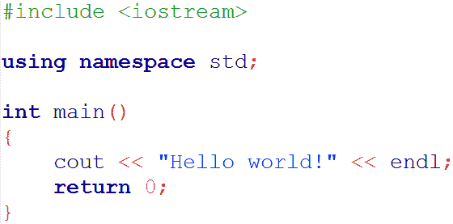

The first code most people end up writing. Image by [Kleiner](https://commons.wikimedia.org/wiki/User:Kleiner "User:Kleiner").

### 方案拟订一、二

这是我学到的所有东西的核心，也是我继续编程的动力。这些是你学习编程的课程。在我参加这些课程之前，我几乎没有编程经验。我曾试图获得领先，但没有得到比循环更远。

这个类从创建一个空文件并在 IDE 中编译它开始(我使用了 Code::Blocks)。我们一路努力，创造了我们自己的基于文本的战斗游戏。回头看看自己写的代码，让我很尴尬。从那时起，我走过了漫长的道路。如果你想笑的话，这里有一个回购协议(我只用了一个 main.cpp 文件，有 1063 行代码)。

那么我在这里学到了什么？我想说一切。这些课程非常有价值，让我获得了至少 70%的专业程序员所需的知识。我学习了 if 语句、循环、布尔逻辑、类创建、结构创建、创建接口、多态、继承等等。也有一些像数组和向量这样的基本数据结构的使用。

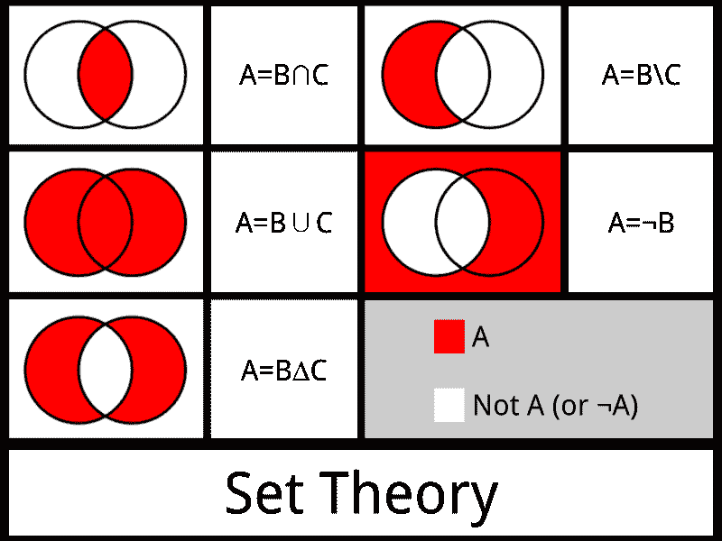

One of the many topics covered in discrete structures. Image by [Benji3.141](https://commons.wikimedia.org/w/index.php?title=User:Benji3.141&action=edit&redlink=1 "User:Benji3.141 (page does not exist)") under [Creative Commons](https://en.wikipedia.org/wiki/en:Creative_Commons "w:en:Creative Commons") [Attribution-Share Alike 3.0 Unported](https://creativecommons.org/licenses/by-sa/3.0/deed.en) license.

### 计算机科学中的离散结构

这个类被添加到抄本中是为了让人们习惯布尔逻辑。这是我们在课程的前两周写下的。不幸的是，对于我们这些不知情的学生来说，它已经掉进了兔子洞。以下是它涉及的一些主题:“逻辑、集合和集合运算、证明方法、递归定义、组合学和图论”。

这些都是需要知道的有用的东西。但问题是，学生们被鼓励尽早上这门课。通常与方案一和方案二同时进行。这些是一些高级的话题。我现在很难使用数学方法来证明。我记得当时我真的很挣扎。此外，我不得不谷歌什么是组合学，所以我显然不太使用它们。

事实上，在我学习这门课程的时候，他们在这门课程中教授的很多东西似乎并不适用于计算机科学职业。我现在知道，逻辑、集合和集合运算、递归定义和图论都是有用的。但这仅仅是作为一名程序员几年后的后知之明。

我在目前的职业生涯中每天应用的是逻辑，也许还有集合运算。递归定义和图论只对面试有帮助。但是不要完全相信这一点，因为我是一名移动开发者。后端开发人员可能会发现图论非常有用。

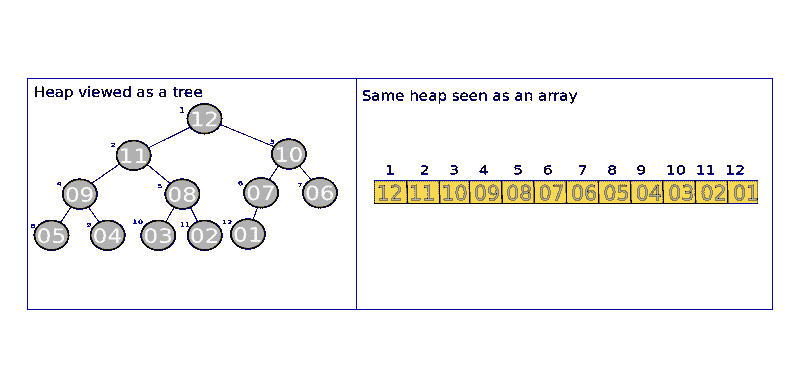

Same thing implemented with two different data structures. Image by [Filosoficos](https://commons.wikimedia.org/w/index.php?title=User:Filosoficos&action=edit&redlink=1 "User:Filosoficos (page does not exist)").

### 数据结构

这堂课很好。非常好。数据结构在计算机编程中被广泛使用，并且是人们编写的大多数代码的主干。它们允许我们以一种对我们编写的程序有用的方式存储数据。查看数据并了解存储数据的最佳方式以提高时间和空间性能的能力是一项非常有用的技能。

我学习了数组、栈、链表、双向链表、树、图、堆以及所有这些数据结构的不同风格(比如自平衡树)。这门课不仅帮助我理解数据结构，还帮助我更好地组织我存储的数据。

这个课程是用 C 语言完成的，这使得它更加有趣。c 可能非常挑剔，但如果使用正确的话，也会非常强大。我必须非常小心地分配和清理内存，这对于讲授内存管理非常有用。

这堂课有如此多有用的东西，很难涵盖所有的内容。我甚至没有提到这是科技面试的一个关键知识组成部分。如果你对数据结构不太熟悉，那么开始温习一些基础知识，因为它们非常重要。

Good ol’ breadth-first search. I can’t count the number of times the algorithm saved me in interviews. Image by [Mre](https://commons.wikimedia.org/w/index.php?title=User:Mre&action=edit&redlink=1 "User:Mre (page does not exist)") under the [Creative Commons](https://en.wikipedia.org/wiki/en:Creative_Commons "w:en:Creative Commons") Attribution-Share Alike [3.0 Unported](https://creativecommons.org/licenses/by-sa/3.0/deed.en) license.

### 算法分析

这个类有些用处。算法是有用的。它们驱动着世界上最好的软件，并使它们强大到足以在现代世界中保持相关性。但是这门课有一些问题。

最有用的部分是学习大 O 符号。大 O 符号允许你评估代码并理解它在时间和空间上的表现。一般来说，如果您在一家公司测量代码性能，您将使用一个计时器来跟踪交互之间的时间。这可以让你看到你的软件运行的有多好。这需要您编写代码，然后评估结果。

大 O 符号允许你通过查看代码来评估代码的性能。我不想过多地谈论这个，但是如果你不知道大 O 符号，[阅读这篇博文](https://rob-bell.net/2009/06/a-beginners-guide-to-big-o-notation/)。

我们讨论过的实际算法没那么有用。我只记得背包问题和旅行推销员问题。我还必须在小组中为这些写代码，这不是很好，因为我的小组中有一个人超出了他的工作范围。这意味着我每次为最终实现编写的代码都比我希望的要少。

基本了解有哪些著名的算法存在，它们的目的以及它们是如何实现的会很有用(主要是为了面试)。大 O 符号是这里的关键。这在工作中非常有用，在面试中也非常有用。

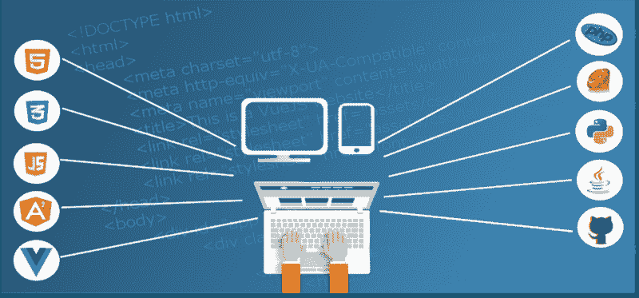

The web developer’s stack. Image by [lakexyde](https://pixabay.com/en/users/lakexyde-2489063/) on Pixabay.

### Web 开发

这个班级拥有大多数直接适用于技术工作的技能。我学习了 HTML、CSS、JQuery、JavaScript、PHP 和 JSON。我了解了一个请求如何从网站前端发送到后端，如何在后端处理，然后将响应发送回前端。我学习了如何创建 UI 以及如何与数据层交互，然后数据层再与网络交互。

下课的时候，我已经建好了自己的网站，主动学习 Angular。我用棱角让我的网站看起来浮华，这最终让我得到了我的第一份实习。我也很好地理解了网站是如何运作的。

光是这些知识就已经很不错了，但我也学会了如何学习一门不熟悉的语言、框架或数据格式，并在运行中使用它们。我在这些话题上做了大量的谷歌搜索来寻找具体的例子。我学会了如何使用文档和在线调查来更好地理解我需要在短时间内直接应用的概念。这是成为熟练程序员的关键技能。

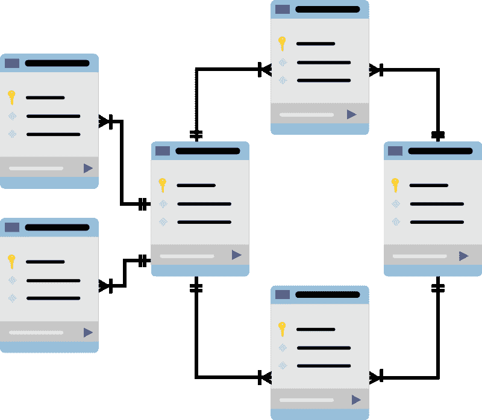

Database schemas. Image by [mcmurryjulie](https://pixabay.com/en/users/mcmurryjulie-2375405/) on Pixabay.

### 数据库简介

我在这门课上基本上只学了 SQL。我确信我们复习了一些其他概念，如分片和集群，但我不记得了。我有时会在当前工作中使用 SQL 来查询我记录的事件。SQL 要么将成为你工作中不可或缺的一部分，要么你将很少使用它。需要的话就去学，成为专家。如果没有，那就不要太担心。

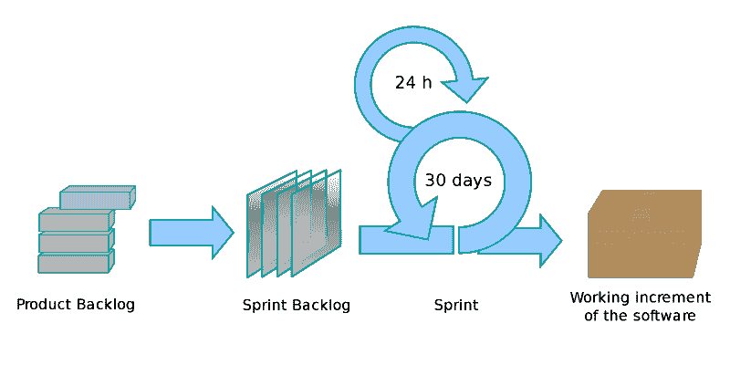

Scrum in a nutshell. Image by [Lakeworks](https://commons.wikimedia.org/w/index.php?title=User:Lakeworks&action=edit&redlink=1 "User:Lakeworks (page does not exist)") under the [Creative Commons](https://en.wikipedia.org/wiki/en:Creative_Commons "w:en:Creative Commons") Attribution-Share Alike [4.0 Internationa](https://creativecommons.org/licenses/by-sa/4.0/)l license.

### 软件工程 I，II

还有一门课我记不清了。我相信我们在这堂课上已经复习了很多宽泛的概念。我们讨论了 Scrum 和瀑布项目管理方法。我们检查了所有不同类型的测试。我们讨论了一些可用性和可访问性的概念。它实际上只是一个不适合它们自己的类的概念的总称。

由于这门课东拼西凑的性质，我没有很好地理解任何概念。对所涵盖的概念有一个基本的概述是很好的，但我希望更多的时间花在重要的个别主题上，如测试。

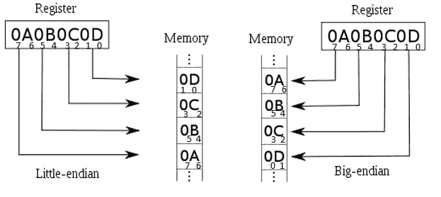

Different computer architecture types. Image by [Virtual_Loïc](https://en.wikipedia.org/wiki/User:Virtual_Lo%C3%AFc "User:Virtual Loïc").

### 计算机体系结构和汇编语言

我清楚地记得这堂课。这门课探讨计算机是如何工作的。机器指令是如何被计算机发送和处理的。我们还用 MASM 写了一些代码，这是一种汇编语言，与机器代码的交互非常紧密。

我在上这门课之前使用的大多数编程语言都是高级语言。高级语言往往比机器代码更接近人类语言。MASM 非常接近于机器代码，我认为它更接近于机器语言而不是人类语言。

本课程最重要的部分是了解代码编译后会发生什么。了解计算机中不同的逻辑单元以及它们如何处理你的代码是非常有趣的。

实际上，我不认为这门课对我的科技职业生涯有什么贡献。到目前为止，在我的职业生涯中，我并没有使用多少从这门课上学到的知识。

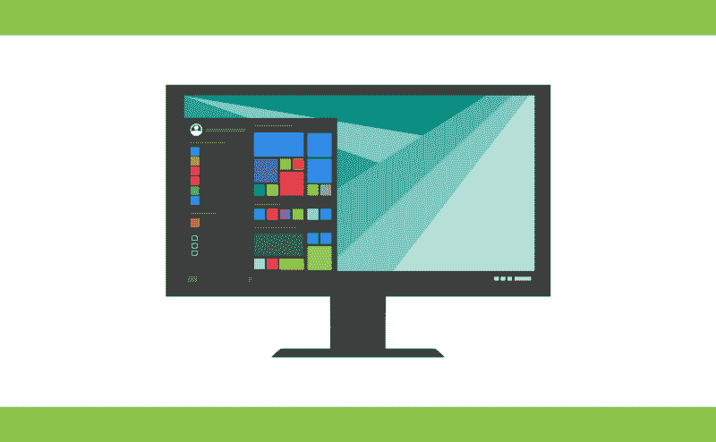

Operating systems allow us to get our s**t done. Image by [200degrees](https://pixabay.com/en/users/200degrees-2051452/) on Pixabay.

### 操作系统

老实说，我真的很难记住我在这门课上学到的东西。我唯一能记得的是用 C 语言编写了一个使用套接字编程进行通信的消息程序。我还学习了使用脚本打开文件和操作文件夹。

我想坦率地说出我从学位中学到的东西，事实是，我对这门课记不太清了。我只是没有在我目前的职业生涯中使用从中获得的许多知识。

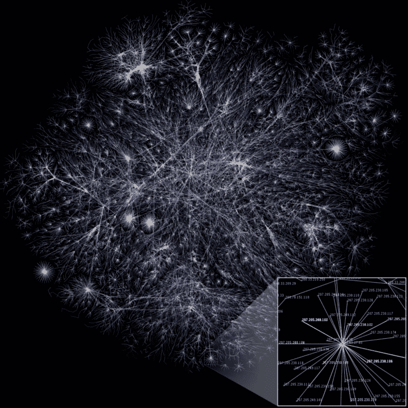

Computer networks are really **amazing**. Image by [The Opte Project](https://commons.wikimedia.org/w/index.php?title=Barrett_Lyon&action=edit&redlink=1 "Barrett Lyon (page does not exist)") available under the [Creative Commons](https://en.wikipedia.org/wiki/en:Creative_Commons "w:en:Creative Commons") [Attribution 2.5 Generic](https://creativecommons.org/licenses/by/2.5/deed.en) license.

### 计算机网络导论

这门课非常有用。它讲述了计算机网络是如何运作的。这包括浏览网络协议，如 HTTP、HTTPS、TCP、IP、FTP、IMAP、POP3、SSH 和 DNS。我了解了这些协议的用途，它们是如何实现的，并理解了为什么要创建它们。

我上面提到的网络协议用于现代软件的关键功能。这包括电子邮件处理(POP3 & IMAP)、在客户端和服务器之间发送网络请求(HTTP，HTTPS)以及通过网络安全地处理设备(SSH)。这真的让你了解互联网是如何工作的，以及世界各地的设备是如何相互作用的。

这不仅令人着迷，而且非常有用。当我从网络上得到错误的时候，我已经用我从这门课中学到的东西来调试我遇到的问题。我能够指出我遇到的问题，并帮助我工作的后端开发人员找到他们那端的 bug。

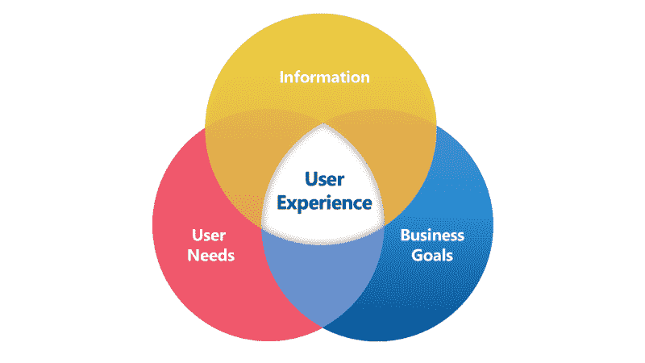

User experience is a fine balance between many parties. Image by [Borys Kozielski](https://commons.wikimedia.org/wiki/User:Borys_Kozielski "User:Borys Kozielski") under the [Creative Commons](https://en.wikipedia.org/wiki/en:Creative_Commons "w:en:Creative Commons") [Attribution 4.0 International](https://creativecommons.org/licenses/by/4.0/deed.en) license.

### 可用性工程介绍

本课程讲述了如何制作直观的应用程序，以及如何使应用程序或网站易于访问。可访问性是指使一个软件对任何人都可用，包括残疾人。这包括文本到语音的使用，以及设计不完全依赖音频元素的软件。

如果您以前从未听说过可访问性，那么所涉及的主题会很有用。它至少让你在设计软件的时候考虑了这些事情。这也让我真正开始思考用户体验，以及它对优秀软件的重要性。如果没有人使用你的应用程序的关键功能，因为它令人困惑，那么你的软件最终会失去所有的用户。

虽然这些知识很有趣，但是如何创建一个可用且可访问的软件的具体实现取决于平台。例如，[苹果有自己的一套用户界面指南](https://developer.apple.com/design/human-interface-guidelines/)，它描述了一般的设计原则和具体的细节，告诉你应该如何设计可以在任何苹果平台上运行的软件。

由于每个平台都需要特定的信息，我不确定这个类是否非常有用。这是一个很好的介绍，但我最终不得不学习苹果的界面指南，该指南涵盖了本课程中的所有主题。

So many apps. There are so many opportunities for mobile developers. Photo by [Rahul Chakraborty](https://unsplash.com/photos/xsGxhtAsfSA?utm_source=unsplash&utm_medium=referral&utm_content=creditCopyText) on [Unsplash](https://unsplash.com/search/photos/mobile?utm_source=unsplash&utm_medium=referral&utm_content=creditCopyText).

### 移动和云软件开发

我会尽量简短。上这门课的时候我已经是移动工程师了。为了尽快完成学位，我在几个小时内开发了一个蹩脚的手机应用程序。在这一点上，我已经实现了我的目标，得到一份软件工程师的工作，但只需要完成我的计算机科学学位，因为我几乎完成了。在这一点上，我的心没有投入到学习中。

尽管如此，我还是不认为这个班办得好。它是被懒散地设计的。他们鼓励人们为这个班级编写 Windows phone 应用程序的代码，这些工作的需求比其他人低得多。我觉得这只是因为环境更容易建立，代码可以用 JavaScript 编写，类似于网络开发。

此外，对我来说，很明显，负责授课的人并不了解所有的移动应用平台。我们被要求写一个小的后端部分，但我真的不想。我最终伪造了一个 web 请求，改为从磁盘读取，并在几秒钟后返回一个固定的响应。这很有效，因为我只需要提交一个演示和源代码。我感觉评分的人只看了样片。

总的来说，这门课教授过时和未使用的技术，没有得到适当的评估，也没有提供多少指导。这不是一堂很好的课。

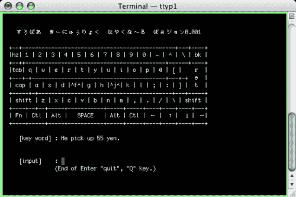

Such a beautiful and modern interface. Who wouldn’t be thrilled to learn this Python GUI after working as a mobile developer? /s. Image by [jim212jim](https://www.flickr.com/photos/syobosyobo/ "Go to jim212jim's photostream") under [Creative Commons Attribution 2.0 Generic License](https://creativecommons.org/licenses/by/2.0/).

### 顶点软件项目

说到过时的技术，这个项目要求我们使用 curses 构建一个访问数据库的 GUI。如果你感兴趣，这里有完整的项目。我们不能选择我们的顶点工程是什么，它是分配给我们的。每个人都必须做同样的项目。它也是在 3 人小组中完成的，所以你实际上只覆盖了项目的一小部分。这真是一个管理不善的班级。

与老师的互动几乎不存在。我对这个项目毫无兴趣，我们所学的东西似乎毫无用处。要对一个话题产生兴趣，你需要让人们在选择学习内容时有一定的自由意志。在你的顶点项目中没有选择是愚蠢的。这个项目对大多数职业道路都没用，把它强加于人是没有意义的。

课堂上应该让每个学生提交一份建议书，粗略估计他们完成项目每个子部分的时间表。这完成了两件事:让人们开始练习评估工作，并允许人们从事他们感兴趣的工作。这样的话，课堂会好 100 倍。

Another algorithm GIF, because they’re nifty. Depth-first search to balance the breadth-first search. Image by [Mre](https://commons.wikimedia.org/w/index.php?title=User:Mre&action=edit&redlink=1 "User:Mre (page does not exist)") under [Creative Commons](https://en.wikipedia.org/wiki/en:Creative_Commons "w:en:Creative Commons") Attribution-Share Alike [3.0 Unported](https://creativecommons.org/licenses/by-sa/3.0/deed.en) License.

### 最后的想法

我可能没有上过很好的一部分课程，仍然是我今天的软件工程师。但是我认为错过这些课程可能会在你作为开发者的知识上留下巨大的空白。我认为每个软件工程师都应该了解的主题是**数据结构和算法。**

其他的课程取决于你选择的职业道路。如果你决定从事嵌入式开发，你应该学习计算机体系结构。如果你决定成为一名前端工程师，你应该学习计算机网络。

这里关键的一点是，一个好的工程师需要不断学习。如果你错过了一些你知道在工作中有用和适用的知识，那么去参加一个课程来获得这些知识。这就是你如何更好地写出好代码的方法。永远学习。

### 喜欢你读的书吗？查看我的其他文章

从一无所有开始科技生涯。

选择最适合自己的技术职业——开发运营、移动工程师、数据科学家、项目经理和前端。

第一次科技面试的小贴士。

你应该获得计算机科学学位吗？

[Swift 与 Objective-C](https://medium.freecodecamp.org/https-medium-com-colin-gabriel-smith-swift-vs-objective-c-5b19add8e2ed)