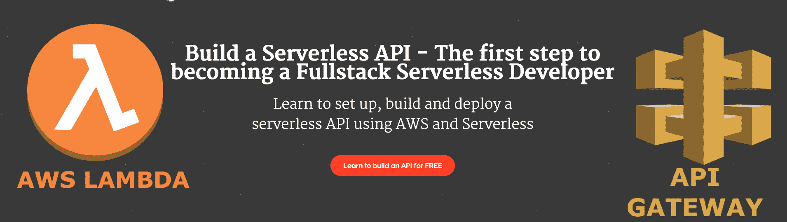

# 成为全栈无服务器开发人员需要知道什么

> 原文：<https://www.freecodecamp.org/news/what-you-need-to-become-a-full-stack-serverless-developer/>

## 要称自己为全栈开发人员，您需要了解以下 4 个开发领域

成为全栈开发者是很多开发者的目标。能够创建一个完整的软件产品，了解整个系统是如何工作的，以及非常好的工资增长(超过 5500 * *)都是人们想要提升技能并成为全栈开发人员的原因。

问题是，学习所有你需要的技能可能会花很多时间。我们将涵盖您需要了解的 4 个发展领域，并讨论学习它们的最佳方式。

# 前端/网站托管

无论何时构建任何类型的应用程序，都需要有一个前端。这是你的用户将会看到的，以及他们如何与你的产品互动。

这通常是开发人员获得的第一项无服务器技能，但他们往往没有意识到这一点。这通常是通过 GitHub 页面或托管服务实现的。

虽然这些服务对于快速简单的项目托管来说很棒，但是对于更大更专业的无服务器虚拟主机来说，你需要更强大的服务。

### 你需要能够做什么

*   能够托管前端应用程序所需的文件。
*   为了能够大规模地在给定的 URL 上提供这些文件
*   指向这些文件的注册域名

### 如何使用无服务器实现这一点？

*   将文件托管在亚马逊 S3(文件存储系统)上
*   创建一个 CloudFront 发行版来提供大规模的文件服务
*   使用 Route 53 注册一个域名，并将其指向 Cloudfront 发行版

### 为什么无服务器是实现这一目标的最佳方式

S3、CloudFront 和 53 号公路都是可伸缩的，所以你不必计算(猜测)你的网站会有多少访问者

*   您不需要设置或维护服务器
*   你不需要设置域名系统、域名服务器或其他任何东西来让网站出现在你的 URL 上。53 号公路处理所有这些。

# 创建一个 API

每个应用程序都需要 API，以便前端可以与后端(数据库、存储、电子邮件等)进行交互。)这也是全栈应用的大部分功能的来源。

### 你需要能够做什么

*   为了能够创建 restful API 端点
*   为了能够访问你的数据库
*   能够访问其他服务(存储、短信、电子邮件、其他 API)
*   使用 API 密钥保护您的端点

### 如何做到这一点？

*   使用 API 网关构建 API 端点
*   创建 Lambda 函数来执行您的逻辑并访问其他服务(数据库访问、SMS、电子邮件等)。)
*   创建提供对 API 端点的访问的 API 键

### 为什么无服务器是实现这一目标的最佳方式

*   每个端点都是一个独立的函数，所以如果一个端点崩溃了，其他的不会崩溃
*   通过 aws-sdk，您可以非常容易地访问其余的无服务器服务，从而减少代码并加速开发
*   您可以轻松地创建、限制和删除 API 键，以确保正确的人能够调用您的 API 端点。

# 数据库

所有全栈服务都需要一种方法来存储关于用户、产品和其他一切的数据。这可能在关系或非关系数据库中，但是您需要将数据存储在有组织的地方。

### 你需要能够做什么

*   创建可伸缩的非关系或关系数据库
*   访问这个数据库

### 如何做到这一点？

*   创建一个 DynamoDB(非关系)或 Aurora(关系)数据库
*   使用 AWS SDK 中的内置工具访问 API Lambdas 中的表

### 为什么无服务器是实现这一目标的最佳方式

*   您的表会自动扩展并具有内置冗余，无需管理和同步多个数据库副本
*   您可以轻松地使用 AWS SDK 访问数据库，而不必向外界公开它。

# 部署和维护

一旦您设计并构建了所有的系统，您就需要将它们部署到生产环境中，并对它们进行维护和升级。

### 你需要能够做什么

*   部署我们到目前为止讨论过的所有资源
*   为所有资源提供受版本控制的配置
*   维护和更新运行系统的软件和硬件

### 如何做到这一点？

*   使用无服务器框架创建资源

### 为什么无服务器是实现这一目标的最佳方式

*   当您创建 serverless.yml 文件时，您定义了运行应用程序所需的所有资源
*   这个 serverless.yml 文件可以进行版本控制，以跟踪随时间的变化
*   只需一个命令，您就可以在几分钟内部署整个架构
*   所有底层软件和硬件都由您的服务提供商(AWS)维护、更新和升级，因此您无需担心

* * *

如果你喜欢这篇文章，并想开始学习如何成为一名全栈开发人员，我有一个关于如何构建和部署自己的无服务器 API 的免费视频课程。

**伦敦前端开发商(42，994)对伦敦全栈开发商(48，767)