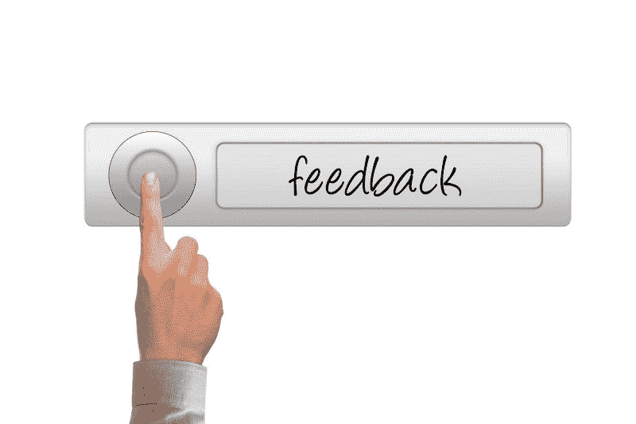

# 2019 年你需要了解你的用户

> 原文：<https://www.freecodecamp.org/news/what-you-need-to-know-about-your-users-in-2019-638bcbd1ff39/>

作者:Yisroel Yakovson

# 2019 年你需要了解你的用户

在过去的几年里，用户发生了很大的变化。在这方面，我们程序员可能需要克服文化差异。如果你想上船并留住用户，你最好搞清楚这一点！

在过去的一个月里，我有机会和真正的用户一起工作。我的团队正在开发一个创建网络应用的工具。一个月前，我在 alpha 中发布了一个简单的 web 应用。

我首先让 10 个我认识的用户加入进来。事实上，我们一起在我们的社区中创建活动日历。该平台的目标是简化我们一直手动进行的工作。我知道他们会同情我。

但是他们没有坚持到底。起初，我感到沮丧和侮辱，因为我认为这是缺乏兴趣。后来我了解到，许多人实际上是兴奋的和支持的。问题是我没有遵循今天用户的三条黄金法则。如果你不遵循这些，你将在 2019 年迷失。

### (1)没有搜索

并不是用户懒。更多的是搜索肌肉萎缩了。任何时候你想让人们做某事，他们都需要一个链接。

我给某人发了几条消息，让他继续输入数据。当我终于给他打电话时，他告诉我，他没有“有”。

一开始我不明白。有**什么**？？他解释说，他不知道如何回到现场。这对我来说似乎很奇怪，因为我在之前的信息中给了他链接。

这里有一个文化差距:开发者一直在搜索，但普通用户根本不搜索。您可以观察到用户如何找到返回访问过的站点的三个历史阶段:

1.  人们曾经在浏览器中存储“收藏夹”。超级用户也浏览了他们的历史。
2.  搜索已替换的“收藏夹”。谷歌的搜索算法优化了访问网站对新点击的权重。我们想到的东西神奇地出现了。
3.  今天，更新推送通知已经建立了链接的预期。一个写得好的应用程序不再等待用户回来——它伸出手把他们拉回来。如果没有链接，许多用户就找不到返回你的路，不管他们以前访问过多少次。

我不明白为什么人们总是让我再发一次邮件。然后我意识到，我让他们搜索过去的电子邮件是很冒昧的。他们可能不记得如何，如果他们曾经知道。我最大的希望是用户可以向前或向后滚动一个屏幕。

我发现，如果我发送一个所有字段都已经填写好的链接，那么它们就会转换。所以我告诉他们这是一条“捷径”,并在链接中为字段值使用参数。我们计划建立一个“邀请”功能，帮助用户以这种方式加入其他人。

### (2)不读书

我不断发信息解释。但是我的用户会问我已经解释了什么。起初，我怀疑是严重的技术恐惧症或精神能力不足。然后我意识到他们是在无视我的话，点开链接。

你还记得在一年级学数学时，遇到可怕的“应用题”吗我们大多数人忽略了单词，把数字加了起来。它在最初的几个月里是有效的，直到一些问题开始需要减法。想象一下，你的用户在一年级，你应该没事。

再说一次，这是文化差异。我们开发者要读很多，但是不要指望别人读一个东西。

在公共汽车上看人们打电话。他们快速浏览信息，偶尔会给出简短的回复。如今的用户除了几个重要的词之外都懒得发短信了——这在手机上太麻烦了。此外，他们知道他们的收件人无论如何不会阅读超过开头几个字。

一定有人在某处张贴原始材料。也许他们是更老、更强的一代人的遗民。不管他们是谁，他们已经明白，如果不是一个图像，它必须是简短的。其他人都在转发东西或者点击“赞”。

三年前，一位专家告诉我，用户的平均注意力持续时间是两秒钟。但那是今天的古老历史。我想是半秒钟。这可能是世界从脸书向 Pinterest 过渡的一个征兆。

我们的团队通过重建数据输入界面做出了回应。用户现在一次输入一个项目列表，仅此而已。可悲的是，我们的用户已经失去了一层复杂的分组。但这需要几秒钟才能学会，违反了第二条黄金法则。

### (3)没有反馈

那些喜欢抱怨的心怀不满的老顾客后来怎么样了？答案是，没有人会再去抱怨了。用户甚至不会试图找出问题所在。两秒钟之内他们就忘记了你，就好像你是一条推特。

同样，这里也存在文化差异。我们开发人员倾向于积极主动。但大多数人不是。事实上，在我打电话之前，大多数人不会回答问题。

正如我提到的，我个人了解我的前十个 alpha 用户。这让我犯了没有跟踪的错误。我刚给他们发了封邮件。我不明白为什么我没有收到他们注册的通知。我以为他们把我甩了。

原来大部分都是尝试注册的。有一个技术问题，由于他们的互联网过滤器，没有人费心告诉我。事实上，即使当我跟进时，他们也不会主动提供太多反馈。我们不断重复这些步骤:

1.  我们改变了一些东西
2.  我请他们尝试，直到他们做到这一点。
3.  我再次联系他们，问他们哪里出了问题。

现在，每当我与用户交谈时，我首先会问是否有任何问题。

我们计划添加一个帮助按钮。但我怀疑许多人会推动它。对他们有什么好处？

### 外卖食品

一个古老的真理直到今天依然存在:顾客永远是对的。事实上，现在比以往任何时候都更是如此，因为用户会在一瞬间消失。

所以，我们还是面对事实吧。上面的三条黄金法则描绘了一幅清晰的画面。你的用户不记得过去，也不考虑未来。即使在现在，他们对你服务的体验也不是一种关系。充其量是一种习惯。难怪硅谷对试图让人们“上瘾”毫不掩饰。

那么，你如何在 2019 年实现 UX(用户体验)？把界面想象成一系列的点击决定。一次只有一个链接、字段或按钮。你只有一个任务:让他们点击它。

