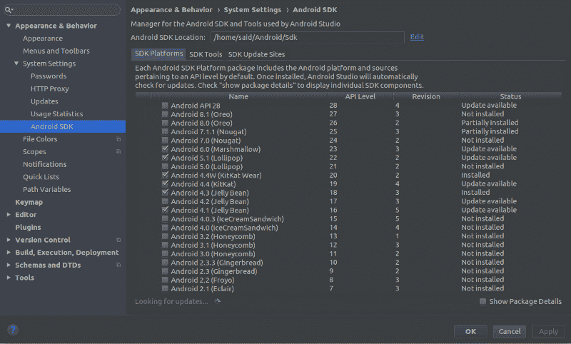
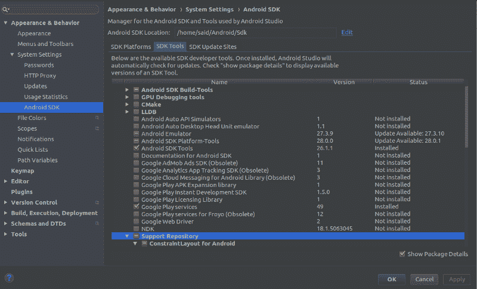
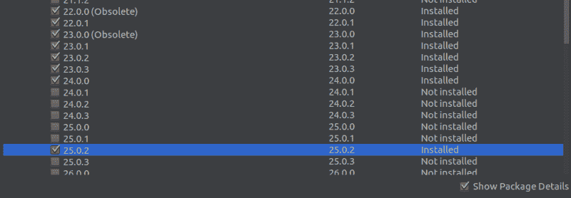
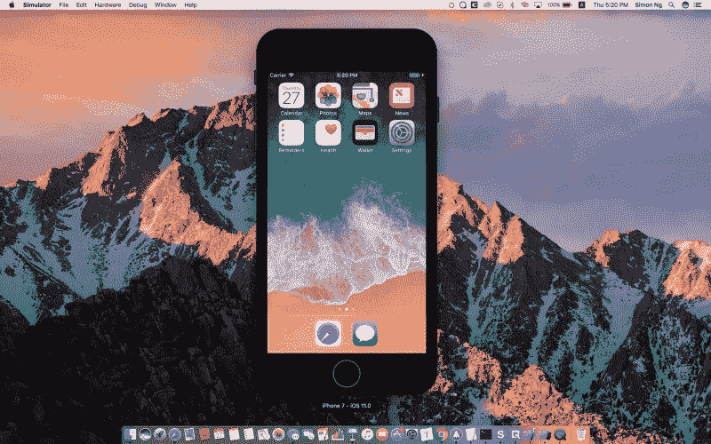
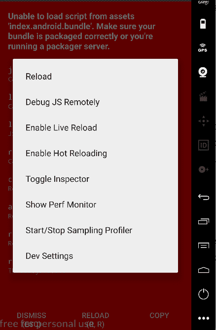
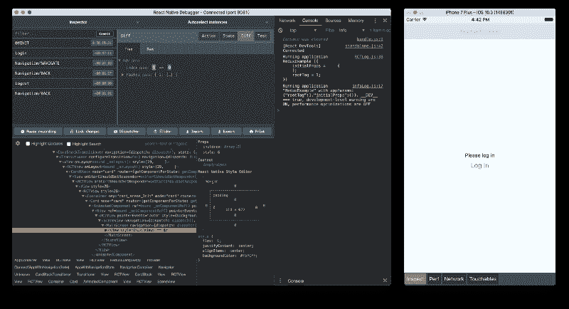

# 开始在 React Native 中构建移动应用程序需要知道什么

> 原文：<https://www.freecodecamp.org/news/what-you-need-to-know-to-start-building-mobile-apps-in-react-native-dded951277b7/>

没有什么比用 JavaScript 构建应用更好的了。除非你在开发移动应用。JavaScript 是用来构建 web 应用程序的，用它来构建本地移动应用程序在过去是不可能的。任何一个网络开发者都很难投入到构建原生移动应用的工作中。他们必须学习 Java，或者 Objective-C……或者任何用于这个目的的编程语言。

也就是说，直到脸书的 [React Native](https://facebook.github.io/react-native/) 打破了这个障碍。React Native 具有很大的优势，比如可以为 Android 和 IOS 构建跨平台的应用程序。在 React Native 之前，你必须编写两次代码——一次用于 Android，一次用于 IOS。现在不再是这样了。

本文是对 React Native 世界的介绍，所以准备好了吗？。

### 为什么反应原生？

对，那么为什么反应原生的而不是任何其他技术？

它为我们提供了许多其他技术无法提供的解决方案。以下是您可以使用 React Native 执行的操作:

#### 构建原生移动应用

React Native 允许我们用 JavaScript 为 iOS 和 Android 编写原生应用。它让我们能够使用所有原生组件，如手势、推送通知、摄像头和位置。还有其他一些 JavaScript 库可以用来构建移动应用，比如 ionic 或 PhoneGap。但这些图书馆使用 Webview，用这些技术构建的应用程序不是原生的。

#### 构建跨平台移动应用(iOS 和 Android)

是的，有了 React Native，你可以构建可以在 iOS 和 Android 上运行的移动应用。这是 React Native 的一大好处。在脸书创建它之前，你必须用不同的代码构建你的应用程序两次:一次用 Swift 或 Objective-C 在 iOS 上运行，一次用 Java 或 Kotlin 在 Android 上运行。React Native 解决了这个问题，因此您可以构建自己的 React Native 应用程序，它将在 iOS 和 Android 中工作。厉害！？

#### 用 JavaScript 编写你的代码并做出反应

当你在构建 React 原生应用时，你实际上是在编写 JavaScript。Reactjs 代码允许我们构建出色的 UI 和用户体验组件。

### react-native 入门

从 react-native 开始可能令人兴奋，但同时也可能有点令人困惑。第一步是安装它，有几种方法可以完成:

#### 使用 expo-cli:

expo-cli 是一个命令行工具。它为您下载并安装 React 原生样板文件，集成了 [expo](http://expo.io/) API ( [点击此处查看安装指南](https://github.com/react-community/create-react-native-app))。这是一种构建 React Native 应用程序的简单方法，如果您刚刚开始使用 React Native，这是一种推荐的方法。

expo-cli 为您提供了许多选择。您可以在移动设备上运行和测试您的应用程序，无需任何配置。扫描二维码，您的应用程序将与 expo 移动应用程序一起打开。你可以通过一个名为[appertise](https://appetize.io/)的 web 界面在浏览器上探索其他使用 React Native 构建的移动应用程序！

#### 使用 react-native-cli

r [eact-native-cli](https://facebook.github.io/react-native/docs/understanding-cli) 执行与 expo-cli 相同的工作，但是具有不同的方法和额外的优势。与 react-native-cli 一起安装的应用程序为我们提供了在应用程序中创建自己的本机模块的选项和能力。您不需要弹出您的应用程序就能够生成本机模块。弹出使你能够使用原生模块并编写你自己的模块(*我们将在另一部分*探讨如何编写原生模块)。

在不同平台上开发 React 原生应用是一个不同的过程。有时候，我们需要针对特定平台的特定配置。例如，为了构建 Android，您需要使用 Android SDK，所以让我们来探索一下这是如何工作的！

### 为 Android 构建移动应用

开始为 Android 开发需要安装一些要求。首先，你必须下载并配置 Android SDK 和 Android Studio。你可以点击这里的链接[下载它们。](https://developer.android.com/studio/)

下载 Android Studio 后，你还需要安装一些 API。要做到这一点，打开 Android Studio，然后点击设置选项卡，这个窗口将会打开:

首先，在 SDK 平台选项卡中检查您希望 react-native 支持的✔️the 平台(例如 Android 6.0 Marshmallow)。然后切换到 SDK 工具。

click on the image to see it clearly

并检查`Android SDK Build-Tools`、`Android SDK tools`和`google play service`。在 Android SDK 构建工具下，选择所有平台:

*   从 19.0.0 到 20.0.0 开始
*   从 22.0.0 到 24.0.0
*   以及 25.0.2、26.0.1 至 26.0.3
*   27.0.3 和 28.0.1 至 28.02

现在我们完成了 SDK 和 Android Studio。下一步是模拟器。模拟器是我们运行和测试应用程序的地方。有很多不同的选择。

你可以使用 Android Studio 模拟器。你可以在这里查看如何创建一个在 Android Studio 上使用的[模拟器。老实说，我从来没用过。我更喜欢](https://developer.android.com/studio/run/managing-avds) [Genymotion](https://www.genymotion.com/) 或者一个真实的设备。

#### **元宵节**

Genymotion 是一个桌面应用程序，它提供了一个虚拟仿真器来测试你的应用程序。我很喜欢用它，因为它很快。？它为您提供了创建定制手机的选项，这些功能在任何真实设备中都可以找到。例如启用 Wifi、定位和摄像头。我强烈推荐你使用 G [enymotion](https://www.genymotion.com/) 而不是 Android Studio 模拟器或任何其他模拟器。

#### **使用真实设备**

没有什么比使用真实的设备来运行和测试你的应用更好的了。这是因为它让你知道你的应用程序在真实设备上是什么样子的。它让你以一种虚拟设备无法给予的方式感受到工作的真实性。所以如果你有能力使用一个设备，不要犹豫。

到目前为止，我们已经接受了 Android——但是 iOS 呢？

### 为 IOS 构建 react-native 应用

在 iOS 上运行 React Native 看起来和 Android 没有太大区别。除了一些例外，在 Android 上运行的 React 原生应用程序也可以在 iOS 上运行。

例如，如果你想在 iOS 设备上运行，你需要有一个 MacOS。谈到 MacOS 和 iOS，您不需要下载任何额外的依赖项，例如 Android 的 SDK，就可以在 iOS 上运行 React Native。

关于模拟器，Xcode 有很好的模拟器，你可以用来测试你的 React 本地应用。你可以看看这篇文章，它向[展示了一些在模拟器中使用](https://www.appcoda.com/ios-simulator-tips-tricks/)的技巧。

appcoda [image credit](https://www.appcoda.com/ios-simulator-tips-tricks/)

在 MacOS 中，你可以同时运行 iOS 和 Android。你绝对可以在 MacOS 上安装 Android Studio 和 Genymotion。这种可能性在只能运行 Android 模拟器而不能运行 iOS 模拟器的 PC 上是不存在的。所以你很幸运？如果你有苹果电脑——享受？。

现在我们有了构建 React 原生应用的环境，并且已经安装了所有的东西，但是 React 原生代码是如何编写的呢？这非常简单:您将实际编写 [Reactjs](https://reactjs.org/) 代码。

你可以查看官方指南来练习一下 React Native。我推荐这篇伟大的文章开始“[反应原生 YouTube 副本。](https://medium.com/react-native-training/react-native-youtube-replica-f378200d91f0)“它将一步一步地指导你创建你的第一个 React 原生应用。

哇！到目前为止，你很好，你是用 react-native 编码的。？但是您需要检查和调试您的错误，并查看您的代码日志。是的，那些木头！！所以我们需要一个 d *ebugger！*如何用 React Native 调试？

### 调试反应-本机

调试你的代码是非常重要的，不仅仅是 React Native，其他任何编程语言都是如此。所以在你的 React 原生代码中，你需要知道发生了什么。调试 React 本机应用程序有许多不同的方法，例如:

#### 使用 Chrome devtools 进行调试

React Native 让你可以选择使用 Chrome devtools 来查看你的应用程序的日志。要使用 Chrome 进行调试并在模拟器中启用调试模式，只需在键盘上点击`Ctrl+ m`。

该屏幕将弹出:

然后选择`Debug Js Remotely`。这将在 Google Chrome 中打开一个地址为`http://localhost:8081/debugger-ui/`的标签页。那是为了使用 Chrome devtools，其他选项呢？

#### 使用 React 本机调试器

[credit react-native-debugger](https://github.com/jhen0409/react-native-debugger)

[React-native-debugger](https://github.com/jhen0409/react-native-debugger) 是调试 React 原生代码的绝佳工具。这是一个桌面应用程序，给你带来许多好处。它带有 Redux devtools 和 React-devtools 集成。您也可以调试样式。它实际上是 React Native 的最佳调试器，也是我使用的调试器。通常它可以在 MacOS、Windows 和 Linux 上使用。查看[安装和集成指南](https://github.com/jhen0409/react-native-debugger)。

我觉得这一点就够了。这是用 React Native 构建移动应用绝对指南的第一部分。在下一部分中，我们将深入探讨更多的技术技巧和问题，比如我们如何使用本机组件、React 本机 API、与其他库的集成、Redux、GraphQL 等等。因此，订阅这个邮件列表,继续关注下一部分。谢谢你的时间。？

你总能在推特上找到我？