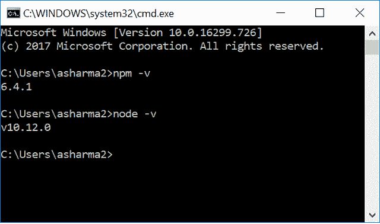
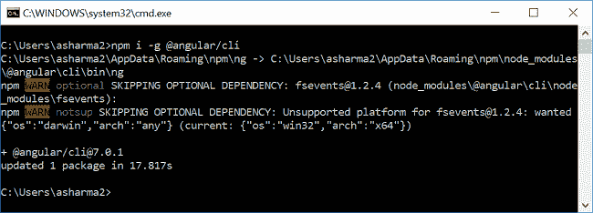
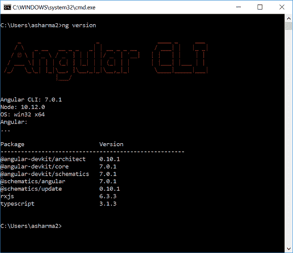
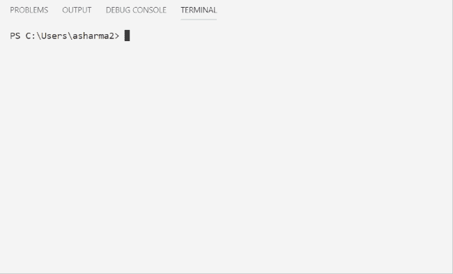
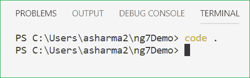
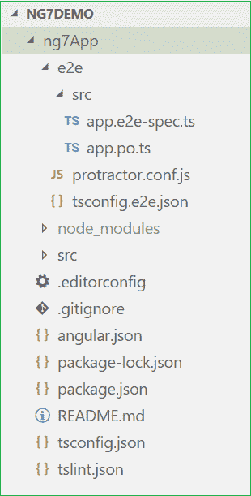
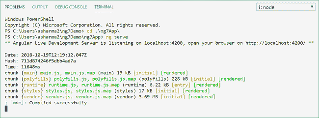
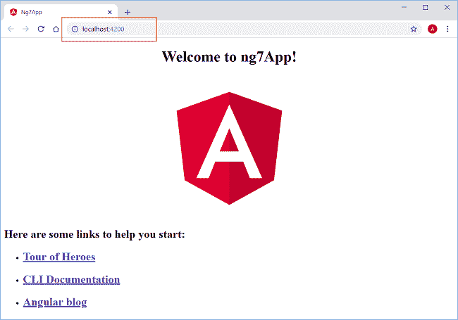
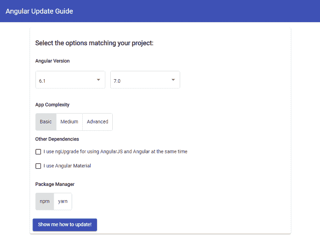

# Angular 7.0 的新增功能以及如何升级

> 原文：<https://www.freecodecamp.org/news/whats-new-in-angular-7-0-and-how-to-upgrade-f2ed22a79e28/>

### 介绍

Angular 发布了最新版本 Angular 7.0。在本文中，我们将探讨以下几点:

*   Angular 7.0 的新特性是什么
*   使用 Angular CLI 创建第一个 Angular 7.0 应用程序
*   如何将您现有的 Angular 应用程序更新到 Angular 7.0

### Angular 7.0 有什么新功能？

1.  创建新的 Angular 应用程序时，Angular CLI 将提示用户选择是否要添加一些功能，如 Angular routing 或他们希望在应用程序中使用的样式表格式
2.  Angular 7.0 应用程序将使用 Angular CLI 的捆绑包预算功能。如果应用程序包的大小超过了预定义的限制，这将会警告开发人员。警告的默认值设置为 2MB，错误的默认值为 5MB。该值可通过`angular.json`文件进行配置和更改。这个特性极大地增强了应用程序的性能。
3.  作为此次更新的一部分，角形材料的组件开发套件(CDK)也获得了一些新功能。CDK 新增的两个功能是:

*   ****虚拟滚动**** 如果你试图加载一个大的元素列表，那么它会影响应用程序的性能。标签可以用来只加载屏幕上列表的可见部分。它将只呈现适合屏幕的项目。当用户滚动列表时，DOM 将根据显示大小动态地加载和卸载元素。这个特性不要与无限滚动混淆，无限滚动是加载元素的完全不同的策略。你可以在这里阅读更多关于虚拟滚动[的内容。](https://material.angular.io/cdk/scrolling/overview)
*   **拖放**
    我们可以很容易地给一个项目添加拖放功能。它支持自由拖动元素、重新排序列表项、在列表间移动项、动画、添加自定义拖动手柄以及沿 X 或 Y 轴进行受限拖动等功能。你可以在这里阅读更多关于拖放[的内容。](https://material.angular.io/cdk/drag-drop/overview)

4.`mat-form-field`现在将支持使用本地 select 元素。这将为应用程序提供增强的性能和可用性。在这里阅读更多关于这个功能[的信息。](https://material.angular.io/components/select/overview)

5.Angular 7.0 更新了依赖关系，支持 Typescript 3.1、RxJS 6.3 和 Node 10。

现在我们将开始创建我们的第一个 Angular 7 应用程序。

### 先决条件

*   从[这里](https://nodejs.org/en/download/)安装 Node.js 的最新版本
*   从[这里](https://code.visualstudio.com/)安装 Visual Studio 代码

安装 Node.js 也会在您的计算机上安装 npm。安装 Node.js 后，打开命令提示符。运行以下命令集，检查您的计算机上安装的节点和 npm 的版本。

*   节点 v
*   npm -v

请参考下图:



### **安装角度指示器**

Angular CLI 是 Angular 的命令行界面。它帮助我们轻松地初始化、开发和维护 Angular 应用程序。

要安装 Angular CLI，请在命令窗口中运行以下命令:

```
npm i -g @angular/cli
```

这将在您的计算机中全局安装 Angular CLI 7.0。请参考下图:



要检查计算机中安装的 angular CLI 版本，请运行以下命令:

请参考下图:



### **创建 Angular 7 app**

打开 Visual Studio 代码并导航到`View >> Te`终端。这将打开 VS 代码终端窗口。或者，您也可以使用键盘 sho `rtcut` ctrl+`打开终端窗口。

在终端窗口中键入以下命令序列。这些命令将创建一个名为“ng7Demo”的目录。然后在该目录中创建一个名为“ng7App”的 Angular 应用程序。

*   mkdir ng7 演示版
*   CD ng7 演示
*   ng 新的 ng7 应用

运行 ng new 命令时，Angular CLI 将要求您在以下两个选项中进行选择:

1.  您想要添加角度路由吗？(是/否)
2.  您想使用哪种样式表格式？

一旦您选择了选项并按下回车键，Angular 7.0 应用程序将被创建。

为了更好的理解，请参考下面的 Gif。



成功创建应用程序后，运行以下命令打开项目:

*   代码。

请参阅下图:



这将在一个新的 VS 代码窗口中打开我们应用程序的代码文件。您可以在解决方案资源管理器中看到以下文件结构。



打开 package.json 文件，您可以看到我们的项目中安装了最新的 Angular 7.0.0 包。

```
{
  "name": "ng7-app",
  "version": "0.0.0",
  "scripts": {
    "ng": "ng",
    "start": "ng serve",
    "build": "ng build",
    "test": "ng test",
    "lint": "ng lint",
    "e2e": "ng e2e"
  },
  "private": true,
  "dependencies": {
    "@angular/animations": "~7.0.0",
    "@angular/common": "~7.0.0",
    "@angular/compiler": "~7.0.0",
    "@angular/core": "~7.0.0",
    "@angular/forms": "~7.0.0",
    "@angular/http": "~7.0.0",
    "@angular/platform-browser": "~7.0.0",
    "@angular/platform-browser-dynamic": "~7.0.0",
    "@angular/router": "~7.0.0",
    "core-js": "^2.5.4",
    "rxjs": "~6.3.3",
    "zone.js": "~0.8.26"
  },
  "devDependencies": {
    "@angular-devkit/build-angular": "~0.10.0",
    "@angular/cli": "~7.0.1",
    "@angular/compiler-cli": "~7.0.0",
    "@angular/language-service": "~7.0.0",
    "@types/node": "~8.9.4",
    "@types/jasmine": "~2.8.8",
    "@types/jasminewd2": "~2.0.3",
    "codelyzer": "~4.5.0",
    "jasmine-core": "~2.99.1",
    "jasmine-spec-reporter": "~4.2.1",
    "karma": "~3.0.0",
    "karma-chrome-launcher": "~2.2.0",
    "karma-coverage-istanbul-reporter": "~2.0.1",
    "karma-jasmine": "~1.1.2",
    "karma-jasmine-html-reporter": "^0.2.2",
    "protractor": "~5.4.0",
    "ts-node": "~7.0.0",
    "tslint": "~5.11.0",
    "typescript": "~3.1.1"
  }
}
```

### 执行演示

我们的 Angular 应用程序的名称是 *ng7App* ，它位于 *ng7Demo* 目录中。

因此，我们将首先使用下面的命令导航到我们的应用程序。

*   CD ng7 演示
*   cd ng7App

现在，我们使用下面的命令来启动 web 服务器。

*   发球

请参考下图:



运行这个命令后，您可以看到它要求在您的浏览器中打开`*http://localhost:4200*`。所以，打开你机器上的任何一个浏览器，导航到这个 URL。现在，你可以看到下面的页面。



### 如何升级到 Angular 7

angular 团队已经提供了 angular 更新指南，以确保 Angular 版本的顺利升级。导航到[https://update.angular.io/](https://update.angular.io/)进行访问。这是一个不言自明且易于使用的应用程序。它将向您展示在更新之前、更新期间和更新之后您需要遵循的步骤。请参考下图:



如果要将应用程序从 Angular 6 更新到 Angular 7，请在项目文件夹中运行以下命令:

```
ng update @angular/cli @angular/core
```

### 结论

我们已经了解了 Angular 7.0 的新特性。我们还安装了 Angular CLI 7.0。为了创建和执行 Angular 7.0 应用程序，我们使用了 Angular CLI 和 VS 代码。我们还探索了将现有应用程序升级到 Angular 7.0 的方法。

### 请参见

*   【Angular 6.0 入门
*   [了解角度 6 动画](https://ankitsharmablogs.com/understanding-angular-6-animations/)
*   [使用 Visual Studio 代码开始使用 Angular 5](https://ankitsharmablogs.com/getting-started-with-angular-5-using-visual-studio-code/)
*   [使用角度 5°和 ADO.NET 的 ASP.NET 堆芯的积垢操作](https://ankitsharmablogs.com/crud-operations-asp-net-core-using-angular-5-ado-net/)
*   [ASP.NET 核心—使用 Angular 5 和实体框架核心的 CRUD】](https://ankitsharmablogs.com/asp-net-core-crud-using-angular-5-and-entity-framework-core/)
*   [ASP.NET 岩心——使用角度为 5 的高图表](https://ankitsharmablogs.com/asp-net-core-using-highcharts-with-angular-5/)

最初发表于[https://ankitsharmablogs.com/](https://ankitsharmablogs.com/)