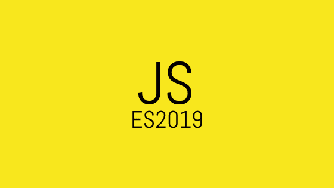

# JavaScript ES2019 的新特性

> 原文：<https://www.freecodecamp.org/news/whats-new-in-javascript-es2019-8af4390d8494/>

作者瓦利·沙阿

# JavaScript ES2019 的新特性



我们中的许多人都知道 Javascript 的最新版本有一个标准的程序，并且背后有一个委员会。在这篇文章中，我将解释谁对任何新规范做出最终决定，其程序是什么，以及 **ES2019 中有什么新内容。**

驱动 JavaScript 的语言规范叫做 **ECMAScript。在技术委员会 39**【TC39】**的背后有一个团队，在采用**之前审查每一个规范。****

每一个变化都经历一个成熟阶段的过程。

*   第 0 阶段:创意/稻草人
*   **第一阶段:**提案
*   第二阶段:草稿
*   第三阶段:候选人
*   **阶段 4:** 完成/批准

达到第 4 阶段的特性很可能是语言规范的一部分。

让我们深入了解 ES2019 规范中新增的内容。

#### Array.prototype.{flat，flatMap}

`Array.prototype.flat()`建议将数组递归展平到指定的`depth`并返回一个新数组。

**语法**:`Array.prototype.flat(depth)`
深度— 默认值 **1** ，使用`Infinity`展平所有嵌套数组。

```
const numbers = [1, 2, [3, 4, [5, 6]]];
// Considers default depth of 1
numbers.flat(); 
> [1, 2, 3, 4, [5, 6]]
// With depth of 2
numbers.flat(2); 
> [1, 2, 3, 4, 5, 6]
// Executes two flat operations
numbers.flat().flat(); 
> [1, 2, 3, 4, 5, 6]
// Flattens recursively until the array contains no nested arrays
numbers.flat(Infinity)
> [1, 2, 3, 4, 5, 6]
```

`Array.prototype.flatMap()`使用映射函数映射每个元素，并将结果展平到一个新数组中。这与映射操作完全相同，后面是一个`depth`的`flat`和一个 **1。**

**语法:** `Array.prototype.flatMap(callback)`
**回调:** `function`产生一个新数组的元素。

```
const numbers = [1, 2, 3];
numbers.map(x => [x * 2]);
> [[2], [4], [6]]
numbers.flatMap(x => [x * 2]);
> [2, 4, 6]
```

#### 对象. fromEntries

`Object.fromEntries`执行`Object.entries`的反向操作。它将一列键值对转换成一个对象。

**语法:** `Object.fromEntries(iterable)`
**可迭代:**可迭代如`Array`或`Map`或实现 **[可迭代协议](https://developer.mozilla.org/en-US/docs/Web/JavaScript/Reference/Iteration_protocols#The_iterable_protocol)** 的对象

```
const records = [['name','Mathew'], ['age', 32]];
const obj = Object.fromEntries(records);
> { name: 'Mathew', age: 32}
Object.entries(obj);
> [['name','Mathew'], ['age', 32]];
```

#### String.prototype.{trimStart，trimEnd}

`trimStart()`删除字符串开头的空白，`trimEnd()`删除字符串结尾的空白。

```
const greeting = ` Hello Javascript! `;
greeting.length;
> 19
greeting = greeting.trimStart();
> 'Hello Javascript! '
greeting.length;
> 18
greeting = 'Hello World!   ';
greeting.length;
> 15
greeting = greeting.trimEnd();
> 'Hello World!'
greeting.length;
> 12
```

#### 可选 Catch 绑定

在新规范之前，需要将一个异常变量绑定到一个`catch`子句。ES2019 使它成为可选的。

```
// Before
try {
   ...
} catch(error) {
   ...
}
// After
try {
   ...
} catch {
   ...
}
```

当您想要完全忽略错误时，此功能非常有用。最佳实践是考虑处理错误。

有些情况下，您知道可能会触发操作的错误。您可以忽略 catch 块处理。

#### JSON ⊂ ECMAScript

字符串中现在允许使用行分隔符(U+2028)和段落分隔符(U+2029)。以前，这些被视为行终止符，会导致`SyntaxError`异常。

```
// Produces invalid string before ES2019
eval('"\u2028"');
// Valid in ES2019
eval('"\u2028"');
```

#### 格式良好的 JSON.stringify

ES10 用 JSON 转义序列来表示它们，而不是产生单个 **UTF-16** 代码单元的不成对代理代码点。

```
JSON.stringify('\uD800');
> '"�"'
JSON.stringify('\uD800');
> '"\\ud800"'
```

#### Function.prototype.toString

`.toString()`现在返回源代码文本的精确片段，包括空白和注释。

```
function /* a comment */ foo () {}
// Previously:
foo.toString();
> 'function foo() {}'
             ^ no comment
                ^ no space
// Now:
foo.toString();
> 'function /* comment */ foo () {}'
```

#### 符号.原型.描述

返回`Symbol`对象的可选描述的只读属性:

```
Symbol('desc').toString();
> "Symbol(desc)"
Symbol('desc').description;  
> "desc"
Symbol('').description;      
> ""
Symbol().description;
> undefined
```

### 结论

TC39 保存所有在 [ss h](https://github.com/tc39/proposals) 第> 1 阶段的即将到来的规格。作为一名开发者，关注周围发生的事情是很重要的。接下来还有更多令人兴奋的事情，比如类中的私有方法和字段，遗留 RegE x 等等。在这里找出提案中所有的新东西。

`**code** = **co**ffee + **de**veloper`

这里有几个更有趣的话题:

*   [**JavaScript 符号快速概述**](https://medium.freecodecamp.org/how-did-i-miss-javascript-symbols-c1f1c0e1874a)
*   [**如何采用 git 分支策略**](https://medium.freecodecamp.org/adopt-a-git-branching-strategy-ac729ff4f838)
*   [**Git Merge 和 Git Rebase 简介:它们做什么以及何时使用它们**](https://medium.freecodecamp.org/an-introduction-to-git-merge-and-rebase-what-they-are-and-how-to-use-them-131b863785f)