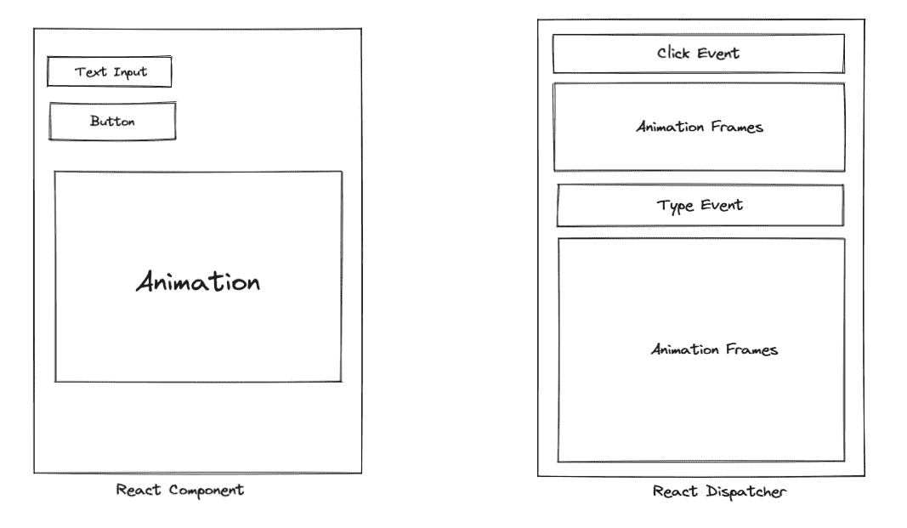

# React 18 Alpha 有什么新功能？并发、批处理、转换 API 等等

> 原文：<https://www.freecodecamp.org/news/whats-new-in-react-18/>

嘿大家好！在这篇文章中，我将在不到 8 分钟的时间里向您展示 React-React 18 alpha 最新版本的新功能。

首先，您可能想知道最新的一系列更改是否会破坏您当前的设置，或者您是否需要学习新的完全不相关的概念。

好吧，不要担心——你可以继续你目前的工作，或者继续学习你目前的 React 课程，因为 React 18 不会破坏任何东西。

如果你想看视频来补充你的阅读，看看这里:

[https://www.youtube.com/embed/IOeqma3YcGs?feature=oembed](https://www.youtube.com/embed/IOeqma3YcGs?feature=oembed)

对于那些真正想知道发生了什么的人来说，这里有一个分类。

简单说明一下:React 18 还在 alpha 中，还没有发布。所以这是它发布时你可以期待的。

## React 中的并发是什么？

此次发布的主题是**并发性**。首先，让我们看看什么是并发。

并发是指同时执行多个任务的能力。以一个标准的 React 应用程序为例，让我们考虑在一个组件中播放动画，同时用户能够点击或输入其他 React 组件。



在这里，当用户键入和点击按钮时，React 的上下文中也会呈现一个动画。

React 必须管理所有的函数调用、钩子调用和事件回调，其中几个甚至可以同时发生。如果 React 把所有时间都花在渲染动画帧上，用户会觉得应用程序“卡住了”，因为它不会对他们的输入做出反应。

现在，运行在单线程进程上的 React 必须对这些事件和功能进行组合、重新排序和优先排序，以便为用户提供最佳的性能体验。

为了做到这一点，React 在内部使用了一个“调度程序”，它负责对这些回调进行优先级排序和调用。

在 React 18 之前，用户无法控制这些函数的调用顺序。但是现在，React 通过转换 API 将这个事件循环的一些控制权交给了用户。

你可以在丹·阿布拉莫夫的文章中读到更多关于这方面的内容:[并发的 Eli 5](https://github.com/reactwg/react-18/discussions/46#discussioncomment-846786)。

## 过渡 API

React 的开发人员已经公开了一些 API，这些 API 允许 React 用户对并发进行一些控制。

其中一个 API 是`startTransition`，它允许开发者指出哪些动作可能阻塞线程并导致屏幕延迟。

通常，这些操作是您以前可能使用过的，比如通过搜索 API 的网络调用，或者渲染繁重的过程，比如搜索 1000 个字符串的数组。

包装在`startTransition`中的更新被标记为非紧急更新，如果出现更紧急的更新，如点击或按键，更新就会被中断。

如果过渡被用户打断(例如，在搜索栏中键入多个字母)，React 将丢弃未完成的陈旧渲染工作，只渲染最新的更新。

### 过渡 API 示例

为了更详细地理解这一点，让我们考虑一个带有搜索字段的组件。假设它有两个控制状态的功能:

```
// Update input value
setInputValue(input)

// Update the searched value and search results
setSearchQuery(input); 
```

`setInputValue`负责更新输入字段，而`setSearchQuery`负责根据当前输入值进行搜索。现在，如果这些函数调用在每次用户开始输入时同步发生，将会发生以下两种情况中的任何一种:

1.  将进行几次搜索调用，这会延迟或减慢其他网络调用。
2.  或者，更有可能的是，搜索操作会变得非常繁重，每次按键都会锁定屏幕。

解决这个问题的一个方法是使用去抖技术，它可以隔离网络调用或搜索操作。但是，去抖的问题是，我们必须频繁使用和优化去抖定时器。

所以在这种情况下，我们可以将 setSearchQuery 包装在`startTransition`中，允许它将其作为非紧急事件处理，并且只要用户在键入，它就会被延迟。

```
import { startTransition } from 'react';

// Urgent: Show what was typed
setInputValue(input);

// Mark any state updates inside as transitions
startTransition(() => {
  // Transition: Show the results
  setSearchQuery(input);
}); 
```

过渡可以让你保持大部分交互流畅，即使它们会导致显著的 UI 变化。它们还可以让您避免浪费时间呈现不再相关的内容。

React 还提供了一个名为`useTransition`的新钩子，因此您可以在转换挂起时显示一个加载器。这有助于向用户表明应用程序正在处理他们的输入，并将很快显示结果。

```
import { useTransition } from'react';

const [isPending, startTransition] = useTransition();

const callback = () => {
  // Urgent: Show what was typed
  setInputValue(input);

  // Mark any state updates inside as transitions
  startTransition(() => {
    // Transition: Show the results
    setSearchQuery(input);
  });
}

{isPending && <Spinner />} 
```

根据经验，只要存在网络调用或呈现阻塞进程，就可以使用转换 API。

你可以在这篇文章中读到更多关于 API 的内容，来自核心 React 团队的 Ricky 对 startTransition 的解释。

### 过渡 API 的演示

在一个 app 中使用`useTransition`和悬念:[https://codesandbox.io/s/sad-banach-tcnim?file=/src/App.js:664-676](https://codesandbox.io/s/sad-banach-tcnim?file=/src/App.js:664-676)

使用复杂渲染算法的`startTransition`演示:[https://react-fractals-git-react-18-swizec.vercel.app/](https://react-fractals-git-react-18-swizec.vercel.app/)

## 反应中的配料

接下来是配料。批处理是开发人员通常不必关心的事情，但是知道幕后发生了什么是很好的。

每当您使用 setState 来更改任何函数中的变量时，React 会收集所有的 setState，然后一起执行它们，而不是在每个 setState 进行呈现。这就是所谓的批处理。

```
function App() {
  const [count, setCount] = useState(0);
  const [flag, setFlag] = useState(false);

  function handleClick() {
    setCount(c => c + 1); // Does not re-render yet
    setFlag(f => !f); // Does not re-render yet
    // React will only re-render once at the end (that's batching!)
  }

  return (
    <div>
      <button onClick={handleClick}>Next</button>
      <h1 style={{ color: flag ? "blue" : "black" }}>{count}</h1>
    </div>
  );
} 
```

这对性能非常好，因为它避免了不必要的重新渲染。它还防止您的组件呈现“半成品”状态，其中只有一个状态变量被更新，这可能会导致 UI 故障和代码中的错误。

然而，React 过去在执行批处理时并不一致。这是因为 React 过去只在浏览器事件(比如点击)期间批量更新*，但是这里我们在*事件已经被处理之后更新状态*(在获取回调中):*

```
function App() {
  const [count, setCount] = useState(0);
  const [flag, setFlag] = useState(false);

  function handleClick() {
    fetchSomething().then(() => {
      // React 17 and earlier does NOT batch these because
      // they run *after* the event in a callback, not *during* it
      setCount(c => c + 1); // Causes a re-render
      setFlag(f => !f); // Causes a re-render
    });
  }

  return (
    <div>
      <button onClick={handleClick}>Next</button>
      <h1 style={{ color: flag ? "blue" : "black" }}>{count}</h1>
    </div>
  );
} 
```

从 React 18 中的`[createRoot](<https://github.com/reactwg/react-18/discussions/5>)`开始，所有的状态更新都将被自动批处理，不管它们来自哪里。

这意味着超时、承诺、本机事件处理程序或任何其他事件中的更新将以与 React 事件中的更新相同的方式进行批处理。这将减少 React 的渲染工作量，从而提高应用程序的性能。

你可以在丹·阿布拉莫夫的[批处理解释](https://github.com/reactwg/react-18/discussions/21)中阅读更多关于批处理的内容。

### 批处理演示

18:[https://codesandbox.io/s/hopeful-fire-ge4t2?才反应过来 file=/src/App.tsx](https://codesandbox.io/s/hopeful-fire-ge4t2?file=/src/App.tsx)

18:[https://codesandbox.io/s/morning-sun-lgz88?反应过来后 file=/src/index.js](https://codesandbox.io/s/morning-sun-lgz88?file=/src/index.js)

## 悬疑 API

React 18 包含了很多改变，以提高 React 在服务器端渲染的上下文中的性能。服务器端呈现是在服务器上将 JS 数据呈现为 HTML 以节省前端计算的一种方式。这在大多数情况下会导致更快的初始页面加载。

React 分 4 个连续步骤执行服务器端渲染:

*   在服务器上，为每个组件提取数据。
*   在服务器上，整个应用程序呈现为 HTML 格式并发送给客户端。
*   在客户端，获取整个应用程序的 JavaScript 代码。
*   在客户端，JavaScript 连接对服务器生成的 HTML 做出反应，这就是所谓的水合作用。

React 18 引入了`Suspense` API，允许你将应用分解成**个更小的独立单元**，它们会独立完成这些步骤，不会阻塞应用的其余部分。因此，你的应用程序的用户将更快地看到内容，并能够更快地开始与它互动。

### 悬疑 API 是如何工作的？

#### 流式 HTML

如今的 SSR，渲染 HTML 和水合是“要么全有，要么全无”。客户必须一次获取并水合所有的应用程序。

但是 React 18 给了你一个新的可能。可以用`<Suspense>`将页面的一部分换行。

```
<Suspense fallback={<Spinner />}>
  {children}
</Suspense> 
```

通过将组件包装在`<Suspense>`中，我们告诉 React 它不需要等待注释就可以开始为页面的其余部分传输 HTML。相反，React 将发送占位符(一个微调器)。

当评论的数据在服务器上准备好了，React 将发送额外的 HTML 到同一个流中，以及一个最小的 inline `<script>`标签来把 HTML 放在“正确的地方”。

#### 选择性水合

在 React 18 之前，如果应用程序的完整 JavaScript 代码没有加载，水合作用就无法启动。对于较大的应用程序，此过程可能需要一段时间。

但是在 React 18 中，`<Suspense>`允许你在子组件加载之前对应用进行水合。

通过在`<Suspense>`中包装组件，您可以告诉 React 它们不应该阻止页面的其余部分流动——甚至是水合作用。这意味着你不再需要等待所有的代码加载后才能开始补水。React 可以在装载时水合零件。

`Suspense`的这两个特性和 React 18 中引入的其他几个变化极大地加速了初始页面加载。

你可以在这篇文章中阅读更多内容[丹·阿布拉莫夫对悬念 SSR](https://github.com/reactwg/react-18/discussions/37) 和相关变化的解释

### 悬念演示

[https://codesandbox.io/s/recursing-mclaren-1ireo?file=/src/index.js:458-466](https://codesandbox.io/s/recursing-mclaren-1ireo?file=/src/index.js:458-466)

## 摘要

所以总结一下，React 18 带来的功能有:

*   使用转换 API 进行并发控制，
*   自动批处理函数调用和事件，以提高应用内性能，以及
*   有悬念的 SSR 页面加载速度更快。

尽管与 React 的前一版本没有很大的不同，但所有这些变化都使 React 成为了所有框架的潮流引领者。

感谢你阅读这篇文章！你可以在 freeCodeCamp 上查看我以前在 React 上的帖子和教程。你也可以在 Twitter [@thewritingdev](https://twitter.com/thewritingdev) 上关注我，我在那里发布 React 和 web 开发的每日内容。