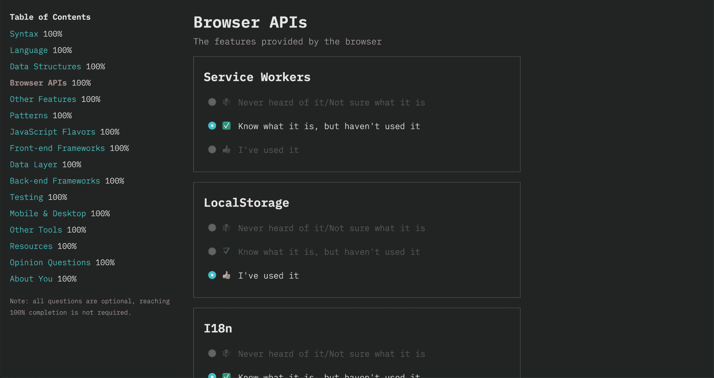
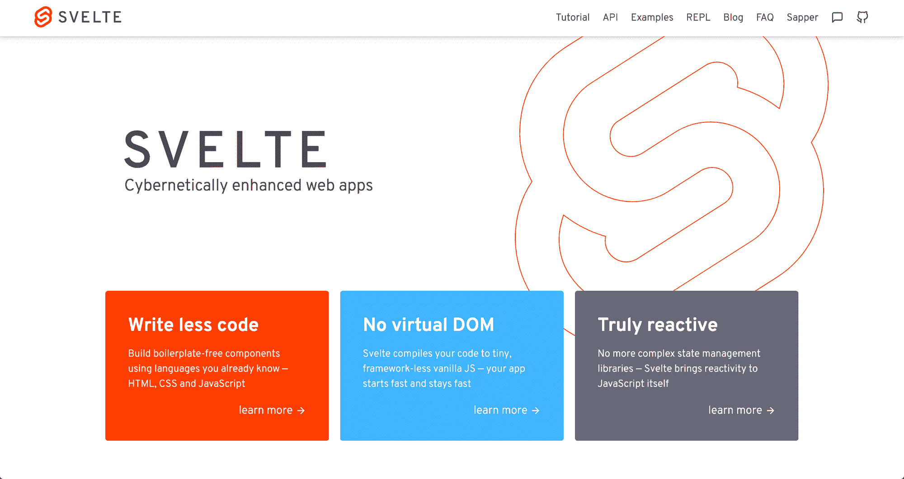

# 2019 年 JavaScript 调查的新内容

> 原文：<https://www.freecodecamp.org/news/whats-new-in-the-2019-state-of-javascript-survey/>

我们刚刚开启了 [2019 年 JavaScript 调查状态](http://survey.stateofjs.com/?source=fcc)。[如果你还没去拿的话，就去拿吧](http://survey.stateofjs.com/?source=fcc)！

这已经是我们第四次做这个调查了，每次我们都要深入查看我们的大 YAML 文件，里面有我们所有的问题，看看哪些留下，哪些离开。因此，如果你感到好奇，这里有一个今年调查中所有新内容的快速概述。

## 语言和模式

最大的结构变化是我们现在有了一个新的“语言”部分，询问 JavaScript 作为一种语言本身的情况。你使用析构吗？箭头函数呢？你看过地图和布景了吗？你是函数式程序员还是面向对象的程序员？

我们还有一整节都是关于浏览器 API 的，所以我们可以看到它们有多受欢迎。

目标是不仅了解人们在使用什么库，而且了解他们的实际代码是什么样子的。

## 新图书馆:苗条，柏树，等等

说到图书馆，我们也有一些新的参与者。

首先是[苗条的](https://svelte.dev/)，它在整个 2019 年都在社区中掀起了波澜。这也是我们去年在前端部分的第一个“其他”答案，因此包含它是有意义的。

在后端部分，我们增加了 [Nuxt](https://nuxtjs.org/) 和[盖茨比](https://www.gatsbyjs.org/)。它们不像 Express 或 Koa 那样是“传统的”后端框架，但是它们最近变得如此流行，以至于没有添加它们感觉像是一个疏忽。

在测试部分，我们增加了[柏树](https://www.cypress.io/)和[木偶师](https://github.com/puppeteer/puppeteer)，在移动&桌面部分 [NW.js](https://nwjs.io/) 和[博览会](https://expo.io/)。

## 资源科

正如我们在今年的[CSS 状态](https://2019.stateofcss.com/)调查中所做的那样，我们还增加了一个资源部分，以了解哪些博客、资源和播客最受欢迎。

## 自定义调查前端

最后，在技术方面，今年的巨大变化是我们首次使用自己开发的调查平台，而不是依赖于[字体](https://typeform.com/)。

这是我们已经讨论了一段时间的事情，但我们并没有认真考虑，直到我们意识到 Typeform 改变了他们的定价，并且他们最大的计划现在被限制在每月 10，000 个响应！Typeform 对接纳我们不感兴趣，所以随着年底越来越近，我开始着手一起开发一个调查应用程序。

谢天谢地，我口袋里有一个秘密武器: [Vulcan.js](http://vulcanjs.org/) ，这是一个全栈 JavaScript 框架，非常适合快速整合 web 应用程序；通过利用 Vulcan 的表单生成模块，我能够在大约五天内完成整个应用程序(你可以[在这里](https://github.com/StateOfJS/StateOfJS-Vulcan)找到它的代码)。

进展如此之快确实有一些缺点。我们也遇到过一些小问题，但目前还没什么大问题。此外，我们现在要求您在填写调查之前创建一个帐户。尽管我们很想支持匿名用户，但我们没有时间实施适当的保护措施来防止数据篡改，所以要求帐户似乎是最安全的选择。

不过，我确实认为这是正确的选择。当我们将前几年的数据导入新的调查应用程序时，我们将允许您访问这些数据，这样您就可以看到您的回答是如何随着时间的推移而变化的(前提是您使用过同一封电子邮件)；也让其他人更容易访问我们的数据，以实现他们自己的数据可视化。

话虽如此，体验所有这些新事物的最好方式是亲自去看看！所以[参加调查](http://survey.stateofjs.com/?source=fcc)，帮助我们了解今年最新的 JavaScript 趋势。