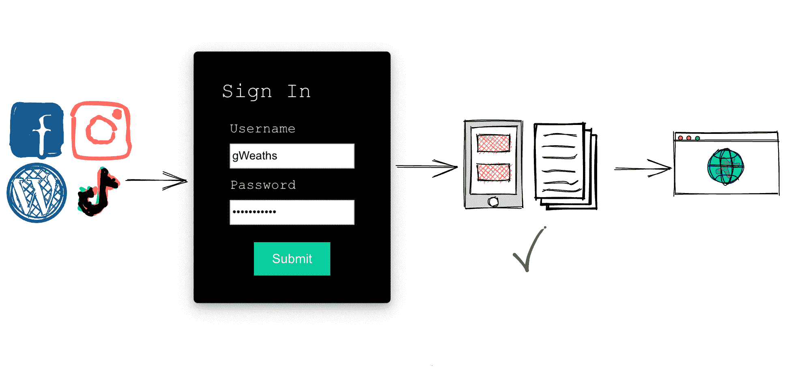
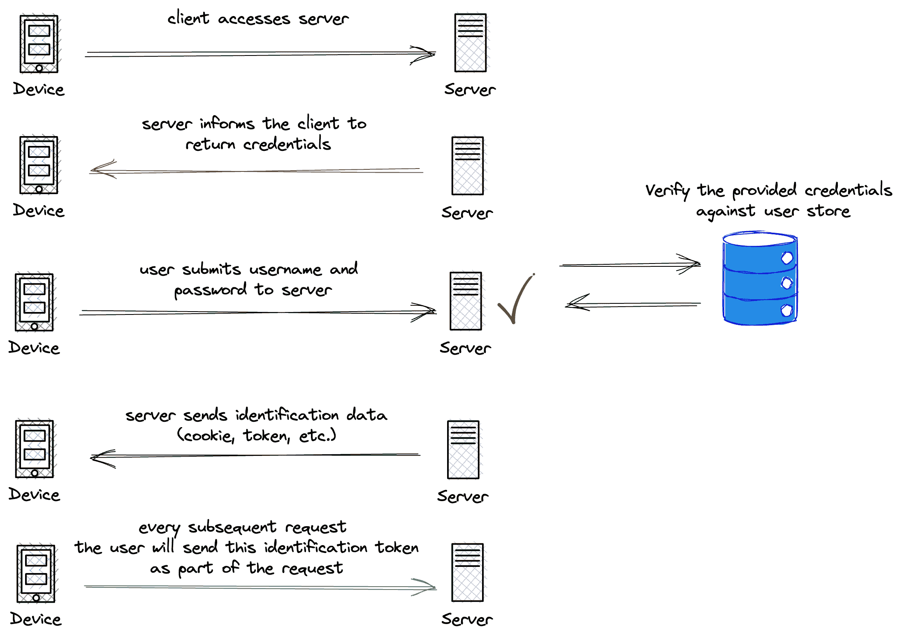
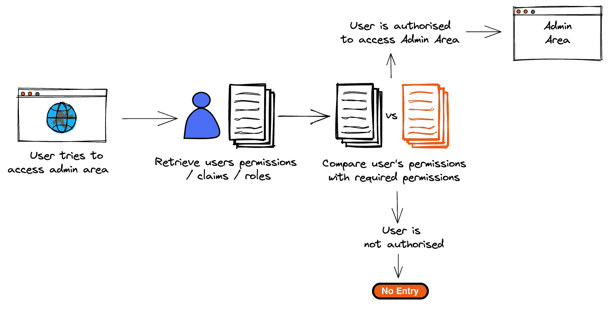

# 身份验证与授权–有什么区别？

> 原文：<https://www.freecodecamp.org/news/whats-the-difference-between-authentication-and-authorisation/>

当您开始从事 web 开发时，您可能会经常听到“身份验证”和“授权”这两个术语。更糟糕的是，它们通常都缩写为“auth ”,所以很容易把两者混淆。

在本文中，您将了解到:

*   身份验证和授权的区别
*   这些过程是如何工作的
*   日常生活中授权和认证的例子。

‌‌‌‌Ok，我们开始吧。

## 什么是认证？

认证是指**验证**用户提供的凭证和存储在系统中的凭证的过程，以**证明**用户就是他们所说的那个人。如果凭证匹配，则您授予访问权限。如果不是，你就否认。

### 认证方法

#### 单因素身份验证:

这通常用作低风险系统的身份验证过程。您只需要一个因素来进行身份验证，最常见的是密码，因此它更容易受到网络钓鱼攻击和键盘记录器的攻击。

除此之外，DataProt 最近的一篇[文章](https://dataprot.net/statistics/password-statistics/)显示，78%的 Gen-Z 人在多个服务中使用同一个密码。这意味着，如果攻击者获得了一个用户帐户的访问权限，他们很有可能通过使用相同的密码获得对其他用户帐户的访问权限。

#### 双因素身份验证:

这种方法更安全，因为它包括两个身份验证因素-通常是您知道的东西，例如用户名和密码，加上您拥有的东西，例如电话短信或安全令牌。

对于双因素身份验证，您将输入发送到您设备的一次性 SMS 密码，或者可能是链接的身份验证器应用程序代码，并提供不断变化的访问代码。

可以想象，这比简单地输入密码或单一身份验证凭证要安全得多。对于第二部分，您需要知道登录凭证，并且能够访问物理设备。

近年来，双因素身份认证在在线服务中变得非常普遍，并且是许多大公司的默认身份认证方法。许多人要求您设置双因素认证，以便利用该服务。

#### 多因素身份认证:

更进一步，使您的认证过程更加安全的是有 3 个或更多的因素。这种形式的身份验证通常基于以下前提:

*   您知道的内容(用户名+密码或用户名+安全问题和答案)
*   你有的东西(手机短信，认证器 app，u 盘)
*   你是什么(比如指纹/人脸识别)

由于这些原因，多因素身份认证提供了最大的保护，因为您需要折衷多个因素，而这些因素更难以“侵入”或复制。这种身份验证方法的缺点，也是许多普通系统不采用它的原因，是它的设置和维护很麻烦。因此，您要保护的数据/系统确实需要证明这种安全性的必要性。

## 那么，认证需要多少信息呢？

这个问题会在很多安全架构会议上出现，答案是“*视情况而定*”。

对于公司来说，根据应用程序的性质组合各种身份验证方法来提高安全性并不罕见。

举个银行 app 的例子。它包含非常敏感的信息，如果被错误的人获取，可能会产生巨大的财务和声誉影响。银行可能会将需要回答的个人问题与客户编号和复杂密码结合起来。

另一方面，对于社交媒体网站，您可能只需要用户名和密码，然后在允许访问之前进行检查和验证。

这完全是关于所涉及的风险级别，以及一旦进入应用程序，人们可以访问哪些信息。这有助于确定您需要的身份验证级别。

如果您或您的团队低估了您的应用程序所需的身份验证级别，您可能会因为没有充分保护您系统中的数据而被起诉。因此，公司雇佣安全专家来建议最佳实践和适当的解决方案。

## 认证在现实世界中是如何工作的？

让我们以一个社交媒体账户为例。你选择你最喜欢的社交媒体网站(托管在服务器上)。服务器将要求您提供凭据，以便通过登录页面访问该站点。在这里，您可以输入创建帐户时使用的用户名和密码。

Image showing the authentication process

然后，这些详细信息被发送到服务器，身份验证过程开始。您提供的详细信息会在服务器的数据库中进行验证和检查，如果它们与记录中的详细信息相匹配，您就通过了身份验证。然后为您提供一种形式的身份数据，例如 cookie 或 Json Web 令牌(JWT 令牌)。

成功！您已经访问了该网站，并被允许进入。

你可以在 Beau Carnes 的另一篇文章中了解更多关于 JWT 代币的信息。

接下来，我们来看看授权。

## 什么是授权？

授权是根据应用程序设置的特定标准和条件，验证您是否被允许访问应用程序的某个区域或执行特定操作的过程。你也可能听说它叫做访问控制或特权控制。

授权可以授予或拒绝执行任务或访问应用程序区域的权限。

让我们看一个例子:

我们已经获得了社交媒体网站的访问权限，但我们在那里被允许做什么取决于我们被授权做什么。

如果我们试图访问我们不是朋友的人的个人资料(他们没有接受我们的连接请求)，我们没有得到**授权**查看他们的个人资料。这意味着我们被拒绝查看他们的共享帖子。

Image of authorization flow

### 如何实现授权

根据您使用的框架，有许多方法可以实现授权。

在。NET framework，您可以使用基于角色的访问控制或基于声明的访问控制。

基于角色的访问控制的核心思想是，系统中的每个用户都被分配了一个角色。这些角色具有与其关联的预定义权限。被授予角色意味着用户将自动继承所有这些权限。角色是在用户创建和设置时分配的。

当试图访问管理区域时，端点或站点简单地检查当前登录的用户是否具有管理员角色。

这种方法的缺点是，有时用户被授予了太多他们不需要或不应该拥有的权限。

例如，赋予用户`Admin`的角色可能意味着他们将被赋予`Advanced Create`、`Edit`、`Delete`和`View`的用户权限。然而，您可能只想给他们`View`和`Basic Create`权限。

基于声明的访问控制可以更好地调整特定用户的权限。应用程序可以检查索赔是否存在于用户身上，或者是否为索赔分配了特定的值。

举个例子，一个名为`CreateUser`的声明可以给一个用户，在创建用户时检查这个声明。或者，您可以为同一个声明分配一个值`Advanced`，然后根据该值是`Advanced`还是`Basic`，使用不同的操作和用户界面。

## 认证和授权有什么区别？

现在我们对这些术语有了更好的理解，让我们来看一个您可能熟悉的涉及这两个过程的场景。

在一个有专属宾客名单的晚宴上，每个宾客都被赋予一个昵称和一个秘密密码。

到达后，一名保安询问您的昵称和密码。然后，他们会根据他们拥有的列表对你的证书进行认证。如果你的证件匹配，你会得到一个信封，表明你已经被允许进入。

一旦进入，你被允许进入派对和场馆的公共区域，因为这些不需要**授权** *(* 每个人都有权享受派对)。然而，你想参观贵宾区。

当你走近时，另一名安全人员要求打开你的信封(你的权限和角色)。他们看了一下，可惜你没有 VIP 角色，因此没有**授权** 访问。‌‌‌‌Put 尽可能简单地说，身份验证验证允许访问的用户或服务的身份，而授权决定他们进入后可以做什么。

## 为什么要同时实现身份验证和授权？

正如您所看到的，尽管身份验证和授权有很大的不同，但它们在应用程序或系统的安全性和完整性方面都扮演着不可或缺的角色。

这些过程是相辅相成的，没有一个过程，另一个过程就毫无意义。如果你可以进入管理区，但一旦进入就想做什么就做什么，这可能会导致大问题。

另一方面，你不能在不知道个人是谁的情况下授权他们！这就是为什么认证总是在授权之前。

## 结束语

我希望这篇文章很有见地，并且您现在对授权和身份验证之间的区别以及如何使用它们有了更清晰的理解。

请记住:

*   Authenticate =验证用户或进程的身份。
*   Authorize =确定用户/系统是否有权使用资源或执行操作。

如果你想更详细地讨论这篇文章，请随时通过 Twitter 联系。