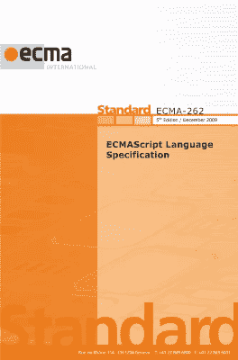
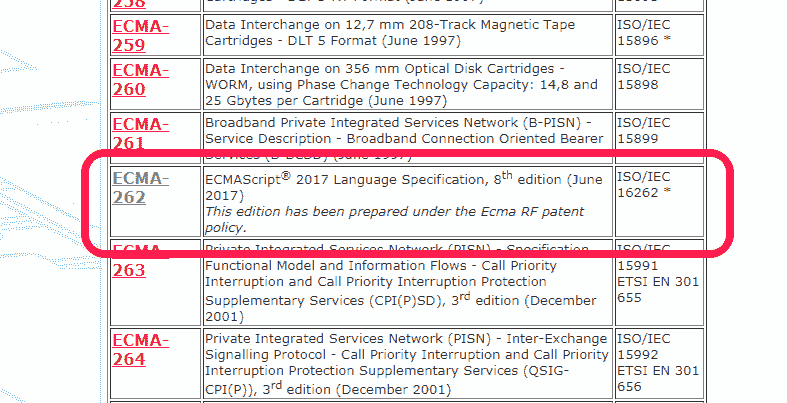
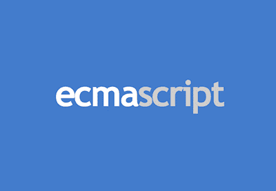
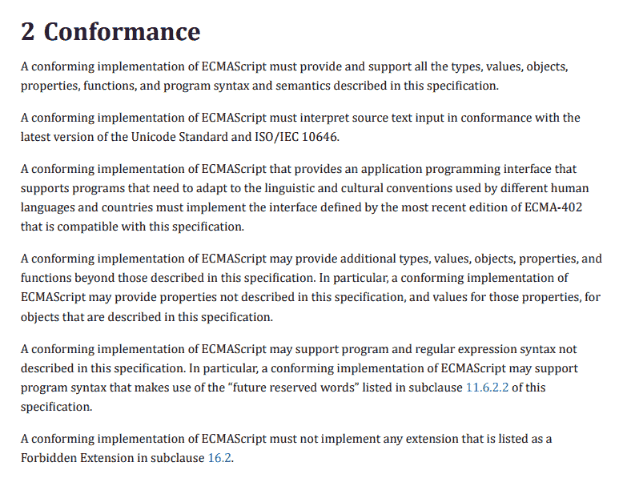
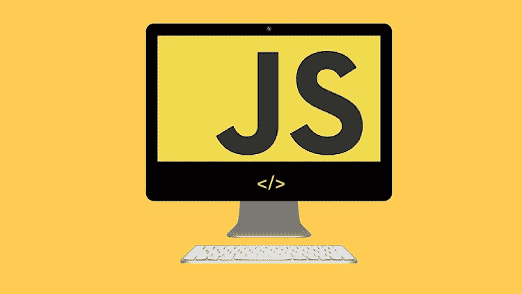
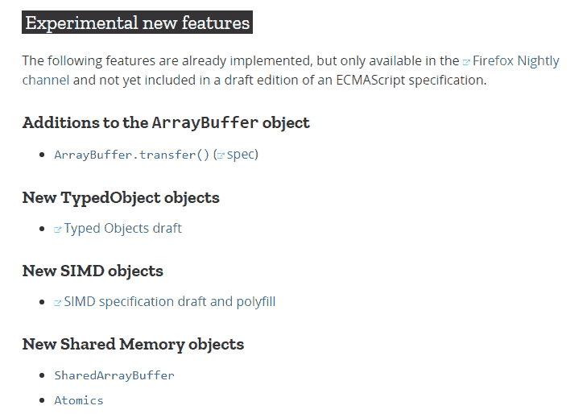
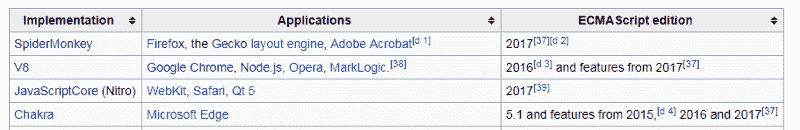
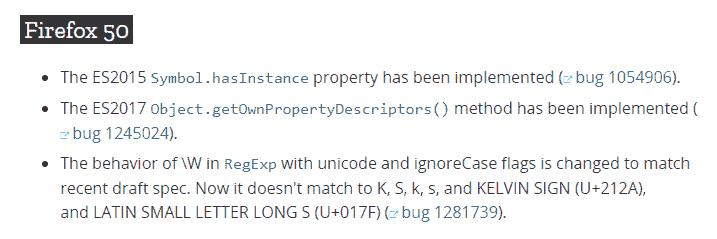
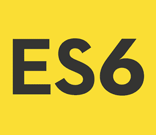
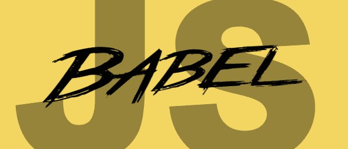

# JavaScript 和 ECMAScript 有什么区别？

> 原文：<https://www.freecodecamp.org/news/whats-the-difference-between-javascript-and-ecmascript-cba48c73a2b5/>

迈克尔·阿兰达

# JavaScript 和 ECMAScript 有什么区别？

我试过用谷歌搜索“JavaScript 和 ECMAScript 的区别”

我最终不得不艰难地面对一大堆模棱两可、看似矛盾的结果:

" ECMAScript 是一种标准."

“JavaScript 是一种标准。”

" ECMAScript 是一种规范."

" JavaScript 是 ECMAScript 标准的一个实现."

" ECMAScript 是标准化的 JavaScript . "

“ECMAScript 是一种语言。”

" JavaScript 是 ECMAScript 的一种方言."

" ECMAScript **是 JavaScript 的**"

抑制住想哭的冲动，我振作起来，决定致力于一些痛苦但富有成效的研究。

这篇文章代表了我目前对 JavaScript 和 ECMAScript 之间的区别的理解。它面向那些熟悉 JavaScript，但希望更清楚地了解它与 ECMAScript、web 浏览器、 [Babel](https://babeljs.io/) 等的关系的人。此外，您还将学习脚本语言、JavaScript 引擎和 JavaScript 运行时。

所以加油吧。

### JavaScript/ECMAScript 词汇表

下面是一个定义列表，旨在强调一致性和清晰性。这些定义不是 100%完整的。它们的构造方式提供了对 JavaScript 和 ECMAScript 之间的联系和关系的高级理解。

事不宜迟，我们开始吧。

### Ecma 国际

创建技术标准的组织。

为了说明一个“标准”的例子(虽然不是 Ecma 创造的)，想想你用过的所有键盘。绝大多数都有相同顺序的字母，空格键，回车键，箭头键，数字在顶部排成一行吗？这是因为大多数键盘制造商基于 [QWERTY](https://en.wikipedia.org/wiki/QWERTY) 布局标准来设计键盘。

### ECMA-262

这是 Ecma 国际发布的标准。它包含了通用脚本语言的规范。

ECMA-262 是一种类似 QWERTY 的标准，但它不是代表键盘布局规范，而是代表一种称为 ECMAScript 的脚本语言规范。

可以把 ECMA-262 看作 ECMAScript 的参考编号。

ECMA-260, ECMA-261, ECMA-262\. There’s ECMAScript.

### 一种脚本语言

**一种专门为作用于现有实体或系统而设计的编程语言**

对于是什么使编程语言成为脚本语言的一般概念，考虑命令“行走”、“运行”和“跳跃”这些行为需要一些东西来执行，也许是一个人，一只狗，或者一个电子游戏角色。如果没有演员来执行这些命令，“走”、“跑”和“跳”就没有意义。这组动作类似于专注于操作外部实体的脚本语言。

### ECMAScript

ECMA-262 中定义的规范，用于创建通用脚本语言。
**同义词:** ECMAScript 规范

Photo credit: [code.tutsplus.com](https://code.tutsplus.com/tutorials/ecmascript-6-power-tutorial-class-and-inheritance--cms-24117)

虽然 ECMA-262 是该标准的名称，但它代表了脚本语言规范 ECMAScript。

ECMAScript 提供了规则、细节和指导原则，脚本语言必须遵守这些规则、细节和指导原则才能被认为是 ECMAScript 兼容的。

An excerpt from the [ECMAScript 2017 Language Specification](https://www.ecma-international.org/publications/files/ECMA-ST/Ecma-262.pdf). The document is only about 900 pages, if you are looking for a light read.

#### **JavaScript**

符合 ECMAScript 规范的通用脚本语言。

Photo credit: [Udemy](https://www.udemy.com/javascript-from-basic-fundamentals-to-advanced/)

JavaScript 是我喜欢用来编程的咖啡味语言。ECMAScript 是它所基于的规范。通过阅读 [ECMAScript 规范](https://www.ecma-international.org/publications/files/ECMA-ST/Ecma-262.pdf)，你学习如何**创建** 一种脚本语言。通过阅读 [JavaScript 文档](https://developer.mozilla.org/en-US/docs/Web/JavaScript)，你可以学习如何**使用**一种脚本语言。

当人们称 JavaScript 为“ECMAScript 语言的方言”时，他们的意思与谈论英语、法语或汉语方言时是一样的。一种方言的大部分词汇和句法来自其母语，但也有足够的差异值得区分。

JavaScript 主要实现了 ECMA-262 中描述的 ECMAScript 规范，但是确实存在一些差异。Mozilla 在这里概述了 JavaScript 的非 ECMAScript 语言特性:

A screenshot from September 3, 2017\. It is a list of JavaScript’s experimental features that are not a part of ECMAScript (at least not yet).

#### 一个 JavaScript 引擎

理解并执行 JavaScript 代码的程序或解释器。

**同义词** : JavaScript 解释器，JavaScript 实现

Photo credit: [translatemedia.com](https://www.translatemedia.com/translation-blog/exploring-the-source-of-language-comprehension/)

JavaScript 引擎在网络浏览器中很常见，包括 Chrome 中的 V8、Firefox 中的 SpiderMonkey 和 Edge 中的 Chakra。每个引擎就像其应用程序的语言模块，允许它支持 JavaScript 语言的某个子集。

浏览器的 JavaScript 引擎就像人的语言理解。如果我们再次访问我们的动作“走”、“跑”、“跳”的例子，JavaScript 引擎是“实体”的一部分，它实际上理解这些动作的意思。

这个类比有助于解释一些关于浏览器的事情:

Photo credit: [datavizcatalogue.com](https://datavizcatalogue.com/methods/line_graph.html)

#### **浏览器性能差异**

两个人可能认识到命令“跳跃”，但是其中一个人可能对该命令做出更快的反应，因为这个人能够比另一个人更快地理解和处理该命令。同样，两个浏览器都可以理解 JavaScript 代码，但其中一个运行得更快，因为它的 JavaScript 引擎实现得更高效。

Photo credit: [vcsolutions.com](http://vcsolutions.com/battle-of-the-browsers-the-best-web-browser-is/)

#### **浏览器支持的差异**

考虑说同一种语言的人之间存在的差异。即使很多人说英语，但有些人可能知道一些别人不知道的单词、表达和语法规则，反之亦然。浏览器也是一样。尽管浏览器的 JavaScript 引擎都理解 JavaScript，但有些浏览器对该语言的理解比其他浏览器更深刻。浏览器支持语言的方式有所不同。

关于浏览器支持，人们通常谈论“ECMAScript 兼容性”而不是“JavaScript 兼容性”，即使 JavaScript 引擎解析并执行…嗯，JavaScript。这可能有点令人困惑，但有一个解释。

This table is part of a browser support table in the [ECMAScript Wikipedia](https://en.wikipedia.org/wiki/ECMAScript) page. JavaScript versions are not mentioned here.

如果你还记得的话，ECMAScript 是一个关于脚本语言**可能是什么样子的规范。发布 ECMAScript 的新版本并不意味着现有的所有 JavaScript 引擎突然都有了这些新特性。负责 JavaScript 引擎的团体或组织有责任更新最新的 ECMAScript 规范，并采纳其变化。**

因此，开发人员往往会问这样的问题:“这个浏览器支持哪个版本的 ECMAScript？”或者“这个浏览器支持哪些 ECMAScript 特性？”他们想知道谷歌、Mozilla 和微软是否已经着手更新他们浏览器的 JavaScript 引擎——例如分别是 [V8](https://en.wikipedia.org/wiki/Chrome_V8) 、[蜘蛛猴](https://en.wikipedia.org/wiki/Spider_monkey)和[查克拉](https://en.wikipedia.org/wiki/Chakra_(JScript_engine))——具有最新 ECMAScript 中描述的特性。

ECMAScript 兼容性表是回答这些问题的好资源。

如果 ECMAScript 的新版本出来了，JavaScript 引擎不会一次集成整个更新。它们逐渐加入了新的 ECMAScript 特性，如 Firefox 的 JavaScript changelog 中的摘录所示:

In Firefox 50, pieces of ES2015 and ES2017 were both implemented in Firefox’s JavaScript engine, SpiderMonkey. Other pieces of ES2015 and ES2017 were implemented before, and will continue to be implemented in the future.

#### JavaScript 运行时

JavaScript 代码运行的环境，并由 JavaScript 引擎解释。运行时提供 JavaScript 可以操作和使用的主机对象。

**同义词**T2:宿主环境

Photo credit: [Emuparadise](https://www.emuparadise.me/Nintendo_DS_ROMs/New_Super_Mario_Bros._(U)(Psyfer)/46505)

JavaScript 运行时是脚本语言定义中提到的“现有实体或系统”。代码通过 JavaScript 引擎，一旦被解析和理解，实体或系统就执行被解释的动作。一只狗行走，一个人奔跑，一个视频游戏角色跳跃(或者在上述图像的情况下，残骸)。

通过在运行时提供“宿主对象”,应用程序可以使用 JavaScript 脚本。对于客户端，JavaScript 运行时将是 web 浏览器，在这里可以操作像窗口和 HTML 文档这样的主机对象。

你曾经使用过窗口或文档宿主对象吗？窗口和文档对象实际上不是核心 JavaScript 语言的一部分。它们是 Web APIs，由充当 JavaScript 宿主环境的浏览器提供的对象。对于服务器端，JavaScript 运行时是 node . js。node . js 中提供了与服务器相关的主机对象，如文件系统、进程和请求。

有趣的一点是:不同的 JavaScript 运行时可以共享同一个 JavaScript 引擎。例如，V8 是在 Google Chrome 和 Node.js 中使用的 JavaScript 引擎，这是两个非常不同的环境。

#### ECMAScript 6

这是 ECMA-262 标准的第六版，对 ECMAScript 规范进行了重大更改和改进。

**同义词** : ES6、ES2015 和 ECMAScript 2015

这个版本的 ECMAScript 从 ES6 更名为 ES2015，因为 2015 年 Ecma International 决定改用 ECMAScript 的年度版本。相应地，Ecma International 也开始根据 ECMAScript 规范发布的年份来命名新版本。简而言之，ES6 和 ES2015 是同一事物的两个不同名称。

#### 巴比伦式的城市

**一个可以把 ES6 代码转换成 ES5 代码的 transpiler。**

Photo credit: [HTML5Hive.org](https://html5hive.org/es6-and-babel-tutorial/)

开发者可以使用 ES6 自带的[闪亮新功能，但可能会担心他们的 web 应用程序的跨浏览器兼容性。在撰写本文时，Edge 和 Internet Explorer 还不完全支持 ES6 规范的功能。](http://es6-features.org/)

关心的开发者可以使用 Babel 将他们的 ES6 代码转换成功能等同的版本，只使用 ES5 的特性。所有主流浏览器都完全支持 ES5，所以它们可以毫无问题地运行代码。

### 还有一个有趣的花絮

我希望这些关于 JavaScript 和 ECMAScript 的信息对您有用。在我们结束这里的事情之前，我想分享一条信息，这是像我这样的新手 web 开发人员需要澄清的。

#### 鸡肉还是鸡蛋

一段令人困惑的历史是 JavaScript 创建于 1996 年。1997 年，它被提交给 Ecma International 进行标准化，从而产生了 ECMAScript。同时，因为 JavaScript 符合 ECMAScript 规范，所以 JavaScript 是 ECMAScript 实现的一个例子。

这给我们留下了一个有趣的事实:ECMAScript 基于 JavaScript，JavaScript 基于 ECMAScript。

我知道。

这听起来就像人们成为自己父母的时间旅行比喻——有点不靠谱，但想想挺有趣的。

### 所有好的东西

我知道我们在这里都很开心，但是有很多信息需要消化。我将借此机会说再见。

请在下面留下任何问题、评论、建议或顾虑。

非常感谢您的阅读！