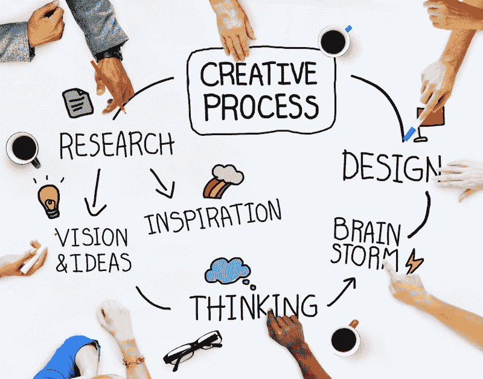
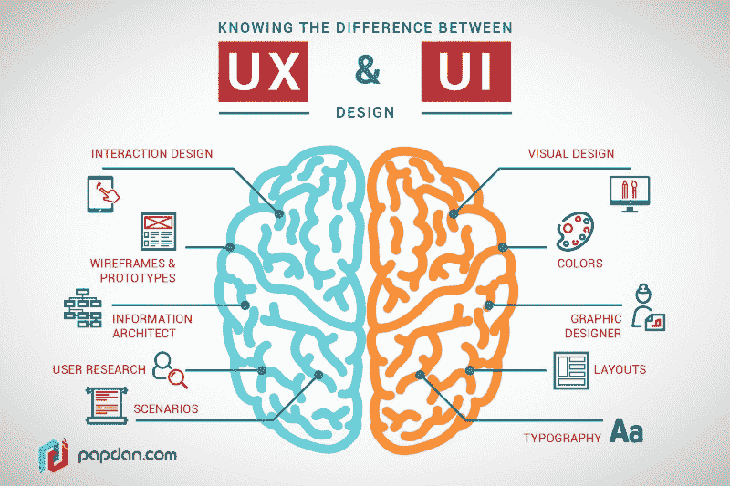
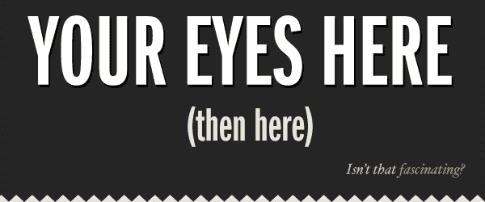
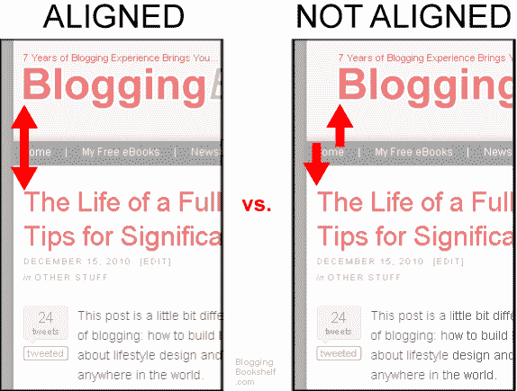
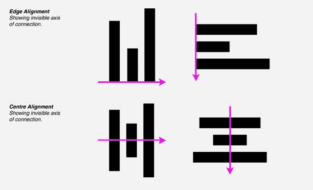

# UX 和 UI 设计有什么区别？

> 原文：<https://www.freecodecamp.org/news/whats-the-difference-between-ux-and-ui-design-2ca8d107de14/>

作者 Harshita Arora

# UX 和 UI 设计有什么区别？

#### 和一些提示让你开始使用这两者。

[Image credits](https://blog.nicolesaidy.com/7-steps-to-become-a-ui-ux-designer-8beed7639a95)

前几天发表了一篇关于[排版](https://medium.freecodecamp.org/how-typography-determines-readability-serif-vs-sans-serif-and-how-to-combine-fonts-629a51ad8cce)的帖子，一篇关于[色彩理论](https://medium.freecodecamp.org/an-intro-to-color-theory-how-to-combine-colors-and-set-the-mood-of-your-designs-79bf5a45b3d)的帖子，一篇关于[从零开始设计手机 apps】的帖子。他们得到了大量的关注，人们和我分享了这些帖子对他们更好地理解设计有多么大的帮助。](https://medium.freecodecamp.org/designing-beautiful-mobile-apps-from-scratch-1a3441ebd604)

所以，我决定写另一篇文章，快速介绍两个非常广泛的主题:用户界面设计和用户体验设计。前几篇文章和这篇文章中的知识可以帮助你成为一名更好的设计师。

### 开始吧！

首先，让我们来回答这个问题:UI 设计和 UX 设计到底是什么，两者之间有什么区别？

[Image credit](http://www.writingfordesigners.com/?p=19528)

简单地说，UI 就是事物如何看起来如何，UX 就是事物如何工作。UX 是一个过程，而 UI 是一个可交付的东西。让我们进一步阐述…

### **用户界面设计**

用户界面设计是一个很大的领域。理论上，UI 是内容(文档、文本、图像、视频等)、形式(按钮、标签、文本字段、复选框、下拉列表、图形设计等)和行为(如果我点击/拖动/键入会发生什么)的组合。

要想做得更好，需要很好的眼光，大量的练习，大量的尝试和错误。作为一名用户界面设计师，你的目标是创建一个吸引人的、漂亮的用户界面，同时也能引起用户的情感反应，使你的产品更可爱、更漂亮。

当我开始时，我从我的导师那里学到了一些东西，那就是对你的产品进行一次导游之旅。把你的应用/网站想象成一次旅行。从在 App Store/web 上发现你的应用程序，到使用它，实现目标或完成应用程序中的任务，每个下载你的应用程序的用户都踏上了一段旅程。这个旅程应该是愉快的。

作为应用程序的设计者，你是设计这个旅程的工匠。所以你不想把所有的信息都扔在屏幕上，希望用户能捡起来。这与好的用户界面正好相反。

相反，你是一个导游，带领用户通过你的应用程序进行一次奇妙的旅程。为了做到这一点，你必须能够将他们的注意力从一个地方转移到另一个地方，引导他们。

设计不仅仅是学习使用设计软件——尽管这当然很重要。软件就像设计师的剑。你需要剑来战斗，但这不是你需要学习使用的全部。你需要学习战斗/游戏的策略、过程、技巧和窍门，以便能够赢得它。在 UI 设计中，你需要集思广益，实验，测试，并理解你的用户和他们使用你的产品的过程。

拥有一个设计良好的产品的好处是你会有更高的用户保留率。

### 关于创建令人愉快的用户界面要记住的事情

1.  在屏幕上，人们总是先看最大的、最粗的和最亮的。

[Image credits](https://emilysb1.coetail.com/2016/02/07/your-eyes-here-then-here/)

这是人的本性。我们的注意力是以这样一种方式设定的，我们首先看到最大的、最大胆的和最聪明的。然后转移到更小、不那么大胆、不那么明亮的事物上。

作为一名设计师，你可以利用这些信息来规划用户的体验。

2.对齐的重要性。

对齐是 UI 设计的一个基本方面。而一个重要的设计原则就是:尽量减少对齐线的数量。它提高了可读性，使设计更悦目。

[Image credits](https://kristindigitalrhetoric1102.wordpress.com/2012/04/12/design-principles-alignment-and-contrast/)

在上面的图像中，左侧的图像有一条对齐线。而右边部分的图像有 4 条对齐线。

这是另一个例子，说明了更少的对齐线如何在改进设计方面发挥巨大作用。

Image on the left has too many alignment lines, while the one on the right has only one and looks more pleasing to the eye! [Image credits](https://www.macworld.com/article/1142984/designtipsali.html)

有两种基本的对齐方式:边缘对齐和中心对齐。

*   边缘对齐是指所有元素的一边或边缘与一条直线对齐。
*   中心对齐是指通过中点将所有元素对齐。

[Image credits](http://www.strohacker.net/strohacker-blog/a-for-alignment-strohacker-studio-a-to-z-of-design-tips)

根据用例，您将选择其中之一。通常，边缘对齐被认为更好。在 Photoshop 这样的设计软件中，对齐元素相当容易。大多数设计软件通常会提供一把尺子/指南来对齐所有的元素。

3.成为注意力建筑师。

这里有两种方法来解释这一点:1)你需要用你的设计抓住用户的注意力。2)你需要关注设计中的每一个细节。要成为一名伟大的设计师，你需要两样都做。后者让你实现前者。

UI 设计是通过引导用户的注意力到不同的重要事情上来为他们量身定制体验。

使用文本吸引用户注意力的方法:

*   使其尺寸变大或变小。
*   颜色更大胆或者更明亮。或者让它静音。
*   相对于薄或轻的字体，使用重的字体。
*   *斜体*字。将一些单词大写或小写。
*   增加每个字母之间的距离，使单词的整体大小占据更多空间。

设计的时候最重要的就是测试！确保你尝试了不同的一切:颜色，字体，色调，角度，对齐，布局等。尝试不同的设计，这样你就可以用各种吸引注意力的方式来设计用户的旅程。

点击阅读更多关于用户界面设计的内容。 [Behance](https://www.behance.net/) 和 [Dribbble](https://dribbble.com/) 是寻找优秀设计并从中获得灵感的绝佳平台。

### 用户体验设计

用户体验(UX)设计是关于创造无痛苦和愉快的体验。

这里有 7 个问题可以问你自己，以了解你的产品的 UX 是否好:

1.  **可用性**:用户使用我的 app 是为了什么？我的应用程序的核心功能是什么？为了让我的应用程序被使用，我需要做些什么？
    现在，我怎样才能让用户在我的应用程序中实现这个目标的步骤最少化？我的用户想通过我的应用实现的主要目标是什么？我怎样才能让实现这一目标的过程变得顺利、快速和愉快呢？
2.  用户描述:你必须知道你的用户是谁，他们想用你的应用达到什么目的。最好的方法是对你的用户进行剖析。
    你必须做一些思考练习来了解你的市场。缩小你的目标/用户群。
    要不断问自己的主要问题是:我的应用程序的核心功能是什么？剖析你的用户，不断地重新评估这个问题。
3.  **请求许可**:如果你的移动应用有推送通知、需要位置服务、与社交媒体、电子邮件等整合，你知道你需要用户的许可，当他们使用你的应用时，屏幕上会弹出一条提醒消息。不要一次问所有的问题，这会让用户不知所措，使用本杰明·富兰克林效应。在请别人帮大忙之前，先请他们帮个小忙。并慢慢地将用户推向某个方向。
    确保你的应用只在用户即将使用该功能时发送许可通知，而不是在他们刚刚启动应用时。
4.  **形式与功能:**设计不总是关于形式——漂亮的配色方案、字体、布局等等。这也与功能有关。永远追求功能胜于形式。
5.  **一致性:**我在整个应用程序中保持一致了吗？我的 app 和我的品牌一致吗？设计的不一致会造成混乱。困惑的用户是不快乐的用户。
    考虑一致性，不仅仅是在外观方面，还要在功能方面。
6.  **简单**:我能不能再简单一点？
    确保你的应用程序不受奶奶的影响，也就是说，老年人可以理解和使用它。一个糟糕的令人困惑的应用程序应该是一排排的按钮，许多不同的颜色，以及一个紧凑的用户界面。
7.  **不要让我思考**:我在给我的用户制造麻烦吗？
    人类不喜欢被迷惑。
    当我们编程时，我们试图让我们的代码尽可能的轻量级和高效。
    当我们在设计时，我们试图让界面尽可能清晰，尽量不让人困惑。而且漂亮！
    尽量让你的措辞清晰明了。

### **伟大的 UX 需要注意的几点:**

1.  不要在应用发布时用冗长的教程来解释如何使用应用。取而代之的是，你希望在用户需要的时候给他们提供一些信息。让它与上下文相关。给出提示和暗示。尝试构建这样的设计，用户在几秒钟内就能理解应用程序，而不需要明确的教程。这就是直觉设计原则的来源！
2.  当一些东西在移动用户的脑海中根深蒂固时，比如拉动来刷新，或者捏来缩放——为你的应用程序坚持这些规则。并且不要将这些行为用于其他目的。就像拉添加一个新的日志条目，它变得超级混乱。我使用的一个日志应用程序做到了这一点，这很令人困惑。
3.  不要把你的用户当成白痴盒。不要给用户弹出/警告来确认一个频繁的动作。只对用户可能会后悔的有害行为进行确认，比如删除某些东西，或者进行购买。不必要的弹出窗口和警告会打断流程，导致糟糕的用户体验。不要让你的顾客感到愚蠢。

点击此处阅读更多关于 UX 设计[的信息，点击此处](https://en.wikipedia.org/wiki/User_experience_design)阅读更多关于 T2 的信息。

### **最终想法**

我希望这篇文章能帮助你理解 UI 和 UX 设计的基本概念。我很乐意听到任何关于这个帖子的反馈或想法。你可以发邮件到 harshita@harshitaapps.com 给我！

你也可以在这里下载我的 app [。所有这些知识之所以成为可能，是因为我想为加密货币价格跟踪、警报和投资组合管理构建一个漂亮而有用的应用程序。构建这个应用程序的旅程教会了我重要的课程并提高了我的技能，我已经在我的帖子中分享了很多。:)](https://itunes.apple.com/us/app/crypto-price-tracker/id1333696099?ls=1&mt=8)

用我最喜欢的一句关于设计的名言来结束这篇文章…

> “设计不仅仅是它的外观和感觉。设计就是它是如何工作的