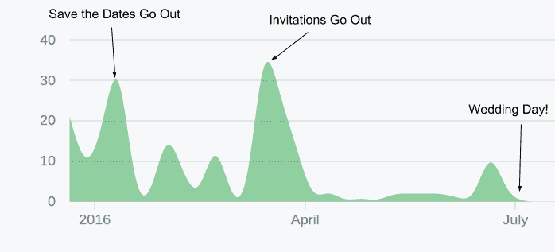
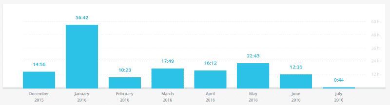
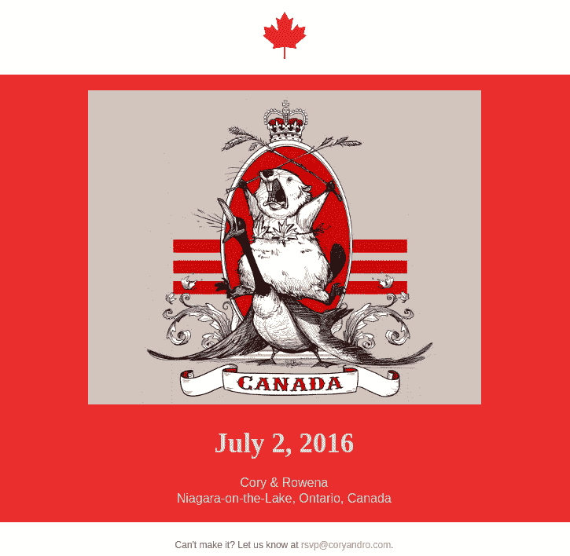
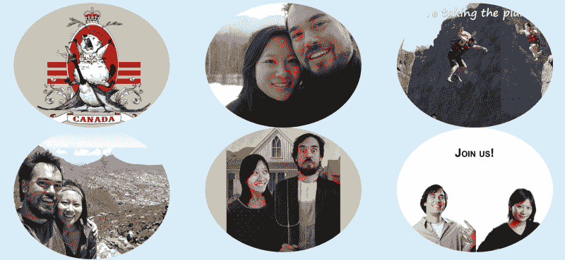
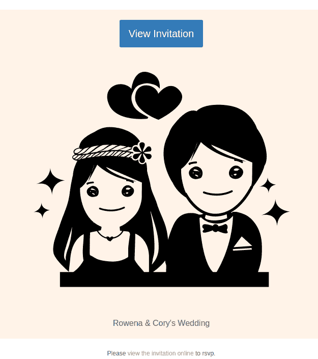
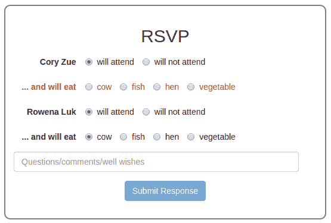
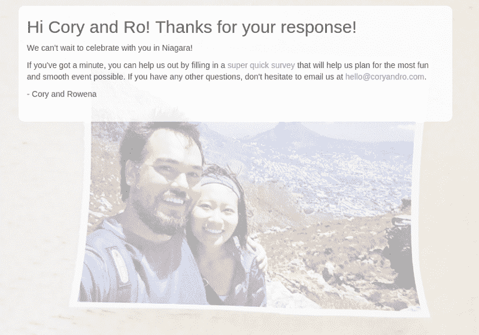
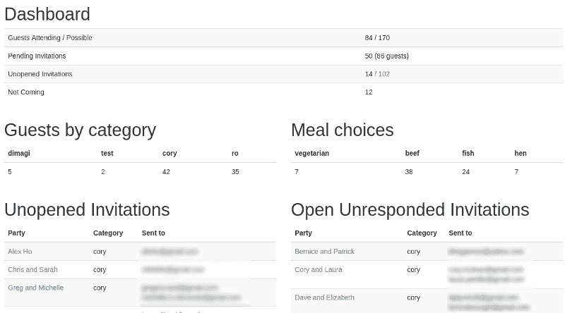

# 当一个 CTO 决定做一个婚礼网站的时候

> 原文：<https://www.freecodecamp.org/news/when-a-cto-decides-to-make-a-wedding-website-256061b64e7f/>

#### 一个开源的、响应迅速的、基于 Django 的婚礼网站和邀请+客人管理系统，有 250 多个提交、单元测试等等。

当我和妻子在 2016 年夏天结婚时，我决定从头开始创建我们自己的婚礼网站。

你问为什么不直接用婚纱照或 Squarespace 之类的东西呢？

主要是因为我认为这将是一个有趣的小项目。作为一名经验丰富的 web 开发人员(当时我是 Dimagi 的 CTO ),我喜欢构建东西，这似乎是一个花几天时间将 HTML 和 CSS 组合在一起并赋予它真正的个人风格的好机会。

当然，比你所说的“范围蔓延”更快的是，一件事情导致了另一件事情，很快我就构建了一个相当重要的应用程序，包括:

*   一个响应迅速的单页传统婚礼网站
*   一个完整的来宾管理应用程序
*   发送保存日期的电子邮件框架
*   邀请的电子邮件框架和内置的 RSVP 系统
*   实时来宾仪表板

18 个月和 250 次提交之后，我觉得写一点关于这个项目的东西并与世界分享会很有趣。

如果你只是想看代码，你可以在 github 上找到。



Commit timeline for the project



My overall timespend on wedding planning (including the website)

### 静态婚礼网站

起初的计划只是做一个标准的、普通的婚礼网站。你知道标准的“这是我们的订婚故事”和“这是活动信息”之类的东西。

当时我有很多制作 Django 网站的经验，但没有很多使用其他框架的经验，所以我决定只在 Django 中制作网站，尽管我不确定我是否需要后端。如果我只是想做一个静态的婚礼网站，更好的选择可能是 T2 的静态网站生成器，但是在我内心深处，我想我知道我想做更多的事情。

对于这个网站，我知道我希望它在视觉上吸引人——至少像我这样的设计有缺陷的后端开发人员能够做到的那样——并且对移动设备友好。我也知道我想要一个单页的应用程序，因为那些都很流行。我最终决定使用 [Twitter Bootstrap](http://getbootstrap.com/) 并修改了一个[免费主题](https://blackrockdigital.github.io/startbootstrap-creative/)来满足我的喜好。

这些都是非常标准的 HTML/CSS/JS/Bootstrap3，所以我不会用细节来烦你。如果你想看成品，你可以在我们的[直播网站](http://www.coryandro.com/)上看到。


One of the navigation UI elements on the site.

### 特征蠕变如何开始

当我们开始考虑保存日期时，我们做的第一个决定是用电子邮件发送。这似乎更有效率，更具成本效益，更环保，而且比试图获得我们所有朋友和家人的地址并手工邮寄要容易得多。(特别是从我们在南非的新家！)

像许多可能是糟糕的决定一样，这个决定以五个非常简单的词开始:“如果……不是很酷吗？”

在我们的例子中，这句话是“如果我们不使用电子邮件或无纸邮件，而是自己发送保存日期，这不是很酷吗？然后我们可以做一些更加个性化和有趣的事情，比如给不同的人发送不同的版本。”

嗯，我想。这听起来很简单。我们只需要制作几个电子邮件模板，然后我们需要的是所有客人的列表和他们的电子邮件地址列表，然后我们可以随机或明确地将他们分配到一个模板，然后发送出去。

听起来像一个超级简单的模型，有一个名字、电子邮件和一些其他跟踪属性。我打赌我能在一小时内做好。

### 输入游客模型

如果我们要给我们的客人发电子邮件，我们需要跟踪他们。幸运的是，由于我选择了使用 Django，这就像创建数据库模型一样简单。

这是我第一次尝试`Guest`模型。

```
class Guest(models.Model):
    name = models.TextField()
    email = models.TextField()
    save_the_date_sent = models.BooleanField(default=False)
    save_the_date_opened = models.BooleanField(default=False)
    invited = models.BooleanField(default=False)
    attending = models.NullBooleanField(default=None) 
```

*Initial Guest model*

姓名，电子邮件，两个字段来跟踪我们是否发送了保存日期，以及他们是否打开了它(这是后来建立的功能)。还有一个字段跟踪他们是否被正式邀请——在开始时，我们有一些人持观望态度(对不起，疯狂的阿姨们！)——以及他们是否参加。与其他人不同，attending 使用了一个`NullBooleanField`而不是一个`BooleanField`，所以我们可以用`None`来表示信息的缺失。

很简单。

### 额外蠕变:这是党的时间

这个模型是一个不错的开始，但是很快我们就遇到了一个问题:那些我们没有电子邮件的人怎么办？还是像我兄弟的孩子一样连电子邮件都没有的人？我们需要一种方式来代表这些人，但我们无法单独跟踪他们的反应。因此出现了`Party`模型——来帮助代表一个`Guests`的集合。

我把大部分元数据从`Guest`模型移到了`Party`，只留下了`Guests`上的`name`、`email`和`is_attending`。在这一阶段，我还决定将名和姓分开——我想这主要是为了匹配我们的来宾电子表格中的格式。我们还决定向 party 字段添加一个“类型”来表示我们的客人是“正式的”还是“有趣的”——因为我们希望向每个人群发送不同的保存日期。

以下是`Guest`和`Party`型号的更新版本:

```
# these will determine the default formality of correspondence
ALLOWED_TYPES = [
    ('formal', 'formal'),
    ('fun', 'fun')
]

class Party(models.Model):
    """
    A party consists of one or more guests.
    """
    name = models.TextField()
    type = models.CharField(max_length=10, choices=ALLOWED_TYPES)
    save_the_date_sent = models.DateTimeField(null=True, default=None)
    save_the_date_opened = models.DateTimeField(null=True, default=None)
    is_invited = models.BooleanField(default=False)
    is_attending = models.NullBooleanField(default=None)

class Guest(models.Model):
    """
    A single guest
    """
    party = models.ForeignKey(Party)
    first_name = models.TextField()
    last_name = models.TextField(null=True, blank=True)
    email = models.TextField()
    is_attending = models.NullBooleanField(default=None)
```

*Second version of the models — featuring the introduction of the Party model.*

### 来宾进口商

我们之前一直在谷歌表单中跟踪我们的客人名单，我们不可能手动重新输入所有这些客人。我们需要一个进口商。

我最终做了一个[非常基本和愚蠢的 CSV 处理器](https://github.com/czue/django-wedding-website/commit/8928de5dc266da86aad5d36d01a916103e8278c6)，尽管关于它的一个重要的事情是它是[幂等的](https://en.wikipedia.org/wiki/Idempotence)——这意味着它可以连续安全地运行多次。我们仍在修改 Google Sheets 中的客人列表，以便能够在现有数据库的基础上不断导入。因为这一部分没有错误似乎很重要，所以我也决定添加一些单元测试，使用[《权力的游戏》](https://github.com/czue/django-wedding-website/blob/8928de5dc266da86aad5d36d01a916103e8278c6/guests/tests/data/guests-test.csv)中的一组客人样本。

```
class GuestImporterTest(TestCase):

    @classmethod
    def setUpClass(cls):
        super(GuestImporterTest, cls).setUpClass()
        cls.path = os.path.join(os.path.dirname(__file__), 'data', 'guests-test.csv')

    def test_import(self):
        import_guests(self.path)
        self.assertEqual(2, Party.objects.count())
        self.assertEqual(4, Guest.objects.count())
        the_starks = Guest.objects.filter(party__name='The Starks')
        self.assertEqual(3, the_starks.count())

    def test_import_idempotent(self):
        for i in range(3):
            import_guests(self.path)
            self.assertEqual(2, Party.objects.count())
            self.assertEqual(4, Guest.objects.count())
            the_starks = Guest.objects.filter(party__name='The Starks')
            self.assertEqual(3, the_starks.count())
```

*Unit tests for the importer*

### 终于准备好开始保存日期

在让模型达到可以支持我们想做的一切的状态后，终于到了开始工作的时候了。

第一步是找到一个适用于所有客户的电子邮件模板——这是一个众所周知的棘手问题。我的妻子(也是一名前网络开发人员)在 litmus.com 找到了一个，并根据我们的需要进行了定制。

因为我们想给不同的客人发送不同的模板，所以我们必须提取出想要定制的模板片段。最终我们得到了一个包含几个可定制部分的模板:标题图像、主图像、背景颜色和文本颜色。相当多乱七八糟的兼容性代码我就不贴在这里了，不过所有的模板都在 github 上[这里](https://github.com/czue/django-wedding-website/tree/master/guests/templates/guests/email_templates)。

我们一起集思广益，想出了一些不同的模板创意，最终形成了六个——两个“标准”的，上面有我们的漂亮照片，三个更傻/有趣，一个是内部笑话，只与为我们公司工作的人有关。



One of our final save the date templates. This one was for my American friends (we got married in Canada).

有了这个基础设施后，我们只需将所有的保存日期添加到一个包含各种可配置属性的列表中，并编写一些代码将这些值插入到一个共享模板中:

```
SAVE_THE_DATE_CONTEXT_MAP = {
    'lions-head': {
        'title': "Lion's Head",
        'header_filename': 'hearts.png',
        'main_image': 'lions-head.jpg',
        'main_color': '#fff3e8',
        'font_color': '#666666',
    },
    'canada': {
        'title': 'Canada!',
        'header_filename': 'maple-leaf.png',
        'main_image': 'canada-cartoon-resized.jpg',
        'main_color': '#ea2e2e',
        'font_color': '#e5ddd9',
    },
    # other templates omitted for brevity
}
```

然后，我们编写了一个简单的函数，根据我们定义的标准半随机地选择一个模板(您可以在评论中看到):

```
def get_template_id_from_party(party):
    if party.type == 'formal':
        # all formal guests get formal invites
        return random.choice(['lions-head', 'ski-trip'])
    elif party.type == 'dimagi':
        # all non-formal dimagis get dimagi invites
        return 'dimagi'
    elif party.type == 'fun':
        all_options = SAVE_THE_DATE_CONTEXT_MAP.keys()
        all_options.remove('dimagi')
        if party.category == 'ro':
            # don't send the canada invitation to ro's crowd
            all_options.remove('canada')
        # otherwise choose randomly from all options for everyone else
        return random.choice(all_options)
    else:
        return None
```

*Choosing a save the date to send based on our unique criteria.*

作为发送前的最后一步，我们决定也让我们网站的登录页面随机选择保存日期(因为每个人只会得到一个模板，我们希望人们看到其他的)。我们最终[将这个页面移到了这里](http://www.coryandro.com/save-the-date/)(如果你刷新，你会得到一个新的)。

```
def save_the_date_random(request):
    template_id = random.choice(SAVE_THE_DATE_CONTEXT_MAP.keys())
    context = get_save_the_date_context(template_id)
    context['email_mode'] = False
    return render(request, SAVE_THE_DATE_TEMPLATE, context=context)
```

*Serving a random save the date on the homepage.*

您可以在下面看到最后一组保存日期。



*The complete set of save the dates.*

最后，我们编写了一个管理命令来处理实际的发送，该命令调用了一个类似如下的函数:

```
def send_all_save_the_dates(test_only=False, mark_as_sent=False):
    to_send_to = Party.in_default_order().filter(is_invited=True, save_the_date_sent=None)
    for party in to_send_to:
        send_save_the_date_to_party(party, test_only=test_only)
        if mark_as_sent:
            party.save_the_date_sent = datetime.now()
            party.save()
```

*Function to send the save the dates with some additional testing options.*

经过大量测试后，我们确信一切正常，是时候按下可怕的“发送”按钮了(或者在这种情况下运行`./manage.py send_save_the_dates --send --mark-sent`)。

几乎同时，我们开始从我们的朋友那里得到一些有趣的回复，谈论保存日期，看着他们对描述不同的模板感到困惑是很有趣的。

总之，由于彻底的测试和准备，这是一个巨大的成功！

虽然我应该注意到，可能并不奇怪，整个事情比预期的时间要长得多。我们才刚刚开始！

### 邀请函

经过几个月备受赞赏的停工期后，你应该发出邀请的三个月截止日期开始临近了。对这次约会的经历总体感觉良好，我们再次决定自己做邀请和回复。这增加了相当多的额外范围。特别是，我们决定要:

*   能够跟踪邀请开启
*   让人们在我们的网站上回复
*   不要求人们登录或输入电子邮件
*   从邀请链接中自动填充客人姓名
*   让人们选择餐点并指定每位客人的出席人数

### 更新模型

所有这些额外的功能意味着另一个重要的模型更新。以下是邀请函完成后的最终`Party`和`Guest`型号:

```
class Party(models.Model):
    """
    A party consists of one or more guests.
    """
    name = models.TextField()
    type = models.CharField(max_length=10, choices=ALLOWED_TYPES)
    category = models.CharField(max_length=20, null=True, blank=True)
    save_the_date_sent = models.DateTimeField(null=True, blank=True, default=None)
    save_the_date_opened = models.DateTimeField(null=True, blank=True, default=None)
    invitation_id = models.CharField(max_length=32, db_index=True, default=_random_uuid, unique=True)
    invitation_sent = models.DateTimeField(null=True, blank=True, default=None)
    invitation_opened = models.DateTimeField(null=True, blank=True, default=None)
    is_invited = models.BooleanField(default=False)
    rehearsal_dinner = models.BooleanField(default=False)
    is_attending = models.NullBooleanField(default=None)
    comments = models.TextField(null=True, blank=True)

class Guest(models.Model):
    """
    A single guest
    """
    party = models.ForeignKey(Party)
    first_name = models.TextField()
    last_name = models.TextField(null=True, blank=True)
    email = models.TextField(null=True, blank=True)
    is_attending = models.NullBooleanField(default=None)
    meal = models.CharField(max_length=20, choices=MEALS, null=True, blank=True)
    is_child = models.BooleanField(default=False)
```

*The final Party and Guest models that were used.*

最重要的变化是将`invitation_id`添加到了`Party`型号中。这是一个 32 个字符的 GUID，我们在邀请 URL 中使用它来防止人们猜测其他人的邀请链接(如果我们使用标准整数的话，这很容易)。`invitation_id`也解决了允许客人不需要登录就可以回复的问题；每一方将简单地具有只有他们知道的唯一的邀请 ID，该 ID 可用于 RSVP。

除了`invitation_id`之外，派对还获得了一些关于邀请函何时被发送和打开的元数据，以及一个供我们的客人填写祝福的评论字段。

与此同时,`Guests`得到了另外两个与 RSVPs 相关的字段——一个用于选择食物，另一个表示他们是否是孩子。我们必须添加最后一个字段，因为我们不想为儿童提供膳食选择，这也有助于我们更好地计划最终的人数和成本。

### 邀请电子邮件和公开跟踪

我们原本打算在邀请邮件中实现一个[跟踪像素](https://skillcrush.com/2012/07/19/tracking-pixel/)来查看它们是否被打开，但最终采用了一个更简单的方法。相反，我们决定让我们的实际邀请电子邮件成为一个“预告片”，将你链接到“真正的”邀请，即你的个性化链接和 RSVP 页面。然后，由于我们的邀请已经是每个派对的个性化链接，我们只是决定将该链接的打开视为邀请的打开。

一旦决定了这一点，当页面第一次打开时，添加一些代码来更新跟踪字段就变得非常容易了。

```
def invitation(request, invite_id):
    party = guess_party_by_invite_id_or_404(invite_id)
    if party.invitation_opened is None:
        # update if this is the first time the invitation was opened
        party.invitation_opened = datetime.utcnow()
        party.save()
```

*Simple tracking when a Party views the invitation page.*

对于电子邮件本身，我们最终使用了与保存日期基本相同的模板，只是这一次电子邮件必须聪明地根据收件人将正确的链接注入邮件中——这是 Django 模板渲染的一个简单过程。



Our invitation email. We found [a graphic online that kind of looked like us](https://www.iconfinder.com/icons/372878/boyfriend_girlfriend_heart_marriage_sweetheart_valentines_wedding_icon) for $1.

### 邀请和回复页面

邀请/回复页面([示例，这里是](http://coryandro.com/invite/b2ad24ec5dbb4694a36ef4ab616264e0/))非常简单(我更像是一个后端开发人员，所以我必须在 UI 端保持简单)。

基本上，它由我们制作的一个简短的嵌入式视频、一些活动细节和一个 RSVP 表单组成。最棘手的部分是验证和用餐逻辑，如下所示:

*   你必须对你聚会上的所有客人做出答复
*   如果你回答“是”，你只能选择一餐
*   孩子们不吃饭

我为 Bootstrap 3 库的 UI 和大部分 javascript 逻辑使用了优秀的[验证器，并且只需添加一点手动 JavaScript 来连接考勤/用餐工作流:](https://github.com/1000hz/bootstrap-validator)

```
$(function () {
    // enable/disable meal choices based on attendance
    $("input.attending-radio").change(function (e) {
        var target = $(e.target);
        if (target.closest('.form-group').data('is-child') === "True") {
            // don't attempt to update meals for children, who don't have them.
            return;
        }
        var value = target.attr('value');
        var mealButtonContainer = target.closest('.form-group').next('.form-group');
        var mealButtons = mealButtonContainer.find('[type=radio]');
        if (value === 'yes') {
            mealButtonContainer.removeClass('text-muted');
            mealButtons.each(function (index, button) {
                button.disabled = false;
                button.required = true;
            });
        } else if (value === "no") {
            mealButtonContainer.addClass('text-muted');
            mealButtons.each(function (index, button) {
                button.checked = false;
                button.disabled = true;
                button.required = false;
            });
        }
        // reload validation
        $(document.forms[0]).validator('destroy');
        $(document.forms[0]).validator();
    });
});
```

*All the client-side validation code that was needed.*

这部分看起来是这样的:



Nice UI and auto enable/disable of submit button courtesy of [Validator for Bootstrap 3](https://github.com/1000hz/bootstrap-validator).

最后，在您提交表格后——这当然会相应地更新您的出席和用餐偏好——我们会带您到一个定制的确认页面，其中包含感谢和一些其他信息。



What you see after you RSVP

### 发送邀请

再一次，由于在发送真正的邀请之前进行了彻底的测试和测试，一切都进行得非常顺利。在回复过程中，我们的客人实际上没有遇到任何错误，这是我引以为豪的事实。

另一方面，在这一点上，我在晚上和周末花了 40 多个小时来建设这个网站。

### 最后一件作品:一个现场嘉宾仪表盘

一旦我们发出了邀请，收到了回复，我们最后想要的就是一个跟踪进度的仪表板。这非常简单——只是一些没有回复或没有看到邀请的人的总数和名单，这样我们就可以直接跟踪他们。



The guest dashboard view.

我们实际上经常使用仪表板！这是一个很好的地方，可以看到我们计划的出席人数，用餐人数，以及我们需要跟进以获得回复的人员名单。这里有一个链接[仪表板视图代码](https://github.com/czue/django-wedding-website/blob/master/guests/views.py#L31-L61)。

> “我发现知道最大可能的与会者人数非常非常有帮助，因为我们需要提供场地这些数字，而且有很大的成本影响。”

> *—我的妻子冰雪睿*

### 结论

如果您已经做到了这一步，那么希望您已经了解了一些关于 Django 的事情，构建这样的东西所需要的工作类型，以及范围是如何快速渗透到最简单的事情中的。

如果您有兴趣在自己的婚礼上使用该项目，请不要犹豫，立即联系我们！Github 上的所有东西都是[的，我很高兴与人们一起工作，让它变得更加开源友好。](https://github.com/czue/django-wedding-website)

感谢阅读！

—科里

### 关于我

我是 Dimagi 的前首席技术官，在那里我领导团队制作了 6 年的 CommCare HQ ，这是我所知道的较大的 Django 代码库之一。我从 2007 年开始开发 Django 应用程序。

我目前正在开发一个 Django SaaS 模板，同时还有其他的项目，包括一个让 T2 在线制作可打印的座位卡的应用和一个用你自己的照片个性化你的新标签屏幕的 Chrome 扩展。

我最初在我的博客上发表了这篇文章，地址是 [www.placecard.me](https://www.placecard.me/django-wedding-website/) 。