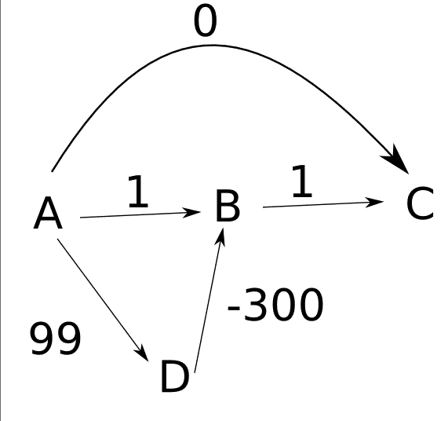

# 什么时候使用贪婪算法，什么时候避免使用贪婪算法[举例说明]

> 原文：<https://www.freecodecamp.org/news/when-to-use-greedy-algorithms/>

贪婪算法试图通过在每一步采取最佳选择来找到最优解。

比如，你可以贪婪地接近你的生活。今天你总是可以选择最大化你幸福的道路。但这并不意味着你明天会更快乐。

类似地，对于一些问题，贪婪算法并不能给出最好的解决方案。实际上，它们可能会产生最糟糕的解决方案。

但是在其他情况下，我们可以通过使用贪婪策略获得足够好的解决方案。

在这篇文章中，我将写贪婪算法和这种策略的使用，即使它不能保证你会找到一个最优解。

第一部分是对贪婪算法和使用这种策略可以解决的众所周知的问题的介绍。然后我会谈到贪婪策略是一个非常糟糕的选择的问题。最后，我将向您展示一个通过贪婪算法实现良好近似的示例。

> **注**:我在本文中讨论的大部分算法和问题都包含了图。如果你熟悉图表，就能从这篇文章中得到最大的收获。

## 贪婪算法如何工作

贪婪算法总是选择最好的可用选项。

一般来说，它们在计算上比其他算法家族更便宜，如动态编程或蛮力。这是因为他们没有过多地探索解决方案空间。而且，出于同样的原因，他们没有找到很多问题的最佳解决方案。

但是有很多问题可以用贪婪策略来解决，在这些情况下，这种策略恰恰是最好的方法。

最流行的贪婪算法之一是 Dijkstra 算法，该算法寻找从图中的一个顶点到其他顶点的最小成本的路径。

该算法通过总是去最近的顶点来找到这样的路径。这就是为什么我们说它是一个贪婪的算法。

这是算法的伪代码。我用`G`表示图，用`s`表示源节点。

```
Dijkstra(G, s):
    distances <- list of length equal to the number of nodes of the graph, initially it has all its elements equal to infinite

    distances[s] = 0

    queue = the set of vertices of G

    while queue is not empty:

          u <- vertex in queue with min distances[u]

          remove u from queue

          for each neighbor v of u:
              temp = distances[u] + value(u,v)

              if temp < distances[v]:
                   distances[v] = temp
     return distances 
```

运行该算法后，我们得到一个列表`distances`，使得`distances[u]`是从节点`s`到节点`u`的最小成本。

只有当图中没有负成本的边时，这种算法才能保证有效。边中的负成本会使贪婪策略选择非最优路径。

用来介绍贪婪策略概念的另一个例子是分数背包。

在这个问题中，我们有一个项目集合。每个项目的权重`Wi`大于零，利润`Pi`也大于零。

我们有一个容量为`W`的背包，我们想用这种方式装满它，以获得最大利润。当然，我们不能超过背包的容量。

在背包问题的分数版本中，我们可以拿走整个对象，也可以只拿走它的一部分。当取第 I 个对象的一小部分`0 <= X <= 1`时，我们获得的利润等于`X*Pi`，我们需要把`X*Wi`加到袋子里。

我们可以通过使用贪婪策略来解决这个问题。这里不讨论解决方案。如果你不知道，我建议你自己尝试解决，然后在网上寻找解决方法。

我们可以用贪婪算法解决的问题数量是巨大的。但是我们不能用这种方法解决的问题更多。下一节是关于后面的问题——那些我们不应该用这种方式解决的问题。

## 贪婪是最糟糕的时候

在上一节中，我们看到了两个使用贪婪策略可以解决的问题的例子。这很棒，因为这些算法非常快。

但是，正如我所说的，Dijkstra 的算法在有负边的图中不起作用。

而且问题更大。我总是能以一种 Dijkstra 的解决方案会像我想要的那样糟糕的方式建立一个带有负边的图！考虑从 [Stackoverflow](https://stackoverflow.com/questions/6799172/negative-weights-using-dijkstras-algorithm/6799344#6799344) 中提取的以下示例



Dijkstra 的算法找不到`A`和`C`之间的距离。它在应该是-200 的时候找到了`d(A, C) = 0`。如果我们减小边`D -> B`的值，我们将获得一个距离，它将离实际的最小距离更远。

类似地，当我们不能打破背包问题(0-1 背包问题)中的对象时，当我们使用贪婪策略时获得的解决方案也可能非常糟糕。我们总是可以为问题建立一个输入，使得贪婪算法严重失败。

另一个例子是旅行推销员问题(TSP)。给定一个城市列表和每对城市之间的距离，访问每个城市一次并返回起始城市的最短可能路线是什么？

我们可以通过总是去最近的城市来贪婪地解决这个问题。我们选择任何一个城市作为第一个城市，并应用这个策略。

正如在前面的例子中发生的那样，我们总是可以用贪婪策略找到最坏的可能解决方案的方式来构建城市的布局。

在这一节中，我们已经看到贪婪的策略会导致灾难。但是存在这样的问题，即这种方法可以很好地逼近最优解。

## 当贪婪不是那么糟糕的时候

我们已经看到，对于某些问题，贪婪的策略可以变得像我们希望的那样糟糕。这意味着我们不能用它来获得最优解，甚至不能得到一个好的近似解。

但是也有一些例子，贪婪算法为我们提供了非常好的近似！在这些情况下，贪婪的方法是非常有用的，因为它往往更便宜，更容易实现。

图的顶点覆盖是最小的顶点集，使得图的每条边在该集合中至少有一个端点。

这是一个很难的问题。事实上，没有任何有效和精确的解决方案。但是好消息是我们可以用贪婪算法做一个很好的近似。

我们从图中选择任意一条边`<u, v>`，并将`u`和`v`添加到集合中。然后，我们删除所有将`u`或`v`作为其端点之一的边，并在剩余的图有边时重复前面的过程。

这可能是前面算法的伪代码:

```
vertexCover(G):
    VertexCover <- {} // empty set
    E' <- edges of G

    while E' is not empty:
          VertexCover <- VertexCover U {u,v} where <u,v> is in E'
          E' = E' - {<u, v> U edges incident to u, v}

     return VertexCover 
```

如你所见，这是一个简单且相对快速的算法。但最棒的是，解永远小于或等于最优解的两倍！无论输入图是如何构建的，我们都无法获得比较小顶点覆盖大两倍的集合。

我不打算在这篇文章中演示这种说法，但你可以通过注意到我们添加到顶点覆盖的每个边`<u, v>`，或者`u`或者`v`都在最优解中(即，在较小的顶点覆盖中)来证明这一点。

许多计算机科学家正在努力寻找更多的这种近似。还有更多例子，但我打算就此打住。

这是计算机科学和应用数学中一个有趣且非常活跃的研究领域。有了这些近似值，我们就可以通过实现非常简单的算法来获得非常困难问题的非常好的解决方案。

## 结论

在这篇文章中，我给你简单介绍了贪婪算法。我们看到了使用贪婪策略可以解决问题的例子。然后，我谈了一些问题，对于这些问题，贪婪策略是一个糟糕的选择。最后，我们看到了一个贪婪算法的例子，它会给你一个难题的近似解。

有时我们可以用贪婪的方法解决问题，但很难想出正确的策略。并且证明贪婪算法(对于精确或近似解)的正确性可能非常困难。所以，关于贪婪算法，有很多东西是可以讨论的！

如果你喜欢这篇文章，并希望我保持这种类型的内容来，让我知道分享它和标记我。你也可以在 Twitter 上关注我，了解更多关于 CS 的内容。