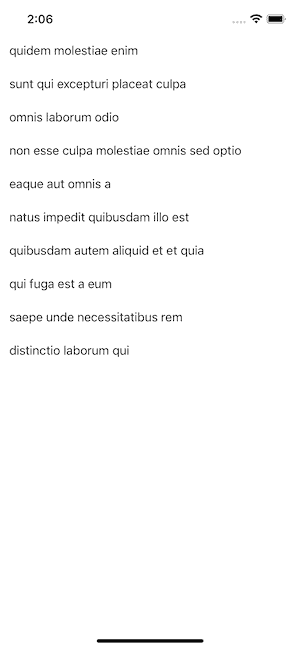
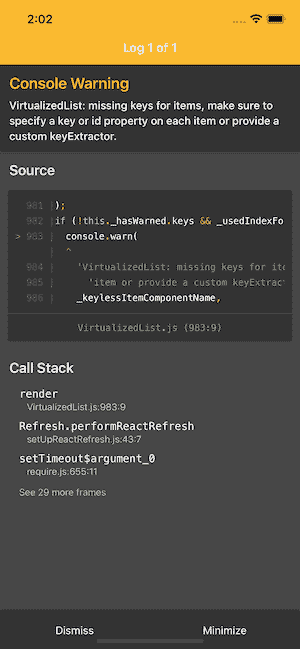

# 在 React Native 的平面列表中何时使用 keyExtractor 属性

> 原文：<https://www.freecodecamp.org/news/when-to-use-keyextractor-prop-in-react-natives-flatlist/>

在 React Native 中，可以使用 [FlatList 组件](https://reactnative.dev/docs/flatlist)来呈现一长串数据。它只在滚动列表中显示屏幕上显示的项目，而不是一次显示所有数据。

要使用`FlatList`呈现一个可滚动的项目列表，您需要将所需的`data`属性传递给组件。`data`道具接受一系列物品。数组中的每一项都代表列表中的一项。

另一个必需的道具是`renderItem`，它从`data`中取出一个项目并将其呈现在列表上。该属性接受一个函数，该函数返回要渲染的 JSX。

为了在可滚动列表中显示一个项目，`FlatList`组件要求每个项目都有一个惟一的键，比如一个`id`。这个键允许`FlatList`组件(因为它使用了[虚拟化列表](https://reactnative.dev/docs/virtualizedlist)来跟踪列表中条目的顺序。

使用`FlatList`组件上的`keyExtractor`属性从数据数组中提取关键字。

在这篇文章中，让我们来谈谈你可能需要在哪里使用`keyExtractor`以及在什么情况下不需要它。

## 如何使用 FlatList 显示项目列表

考虑下面的数据结构。数组中有十个条目，每个条目有两个属性，`id`和`title`。`id`是每个项目的唯一键。

```
const DATA_WITH_ID = [
  {
    id: 1,
    title: 'quidem molestiae enim'
  },
  {
    id: 2,
    title: 'sunt qui excepturi placeat culpa'
  },
  {
    id: 3,
    title: 'omnis laborum odio'
  },
  {
    id: 4,
    title: 'non esse culpa molestiae omnis sed optio'
  },
  {
    id: 5,
    title: 'eaque aut omnis a'
  },
  {
    id: 6,
    title: 'natus impedit quibusdam illo est'
  },
  {
    id: 7,
    title: 'quibusdam autem aliquid et et quia'
  },
  {
    id: 8,
    title: 'qui fuga est a eum'
  },
  {
    id: 9,
    title: 'saepe unde necessitatibus rem'
  },
  {
    id: 10,
    title: 'distinctio laborum qui'
  }
];
```

使用`FlatList`组件，您想要呈现每个项目的`title`,如下所示:

```
export default function App() {
  const renderList = ({ item }) => {
    return (
      <View style={styles.listItem}>
        <Text style={styles.listItemText}>{item.title}</Text>
      </View>
    );
  };

  return (
    <View style={styles.container}>
      <FlatList data={DATA_WITH_ID} renderItem={renderList} />
    </View>
  );
}
```

上述组件的结果将显示一个项目列表，没有任何错误或警告。此外，`FlatList`组件不需要唯一的键来标识每一项，因为原始数据结构已经包含一个名为`id`的键。

以下是上述片段在设备屏幕上的输出:



## 如何使用 keyExtractor 道具

默认情况下，`keyExtractor` prop 检查像`key`和`id`这样的属性(按这个顺序)。如果两者中的任何一个出现在原始数据结构中，那么它将被`FlatList`组件认为是一个惟一键。

在这种情况下(和前面的例子一样)，您不必显式地使用`keyExtractor`属性。

如果两者都没有提供，`FlatList`组件将抛出警告“virtualized list:missing keys for items ...”：



现在，让我们考虑一个场景，其中数据数组包含每个列表项的唯一键，但是唯一键的名称既不是`key`也不是`id`。它包含一个名为`userId`的惟一键属性。

```
const DATA_WITH_USER_ID = [
  {
    userId: 1,
    title: 'quidem molestiae enim'
  },
  {
    userId: 2,
    title: 'sunt qui excepturi placeat culpa'
  },
  {
    userId: 3,
    title: 'omnis laborum odio'
  },
  {
    userId: 4,
    title: 'non esse culpa molestiae omnis sed optio'
  },
  {
    userId: 5,
    title: 'eaque aut omnis a'
  },
  {
    userId: 6,
    title: 'natus impedit quibusdam illo est'
  },
  {
    userId: 7,
    title: 'quibusdam autem aliquid et et quia'
  },
  {
    userId: 8,
    title: 'qui fuga est a eum'
  },
  {
    userId: 9,
    title: 'saepe unde necessitatibus rem'
  },
  {
    userId: 10,
    title: 'distinctio laborum qui'
  }
];
```

在呈现列表时，您会看到这个警告，因为`FlatList`组件没有将`userId`识别为原始数据结构中的`key`或`id`名称。

对于自定义键名，比如上面例子中的`userId`，您将使用`keyExtractor`属性。它提取惟一的键名及其值，并告诉`FlatList`组件根据该值跟踪商品。

对于上面的数据数组，修改`FlatList`组件并使用`keyExtractor`道具提取密钥:

```
<FlatList
  data={DATA_WITH_ID}
  renderItem={renderList}
  keyExtractor={item => item.userId}
/>
```

在此步骤之后，警告将会消失。

## 结论

使用`FlatList`组件时，如果数据数组有唯一的`id`或`key`属性，则不需要显式使用`keyExtractor`属性。但是对于定制的 id 名称，使用`keyExtractor`属性明确地告诉组件要提取哪个惟一键。

如果你想了解更多关于 React Native 的信息，请查看我博客上的 React Native 类别(T1)和 T2 博览会类别(T3)页面。你也可以订阅我的[时事通讯](https://www.getrevue.co/profile/amanhimself)或者在 [Twitter](https://twitter.com/amanhimself) 上关注我，以便在我发布新文章或教程时获得更新。