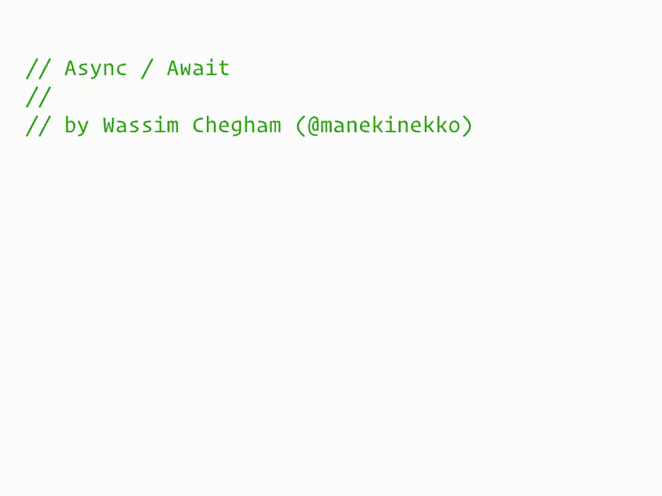

# 何时使用 React 悬念 vs React 挂钩

> 原文：<https://www.freecodecamp.org/news/when-to-use-react-suspense-vs-react-hooks-f66ef94cb54f/>

#### 反应悬念之于单子，正如钩子之于应用符号

单子和应用函子在函数式编程中被广泛使用。它们与用于数据获取的 React Suspense 和 React Hooks APIs 之间存在关系。这是对单子和应用程序的快速简单的介绍，并描述了它们的相似之处。

该帖子是关于未来数据获取的 React 悬念，而不是最近发布的代码拆分的 React 悬念(`React.Suspense`和`React.lazy`)。

#### 单子 do 符号

React 框架方法鼓励开发人员使用函数式编程技术。至少组件呈现函数不应该有可观察到副作用。JavaScript 无法确保这一点，但是有一些编程语言可以做到。比如 Haskell 根本不接受副作用。

纯函数使得代码模块化、可预测且更容易验证。但是它们也大大增加了冗长性。下面是菲尔·瓦尔德的[函数式编程单子](https://homepages.inf.ed.ac.uk/wadler/papers/marktoberdorf/baastad.pdf) (1995)教程中的一段话:

> 在模块化方面，显式数据流既是福也是祸。一方面，它是模块化的极致。所有输入和输出的数据都是显式的和可访问的，提供了最大的灵活性。另一方面，它是模块化的最低点。算法的本质可能被埋没在将数据从创建点传送到使用点所需的管道中。

单子为 Haskell 解决了这个问题。而悬疑/钩子在 React 中解决了同样的问题。

那么什么是单子呢？它是一个简单的抽象接口，有两个功能，我们称之为`of`和`chain`。

*   `of` —接受任意值并返回某个一元(有效)值
*   `chain` —将一个有效值和一个函数从任意值转换为一个有效值，并返回另一个有效值

那里的有效值可以封装任何具体的特定于实现的信息。没有要求它到底应该是什么，它是一些不透明的数据。接口的具体实现应该遵循一套法则，就是这样。

单子是抽象的，没什么好说的了。他们不需要存储任何东西，包装或打开任何东西，甚至连任何东西都不需要。

但是如果它如此抽象，几乎没有定义，我们为什么还需要它呢？该接口提供了一种抽象的方法来组合带有副作用的计算。

如果你用 JavaScript 写代码，你现在可能会想。你已经完成了很多带有副作用的计算，却没有看到任何单子。但事实上，你可以认为你已经在那里用过了。

在计算机科学中，单子最早出现是为了研究命令式语言中的副作用。它们是将命令世界嵌入纯数学世界以供进一步研究的工具。

这样，如果你想把命令式程序转换成表示它的数学公式，用单子表达式来做将是最简单和最直接的方法。它非常简单，你甚至不需要手动操作，有工具可以帮你完成。

Haskell 有一个语法糖，叫做 do-notation，正是为了这个目的。这使得用 Haskell 编写命令式程序成为可能。它的编译器里有一个特殊的工具。它将这样的命令式程序转换成一元纯 Haskell 表达式。这些表达和你在课本上看到的数学很接近。

JavaScript 是一种命令式语言。我们可以认为任何命令式代码都是 do 符号。但与哈斯克尔的不同，它不是抽象的。它只对内置的副作用有效。除了扩展语言之外，没有任何方法可以增加对任何新语言的支持。

有这样的扩展，即生成器、异步和异步生成器函数。JavaScipt JIT 编译器将异步和生成器函数转换成具体的内置 API 调用。Haskell 不需要这样的扩展。它的编译器将 do 符号转换成抽象的单子接口函数调用。

下面是一个异步函数如何简化源代码的例子。这再一次说明了为什么我们需要有一个效果语法。



from [www.async-await.xyz](http://www.async-await.xyz) by Wassim Chegham ([@manekinekko](https://twitter.com/@manekinekko))

对于这篇文章，我们只需要两个 JavaScript 内置效果。姑且称之为突变和例外。它们有明确的含义。突变允许改变一些引用的值。JavaScript 使用`throw` / `try-catch`语句嵌入了异常效果。

我们可以将一些效果转换成另一些效果。这样我们就可以使用生成器编写异步代码。

这个转换技巧也可以应用于其他效果。而且显然，仅仅是突变和例外就足以获得任何其他效果。这意味着我们已经可以将任何简单的函数转化为抽象的 do 符号。这正是悬念的作用。

当代码遇到一些有效的操作并需要暂停时，它抛出一个异常。它包含一些细节(例如一个承诺对象)。它的一个调用者捕获异常，等待参数中的承诺得到解决，将结果值存储在缓存中，并从头重新运行有效的函数。

承诺完成后，引擎会再次调用该函数。执行从其开始，当遇到相同的操作时，它从缓存中返回它的值。它不会抛出异常并继续执行，直到下一个挂起请求或函数退出。如果函数没有任何其他副作用，它的执行应该走相同的路径，所有纯表达式重新计算产生相同的值。

让我们重新实施悬念。与 React 不同，它使用抽象的 Monads 接口。为了简单起见，我的实现还隐藏了一个资源缓存。相反，runner 函数对调用的效果进行计数，并使用当前计数器值作为内部缓存的键。下面是抽象接口的运行程序:

```
/** effectful expression throws this object if it requires suspension */
const token = {};

/** Pointer to mutable data used to record effectful computations */
let context;

/** Runs `thunk()` as an effectful expression with `of` and `chain` as Monad's definition */
const run = (of, chain) => thunk => {
  /** here it caches effects requests */
  const trace = [];
  const ctx = {trace};
  return step();
  function step() {
    const savedContext = context;
    ctx.pos = 0;
    try {
      context = ctx;
      return of(thunk());
    } catch(e) {
      /** re-throwing other exceptions */
      if (e !== token)
        throw e;
      const {pos} = ctx;
      return chain(ctx.effect,
                   (value) => {
                     trace.length = pos;
                     /* recording the resolved value */
                     trace[pos] = value;
                     ctx.pos = pos + 1;
                     /** replay */
                     return step(value);
                   })
    } finally {
      context = savedContext;
    }
  }
}

/** marks effectful expression */
const M = eff => {
  /* if the execution is in a replay stage the value will be cached */
  if (context.pos < context.trace.length)
    return context.trace[context.pos++];
  /* saving the expression to resolve in `run` */
  context.effect = eff;
  throw token;
}
```

现在让我们添加一个具体的异步效果实现。不幸的是，承诺并不完全是单子，因为一个单子定律并不适用于它们，这是微妙问题的来源，但它们仍然适合我们的 do 符号工作。

下面是具体的异步效果实现:

```
const runPromise = run(
  v => Promise.resolve(v), 
  (arg, f) => arg.then(f));
```

这里有一个简单的例子，它在渲染之前等待延迟值:

[https://codesandbox.io/embed/714n51l6mq?from-embed](https://codesandbox.io/embed/714n51l6mq?from-embed)

沙箱还包含`Component`包装器。它将一个有效的功能组件变成一个反应组件。它只是添加了`chain`回调并相应地更新了状态。这个版本还没有阈值回退特性，但是这里的最后一个例子有。

runner 是抽象的，所以我们可以将它应用于其他东西。让我们试试这个`useState`钩子。它是一个延续单子，而不是如其名字所暗示的状态单子。

这里的 Effectful value 是一个将回调作为参数的函数。当运行器有一些值要进一步传递时，调用这个回调。例如当调用从`useState`返回的回调时。

这里，为了简单起见，我使用单个回调延续。承诺还有一个失败传播的延续。

```
const runCont = run(
  value => cont => cont(value),
  (arg, next) => cont => arg(value => next(value)(cont)));

const useState = initial =>
  M(cont => 
    cont([initial, function next(value) { cont([value,next]); }]));
```

下面是一个使用示例，除了 monad 的定义之外，大部分“kit.js”都是复制粘贴的。

[https://codesandbox.io/embed/j79mv6yv0v?from-embed](https://codesandbox.io/embed/j79mv6yv0v?from-embed)

不幸的是，这还不是 React 中的`useState`钩子，下一节将说明原因。

#### 适用的 do 符号

Haskell 中还有另一个 do 符号的扩展。它不仅针对 Monad 抽象接口调用，还针对应用函子抽象接口的调用。

应用接口与单子共享`of`函数，还有另一个函数，我们称之为`join`。它接受一个有效值数组，并返回一个解析为数组的有效值。结果数组包含参数数组的每个元素解析到的所有值。

我用了一个不同于 Haskell 的接口。但是两者是平等的——很容易将 Haskell 的接口转换成这里使用的接口，然后再转换回来。我这样做是因为这个基础在 JavaScript 中使用要简单得多，它不需要任何高阶函数，并且在标准运行时中已经有了它的实例。

在 Haskell 和 JavaScript 中，任何单子都是应用函子。这意味着我们不需要编写应用接口的具体实现，我们可以自动生成它。

如果有默认的实现，为什么我们需要适用的函子？原因有二。第一个是，并不是所有的应用函子都是单子，所以没有我们可以从中生成`join`的`chain`方法。另一个原因是，即使有`chain`，自定义的`join`实现也可以用不同的方式做同样的事情，可能效率更高。例如，并行地而不是顺序地获取资源。

在标准运行时中有一个这个承诺接口的实例。它是`Promise.all`(为了简单起见，这里再次忽略一些细节)。

现在让我们回到州的例子。如果我们在组件中添加另一个计数器会怎么样？

[https://codesandbox.io/embed/3k0j3olk61?from-embed](https://codesandbox.io/embed/3k0j3olk61?from-embed)

现在，当第一个计数器递增时，第二个计数器会重置其值。钩子不应该是这样工作的。两个计数器应该保持各自的值，并行工作。

发生这种情况是因为每次延续调用都会删除代码中其后的所有内容。当第一个计数器改变其值时，整个下一个延续从开始重新开始。在那里，第二个计数器值再次为 0。

在[运行功能实现](https://medium.com/dailyjs/react-suspense-as-a-monad-notation-and-hooks-as-an-applicative-notation-f66ef94cb54f#fae1)中，无效发生在第 26 行— `trace.length = pos` —这将删除当前值(在`pos`)之后的所有存储值。相反，我们可以尝试区分/修补跟踪。这将是用于增量计算的自适应 Monad 的一个实例。MobX 和类似的库与此非常相似。

如果我们只从函数的顶层调用有效的操作，就不会有分支或循环。所有的东西都会被很好地合并，覆盖相应位置上的值，这正是钩子所做的。尝试删除上面两个计数器的代码沙箱中的行。

#### 运输替代方案

使用钩子已经使程序更加简洁、可重用和可读。想象一下，如果没有限制(钩子规则)，你能做什么。这些限制是由于仅运行时嵌入造成的。我们可以通过运输工具来消除这些限制。

[有效的。JS](https://github.com/awto/effectfuljs) 是一个 transpiler，用于将 effectful 嵌入到 JavaScipt 中。它支持一元目标和应用目标。它极大地简化了设计、实现、测试和维护阶段的程序。

与 React 钩子和悬念不同，transpiler 不需要遵循任何规则。它适用于任何 JavaScript 语句(分支、循环、异常等)。它从不从头开始重新播放功能。这样更快。另外，这些函数可以使用任何 JavaScript 内置的副作用。

有效的。JS 不完全是一个 transpiler，而是一个创建 trans piler 的工具。也有几个预定义的和许多调整选项。它支持双层语法，带有有效值的特殊标记(如异步函数中的`await`表达式，或 Haskell 的 do)。它还支持单级语法，其中该信息是隐式的(如悬念、挂钩或具有代数效果的语言)。

出于演示目的，我很快构建了一个类似钩子的 trans piler—[@ effective/react-do](https://github.com/awto/effectfuljs/tree/master/samples/react-do)。调用名字以“use”开头的函数被认为是有效的。只有当函数名以“use”开头或者有“component”或“effective”块指令(函数开头的字符串)时，函数才被转换。

还有“par”和“seq”块级指令，用于在应用目标和一元目标之间切换。启用“par”模式后，编译器会分析变量依赖关系，并在可能的情况下注入`join`而不是`chain`。

下面是一个有两个计数器的例子，但现在使用了 transpiler:

[https://codesandbox.io/embed/mzp619y8wj?from-embed](https://codesandbox.io/embed/mzp619y8wj?from-embed)

出于演示目的，它还为代码分割实现了暂停。整个函数有六行长。在运行时实现[@ effective/react-do/main . js](https://github.com/awto/effectfuljs/blob/master/samples/react-do/main.js)中查看。在下一个例子中，我添加了另一个计数器，出于演示目的，它的渲染被人为地延迟了。

[https://codesandbox.io/embed/nwmxwnp34j?from-embed](https://codesandbox.io/embed/nwmxwnp34j?from-embed)

#### 代数效应

代数效应经常与悬念和挂钩一起被提及。这些可能是内部细节或建模工具，但 React 无论如何不会将代数效果传送到它的用户区域。

通过访问代数效果，用户可以使用自己的效果处理程序来覆盖操作行为。这就像异常一样，能够在`throw`之后继续计算。比方说，如果某个文件不存在，某个库函数会抛出异常。任何调用函数都可以覆盖它如何处理它，忽略或退出进程，等等。

EffectfulJS 没有内置的代数效果。但是它们的实现是一个基于延续或自由单子的小型运行时库。

调用延续还会删除相应的`throw`之后的所有内容。还有特殊的语法和类型规则来获得可应用的(和箭头)API — [代数效果和成语和箭头的效果处理程序](http://homepages.inf.ed.ac.uk/slindley/papers/aeia.pdf)。禁止使用任何需要单子操作的东西。

#### 包扎

transpiler 是个负担，有自己的使用成本。像任何其他工具一样，只有当这个成本小于你得到的价值时才使用它。

你可以通过有效的工作取得很多成就。这是一种编写 JavaScript 程序的新方法。它对于具有复杂业务逻辑的项目非常有用。任何复杂的工作流都可以是简单的可维护脚本。

举个例子，很有效。JS 可以用微小的函数代替悬念、钩子、上下文和组件状态。错误边界是通常的`try-catch`语句。异步渲染是一个异步调度程序。但是我们可以用它进行任何计算，而不仅仅是渲染。

还有许多其他令人惊叹的特定于应用程序的用途，我很快会写更多关于它们的内容。敬请期待！