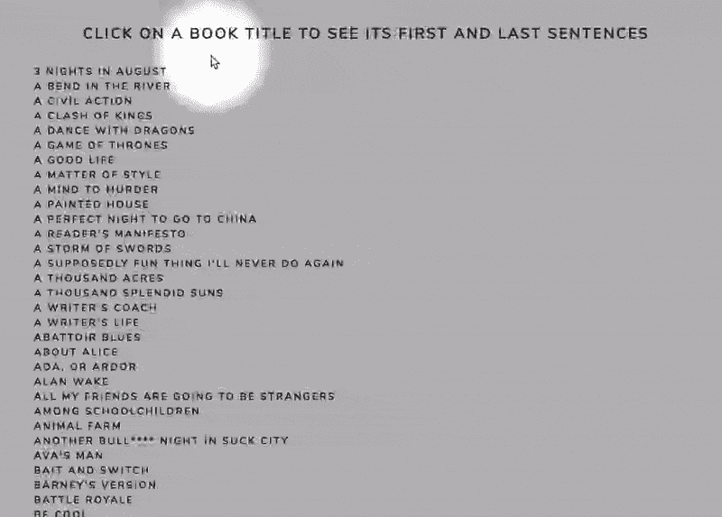
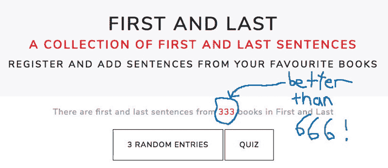
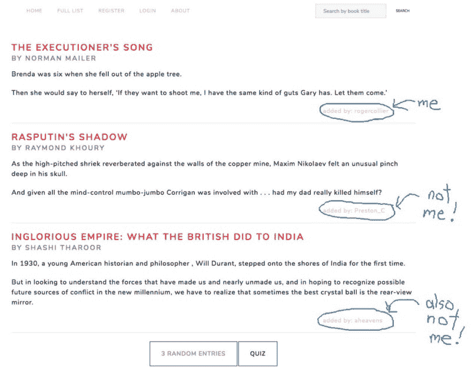

# 当你创建软件来学习编程时，你最重要的用户就是你自己

> 原文：<https://www.freecodecamp.org/news/when-you-create-software-to-learn-programming-your-most-important-user-is-you-c2e57cd5a75f/>

我遇到了一个问题。在我告诉你这个问题之前，要警告你——如果你继续读下去，你会变得情绪化。你会为我心碎。会有哭泣，如此多的哭泣。你可能会想创建一个 GoFundMe 页面来帮助减轻我的负担。

好的，在这里。准备好了吗？拿张纸巾。

我有如此多的运动鞋，以至于我记不起我拥有的每双。悲惨，却真实。红十字会已经宣布这是一次国际紧急事件。

好吧，好吧——这不是一个真正的问题。嗯，也许这是第一世界的第一世界的问题。反正我不是来为我对复古球鞋的痴迷辩解的(怀旧、篮球狂热、多余脚综合征)。我在这里解释为什么我创建了一个 web 应用程序来解决这种超特定的、毫无疑问是琐碎的、类似问题的情况，这种情况只影响到我自己。

I can neither confirm nor deny that I built a shelf in my basement just for (some of) my sneakers.

一年多前，作为一种爱好，我开始学习 JavaScript。我喜欢阅读编程书籍，做教程，看编码视频。然而，最重要的是，我喜欢建造东西。

> 我对我开始的每个软件项目都有一个规则。最终结果必须是我将实际使用的东西。

像其他人一样，当一项任务变得令人沮丧时，我有时需要动力来继续努力。为什么我会在空闲时间坐在这里调试这段代码，而我本可以做一些更简单的事情，比如看电视或在 Instagram 上对 [Air Maxes 流口水？](https://www.instagram.com/p/BgpdPGvgK5h/?taken-by=nicekicks)

当然，我曾经想放弃一个个人软件项目。不会有任何后果。没人会在意。然而我从来没有。我已经完成了我开始的每一个项目(全部三个！)因为我知道，最终，在绞尽脑汁、搜索和轻声咒骂之后，我创建的每一个应用程序都会有用——至少对一个人有用。那个人就是…芭芭拉·史翠珊。抱歉，错别字。而那个人就是……我。

Sneakerhead family photo.

这就把我们带回了鞋子。有些运动鞋收藏家收藏但不摇滚。不是我。我是那种把所有鞋子都穿上的球鞋头型。不过，有时候，我打开一个放了很久的盒子，发现自己正看着一双我不仅没有穿过，而且完全忘记了的鞋子。

> 看到那些可怜的运动鞋就放在那里——被忽视，没穿过，没人爱——让我非常痛苦。当然，没有人遭受过如此难以忍受的痛苦。

但是请收起你的同情，亲爱的读者，擦干你的眼泪。因为我已经纠正了这个可怕的错误，只用了 JavaScript 和我小小的大脑。和节点。而且棱角分明。还有 MongoDB。还有 Heroku。堆栈溢出也有帮助。还有 Git。还有 YouTube。再加上这个叫“enterknit”之类的连接电脑的东西。

He who is first shall be last, and he who is last shall be first. Eventually. My collection is much larger than this demo. I mean, can you even imagine owning only six pairs of sneakers? What am I, a caveman?

我创建了一个非常简单的 web 应用程序，我称之为 Collection Tracker ( [单击此处尝试演示](https://cryptic-reef-56444.herokuapp.com/demo))。它允许我将我的运动鞋收藏输入数据库，并浏览图像网格。每天早上，我打开 Chrome 中的应用程序(在我的手机上)，我选择我想要穿的那双(在我的脚上)，我按下“今天穿”按钮(用我的手指)，那天的日期就被添加到这些鞋子的数据库条目中(通过数字魔法)。

然后，该对的图片下降到最后一页图像的最后位置。因此，当我打开 Collection Tracker 时，我首先看到的是在我的货架上放置时间最长的运动鞋的照片。不再有被忽视的耐克鞋。不再有废弃的 ASICS。不再回避斯凯奇。(哈哈——斯凯奇。好像。朋友不让朋友戴斯凯奇。)

This is just a test. I wouldn’t wear a pair four times in the same month. I have a reputation to uphold.

我可以下载一个现有的应用程序到我的手机来整理我的运动鞋收藏吗？是的，当然。但是你知道吗？使用这个应用程序对我来说更有趣，因为它是我做的。这很傻，但我真的很期待每天早上按下“今天穿”的按钮。因为我知道它会在我的程序中调用一个函数，这个函数会向 Node 生成一个 HTTP 请求，Node 会告诉 MongoDB 更新我的数据库，那天的日期会被推送到云中某处的一个数组中。

> 使用你从零开始创建的软件是一件非常值得的事情。不仅仅是 GitHub 上的文字。它不仅仅是投资组合的一部分。这是你生活的一部分。

我还在使用我制作的第一个 web 应用程序，名为 [First 和 Last](http://www.first-and-last.com/) ，我在[上一篇关于 freeCodeCamp](https://medium.freecodecamp.org/write-better-sentences-and-do-javascript-crud-with-mean-while-mostly-avoiding-acronyms-fe17905bcec5) 的帖子中描述过。它允许用户将书的第一句和最后一句输入数据库。我打算让它成为像我一样喜欢通过研究伟大作家的作品来提高写作技巧的其他作家的学习资源。然而，在我部署它之后的几个月里，我是唯一一个使用这个应用的人，正如你从下面的 GIF 图中看到的。

These sentences were added by me, and by me, and by me, and also by … me.

当然，如果其他人对我的项目感兴趣，那就太好了，但是，再说一次，我对自己是唯一的用户很满意。正如我喜欢使用我的运动鞋追踪应用程序一样，我期待着读完一本书，这样我就可以将它的第一句和最后一句输入我的数据库。然后我点击返回主页，看到显示收藏大小的数字增加了一。他们说你应该享受生活中的小事，这确实是一件小事，但令人愉快的事。

I have to read only 667 more books to reach quadruple digits.

然后，有一天，我在第一次和最后一次访问时注意到了一些事情。有人输入了一对句子——而那个人不是我！事实上，那个人就是…芭芭拉·史翠珊。我再次道歉。我键盘上的芭芭拉·史翠珊键似乎卡住了。让我们再试一次。

事实上，那个人是…另一个人(我假设)。从那时起，大约有 100 人注册并登录了我的应用程序，有些人做出了贡献，我非常感谢。事实证明，当你为自己打造某样东西时，其他人可能会偶然发现并使用它。

Hello other humans! Thanks for the sentences.

学习编程最有趣的部分之一，如果不是最有趣的部分，就是创造实际上能做一些事情的新事物。首先，在文本编辑器上有一个空白屏幕。然后你写了一些代码。然后你有了软件——它可能不优雅、不复杂、不高效，但它能工作。它执行你希望它执行的任务。也许你会成为唯一一个使用这个软件的人。那又怎样？

> 对你有用就有用。

你可能没有拯救世界，或者赚了什么钱，或者吸引了很多用户，但是你从无到有做出了一些东西。你学到了很多，创造了一个工具，让你的生活变得更方便，或者更有趣。你为宇宙增加了一些有价值的东西——也许是有限的价值，但仍然是有价值的。唯一保证没用的代码是你不写的代码。