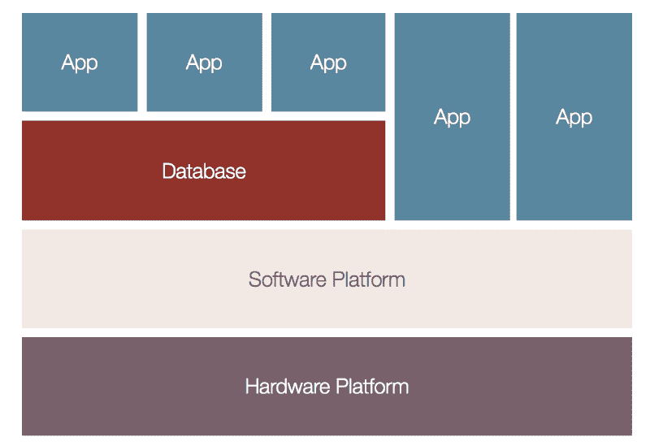
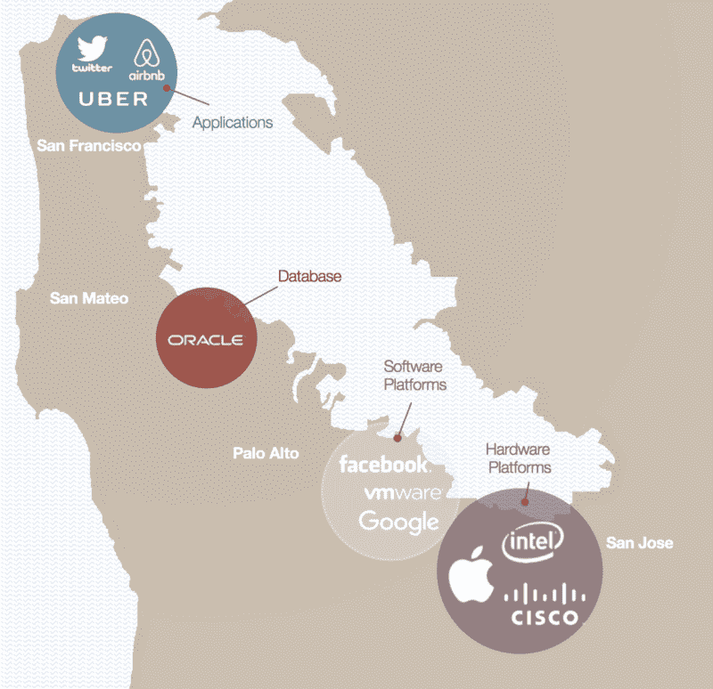

# 哪里能找到顶尖人才:硅谷的系统地图

> 原文：<https://www.freecodecamp.org/news/where-to-find-top-talent-the-systems-map-of-silicon-valley-4bb14b98da4a/>

作者:Jedidiah Yueh

# **哪里能找到顶尖人才:硅谷的系统图**

当我创办第二家软件公司时，我的一位风险投资人问我是否真的打算在奥兰治县这样的“荒地”上再建一家科技公司。

一片*荒地*？

我在硅谷度过了相当长的一段时间。它看起来与新港海滩、拉古纳海滩或科罗纳德尔玛——奥兰治县的美丽海滩城市——有很大不同。

你看到的不是绵延的土地和无尽的阳光，而是漫无目的地蜿蜒穿过库比蒂诺、门洛帕克、山景城和帕洛阿尔托密集的旧街区的破败道路。科技精英的现代豪宅与 20 世纪 70 年代的破旧公寓楼仅一街之隔。

我在南加州长大，所以我在那里创办了我的第一家软件公司 Avamar ( [被 EMC](http://www.eweek.com/storage/how-avamar-s-jed-yueh-caught-the-ultimate-fullback) 以 1.65 亿美元收购)。有了第一个成功的结果，不到一个月就为我的第二家软件公司[德尔福](http://www.delphix.com)筹集到了资金。

但是我花了一点时间来思考我从 Avamar 中学到的经验。

我们开创了一项改变行业的技术，但我们推出产品太迟了。我们遥遥领先两年，但一家硅谷竞争对手超过了我们。随着我们规模的扩大，我们很难找到高质量、有经验的高管来填补关键职位，只能从愿意从远处转移的一小批人中招聘。

最终，我们以 1.65 亿美元的价格售出，我们的竞争对手以 24 亿美元的价格售出。

我没花多长时间就做了决定。

#### 位置，位置，位置

我不得不承认寻找人才的第一条规则:位置，位置，位置。2009 年，我们把德尔福搬到了硅谷，在那里你可以以在新港海滩支付的价格买到三分之一的房子。但是当然，这里没有海滩。

高昂的住房费用压缩了可支配收入。结果，房子看起来更破旧了，汽车开着到处都是叮当声和凹痕，人们看起来有点邋遢和邋遢。我称之为技术税。

战略上位于技术的中心，你有特权在繁忙的街道上购买 200 万美元的拆卸品，并有机会惊奇地注视着流动的技术人才群。

但是这种天赋是强大的。

当我接入硅谷的网络时，我遇到了成就卓著、能说会道的工程师，他们已经创建或设计了一些企业数据管理领域最大的产品。

就像工程师长在树上一样。我想尽快挑选出有才华的人。

#### 经验教训

我为此付出了代价，在 Avamar 对工程进行了次优化。我们不仅仅是推迟了产品的发货。我们晚了四年才发货。我们花了数年时间来消耗质量尾巴——一个产品可靠地支持不同规模的成千上万个客户所需的质量。

在奥兰治县，很少有上市软件公司。我们雇佣了我们能找到的最优秀、最聪明的工程师。许多人作为承包商为政府工作，构建复杂的软件程序，如 Ada 编译器。我后来意识到，承包商经常把自己融入他们的项目中。通过编写复杂的、难以支持的解决方案，您可以保证工作的安全性。

这种依赖于承包商的工程在企业软件领域是行不通的。我们需要发布能够正常工作的软件。

随着我的网络扩大，我遇到了越来越强的工程师，并决定我们必须在德尔福拥有最好的。

但是工程师和大多数人一样，不喜欢通勤。甚至在硅谷内部，位置也很重要。

当我们为第一家德尔福总部选址时，另一位风险投资家对我说，“你为什么不把办公室设在雷德伍德城，就在甲骨文总部旁边？你可以挂一个牌子，上面写着，‘来加入下一个甲骨文吧。’"

我不确定他是不是在开玩笑。

为了构建像我们这样复杂的数据管理解决方案，我们需要来自世界上一些顶级数据库公司的工程师，从 Oracle 开始。但是我们也需要解决低级系统问题的优秀工程师，比如卷管理器和文件系统。

#### 熟悉的布局

当我仔细研究硅谷时，我得出了一个有趣的结论:硅谷的地理布局就像一个系统地图。

基本的应用程序系统图如下所示:

[disruptordie.net](http://disruptordie.net)

底部是硬件平台，包括计算机处理器、网络路由器和存储阵列等项目。随着你在堆栈中向上移动，你有软件平台，如苹果的 Mac OS 或 iOS 操作系统，它们掩盖了不同硬件组件的复杂性。

再往上一层，就有了 Oracle 这样的数据库，它们是驱动当今复杂应用程序的数据引擎。在堆栈的顶部，您有直接与最终用户交互的前端应用程序，如企业资源规划(ERP)解决方案和您手机上的应用程序。

在硅谷的物理世界中，280 号高速公路和 101 号公路在旧金山和圣何塞之间创造了一个人工岛。第一批硬件巨头如英特尔、惠普和思科在南湾涌现。

随着计算机硬件产业的成熟，它引发了系统堆栈的下一个层次:软件平台。随着软件平台的成熟，它们产生了堆栈中的下一层:数据库。随着数据库的成熟，它们产生了越来越复杂的应用程序。每一层都随时间解锁下一层。

旧金山像磁铁一样吸引着新的层次，这导致了一件有趣的事情:硅谷像系统地图一样展示自己。

[disruptordie.net](http://disruptordie.net)

英特尔、思科、苹果等硬件公司坐在最底层。VMware、脸书和谷歌等软件平台位于它们之上。世界上最大的数据库公司 Oracle 紧随其后，位于旧金山和南湾之间。

每天都有越来越多的应用公司出现在三藩市，包括优步、Airbnb 和 Twitter。

#### 与 Delphix 一起前进

经过我的分析，我们在帕洛阿尔托放弃了德尔福，就在甲骨文和硬件公司之间。我们从这两个方面吸引了我们的工程和管理人才。

在过去的十年里，应用变得越来越有杠杆作用，使得 Ubers 和 Airbnbs 似乎在一夜之间成长为令人敬畏的 Appzillas。

因此，人口结构发生了重大变化。有才华的年轻工程师希望在所有热门应用公司的总部工作。他们想住在大城市。

这两项优势使得旧金山成为硅谷的新中心。

在德尔福，工程人才是第一位的，所以我们遵从硅谷的法律，在这座城市开设了第二个办事处。

结果呢？我们在搬家的那年年底发货。2009 年 12 月，史泰博成为我们的第一个客户。在那之后，我们一个品牌接一个品牌，超过 30%的财富 100 强。我们拥有业内最高的客户满意度和保留率。

如果你需要雇佣世界顶尖的软件工程师，他们可能在加州湾区。他们可以帮助你建造你的火箭飞船。

只要确保你在正确的地方寻找它们。

感谢阅读！

如果你喜欢这篇文章，请按住下面的按钮？帮助其他人找到它。你拿的时间越长，你给的掌声就越多！

#### 关于我

我花了 20 年时间解码创新，收集驱动当今许多最成功的技术企业家的隐藏框架。我亲自实施了这些框架，在 Delphix 和 Avamar 开发了软件产品，销售额超过 40 亿美元。**(亚马逊上有售)是我的第一本书。**

**本文部分内容摘自 *Disrupt or Die。***

**在下面注册以获得定期更新、创新笔记和一路上的小趣闻。你还可以免费得到我的书的前五章。**