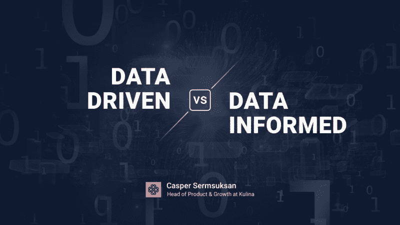
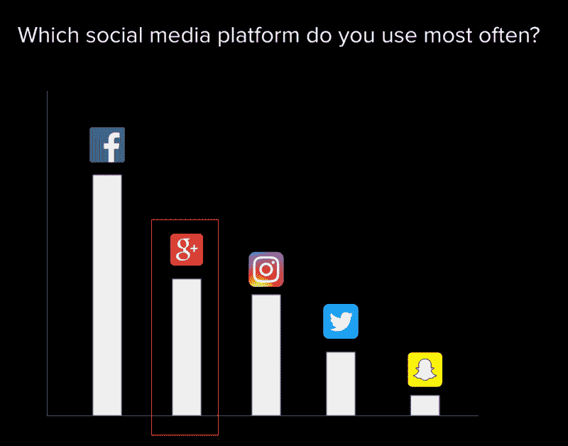
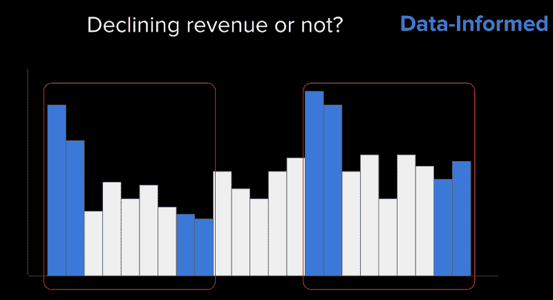

# 哪个更好？数据驱动还是数据通知？

> 原文：<https://www.freecodecamp.org/news/which-is-better-data-driven-or-data-informed-cba4d2c9cf42/>

卡斯帕·瑟姆苏克桑

Images & Illustrations by Murtiono Widi

# 哪个更好？数据驱动还是数据通知？

我最近在雅加达举行的[亚洲技术](http://events.techinasia.com/pdc/)产品开发会议上谈到了数据驱动与数据通知。会后，有几次有人找我讨论这个话题，并在其他活动上发言。由于参加我的演讲的人发现它很有用，我想我应该与全球社区分享它。

“数据驱动”一词已经成为一个时髦词，加入了其他酷的、技术术语的行列。这包括颠覆性、旋转、设计思维等等。所以，让我先试着让我们达成共识。

### 什么是数据驱动？

数据驱动意味着让数据成为团队和公司决策过程的中心。数据是您公司的重要组成部分。决策者的回答大多是，有时仅仅是基于数据。有些决定可以在没有人参与的情况下做出。

来自数据驱动型公司的一些对话如下:

*   让我们对此进行 A/B 测试，并实现结果更好的版本
*   “除非你有数据，否则不要跟我说话”
*   “我们只是按照数据告诉我们的去做”

数据驱动的组织将跨团队和职能部门实施这一流程。这意味着每个团队(如产品、营销、客户成功和运营)都在所有决策中大量使用数据。

### 有什么好处？

#### 它消除了决策过程中的大量人为偏见

事实上，我的一位导师米沙·切拉姆创造了 T2 抽认卡来帮助你记忆它们。数据有助于团队成员和利益相关者达成共识，减少他们自己的判断。

#### 因为我们把人类排除在外，所以耗时更少

你们中有多少人参加过一个长达 3 小时的会议，会上人们争论不休，毫无妥协的迹象？如果你在创业公司工作就更好了。有时我们为了做这件事而讨论和争论，然后由[河马](https://www.forbes.com/sites/derosetichy/2013/04/15/what-happens-when-a-hippo-runs-your-company/)做最后的决定。是的，我知道你的感受。

事实上，麻省理工学院的一项研究已经证明了数据驱动的好处。Erik Brynjolfsson 教授和他的同事研究了 179 家大型上市公司，并得出结论，这些公司的生产率和利润比竞争对手高 5%。

### 然而，数据驱动也有其缺点。

#### 它需要大量的数据来保证决策的准确性

你必须小心异常值的扭曲。异常值是不同于平均数据的数据点。在游戏中，正异常值被认为是“[鲸](https://venturebeat.com/2013/03/14/whales-and-why-social-gamers-are-just-gamers/)”这些顾客要么购买大宗商品，要么经常购买。他们为公司创造了大量的收入。

在我之前的公司，我们甚至创造了一个术语，“捕鲸”在其他行业，可能是那些使用你的产品解决不同问题的客户，而不是你的大多数客户。

他们的行为是如此的不同，以至于他们应该被排除在你的数据之外，来决定你的普通顾客。一些数据点和异常值会把你的公司引向你不想去的方向。

#### 它需要拥有数据科学知识和大量资源的人才能受益

对于刚刚成立数据科学部门的初创公司和组织来说，由于缺乏能力和资源，可能很难完全由数据驱动。当前员工可能没有足够的知识来构建基础架构。有些公司甚至可能没有精通数据的人。

在我之前的公司，我们有 10 名数据科学家。在我目前在 [Kulina](https://www.kulina.id/) 的职位上，我们有 0.5 个人(我自己和我们的技术主管)。

#### 我们收集数据的方式仍然存在偏差

大多数时候，人们说的并不是他们做的。因此，如果我们通过含蓄地询问他们来收集数据，我们就有可能在错误的信息上做出决策。

例如，在优步丑闻和#删除 Uber 运动期间，我的大多数朋友*说*他们再也不会用优步了。当 Lyft(其在美国的主要竞争对手)收取附加费时，他们回去订购了优步的常规航班！

#### 让我们看一个来自我的经历的例子

一个很好的例子是，当我们试图找出哪个社交媒体平台应该花更多的时间和金钱来吸引我们的用户。我们发出了一份调查询问他们，结果相当令人惊讶。不出所料，我们看到脸书名列榜首。然而，让我们困惑的是，Google+在榜单上排名第二(谷歌团队对此并无异议)。

一些团队成员问我是否同意让他们花更多的时间来建立我们的 Google+形象。“也许我们不太了解我们的用户，”一位团队成员提到。

由于是数据驱动的，我可能会对此开绿灯。但是像往常一样固执，我和另一个产品营销经理讨论可能出了什么问题。

我们得出一个结论，我们的用户可能不明白 Google 和 Google+的区别。我们更深入地研究了这个问题的提问方式。

我们在调查问卷中没有使用图标，而是使用了 Google+。如果您没有密切关注调查，您可能会认为我们在问您是否使用谷歌！

### 什么是基于数据的决策？

做出基于数据的决策只把数据作为一个可以不时忽略的因素。这种决策考虑到了其他因素，如客户体验、直觉、品牌一致性和河马领先。

#### 好处是数据会受到质疑

因为我们不纯粹根据数据做决定，我们可以用它来创造一个假设。再好的数据也有它的局限性。这只是现实的快照，并没有描绘出我们客户旅程和行为的全貌。我们需要利用其他因素来帮助做出更好的决定，包括我们自己的判断。

一个这样的例子发生在我之前的公司。我们游戏业务的本质是在周末获得巨大的收入，因为那是我们的用户玩游戏的时候。在一个周一，一位新产品总监就周末收入低的问题找到我，他非常担心。

凭着一些经验和猜测，我怀疑我们的收入下降是因为我们在前一个周末进行了一次销售。在过去的五次销售中也出现了同样的效果。

如果我们看看之前的同一个周期，我们的平均值实际上更好。我们后来发现，这是因为我们发起的一场营销活动遇到了这个具体问题。

#### 脸书的新闻推送版本移动了关键指标，实际上是在没有数据驱动的情况下完成的

Adam Mosseri 和他的团队当时决定创建没有数据的新闻提要。事实上，它得到了很多负面反应，用户很愤怒，甚至创建了一个脸书组[我自动讨厌新的脸书主页](http://www.businessinsider.com/mark-zuckerberg-joins-facebook-group-i-automatically-hate-the-new-facebook-home-page-2009-10/?IR=T)。在这里观看他的演讲。

> “归根结底，我们必须有勇气在没有数据的情况下做出大胆的决策。”—亚当·莫塞里

#### 这并不意味着基于数据的决策没有缺点

它需要大量的时间来讨论和分析，并且不容易形成结论。但是记住在一天结束的时候:

> “世界上所有的数据都无法修复一个根本上糟糕的产品。”安迪·卡沃尔

为了创新并为客户打造合适的产品，我们不能只是坐在房间里看着一排排的数据和图表。

**提示:**数据不一定总是大数据。

构建产品的关键是:

*   通过与客户交谈收集定性反馈
*   通过可用性测试观察客户的挣扎
*   弄清楚客户雇佣你的工作

### 所以，我给你的建议是

对于较小的公司，你应该始终致力于更多的数据驱动。您可能不会利用您收集的数据，甚至根本不会收集这些数据。你拥有的数据越多，你产生的假设就越好。

对于较大的公司，做出大胆的决策，不仅要改变关键指标，还要改善客户体验。我们应该使用数据来帮助我们做出更好的决定，但不要百分之百地依赖它！

你也可以在这里看到幻灯片，其中包含了与我的演讲[略有不同的信息。](https://www.slideshare.net/TechInAsiaID/data-informed-vs-data-driven-by-casper-sermsuksan-kulina)