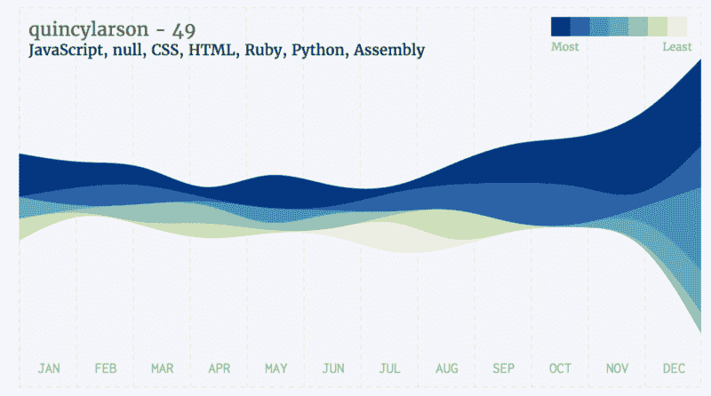
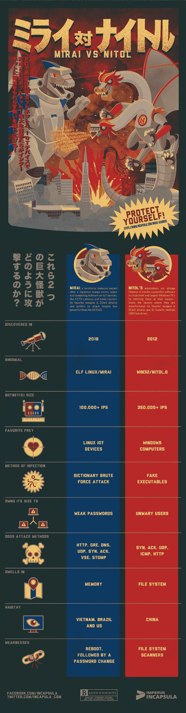

# 2016 年哪些编程语言获得了最多的 GitHub 之星？

> 原文：<https://www.freecodecamp.org/news/which-programming-languages-got-the-most-github-stars-in-2016-34cd556dfe10/>

由免费代码营

# 2016 年哪些编程语言获得了最多的 GitHub 之星？

这里有三个值得你花时间的链接:

1.  2016 年哪些编程语言获得了最多的 GitHub 之星？制作你自己的图表，就像我上面制作的那样( [5 分钟阅读](http://bit.ly/2k0jq6s)
2.  扑克是对抗人工智能竞争的最新游戏
3.  见见机器人律师，他帮助人们争论他们的停车罚单，成功率为 40%

额外收获:在 CodePen 上使用 VueJS 框架的简短入门( [30 分钟观察](http://bit.ly/2jxiwl9))

### 想到这一天:

> “电脑没用。他们只能给你答案。”——巴勃罗·毕加索

### 每日一图:

这是由 [Incapsula](https://www.incapsula.com/blog/mirai-vs-nitol-infographic.html) 制作的两个最大的僵尸网络之间令人敬畏的信息图表对决:Mirai 未来组合 VS Nitol。

编码快乐！

–昆西·拉森，自由代码营的老师