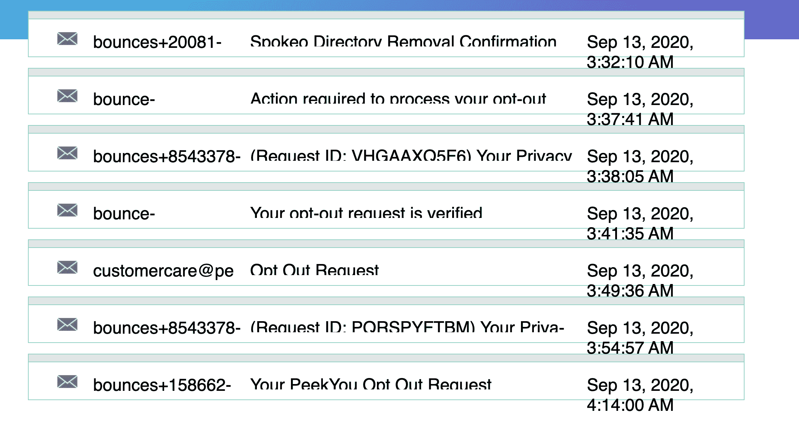
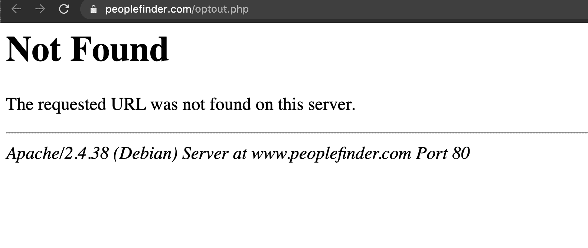
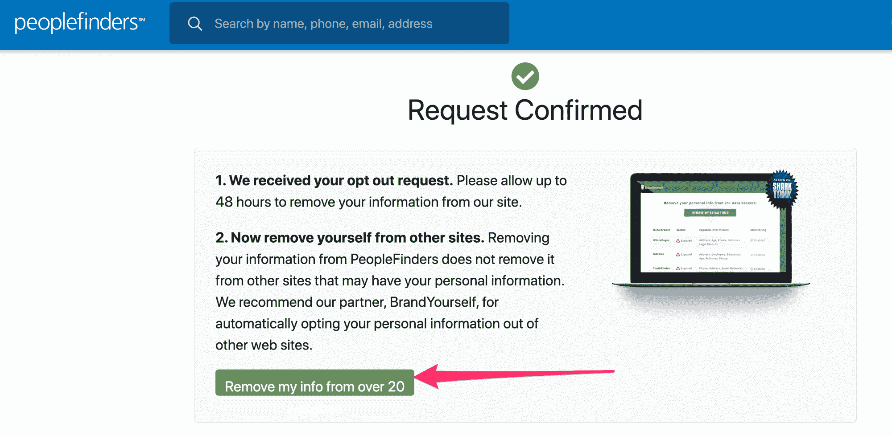
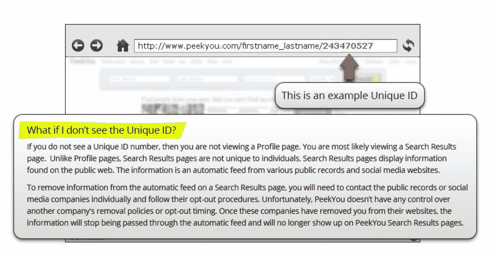
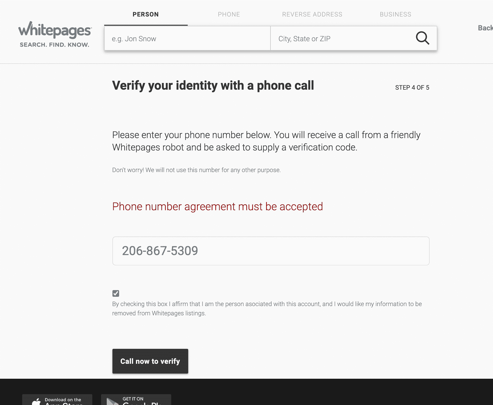
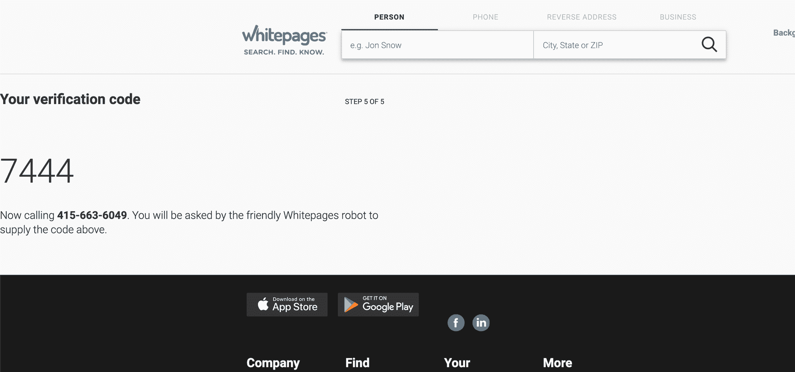
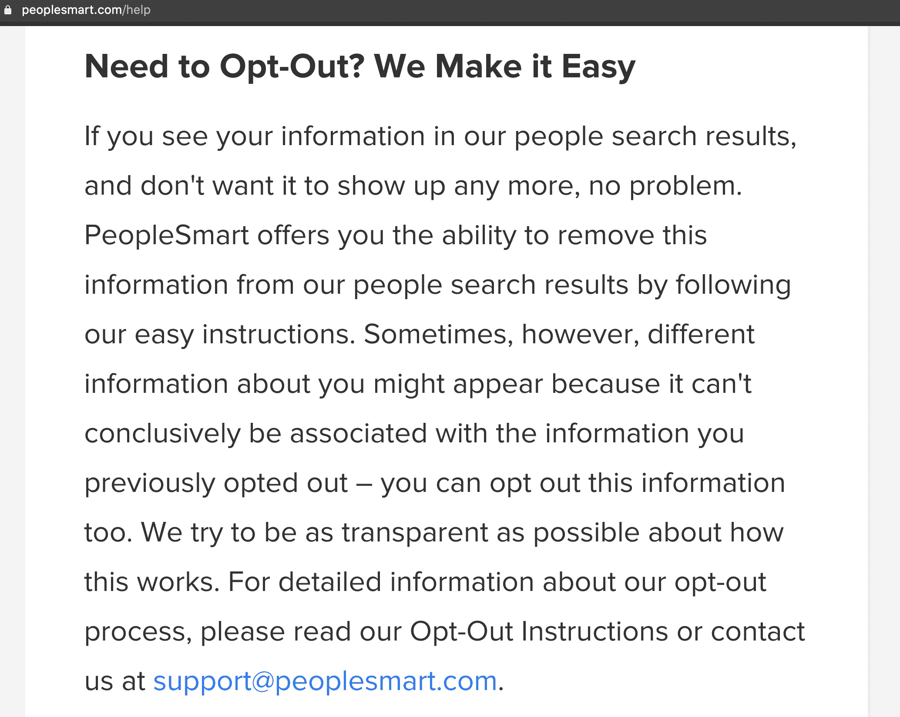
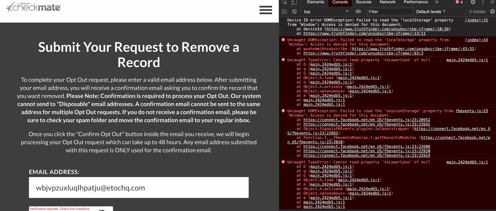

# 白页删除–从 Spokeo 搜索、我的生活、人员查找工具中删除您的信息

> 原文：<https://www.freecodecamp.org/news/white-pages-removal-remove-information-spokeo-peoplefinder-whitepages-opt-out/>

你知道有一个超级粗略的地下网站出售你的个人数据给任何令人毛骨悚然的兰多将支付它吗？

即使你不在社交媒体上，随机的跟踪者类型也可以访问关于你的各种事实，包括:

*   你的年龄
*   你的感情状况和婚姻史
*   您用过的电子邮件地址和电话号码
*   你住过的地方和你现在的地址
*   你的任何法庭记录(包括传票和逮捕)
*   甚至是你孩子的信息。你的孩子！

这太令人毛骨悚然了，在任何正常的世界里，这都是违法的。但这看起来至少是半合法的。我们谈论的是一个价值数十亿美元的产业。

你可能听说过 Equifax、Experian、Transunion 等“数据经纪人”。这些都是根深蒂固的，甚至与美国政府合作。

但是有一整类的数据经纪人你可能没有听说过，他们把你所有的私人数据收集到现代的 SaaS 平台上，然后卖给任何愿意支付月费的人。

## 如何从这些人员查找类型的网站中删除您的数据

好消息是，你可以通过一个电子邮件确认过程来选择退出这些网站。

在这篇文章中，我将带你了解如何一次性退出一些最大的项目。具体来说:

*   发言人
*   人员查找器
*   人员查找工具
*   PrivateEye.com
*   MyLife.com
*   因特留斯
*   皮京子
*   已验证
*   他们中的爷爷:WhitePages.com

请记住，这样的网站有几十个，而且每年都会出现新的网站。唯一的长期解决办法是向美国政府施压，要求其更好地监管这一行业，或者彻底取缔这一行业。

有了这些网站，人们很容易感到绝望。但是你选择退出的每一个网站都稍微降低了有人试图跟踪你或窃取你的身份的可能性。

这是非常值得你花时间和精力去争取的。所以让我们开始吧。

## 对抗数据经纪人的第一条规则:不要给他们更多你的数据

在你开始选择退出的狂欢之前，你应该采取一些预防措施，这样你就不会在这个过程中给这些邪恶的公司提供更多的信息:

1.  如果你有 VPN 的话，我建议你使用。VPN 可以屏蔽你的 IP 地址和位置。如果你真的想要安全，你甚至可以[建立自己的 VPN 服务器](https://www.freecodecamp.org/news/how-to-set-up-a-vpn-server-at-home/)。
2.  匿名模式可以防止这些网站访问您的 cookies、本地存储、自动完成数据以及您可能保存在浏览器中的其他数据。如果你在 Chrome 浏览器中，你可以通过点击菜单栏中的“文件”，然后点击“新建匿名窗口”来打开一个匿名窗口。
3.  最后，我建议使用像 10minutemail.com 这样的临时电子邮件服务来确认邮件。这样你就不会给这些数据经纪人你当前的电子邮件地址。之后，您可以将确认信息发送到您自己的个人电子邮件中，以供记录。

另请注意，本文将重点关注“易得之果”数据经纪人，在这种情况下，一封简单的电子邮件确认就足以删除您的数据。

还有很多其他的数据经纪人要求你千方百计，比如给他们打电话，给他们发信件，给他们发传真(是的，给他们发传真)，甚至给他们发一份你的身份证复印件来确认你的身份。如果你能抽出时间来做这件事，我为你鼓掌。但是，如果您没有时间，这篇文章仍然会有所帮助。

同样，我不会讨论这些难以触及的数据经纪人，而是将重点放在容易摘到的果实上。

在你的会话结束时，你应该有一个收件箱，里面全是退出确认，就像这样。



Taking back your privacy one opt-out at a time

### 如何退出 Spokeo 搜索

第一步:去[Spokeo.com](https://spokeo.com)，在那里找到你自己。

第二步:从地址栏复制网址。你需要这个来退出。

第三步:去[https://www.spokeo.com/optout](https://www.spokeo.com/optout)

第四步:粘贴你的发言人资料的网址，并输入你的电子邮件地址。准备在验证码中识别一些公交车和红绿灯。(是的，你今天会经常这样做。)

第 5 步:检查您的电子邮件的验证电子邮件，并按照其指示。

### 如何从 MyLife.com 搜索中删除您的信息

没有办法直接在网上退出我的生活，所以你需要给他们发一封电子邮件。如果你这样做，你需要在你的电子邮件中包含一些数据，但是你可以只包含他们网站上已经列出的数据。

第一步:找到你在 MyLife.com 的记录

第二步:你需要在 privacy@mylife.com 给他们发一封电子邮件，主题是“选择退出”。这里有一个模板供您在电子邮件中使用:

```
My name is [NAME]. Remove my records from mylife.com and all of your other databases.

To confirm my identity: 

My date of birth is [DATE OF BIRTH]

My current address is [ADDRESS]

My past address is [ADDRESS]

Here is a link to my record on mylife.com: [LINK]

Please email me back to confirm that my data has been deleted.

Thank you.
```

### 如何退出人员查找器搜索

不幸的是，People Finder 的选择退出功能坏了。这对他们和他们的数据窃取方式是多么的方便。



This did indeed used to be a live URL. I found tons of sites linking to this. They seem to have just pulled the page down.

但好消息是——我做了更多的研究，我相信你仍然可以通过母公司 Intelius 退出 PeopleFinder。这样做也应该会让你退出 Intelius 拥有的其他几个小型数据中介网站。

### 如何退出 Intelius 搜索并从大量白页类型的网站中删除你的数据

这应该会让你退出 PeopleFinder，以及其他几个数据代理站点。

第一步:去[https://www.intelius.com/opt-out/submit/](https://www.intelius.com/opt-out/submit/)

第二步:自己搜索。一旦你找到自己，输入你的电子邮件地址。

第三步:检查您的电子邮件的验证电子邮件，并按照其指示。

### 如何从 PeopleFinders 搜索中删除您的信息

是的——people finder 和 PeopleFinders 是两个独立的网站，从事相同的怪诞交易。你也会想退出这个。

第一步:在[PeopleFinders.com](https://www.peoplefinders.com/)上找到你的个人资料

第二步:从地址栏复制网址。你需要这个来退出。

第三步:去[https://www.peoplefinders.com/opt-out](https://www.peoplefinders.com/opt-out)

第四步:粘贴你的 PeopleFinders 个人资料的网址，并输入你的电子邮件地址。为谷歌做更多的无偿劳动。

第 5 步:检查您的电子邮件的验证电子邮件，并按照其指示。

哦，是的，一旦你成功退出，他们会显示一个页面，上面有一堆坏的 CSS 试图向你出售订阅服务，让你退出其他数据代理网站:



Absolutely shameless and abominable.

### 如何从 PeekYou 搜索中删除您的信息

第一步:在[peekyou.com](https://www.peekyou.com)上找到你的个人资料

步骤 2:从地址栏复制唯一 ID。你需要这个来退出。根据他们的文档，这看起来是这样的:



第三步:去[http://www.peekyou.com/about/contact/optout/index.php](http://www.peekyou.com/about/contact/optout/index.php)

第四步:将你的 PeekYou 个人资料的 ID 号粘贴到字段中，输入你的电子邮件地址，然后在 capcha 中点击一些街道照片供谷歌搜索。

第 5 步:检查您的电子邮件的验证电子邮件，并按照其指示。

### 如何从 WhitePages.com 删除您的信息

在我在列表中提到的所有“低垂的果实”数据经纪人中，这是最不方便的。不过也不是太不方便。我能在大约 5 分钟内做它。

第一步:在[https://www.whitepages.com/](https://whitepages.com)上找到你的个人资料

第二步:从地址栏复制网址。你需要这个来退出。

第三步:去[https://www.whitepages.com/suppression_requests](https://www.whitepages.com/suppression_requests)

第四步:粘贴你的白页的网址。

第五步:这就是不方便的地方。你需要一个电话号码以便能够选择退出。我用的是谷歌语音，每当我不想说出自己的真实电话号码时，我都会用它。几分钟后，您就可以在这里设置一个谷歌语音电话号码。



The screen where you input your number

第六步:WhitePages 会用一个 4 位数的代码向你显示这个格式很差的网页，然后给你打电话。



Hey WhitePages employees, if you're reading this – [here's how you center something in CSS](https://www.freecodecamp.org/news/how-to-center-anything-with-css-align-a-div-text-and-more/) – or at least give it a few pixels of margin so people can read it. ?

第七步:如果你在不同的标签页打开了谷歌语音，你会在浏览器中听到一个铃声，你可以接听。输入 4 位数代码。很快，你选择了退出。

### 如何从 BeenVerified 搜索中删除您的信息

更新:在我发表这篇文章后的几天里，BeenVerified 可能再次改变了他们的流程。他们现在可能会要求您提供一些额外的个人身份信息，以便选择退出。

第一步:去[https://www.beenverified.com/app/optout/search](https://www.beenverified.com/app/optout/search)

第二步:在他们的搜索引擎中找到自己。

第三步:检查您的电子邮件的验证电子邮件，并按照其指示。

## 不光彩的提及——那些特别邪恶的网站，它们是如何把你串起来的

### PeopleSmart 选择退出并不“容易”

*2020 年 10 月 19 日更新:推特用户[瑞安·史密斯](https://twitter.com/ryansmith547)告诉我，如果你选择退出 BeenVerified，理论上你也选择退出 PeopleSmart。但是当我试图退出 PeopleSmart 的时候，我并不知道这些。我留下以下部分向你展示我和成千上万的其他人在我试图退出 PeopleSmart 时遇到的情况。*

有一个叫 PeopleSmart 的数据代理。下面是它在常见问题中关于选择退出的说明:



"We make it easy" to opt out.

他们不会“让事情变得简单”他们甚至不给你一个链接到他们的“选择退出指令”据我所知，这样的页面根本不存在。

我确实发现了另一个页面，在那里，他们没有给你关于选择退出他们服务的信息，而是给你关于公共记录如何使用误导性网址的一般信息:[https://www.peoplesmart.com/data-optout](https://www.peoplesmart.com/data-optout)


"Is it possible to remove my name from all public records?" I didn't ask for that. I just want to remove my data from your site.

但是我发现大量的文章表明在某一点上选择退出是可能的。现在，所有这些链接都重定向回同一个通用帮助页面。(比如这个:[https://www.peoplesmart.com/optout-go](https://www.peoplesmart.com/optout-go)。)

### PrivateEye.com 有几个现已破裂的退出链接

2020 年 10 月 21 日更新:PrivateEye.com 似乎使用与 PeopleFinders.com 相同的数据库。所以，如果你按照我上面的指示选择退出 PeopleFinders.com，你现在也应该选择退出 PrivateEye.com。我留下以下部分向你展示我和成千上万的其他人在试图退出 PrivateEye.com 时遇到的情况。

我试着找到了几个退出过程的旧链接。似乎每隔一段时间，PrivateEye 就会改变他们的退出程序。如果有人能找到他们当前的，在 Twitter 上给我发消息，我会在这里添加它。以下是一些现已废弃的选择退出网址:

*   [http://secure.privateeye.com/help/default.aspx#26](http://secure.privateeye.com/help/default.aspx#26)
*   [https://www.privateeye.com/static/process_optout](https://www.privateeye.com/static/process_optout)
*   [https://www.privateeye.com/opt-out/submit/](https://www.privateeye.com/opt-out/submit/)

### 即时将军从来没有真正给你发送退出确认电子邮件

你可以在 https://www.instantcheckmate.com/opt-out/submit/填写表格，但他们不会真的给你发确认邮件。我在不同的地点、不同的浏览器、不同的关闭广告拦截器等地方试了几次。

此外，我关闭了广告拦截器，查看是否有 JavaScript 错误导致表单无法提交。它看起来像即时将军会立即试图抓取任何数据在您的浏览器的本地存储，会话存储，甚至看看他们是否可以获得任何脸书数据您的浏览器。



Instant Checkmate. It would be tough to come up with a more menacing name for a data broker.

## 继续为正义而战

这些网站就像野葛。你必须继续用你的数字弯刀攻击他们。

我会不断更新这份名单。

我建议你将这个列表加入书签，并不时回来仔细检查，确保这些数据代理网站没有将你重新列入。或者没有新的网站出现来出售你的数据。

如果可以的话，我也建议你从自己的个人网站上链接到这个列表，并帮助传播这个信息。

如果你发现任何其他数据经纪人网站，人们可以很容易地选择退出，请[在 Twitter 上给我发一个 DM](https://twitter.com/ossia/status/1186124777246904325)。

在外面注意安全。

昆西