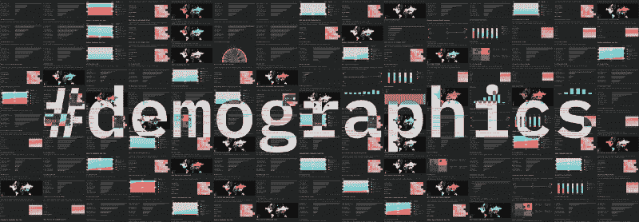
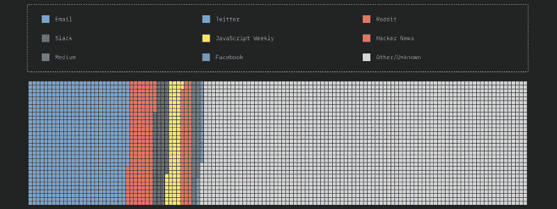

# 谁参加了 JavaScript 2018 年状态调查？

> 原文：<https://www.freecodecamp.org/news/who-took-the-state-of-javascript-2018-survey-8b51bca63a0/>

萨沙·格里菲

# 谁参加了 JavaScript 2018 年状态调查？

#### 我们如何努力使调查更具代表性

我最近听了一集关于 JS 调查状况的播客,虽然主持人对我们的努力表示赞赏，但他们也对我们的方法提出了一些批评。

主要是，不清楚到底是谁做的调查，他们是如何发现这个调查的，以及这个人口样本是否代表了整个 JavaScript 生态系统。

这些都是合理的问题，所以让我们来解决它们。

### 代表…什么？

首先，让我们谈谈“代表性”的问题。当你进行一项政治民意调查，以了解人们将如何投票时，你有一个明确的参照物:该国的总投票人口。

政府人口普查会告诉你有多少选民，他们的人口结构是什么，这让你可以将自己的民意调查与这些数据进行比较，以确定你的结果到底有多有代表性。

然而，当谈到“JavaScript 生态系统”时，我们没有一个清晰的参照物。

从为财富 500 强公司的 100 多名开发人员团队工作的高级工程师，到在业余时间编写 JavaScript transpiler 的高中生，任何人都可以成为 JavaScript 开发人员。

此时，我们有两个选择:

1.  花大量的时间和精力来定义“JavaScript 生态系统”是什么意思，估计它的总规模和组成，然后将我们的结果与那个数字进行比较。
2.  让任何开发人员进行调查，并如实地展示结果，而不要试图将它们与更大的人群联系起来。

我们只是没有时间或技术来完成选项 1，所以我们选择了选项 2。

### 谁参加了调查？

所以自然的下一个问题是，这些开发者是谁？这是我们可以做得更好的地方。事实是，我们只有有限的时间来处理我们积累的所有数据，我们决定将时间集中在实际结果本身上，而不是人口统计部分。

但由于这个问题出现过几次，我回去对自我报告的“你是如何听说这个调查的？”进行了粗略的汇总问题是，出现了这样的故障:

人数如下(在总共 20，252 名答卷人中):

*   **电子邮件** : 2033 名受访者(10.04%)
*   推特 : 2062 名受访者(10.18%)
*   Reddit : 1043 名受访者(5.15%)
*   **懈怠** : 557 人(2.75%)
*   **JavaScript 周刊** : 529 名受访者(2.61%)
*   **黑客新闻** : 468 名受访者(2.31%)
*   **中等** : 285 人(1.41%)
*   **脸书** : 140 名受访者(0.69%)
*   **其他/未知** : 13272 人(65.54%)

“电子邮件”对应于我们自己的邮件列表中的公告，该列表由前几年参加调查并注册以了解最新信息的人组成。

我们还有一个字段可以自动跟踪浏览器的实际`referrer`值，这对于某些来源来说效果更好，但对于其他来源(例如电子邮件)则不然。这让我们可以更详细地了解特定站点:

#### 推特

*   t.co: 1591 名受访者。

#### 谷歌

*   搜索:1591 名受访者。

#### 中等

*   [拿 JavaScript 2018 年调查状态来说！](https://medium.freecodecamp.org/take-the-state-of-javascript-2018-survey-c43be2fcaa9)(发布在 freeCodeCamp 上的公告帖子):3442 名受访者。
*   [评估任何新的 JavaScript 库时你需要考虑的 12 件事](https://medium.freecodecamp.org/the-12-things-you-need-to-consider-when-evaluating-any-new-javascript-library-3908c4ed3f49)(我写的一篇关于我们的问题方法论的帖子，也发表在 freeCodeCamp 上):105 名受访者。

#### 黑客新闻

*   首页:634 名受访者。

#### Reddit

*   [Javascript 2018 年调查结果现已出炉](https://www.reddit.com/r/javascript/comments/9e2u9d/state_of_javascript_2018_survey_is_now_out/)(发布在 r/javascript 上):144 名受访者。

#### 其他论坛

*   [流星论坛](https://forums.meteor.com/t/the-state-of-javascript-2018/45535) : 61 位受访者。

#### 博客

*   [JavaScript 2018 年调查状况](https://dev.to/frontendmentor/state-of-javascript-2018-survey-2nlm) (Dev.to): 56 名受访者。
*   【2018 年 JavaScript 现状调查公布 (Slashdot): 219 名受访者。
*   《烬时报》——第 64 期 : 18 名受访者。

如你所见，唯一可能对某个特定库有固有偏见的来源是 Meteor 论坛和 Ember Times，而 Meteor 和 Ember 在调查中表现都很差。

### 艰难的决定

我意识到，通过将调查命名为“JavaScript 的状态”，我们在表明自己的主张，而一个没有代表性的调查将会是一个问题。

所以我们完全打算越来越接近 JavaScript 生态系统的“真相”。我们知道人们根据我们的研究做出决定，我们非常认真地对待这一责任。

在一天结束的时候，我真的相信我们能做的最好的事情就是坚持下去，并试图年复一年地增加观众。希望一旦我们突破 10 万名受访者的里程碑(如果真的发生的话！)我们终于可以放下对代表性的担忧了。

*想帮我们把 JS 调查的下一个状态做得更好？[报名获取明年公告](https://stateofjs.com/)！*