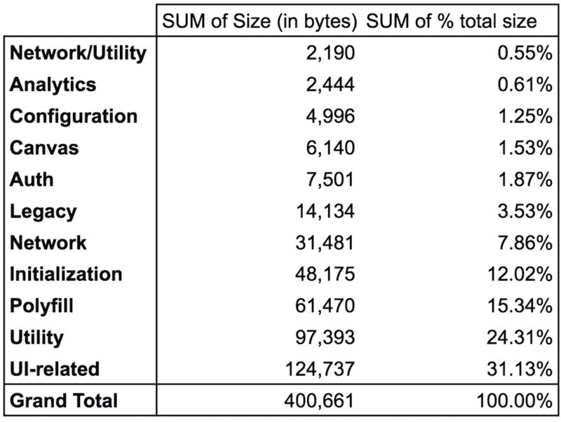
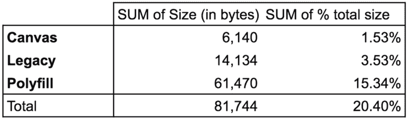
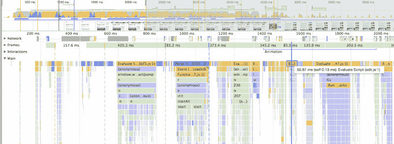
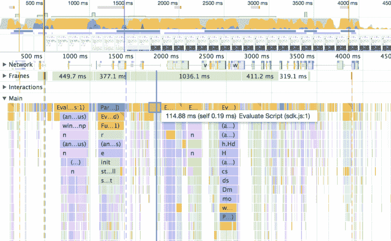

# 为什么脸书喜欢按钮占了一个普通网站代码的 16%

> 原文：<https://www.freecodecamp.org/news/why-16-of-the-code-on-the-average-site-belongs-to-facebook-and-what-that-means-68956cd731be/>

本·格林斯潘

# 为什么脸书喜欢按钮占了一个普通网站代码的 16%

根据 BuiltWith.com 收集的数据，前 10，000 个高流量网站中有 6%从脸书的服务器上下载内容。对于他们中的绝大多数人来说，这些内容很可能是脸书的 Javascript SDK，这是一个巨大的代码块，需要用来显示诸如喜欢按钮(在许多媒体网站上可以看到)和脸书评论小工具(也在许多大型媒体网站上使用，Buzzfeed 就是其中之一)等功能。

这个 SDK 代码如此之大，以至于它代表了平均网页上所有 JavaScript 总大小的 16%。

One of the culprits behind modern websites taking so long to download

作为一个规模庞大、应用广泛的软件库，脸书 SDK 很好地解释了一些问题的答案:为什么今天的普通网站这么大？尺寸到底有多重要？

### 为什么这么大？

脸书 SDK 的功能非常全面，复制了许多普通网站可能已经包含的工具供自己的开发人员使用:从其他网站检索数据的方法，确定用户正在使用的浏览器和设备以便为他们提供特定功能的方法，以及显示 UI 元素(如确认对话框和按钮)的方法。如果我们[对 SDK 的所有部分](https://docs.google.com/spreadsheets/d/1vdRzi-wlYNQOoAt4bGOseDMt7vgmpv9BoSfy4yM1SYY/edit?usp=sharing)进行分类，分类如下:

The amount that each set of features in the SDK contributes to total filesize. (Note that this is the size of the file before it has been compressed; the final package will be smaller.) [[Source data, methodology, and more screen-reader-compatible data table](https://docs.google.com/spreadsheets/d/1vdRzi-wlYNQOoAt4bGOseDMt7vgmpv9BoSfy4yM1SYY/edit#gid=873242422)]

在这些特性中，有三个最为突出:

The three sets of features in the SDK that are completely irrelevant to the vast majority of users on most sites. Eliminating them — if it were possible to do so — would shave off roughly 20% of the SDK filesize. [[Source data, methodology, and more screen-reader-compatible data table](https://docs.google.com/spreadsheets/d/1vdRzi-wlYNQOoAt4bGOseDMt7vgmpv9BoSfy4yM1SYY/edit#gid=873242422)]

“Canvas”是脸书为打算在脸书加载的应用程序开发的系统(脸书过去大力鼓励开发者开发在脸书运行的应用程序；我不完全确定这种应用程序现在有多广泛，但不管怎样，一个正规网站不会使用任何与画布相关的功能。)将它们包含在 SDK 中的成本非常小:仅占总规模的 1.5%。

之后，我们有遗留功能支持。这反映了这样一个事实:随着时间的推移，一个 API 将积累多个接口来处理相同的特性。例如，开发人员可以编写调用 **FB.getLoginStatus()** (请求用户当前脸书登录状态的传统方法)或 **Auth.getLoginStatus()** (新的、受鼓励的方法)的代码。避免需要包含这两套方法的方法是在 SDK 的不同版本中发布它们，但脸书选择不这样做，可能是为了简化开发人员的体验，并最大限度地增加使用完全相同文件的网站数量(以增加普通用户已经下载它的可能性)。这个决定的代价很小:大约 3.5%的 SDK 代码用于处理被明确标记为“遗留”的特性(很有可能有更多的“遗留”特性没有被明确标记为遗留)。

最重要的是，SDK 包括许多 polyfill 和类似 poly fill 的实用程序，占其代码的 15%以上。聚合填充用于将新浏览器中的功能提供给旧浏览器，有时也用于提供即将推出但尚未添加到任何浏览器中的新功能。脸书软件开发工具包包含的大多数填充功能都是针对绝大多数互联网用户使用的浏览器中已经包含的功能。它们只是为了让 SDK 为全球 1%的互联网用户服务，这些用户使用的是像 Internet Explorer 8 这样的旧浏览器，许多(如果不是绝大多数的话)主要网站已经放弃支持了。

在剩下的大约 80%的 SDK 中，要理清哪些特性是出于什么目的所需要的有点困难。这是因为它是这样编写的，要使用像 like 按钮这样的简单功能，还必须包含仅用于评论、视频嵌入、登录按钮和其他无关功能的代码。脸书本可以选择发布小得多的文件，只包含像按钮这样的单一功能，但他有一个商业目标，鼓励网站尽可能多地使用 FB 提供的功能。

### 尺寸重要吗？

由于脸书软件开发工具包的广泛使用，以及它相对不经常变化的事实，许多用户很可能在加载网站之前就已经下载了它。事实上，这是为什么脸书会分发这么大的文件，而不是针对特定功能(如按钮)的较小文件的主要原因。在大多数用户的网络连接上，至少在发达国家，下载文件的时间是很少的。

但是不管用户的浏览器是否已经下载了 SDK，运行一大块 Javascript 仍然会有开销，尤其是在移动设备上。在我写这篇文章的相对较新的 MacBook Pro 上，脸书的 SDK 需要大约 50 毫秒(1/20 秒)，才能在 Buzzfeed 这样的网站上运行。这还不错——尤其是在与 JS 代码的其余部分一起使用时，包括执行时间长得多的广告相关代码——但对于只用于在页面底部显示评论的东西来说，这仍然是一个不小的代价。

Script evaluation in Chrome on a recent MacBook Pro

在一款非常新的智能手机(Google Pixel)上，JS 的执行时间增加了一倍，现在超过了 1/10 秒:

Script evaluation on a Google Pixel smartphone

从上下文来看，这只是页面上总代码执行时间的一小部分。但它增加了滚动页面或与页面交互的时间，这可能是一种不稳定和不愉快的体验。这涉及到一个重要的问题:这个特定的 SDK 有边际成本，但现代网站——特别是媒体网站——经常包括来自大量第三方的类似代码([这个例子是我在 Gawker 被一个亿万富翁吸血鬼杀死之前从 Gawker 捕获的](http://ben.regenspan.com/your-script-loader-is-killing-you/#/4/4)显示了这样的请求可能有多少)。

即使不考虑向这些第三方发送一些用户信息对隐私的影响，所有这些功能的成本也会迅速增加。网站添加的每个第三方脚本都是有代价的，无论是在性能方面，还是在帮助合理化添加下一个“相对无害”的第三方代码块方面。除了所有这些代码的额外成本对性能的直接影响之外，这还会影响开发人员的士气:想象一下，花了几天时间将自己代码的加载时间减少了 10%，结果却看到添加了一大块第三方代码，使这种艰苦努力的影响相形见绌。然后(如果你为一家媒体网站工作)，每隔几个月就会看到同样的模式不断重复。

### 你应该包括它吗？

如果你需要使用像脸书评论这样的功能，加载脸书的 SDK 是不可避免的。但是根据你的站点的结构，你可以通过只在需要的时候加载来限制 SDK 的性能影响(例如，一旦用户向下滚动到评论应该可见的地方)。

如果你想使用喜欢按钮，停下来重新考虑。脸书不再在用户时间轴上突出显示某个页面(或者，在大多数情况下，根本不显示)。最好[使用一个简单的自定义分享按钮或链接](https://jonsuh.com/blog/social-share-links/#use-share-urls)，这样做的附带好处是，可以防止脸书跟踪你页面的所有访问并干涉你用户的隐私。取消了“喜欢”按钮的网站没有意识到这样做对脸书流量推荐的负面影响。

修正标题:最初我的标题是“为什么普通网站上 16%的代码属于脸书，这意味着什么”。正如一些人正确指出的那样，这意味着互联网上所有网站(或者至少是所有顶级网站)的全部 16%的 Javascript 由脸书 Javascript SDK 组成。这不是我的意图，我可以看到它是如何被过分渲染的。

希望新的标题能更清楚地表明，脸书 SDK 的规模达到了普通网站 Javascript 的 16%,而不再意味着它代表了互联网上全部网站 Javascript 的 16%。正如大卫·吉尔伯森在 T2 指出的，实际的全球数字要小得多——0.96%。关于缓存，他也提出了一个很好的观点:脸书 Javascript SDK 根本没有进行优化缓存，它只是以最理想的方式缓存了 20 分钟，之后用户的浏览器会检查脸书的服务器，以验证它已经有了最新版本。