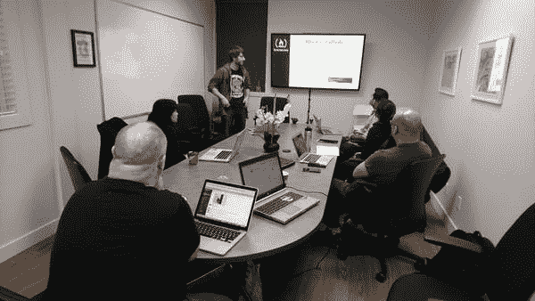

# 为什么美国农民用乌克兰固件入侵他们的拖拉机

> 原文：<https://www.freecodecamp.org/news/why-american-farmers-are-hacking-their-tractors-with-ukrainian-firmware-488029e07cac/>

这里有三个值得你花时间的链接:

1.  为什么美国农民用乌克兰固件黑他们的拖拉机
2.  我是如何在短短一年内获得第二个学位并获得 5 个开发人员认证，同时工作并抚养两个孩子( [8 分钟阅读](http://bit.ly/2mUB5hO))
3.  我的副业如何满足了我的好奇心，并让我赚了 3000 美元( [4 分钟阅读](http://bit.ly/2o5cpTL))

额外收获:我现场采访了科尔姆·图伊特，一位来自爱尔兰的自学成才的设计师和开发者，他的初创公司最近被收购了

### 想到这一天:

> “在相对较短的时间内，我们建立了一个抵御核武器破坏的系统，并使其容易受到烤面包机的攻击。”—杰夫·雅尔莫克

### 今日趣事:

icecreamsandwichcomics.com 的网络漫画

### 今日学习小组:

[英属哥伦比亚萨里郡自由代码营](http://bit.ly/2nCmsD4)

向人们展示你学到了多少，并帮助我们的非营利社区成长。将此转发给对技术感兴趣的朋友和家人。

编码快乐！

–昆西·拉森，自由代码营的老师