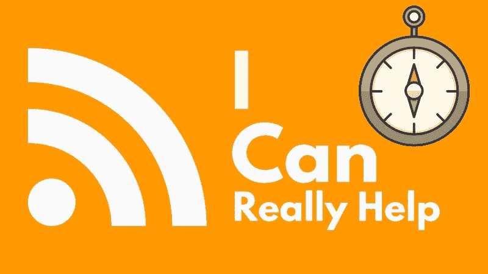
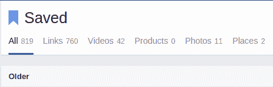
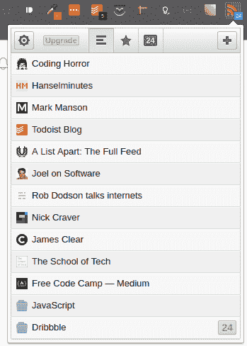
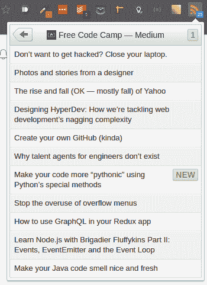
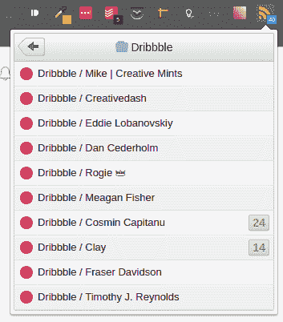
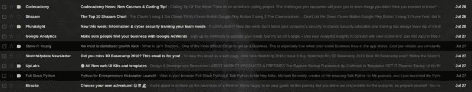

# 如何用 RSS 更有效地阅读

> 原文：<https://www.freecodecamp.org/news/why-an-rss-reader-can-increase-your-productivity-5x-and-how-to-use-it-f4356ab2bcfb/>

by Naman Kamra

# 如何用 RSS 更有效地阅读

Rich Site Summary (RSS)早在 1999 年就被开发出来，作为快速订阅博客和报纸的一种方式，早在 Twitter feeds 这样的工具使查找和阅读文章变得如此容易之前。

在过去的 17 年里，RSS 在很大程度上已经从流行的用法中消失了，但是开发人员从未停止过对它的研究。今天，如果你想简化你的信息饮食，RSS 提供了大量的高级工具，让消费内容变得轻而易举。

### 你可以主动发现内容，也可以被动地发现内容。

假设你决定要学习编码。你去谷歌搜索“免费学习编码”你可以在谷歌搜索结果的第一页找到免费的 Code Camp，注册并开始通过它的编码挑战。这叫做**主动发现。**

现在让我们假设你正在浏览脸书，你看到你的一个朋友在谈论自由代码营。这叫做**被动发现**。你点击这个链接，将它加入书签，然后继续你的脸书之旅，却再也没有机会访问这个网站。

My bookmarks. Don’t end up like me.

这些例子说明了为什么即使你在社交媒体上偶然发现了一些相关的东西，你仍然会浪费时间。如果你当时没有时间，你很可能会打开一个标签或书签。你永远也回不去，因为如果你现在很忙，你很可能以后也会一样忙。相比之下，谷歌搜索只会在你需要某样东西的时候进行。

### 进入 RSS 源阅读器

你知道当朋友在脸书上加标签时，你会收到通知吗？嗯，当一个朋友在他们的博客上发表了一篇新文章时，你可以从 RSS 阅读器获得完全相同的通知。这是我在桌面上使用的 RSS 阅读器 Chrome 扩展。

My frequently visited blogs

这将在你的 chrome 扩展栏上添加一个漂亮的小图标，每次你在一个有提要的博客上，都会有一个小“+”号，这样你就可以“订阅”它了。

假设你正在寻找养成更好的习惯，你发现了一个关于习惯的好博客，比如詹姆斯·克利尔的博客。现在，多亏了这个 Chrome 扩展，你只需点击+号，它就会将该博客添加到你的订阅源中。

从这一点开始，每当 James Clear 写了一篇文章，你就会在那个栏上有一个未决的通知，直到你把它标记为已读，或者更好的是，去阅读它。

Free Code Camp’s latest articles

注意我是如何订阅自由代码营的媒体文章的？没错，您甚至可以在一个地方订阅您喜欢的媒体出版物。这意味着你不必打开 Medium，滚动浏览你的新闻提要，就能找到你最喜欢的出版物上的文章。

以这种方式订阅博客可以节省你大量的时间，因为你的目标是你想读的东西。你甚至可以看到标题，所以你不必打开网站就发现你对它的最新内容不感兴趣。

#### 使用文件夹和 Dribbble 技巧

这还不是全部！你甚至可以创建文件夹，然后将主题相似的博客组合起来，以便更好地管理它们。当我试图专注于一个特定的主题，并寻找灵感时，这经常帮助我。

你会用 [Dribbble](https://dribbble.com/) 来获得灵感吗？我也是！我跟随那里的许多设计师。有了 RSS，你可以为个人设计师创建文件夹，这样当你喜欢的设计师发布新内容时，你会第一个知道。

People I follow on Dribbble and their new Dribbble shots (the green notifications boxes)

你可以对[素材做同样的事情来激发](http://materialup.com)灵感。

Chrome 扩展附带了许多其他有用的功能，比如将某些博客组合起来，甚至订阅播客。

如果你更喜欢电子邮件而不是通知，你可以配置这个扩展来给你发送关于特定博客的电子邮件，并且在你一天中可能有空阅读它们的指定时间。

### 你应该停止被动冲浪。

根据美国有线电视新闻网的报道，青少年每天花九个小时在社交媒体上，每天查看新闻多达 100 次。

现在，如果我不知道任何更好的，我会认为成年人不像青少年，并把他们的时间放在更高的价值。他们不会整天不停地查看社交媒体。

但现实是，作为成年人，我们最终会花很多时间查看我们的社交媒体，而不是积极搜索与我们直接相关的内容。

当我们说我们在“网上冲浪”时，我们实际上在做的是偶然发现有漂亮的点击诱饵标题的链接，只是后来意识到这些内容没有教给我们任何新东西。也与我们当时试图完成的任务无关。

我们经常发现自己在浏览脸书新闻，点击朋友们分享的链接，担心如果我们不这样做，我们可能会“错过”一些东西。

但在所有现实中，这些内容很少是必要的。生产力爱好者很快指出，这种“害怕错过”是错误的，大多数这样的内容不会对我们的生活产生任何真正的影响。

### 电子邮件列表的问题。

RSS 源受欢迎程度下降的最大原因是，网站已经转向手动向您发送电子邮件简讯，其中包含他们最近博客文章的链接。

偶然发现一个网站并能通过简单地给他们一个电子邮件地址来保持更新是很好的。但是如果他们不是那种微妙的类型，开始每天用电子邮件轰炸我，我开始会觉得超负荷，然后最终退订。

如你所见，一天收到 10 封推广邮件并不是消费博客内容的最有趣的方式。我有自己的指定时间来阅读这些帖子，如果我因为工作而没有去读它们，我很可能永远也不会回它们。

有了 RSS，我就有了我订阅的所有博客的列表，以及自从我上次查看它们以来每个博客发布了多少新文章。我可以暂时把它们留着不读，以后再用更系统的方式去处理它们。

这样，我就不用处理那些在我工作日的中间或者半夜我想睡觉的时候突然出现的邮件了，所有我想看的内容都在同一个地方，我可以在闲暇时阅读。

感谢阅读。我希望这篇文章——以及 RSS 阅读器——能帮助你提高工作效率。同样，这是我用于 RSS 的免费 Chrome 扩展。如果你喜欢这篇文章，一定要按下那个绿色的心来表示你的支持。