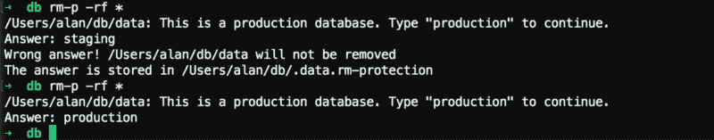

# 一个新的工具来防止像 GitLab 的灾难性删除

> 原文：<https://www.freecodecamp.org/news/why-and-how-i-created-a-new-wheel-to-prevent-gitlabs-disaster-b8cd5bea6e1/>

作者艾伦·陈

# 一个新的工具来防止像 GitLab 的灾难性删除

基本上:我发现现有的大多数工具都不是很有帮助，于是做了一个新的开源工具叫做`rm-protection`，你可以[从 GitHub](https://github.com/alanzchen/rm-protection) 下载。

我坐公交车回宿舍，差点睡着了。突然，我的一个朋友在 Telegram 上给我发了一条消息:“GitLab 删除了它的生产数据库，他们现在正在 YouTube 上直播数据库恢复！”

我的头撞到了我前面的座位上。我感觉不到疼痛，但为 ops 感到难过，并想在阅读他们的事件日志时#拥抱 ops。

我们不都是会犯错的人类吗？但是有些数据太重要了，不能丢失。例如，生产数据库和与家人和朋友的照片。

我对丢失数据有一种根深蒂固的恐惧。我从小学开始玩 Linux，当时只有一台单硬盘的 PC。作为一个孩子和 Linux 新手，我比大多数老练的用户更粗心。有一次，我不小心删除了整个分区——不仅是系统文件，还有我的主目录。

我仍然记得当一切都崩溃了，我意识到我刚刚删除了我所有的照片时的恐惧。当我拿回一些时，我流下了幸福的眼泪。

### 快速调查当前防止这种情况的工具

我下了车，走回房间，开始寻找预防方法。以前听过一些:`rm -i`、`Safe-rm`、`trash-cli`。

#### rm -i

`rm -i`要求对*的每个单个文件和目录*进行额外确认。确认你确实想要移除的所有东西是乏味的。这让我想起了*那个喊狼来了的男孩*的故事。

对*所有事情的警告*就像是对任何事情的警告。更糟糕的是，一些用户已经养成了定期使用`rm -rf`的习惯，其中`-f`选项会覆盖`-i`保护。

在 GitLab 的事件中，`rm -i`没有帮助:ops 知道他要删除哪个目录，但是忘记了他在哪个机器上。他本可以键入“是”并点击“回车键”。

#### `[Safe-rm](https://launchpad.net/safe-rm)`

同样地，`[Safe-rm](https://launchpad.net/safe-rm)`也不会有所帮助。`Safe-rm`有一个配置文件，其中包含您想要保护的路径列表。它带有一些默认路径，如`/usr/lib`。用户还可以创建自己的路径列表。`Safe-rm`所做的是预先提供额外的警告，它不会给出额外的信息来解释为什么它会阻止你。

想想 GitLab 的情况:ops 可以直接打“y”(他会以为不是生产数据库，为什么不打“y”？).另外，`Safe-rm`不提供符号链接和递归保护。

不好意思，`Safe-rm`。(另一个工具叫做`[rmfd](https://github.com/d5h/rmfd/wiki)`，是 GNU coreutils 的一个分支，具有类似的保护机制)

#### `trash-cli`

我发现唯一对 GitLab 的情况有用的工具是`trash-cli`。到目前为止，这是我所知道的最好的解决方案。它把垃圾桶带到命令行。`trash-cli`肯定可以预防 90%左右的事故(包括 GitLab 的)。

但是如果你在清空垃圾后很久才意识到少了什么东西呢？

或者想象一下，您的空间快用完了，但是您有大量的数据要写到磁盘上。你急于释放空间(就像删除充满垃圾信息的数据库)。你还会仔细检查垃圾吗？

所以`trash-cli`不是我寻找的最终解决方案。

### 寻找灵感

浴室一直是尤里卡的好去处。

当时是晚上 11 点。我洗了个澡，我一直在自言自语一个防止 GitLab 事件的解决方案。

> "到底是什么导致了像发生在 GitLab 的事故？"

> “不知道自己在做什么。”

那还是在春假期间，我的大学周围没有人。这样我就可以在浴室里自言自语而不会被人认为我疯了。

> “如何让用户清楚地知道自己在做什么？”

> "嗯，也许让他们大声说出来？"

我冲出浴室。

### 发明工具

我立即给我的朋友发消息，告诉他们我的想法:用户在部署期间“保护”重要的文件和目录。通过设置安全问题和答案来实现保护。

想象一下:当 GitLab ops 将数据库部署到生产服务器时，他们还通过设置一个问题“您删除的是什么数据库？”来“保护”数据库的目录。(db1/db2)”和一个答案“db1”。

之后，在试图删除这些目录时，修改后的`rm`会问你这个问题。除非你知道正确的答案，否则你无法继续。

GitLab 的 ops 不可能在他以为是“db2”的情况下输入“db1”。通过确保他知道自己在做什么，GitLab 的数据库本来是可以保存下来的。

于是我写了一个 Python 脚本，名字叫“rm-p.py”。它是一个`rm`的包装器，检查是否有相应的`.<filename>.rm-prot`部分(我称之为“保护文件”)。当可以找到保护文件时，提示会询问保护文件中定义的问题。

如果你答对了，`rm-p.py`会把你的论点传给`rm`。如果你没有，它就没有。当然，它仍然会将不受保护的文件传递给`rm`。

Demo: Trying to delete a protected file.

我把这个小脚本叫做`rm-protection`，并为它做了一个 logo。

现在包`rm-protection`在 PyPi 上可用，源代码在 [GitHub](https://github.com/alanzchen/rm-protection) 上。

### 最终是什么保护了你？

对于公司和团队来说，备份无疑是防止数据丢失的最重要的保护措施。它不仅能保护你远离肥胖，还能抵御自然灾害。

但对个人来说，全面备份并不总是经济或方便的。

撇开后备力量的缺乏不谈，坏习惯几乎总是这些肥胖的根源。

我们发明了这么多工具来处理这些坏习惯，然而它们可能会导致用户形成新的坏习惯。

> "最好也是唯一正确的方法是仔细检查你要删除的内容."

有些人可能会这么说。但是很少有人能忍受不得不确认每一次的删除。因此，`rm -rf`是他们新的坏习惯。

当前的工具要么在意外删除之前(如`rm -i`或`safe-rm`)保护你，要么在意外删除之后(`trash-cli`)保护你。前者往往在日常操作中带来比预想更多的麻烦。

后一种如`trash-cli`不提供预先保护。很有可能，你仍然会丢失重要的文件。

在对这个问题进行了一些思考后，我意识到没有所谓的最终解决方案。 `rm-protection`只是另一层保护。这不是保护中最重要的部分，但它可以为您从备份中恢复数据节省大量时间。

`rm-protection` **不会在不必要的时候打扰你**，所以你仍然有日常操作的灵活性和效率。当你真的不应该删除某些东西时，它会问你一个由你设定的问题。

> 要做到 99%的安全，你需要的是良好的习惯、谨慎清晰的头脑、有效的备份、良好的保护方法和运气的结合。

### 最佳实践

总而言之，您应该采取以下措施来确保数据的安全:

1.  做**备份**。
2.  **定期检查备份**。
3.  **保持清醒的头脑。不要用`rm -rf`**。
4.  添加一个额外的保护层:选择`rm-protection`、`trash-cli`或任何你喜欢的工具。

你应该是 99%安全的。