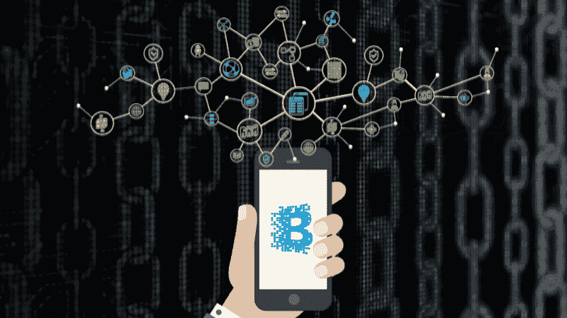
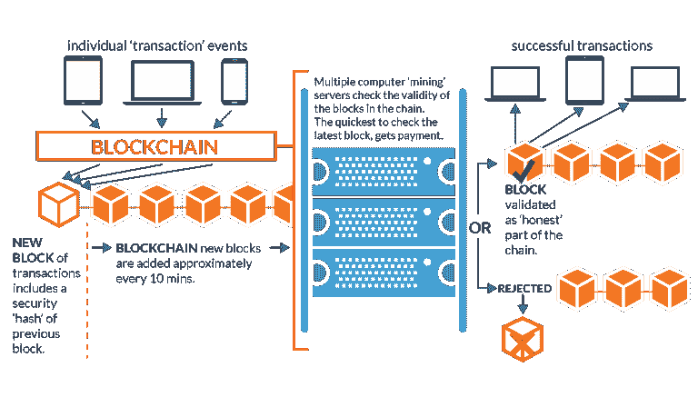
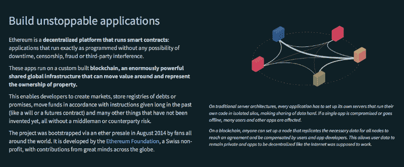

# Dapps:为什么区块链会存在(而比特币可能不会)

> 原文：<https://www.freecodecamp.org/news/why-blockchain-is-here-to-stay-and-bitcoin-might-not-be-e117c4386af7/>

作者詹姆斯·许

# Dapps:为什么区块链会存在(而比特币可能不会)

如果你还不是加密货币投资者，你可能至少听说过区块链、比特币或两者兼而有之。

让我们明确一点:这些确实是值得认真对待的技术，即使它们被传统主义者如沃伦巴菲特和杰米戴蒙等(他们可能在传统金融机构有大量投资，这并非巧合)一笔勾销。

概括来说，**比特币(BTC)** 是第一种去中心化的[加密货币](https://en.wikipedia.org/wiki/Cryptocurrency)(创建于 2009 年)，也是目前【1,000 多种已知加密货币中最大的一种。截至 2018 年 2 月初，其市值约为 1400 亿美元。这占了 CoinMarketCap 追踪的所有加密货币近 4000 亿美元总市值的三分之一以上。

**另一方面，区块链**是比特币和许多(但不是全部)其他新的加密货币争夺加密热潮的技术基础。

区块链的工作原理是将点对点交易记录到“区块”上，随后通过基于共识的挖掘过程将这些交易永久写入开放的分布式账本(区块链)。《区块链纪事报》的开放性决定了它可以被任何人验证，并且因为它是分布式的和加密的，所以很难被修改。

How blockchain transactions are processed (credit: [http://blockchain.open.ac.uk/)](http://blockchain.open.ac.uk/))

重要的是，区块链的设计消除了对银行等“可信”中间人的需求，提供了许多优于我们当前基于信任的系统的显著优势。例如，与使用美元等法定货币的传统交易相比，区块链上的交易可以更快(因为它们可以在几分钟内自动处理)、更可靠、更高效地进行。

效率提高的一个重要好处是大大降低了交易成本。例如，麦肯锡公司估计，到 2021 年，全球跨境支付(交易费)的总收入将达到[2.2 万亿美元，这表明跨境转移资金是多么昂贵(更不用说典型的 3-5 天结算时间了)。](https://www.mckinsey.com/industries/financial-services/our-insights/global-payments-2017-amid-rapid-change-an-upward-trajectory)

如果提供这些支付服务的公司采用基于区块链的系统，将会节省大量的潜在成本。

跨境支付只是区块链技术更明显的用例之一。除了跨境支付甚至点对点(P2P)支付，区块链还有更有趣的用例，我们将在本文后面讨论。

### 为什么区块链会存在(而比特币可能不会)

在一个汽车类比中，你可能会认为比特币是第一辆使用内燃机的汽车，而区块链是内燃机技术本身。

虽然比特币是第一种也是目前最大的使用区块链技术的加密货币，并且背后有优秀的人才，但许多新的区块链项目正在涌现，从技术角度来看也很有趣。是的，即使是柯达(电影公司)[也在 2018 年](https://www.theverge.com/2018/1/9/16869998/kodak-kodakcoin-blockchain-platform-ethereum-ledger-stock-price)加入了区块链的竞争。

下一个会是谁？像微软和 T2 甲骨文这样的科技巨头现在正在将区块链纳入他们的产品和服务组合，尽管他们还没有表明任何创造自己的加密货币的意图。

因此，鉴于创新和人才快速涌入全球加密货币社区，任何人都不知道比特币是否会在未来 5 年、10 年或 20 年内保持领先地位。

然而，确实需要说明的是，比特币在[网络效应](https://en.wikipedia.org/wiki/Network_effect)中保持着强大的优势。比特币目前扮演着一种“避风港”的角色，是最大、交易量最大的加密货币(因此提供了最大的流动性)，比大多数其他加密货币的波动性(价格波动)更小。

因此，比特币现在在竞争中有很大的优势。但事情可能会根据其他加密货币项目的发展迅速变化。

虽然比特币的未来前景谁都说不准，但另一方面，*区块链*几乎肯定会在未来获得主流相关性。作为建立分散系统的基础方法，区块链为几乎所有行业的几乎所有企业提供了巨大的收益。

唯一重要的问题是这项有前途的技术需要多长时间才能被广泛应用。

### 早期的分化有限

受 2009 年比特币出现的启发，早期的加密货币浪潮提供了有限的产品差异化，超越了最初的点对点(P2P)支付重点。

[**莱特币**](https://litecoin.org/)**【LTC】**成立于 2011 年，目前全球市值排名第六，本质上是比特币，例如更频繁地创建区块以允许更快的交易。根据莱特币创始人查理·李的说法，莱特币旨在成为“比特币的黄金”

莱特币还在其网站上将自己定位为比特币的补充。这表明，与比特币需要 10 分钟的交易过程相比，一枚交易只需 2.5 分钟即可结算的硬币在 P2P 支付的未来有空间。

Litecoin founder Charlie Lee’s twitter profile exemplifies the complementary relationship between Bitcoin and Litecoin.

2012 年， [Ripple](https://ripple.com/) (其原生加密货币为 **XRP** )，另一个在去年大受欢迎的项目(目前在加密货币中市值排名第三)，也开始提供自己的分散支付服务。

与比特币和莱特币不同，Ripple 的支付系统通过来自数量少得多的可信网关的共识来验证交易，而不是其前辈基于区块链的方法，这种方法需要大量的计算能力和电力(以开采)。

与比特币相比，Ripple 的方法有几个好处(以更少的分散化为代价):更快的交易速度(只需几秒钟)和潜在的更低交易成本。Ripple 在过去一年里成功推出了合作伙伴关系，利用其支付系统促进“无摩擦”的跨境支付。

尽管 Litecoin 和 Ripple 都为加密领域带来了创新，但归根结底，他们(和其他一些人)通常满足于专注于 P2P 支付用例。

### 以太坊开阔了眼界

2013 年末，当 Vitalik Buterin 向世界介绍了 [**以太坊**](https://www.ethereum.org/) (其令牌为 **ETH** )时，加密范式永远改变了。以太坊在随后几年的出现，特别是在 2017 年，其市值增长到近 1000 亿美元(仅次于比特币)，验证了那些释放 P2P 支付以外的新用例的项目的价值。

原因如下。

与比特币和莱特币不同，以太坊并不是主要为支付而设计的。相反，以太坊的建立是为了方便基于区块链的定制“智能合约”和应用程序。以太坊平台的核心是用于编写自定义智能合同的机制，这些合同可以记录在以太坊区块链上。

这意味着以太(以太坊平台上使用的令牌)可以用于各种智能合约，包括但不限于智能物业租赁(想想 AirBnB、ridesharing 等的“租赁经济”)。)、金融交易、商品定价、在线赌博、视频游戏、内容许可、虚拟礼物，甚至新加密货币项目和初始硬币发行(ico)的创建和管理。

以太坊这样的平台上的智能合约可以涵盖从复杂的商业安排到简单的消费者交易的所有领域。

Ethereum lets you build “unstoppable applications,” according to the Ethereum Foundation website.

### 差异化 dapps 的未来

以太坊在 2017 年的迅速崛起，以及其他发展，促进了最近使用区块链技术的新去中心化应用(dapps)的激增。

一些最著名的 dapps 本身就是新的加密货币项目，其中许多是建立在以太坊网络上的 [ERC20](https://theethereum.wiki/w/index.php/ERC20_Token_Standard) 令牌，但在技术或应用焦点上添加了定制。

截至 2018 年 2 月 7 日，根据 CoinMarketCap 的市场份额，这里只是在爆炸式增长的加密货币市场中争夺注意力的几个顶级硬币或代币项目。

1.  **比特币**
2.  **以太坊**
3.  **涟漪**
4.  **比特币现金**
5.  **卡尔达诺**
6.  **莱特币**
7.  **恒星**
8.  近地天体
9.  **EOS**
10.  **不**

值得注意的是，列表中的每个项目都试图将自己与同行区分开来。例如，快速查看每个项目的公开可用资源，可以发现上面列表中每种货币的主要关注点如下:

1.  **比特币** —安全的 P2P 支付
2.  **以太坊** —灵活智能合约平台
3.  **Ripple** —通过可信网关进行全球支付
4.  **比特币现金** — P2P 现金
5.  **Cardano** —智能合同，可进行合规性监管
6.  **莱特币** —快速、高效的 P2P 支付
7.  **恒星** —全球支付
8.  **NEO** —智能合约支付“红利”
9.  **EOS** —分散式操作系统(OS)
10.  **NEM** —智能资产

这份名单上似乎没有人在做完全相同的事情。

在全球经济中，未来会有几个或更多这样的项目共存的空间吗？(如果是这样的话，我们能不能不要再把加密货币市场视为一场超高风险、赢家通吃的竞赛？)

而且，当你考虑到正在建造的数以千计的 dapps 甚至不符合加密货币的条件时，你开始看到整个宇宙为有创业精神的企业家提供了独特的机会。

### dapps 如何提高实际业务绩效？

对于不打算进入大肆宣传的 ICO 或加密货币市场的企业来说，仍然有很多理由建立 dapps。

以下是建立在区块链基础上可以为各种规模的企业带来的一些实际好处:

*   能够随时自动结算交易和完成交易，而不仅仅是在工作时间(甚至是周末)。
*   提高了存储在区块链上的数据和应用程序的安全性(就不变性而言)。
*   由于提高了运营绩效(更快、更可靠的交易),增加了业务(更多的客户和交易量)
*   降低会计和合同(合同律师和合同管理人员)以及欺诈防范(例如，针对电子商务公司)的间接成本(如人员和设施)。
*   由于与基于区块链的验证和处理相关的开销和可变成本减少，平均交易成本显著降低。

### 分散式应用程序出人意料地容易使用

接下来，考虑许多这些领先的项目(例如以太坊)是生态系统或平台，旨在吸引业务合作伙伴和应用程序的支持，这些合作伙伴和应用程序将在一个或多个这样的平台上扎根。

就像谷歌 Play 商店、Salesforce AppExchange 或 WordPress Plugin Directory 等应用市场必须最大限度地减少希望在其平台上发布的应用开发者的障碍一样，这些区块链平台也需要让应用开发者和企业能够轻松地在其平台上创建和支持 dapp。

正是这个机会——在现有的 dapp 平台(如以太坊)上构建 dapp——吸引了各种规模的公司去中心化。

“区块链技术对我们交谈的许多企业都很感兴趣，因为它可以在他们现有的业务中实现巨大的运营改进，”总部位于洛杉矶和旧金山的移动应用代理公司 [CitrusBits](https://citrusbits.com/) 的首席执行官哈利·李解释道，该公司提供[区块链开发服务](https://citrusbits.com/blockchain-dapp-development/)。“对这些企业来说，建立一个‘dapp’不仅仅是利用投资者对任何与区块链有关的事物的兴趣。他们实际上是在意识到，在区块链上构建分散式应用可以带来可观的投资回报。”

> “底线是:你不需要为了挖掘区块链的潜力而让你的员工中有密码天才或区块链发明家。有了合适的专家或应用代理支持你，你现在可以在现有的 dapp 平台上开始构建你自己的专业化分散应用——本质上是借助全球区块链先驱的开放和创新。”