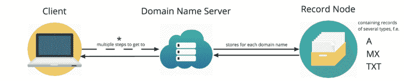

# 为什么域名的根不能是 CNAME——以及其他关于域名系统的趣闻

> 原文：<https://www.freecodecamp.org/news/why-cant-a-domain-s-root-be-a-cname-8cbab38e5f5c/>

本帖将利用上述问题，从初学者的角度探讨`DNS`、`dig`、`A`记录、`CNAME`记录、`ALIAS/ANAME`记录。所以让我们开始吧。

### 首先，一些定义

*   **域名系统** (DNS):将人类记忆的域名(example.com)转换为 IP 地址(93.184.216.34)的整体系统。IP 地址是服务器的，通常是 web 服务器，其中存储了显示网页所需的文件。
*   **DNS 服务器**(也称为名称服务器或名称服务器):使用 DNS 软件存储有关域名地址的信息。有几个级别——分别属于每个 ISP、根域名(全球共有 13 个)、顶级域名(如 TLD)。com’)和域级 DNS 服务器。
*   **域名**:与 TLD(.com)。术语“域名”通常作为域名的同义词使用，[，尽管它们是不同的](https://www.domainsherpa.com/anatomy-of-a-domain-name-and-url/)。当您从注册商或经销商处购买“域名”时，您就购买了特定域名(example.com)以及您想要创建的任何子域名(my-site.example.com、site.example.com 等)的权利。

### 高级查询流程

当您在浏览器中键入“example.com”时发生的高级流程可以简化为删除到 ISP、根和 TLD DNS 服务器的跳，如下所示:



Simplified DNS request flow, more can be seen in a [more detailed flow](http://www.uxworld.com/?p=384)

一个域名通常有两个或更多的域名服务器，包含与域名(example.com)相关的记录。

可以存储多种类型的记录，其中大多数每种类型可以有多个条目:

*   `A`:将域名映射到 IP 地址的地址记录
*   `CNAME`:规范的名称记录。用于将一个域名(或子域名)作为另一个域名的别名。我们稍后将更详细地讨论这个问题。
*   邮件交换记录，告诉邮件发送代理他们应该把你的邮件发送到哪里
*   `TXT`:灵活的文本记录，用于存储各种用途的字符串
*   `SOA`:域名顶级权限记录的单数开头。包含有关域的特定必需信息，例如其主名称服务器
*   `NS`:与域关联的名称服务器

当您的设备发送一个到达名称服务器的查询时，服务器会在域的记录节点中查找一个`A`记录和相关的存储 IP 地址(example.com: 93.184.216.34)。然后将其返回给设备，用于向正确的 web 服务器发送请求，以检索所请求的网页或资源。

### 使用“挖掘”

`dig` ( **域名信息搜寻器**)是一个查询 DNS 服务器的命令行工具。该命令通常用于故障排除，或者现在用于了解系统设置的更多信息。

`$ dig example.com`导致一个长的响应被打印到终端，[默认输出在这里详述](https://www.madboa.com/geek/dig/#understanding-the-default-output)，其中我们感兴趣的是`ANSWER SECTION`。

```
;; ANSWER SECTION:
example.com.       72703      IN     A       93.184.216.34
```

在这里，我们可以看到`example.com`返回了`93.184.216.34`的`A`记录。如果不止一个 web 服务器可以提供所需的信息，有时域会有不止一个`A`记录。

还有呢！如果我们尝试一些其他的例子，我们很快就可以看到另一个常见的记录出现:`CNAME`。

`$ dig www.skyscanner.net`:

```
;; ANSWER SECTION:
www.skyscanner.net. 169 IN CNAME www.skyscanner.net.edgekey.net.
www.skyscanner.net.edgekey.net. 5639 IN CNAME e11316.a.akamaiedge.net.
e11316.a.akamaiedge.net. 20 IN A 23.217.6.192
```

```
www.skyscanner.net.edgekey.net. 5639 IN CNAME e11316.a.akamaiedge.net.
```

```
e11316.a.akamaiedge.net. 20 IN A 23.217.6.192
```

使用`+short`标志可以让我们清楚地看到形成的路径:

`$ dig [www.skyscanner.net](http://www.skyscanner.net) +short`

```
www.skyscanner.net.edgekey.net.
e11316.a.akamaiedge.net.
23.217.6.192
```

### CNAME

一个`CNAME`记录允许一个域名被用作另一个规范(真实)域的别名。

当 DNS 服务器返回一个`CNAME`记录时，它不会将该记录返回给客户端。相反，它将再次查找返回的域名，并依次返回`A`记录的 IP 地址。这个链可以延续许多`CNAME`级别，但是在缓存发生之前，多次查找会对性能造成轻微影响。

一个简单的例子是，如果你有一个保存所有照片的服务器。您通常可以通过`photos.example.com`访问它。然而，您可能还希望它允许通过`photographs.example.com`进行访问。实现这一点的一个方法是添加一个指向`photographs`和`photos`的`CNAME`记录。这意味着当有人访问`photographs.example.com`时，他们将获得与`photos.example.com`相同的内容。

使用查询`$ dig photographs.example.com`我们会看到:

```
photographs.example.com    IN   CNAME photos.example.com
photos.example.com         IN   A     xx.xxx.x.xxx
```

需要注意的是`CNAME`是右手边的那块。左手边是别名或标签。

另一个常见用途是用于`www`子域。购买了`example.com`之后，你可能还想让输入`www.example.com`的用户看到同样的内容。

这里值得注意的是，`example.com`可以称为 apex、root，也可以称为裸域名。

一种选择是建立另一个`A`记录，指向与`example.com`相同的 IP 地址。这是完全正确的，也是真正的`example.com`所做的，但是它没有很好的伸缩性。如果需要更新`example.com`指向的 IP 地址会怎样？你还需要更新它的`www`子域，以及你可能使用的任何其他子域。

如果一个`CNAME`记录被用来别名`www.example.com`以指向`example.com`，那么只有根域必须被更新，因为所有其他节点都指向它。

### CNAME 限制

在编写 DNS 标准时，制定了一些规则来管理它们的使用。 [RFC 1912](https://tools.ietf.org/html/rfc1912) 和 [RFC 2181](https://tools.ietf.org/html/rfc2181) 规定:

*   `SOA`和`NS`记录必须出现在根域中
*   `CNAME`记录只能作为单个记录存在，不能与任何其他资源记录组合(DNSSEC `SIG`、`NXT`和`KEY RR`记录除外)

这排除了在根域上使用的`CNAME`，因为这两个规则会相互矛盾。

这里重要的是，这是一个合同限制，而不是技术限制。在根节点使用`CNAME`是可能的，但是它会导致意外的错误，因为它破坏了预期的行为契约。

这方面的一个例子是 Cloudflare 讲述的[，描述了他们在根域上使用了一个`CNAME`后在 Microsoft Exchange 邮件服务器上遇到的问题:](https://blog.cloudflare.com/introducing-cname-flattening-rfc-compliant-cnames-at-a-domains-root/)

> 域通常指定通过 MX 记录处理电子邮件的服务器。问题是，Exchange 服务器…可能会在根记录中获取 CNAME，然后不正确地考虑在 MX 记录中设置的 CNAME。你不能真的责怪交换。他们在 DNS 规范设定的假设下运营。

在这里，您可以看到一些服务器软件或库中可能出现的缺点。因为一个标准是`CNAME`在一个节点上是唯一的**记录，所以不寻找其他记录。**所有其他记录将被忽略，没有警告或错误消息。即使一个`MX`记录被设置为接收电子邮件，`MX`将被忽略，就像它不存在一样，因为`CNAME`首先被评估。如果有一个`A`记录，情况也是如此:`CNAME`将优先，而`A`记录不会被读取。

### 现代互联网

那么为什么这是一个问题呢？无论如何，为什么你会想要使用一个`CNAME`作为你的根域名呢？在寻找托管你的内容的网络服务器的 IP 地址时，这肯定是路径的终点吗？

在现代互联网格局中，情况不再如此。这个世界与 DNS 标准诞生时大不相同。

你可以选择使用像 [Heroku](https://www.heroku.com/) 这样的平台即服务(PaaS)提供商，并将内容存储在他们的网络服务器上。您控制内容，但不控制基础设施，PaaS 提供商负责繁重的网络维护工作。他们通常会向您提供一个 URL ( `my-app.herokuapp.com`)，这是他们根域的一个子域，您可以查看您的内容所在的 web 服务器的 IP 地址。但是这些完全在 PaaS 提供商的控制之下，并且会在没有警告的情况下改变。

PaaS 提供商所做的后端更改的规模和频率可能会使您很难维护指向单个 IP 地址的根域`A`记录。理想情况下，您会希望这样做:

```
example.com      IN   CNAME    my-app.herokuapp.com.www.example.com  IN   CNAME    my-app.herokuapp.com.example.com      IN   CNAME    my-app.herokuapp.com.
www.example.com  IN   CNAME    my-app.herokuapp.com.
```

允许 Heroku(或您选择的主机提供者)管理更新`CNAME`指向的`A`记录，而无需您进行任何更改。然而，正如我们现在所知，这违反了 DNS 规范，因此是一个非常糟糕的想法。

简单地实现从`example.com`到`www.example.com.`的 [301/302](https://www.namecheap.com/support/knowledgebase/article.aspx/9604/2237/types-of-domain-redirects--301-302-url-redirects-url-frame-and-cname) 重定向是可能的，然而，该指令或者发生在 web 服务器上(因此仍然存在需要使用 DNS 中的固定`A`记录来指向该 web 服务器的问题)，或者发生在定制 DNS 提供商重定向上(即[遭受 HTTPS](https://support.dnsimple.com/articles/url-record/) 的复杂性)。

这也有改变你在 URL 栏中看到的域的副作用，这可能是你不想要的。这种方法是为了当你的网站永久移动，或者当你试图保持搜索引擎优化排名的时候，而不是解决我们以可扩展的方式指向复杂变化的后端的问题。

### 解决方案

一些 DNS 提供商现已开发出解决此问题的定制解决方案，包括:

*   在 DNSimple
*   `ANAME`让 DNS 变得简单
*   在 easyDNS
*   `CNAME`(虚拟)在 CloudFlare

这些都是提供类似行为的虚拟记录类型，没有任何缺点。具体的实现可能会有所不同，但是在较高的层次上，当 DNS 服务器看到这些虚拟记录类型之一时，它会充当 DNS 解析器。它遵循别名创建的链，直到解析到一个`A`记录(或多个记录)并将这些`A`记录返回给 DNS 服务器。这将`CNAME`链“展平”到返回的`A`记录中，对于发送的查询来说是不可区分的。该查询只看到一个纯粹的`A`记录，它没有违反 DNS 规范，也没有`CNAME`的任何缺点。

这些虚拟记录可以和其他记录一起放在根上，而不用担心意外的行为。根据提供商在跟踪`CNAME`链时的 DNS 解析方法，他们也可以从缓存以前的查找中获得性能优势。

对于 DNSimple 设置，我们将如下配置。这个解决方案具有域名别名的所有优点，并且没有在根级别使用它的风险。

```
example.com      IN   ALIAS    my-app.herokuapp.com.www.example.com  IN   CNAME    my-app.herokuapp.com.
```

感谢阅读！？

一如既往，欢迎任何更正或补充。

### 资源

*   [什么是 DNS 服务器](http://www.itpro.co.uk/domain-name-system-dns/30232/what-is-a-dns-server)
*   [设置 DNS 名称服务器](https://www.wired.com/2010/02/Set_Up_a_DNS_Name_Server/)
*   [DNSimple 支持页面](https://support.dnsimple.com/categories/dns/)和[别名博客](https://blog.dnsimple.com/2014/01/why-alias-record/)
*   [Cloudflare 支持](https://support.cloudflare.com/hc/en-us/articles/200169056-CNAME-Flattening-RFC-compliant-support-for-CNAME-at-the-root)和 [CNAME 博客](https://blog.cloudflare.com/introducing-cname-flattening-rfc-compliant-cnames-at-a-domains-root/)
*   `[dig](https://www.madboa.com/geek/dig/)`how to
*   [几个](https://stackoverflow.com/questions/656009/how-to-overcome-root-domain-cname-restrictions/22659895#22659895) [伟大的](https://stackoverflow.com/questions/16022324/how-to-setup-dns-for-an-apex-domain-no-www-pointing-to-a-heroku-app) [栈溢出](https://stackoverflow.com/questions/655235/is-root-domain-cname-to-other-domain-allowed-by-dns-rfc)或[栈交换](https://serverfault.com/questions/170194/why-cant-a-domains-root-be-a-cname?noredirect=1&lq=1) [帖子](https://serverfault.com/questions/613829/why-cant-a-cname-record-be-used-at-the-apex-aka-root-of-a-domain/613830#613830)
*   [写得好](https://en.wikipedia.org/wiki/CNAME_record)维基百科条目
*   [Netlify blog](https://www.netlify.com/blog/2017/02/28/to-www-or-not-www/)‘要不要 www’