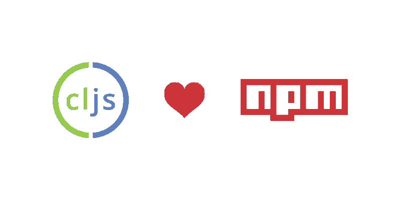
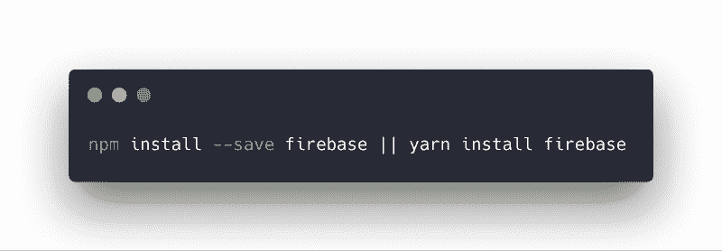
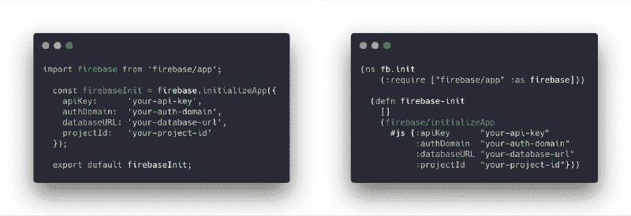
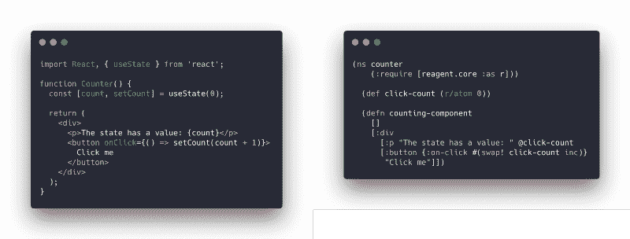
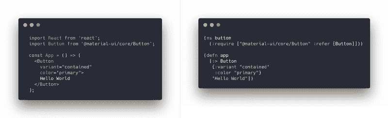
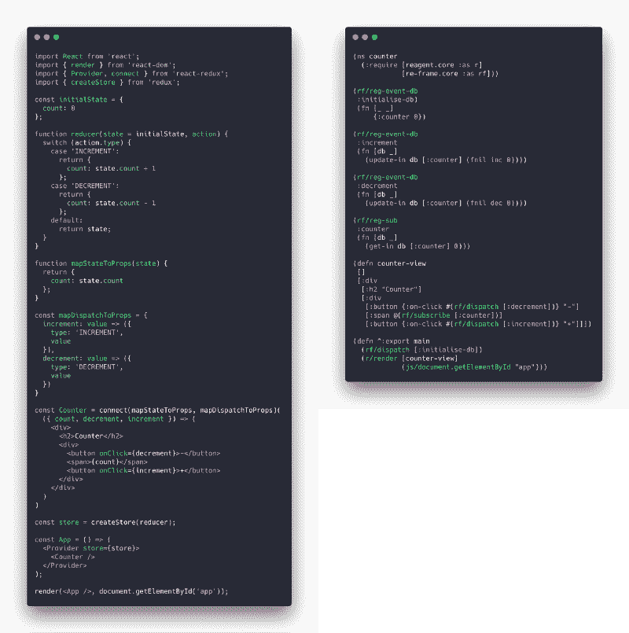

# 为什么 ClojureScript 对 NPM 如此有效

> 原文：<https://www.freecodecamp.org/news/why-clojurescript-works-so-well-with-npm-128221d302ba/>

作者亚采克·沙

# 为什么 ClojureScript 对 NPM 如此有效

每一种符合/转换到 JavaScript 的语言都希望连接到 npm 来使用这个巨大的生态系统。这方面的大师当然是 ECMAScript。第二个——依我拙见——是 ClojureScript，由于 [shadow-cljs](https://github.com/thheller/shadow-cljs) 。

> 免责声明:我知道在不同的社区有很多工作在进行，这些工作都在利用 npm。无论如何，我并不想通过声明 CLJS (ClojureScript)是最好的来贬低这一点。我只是想让你看一下这在 ClojureScript 中是如何工作的。

### 安装 npm 软件包

在 ClojureScript 中，我们像在 JavaScript 中一样安装 npm 包。我们使用标准的 package.json 和 [shadow-cljs](https://github.com/thheller/shadow-cljs) 构建工具，剩下的就交给你了。

Install firebase

安装完成后，我们需要软件包。`require`语句与 JS 中的`import`几乎相同。在 CLJS 中，我们交换顺序——首先说从哪里开始，然后说什么。

每个 ClojureScript 文件都以 ns —名称空间声明开始。接下来我们需要进口而不是进口。然后我们用 defn 定义一个函数。这个函数将利用我们需要的 firebase 包，而不是使用。为了导航到我们的方法 initializeApp，我们使用/。我们确保当我们调用 JS 方法 *initializeApp* 时，我们用`#js`将 CLJS 映射(数据结构)转换成 JS 对象。

让我们尝试一些其他的 npm 包，以便更好地理解 npm 和 ClojureScript 之间的互操作。

### 反应

用 React 怎么样？ClojureScript 有几个 React 的包装器——最流行的是[试剂](https://github.com/reagent-project/reagent)。这是一个简单的反例，有反应钩和试剂。

JaveScript React and ClojureScript Reagent

在这两个例子中，我们首先导入/要求 React 和 Reagent。然后我们在 React 中用钩子定义状态(在试剂中用原子)。

接下来是 JSX (JavaScript)和嗝嗝(ClojureScript)组件。

这很酷，但是我们如何使用 Reagent 中的 React UI 库呢？

### React UI 库

最流行的 UI 库之一是 [material-ui](https://material-ui.com/) 。安装后，我们需要这个库，然后导入我们的按钮组件以及 React。在 Clojure 脚本中，我们只需要按钮。我们不需要试剂，因为它在我们的说明书里。为了与 React 进行互操作，我们将使用`:&`gt；在 `a` {}中形成并传递我们需要的所有属性。

### Redux

你可能会问，Redux 怎么样？有一个建立在试剂之上的库，叫做[重组](https://github.com/Day8/re-frame/tree/master/docs)。它于 2014 年 12 月首次设计，甚至比官方的[榆树建筑](https://guide.elm-lang.org/architecture/)还要早。

到目前为止，您应该对 CLJS 为什么喜欢 npm 生态系统以及从 CLJS 到 JS 的互操作有多容易有了一个很好的了解。也许这是你感兴趣的，你想知道为什么？为什么要尝试 ClojureScript 呢？

### 为什么？

#### 不变的

所有 ClojureScritp 数据结构都是不可变的和持久的。如果你想利用像 [ImmutableJS](https://immutable-js.github.io/immutable-js/) 这样的东西，你不需要学习新的 API。

#### 功能的

ClojureScript 的核心包含了函数式编程思想。你不需要[洛达什](https://lodash.com/)或者[拉姆达](https://ramdajs.com/)。

#### 简单的

有了 [shadow-cljs](https://github.com/thheller/shadow-cljs) ，你不需要花时间配置你的构建。您需要您所需要的东西，构建工具将完成这项工作。

#### 简明的

你的责任是你写的 LoC。ClojureScript 是最简洁的编程语言之一。查看[的最后一节这个比较](https://medium.freecodecamp.org/a-real-world-comparison-of-front-end-frameworks-with-benchmarks-2018-update-e5760fb4a962)。

#### **强大的**

ClojureScript 使用 [Google 闭包工具](https://developers.google.com/closure/)进行代码缩减和树抖动。谷歌用来创建 Gmail、谷歌日历、谷歌文档和谷歌地图的工具。

#### Java Script 语言

它将文件编译/转换成 JavaScript。正如 ES (EcmaScript) ReasonML，PureScript，Elm。

#### 友好的

ClojureScript 社区是我在网上遇到的最友好、最热情的一群人。我们主要是在[懈怠](http://clojurians.net/)和[关门](https://clojureverse.org/)的时候闲逛。

#### **全栈**

ClojureScript 的哥哥 Clojure 用 Java 拥抱了所有这些想法。如果你想在一个性能最好、最稳定的平台 Java 虚拟机——上编写你的服务器，你可以使用相同的语言。

> 如果你喜欢这篇文章，你应该在 Twitter 上关注我。我只写/发关于编程和技术的文章——主要是关于 ClojureScript 和 Clojure。