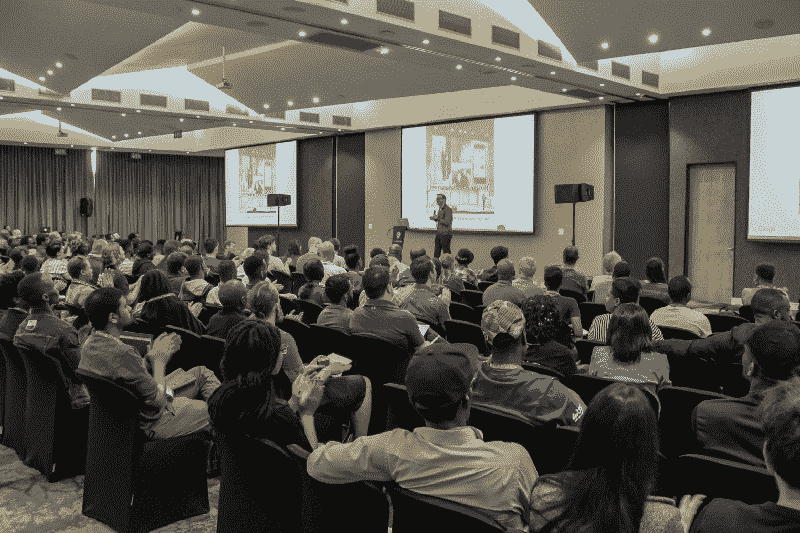
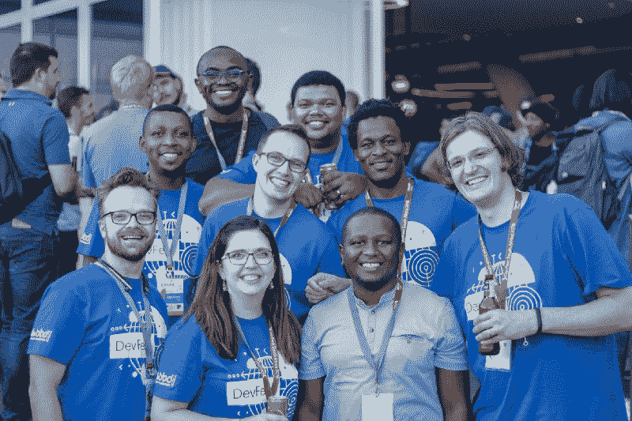

# 为什么会议和会面对开发人员很重要

> 原文：<https://www.freecodecamp.org/news/why-conferences-and-meet-ups-are-important-for-developers-47806552faa8/>

欢迎彼得·约翰

# 为什么会议和会面对开发人员很重要

2018 年，我有幸参加了在南非和国外举行的许多见面会和会议并发言。作为 GDG 约翰内斯堡的一名当地聚会组织者，我每个月至少会参加一次聚会，但我也会尝试去我所在城市的其他地方聚会。我还有幸参加了四次当地会议和社区活动，并帮助组织了南非发展节。最后，我去了国外不同国家的四个很棒的会议，这真正改变了我看待开发者大会的方式。

这让我思考——为什么开发人员要参加聚会或会议或在会上发言，他们对开发人员和他们的职业有多大好处？这引出了四个可以回答这些问题的主题:学习、分享、网络和合作。

#### 学问

许多开发人员参加聚会和会议是为了学习一些新的东西，或者是关于某个特定的主题，或者只是一些他们可能没有听说过的新东西。有了很多资源，比如博客和 Youtube，我们有很多平台可以学习，那么聚会和会议给了我们什么不同呢？

首先，我们要向最好的人学习。大多数情况下，演讲者和与会者都是已经使用特定技术一段时间的人，他们经历过好的和坏的。在这种环境中学习是非常不同的，因为每个人都在那里互相学习或分享他们的知识，而在工作中，你 80%的时间都在那里完成工作。

你还会发现人们分享使用某项特定技术的不同方法，这可能是演讲者没有提到的，在这种环境中，许多令人惊叹的新想法和新技术被开发出来。面对面的交流是很棒的事情，可以帮助任何开发人员成长。

#### 共享

随着学习成为聚会和会议的重要组成部分，人们需要分享内容。这通常是演讲者在台上分享他们对特定技术或他们认为很棒的东西的体验，你会尝试一下。演讲者分享的内容吸引了许多与会者，但分享并不止于此，还不止于此。

人们在会后提出的问题中分享了许多关于特定主题的有用信息。会后的对话对你在工作场所试图解决的问题至关重要，会后分享的想法比会上提供的内容更有帮助。在这些活动中传递知识可以帮助开发人员甚至他们的组织成长。

说到学习，分享是非常重要的，因为分享可以解决复杂的问题，并在人与人之间建立伟大的友谊。我提出的关于分享的很多观点都与在这些活动中与其他开发人员的交流有很大关系。这表明，在参加聚会和会议时，人际关系网是非常重要的。

#### 建立工作关系网

并不是每个开发人员都喜欢网络，但是人与人之间的这种交流在这些活动中给开发人员带来了很多好处。网络是我们谈论我们所做的事情，我们可能在一些技术上遇到的问题，甚至只是结交和你做类似工作的新朋友。这是我们分享想法、互相学习、互相帮助成长的地方。我发现这是我从优秀的人身上学到最多东西的方式。

这也是我们与其他人合作的方式，通过谈论你可能正在从事的开源项目，或者谈论你所在公司令人惊叹的文化。这为开发者提供了许多探索的机会。组织者也在这些活动中建立关系网，为他们自己的聚会和会议寻找潜在的发言人。它让开发者有机会表达他们对产品或技术的兴趣和热情。

我从大部分会议和聚会中学到的最重要的事情之一就是结交志同道合的朋友。这些友谊可能会转化为未来在开源项目上的合作，或者只是在你参加的下一次活动中认识某人。也可能是您曾与之谈论过他们开发的 SDK 或工具的人，您可以向他们提供反馈。这就创建了开发者之间的协作社区。

#### 合作

协作并不总是始于会议或聚会，但这可能是一个起点，一些人在这里相遇，他们最终会做出一些伟大的事情。

说到协作，我指的不仅仅是一起开发软件，还包括互相帮助创建新的开发者社区，或者只是帮助实现一个很多人都相信的目标。这些都是在这些活动中可能发生的事情。

#### 最后的想法

对我个人来说，我认为在软件工程领域拥有这种类型的社区是令人惊奇的。他们帮助许多人成为这种学习、分享、交流和合作环境的一部分，这是许多其他行业所不具备的。

这些活动也很有趣，尤其是当你访问新的国家，探索令人惊叹的文化，和人们谈论世界另一端的软件工程是如何相似的时候。

我想说的是，如果你有机会加入一个开发社区或者帮助将一个社区引向一个新的方向，那就用双手抓住它。一路上你会遇到一些很棒的人=)

如果你有任何想法，请在下面的评论中告诉我。

保持联系。

[**【彼得-约翰(@pjapplez) |推特**](https://twitter.com/pjapplez)
[*彼得-约翰(@pjapplez)的最新推文。移动工程主管@DVT_Corporate，技术探索者…*twitter.com](https://twitter.com/pjapplez)